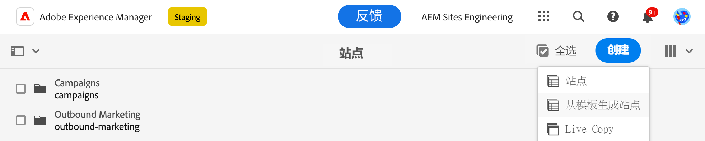
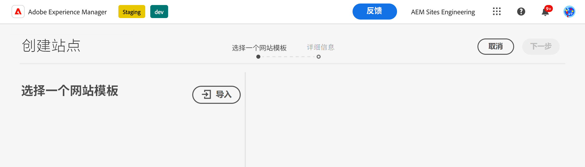
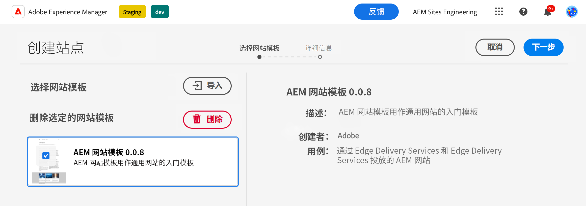
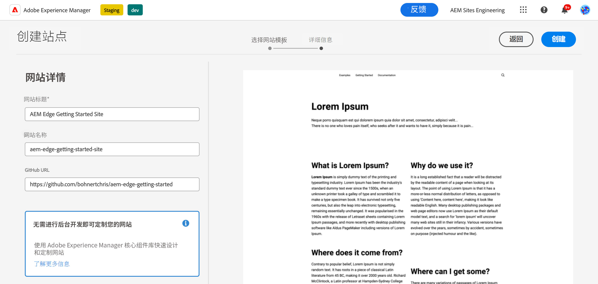
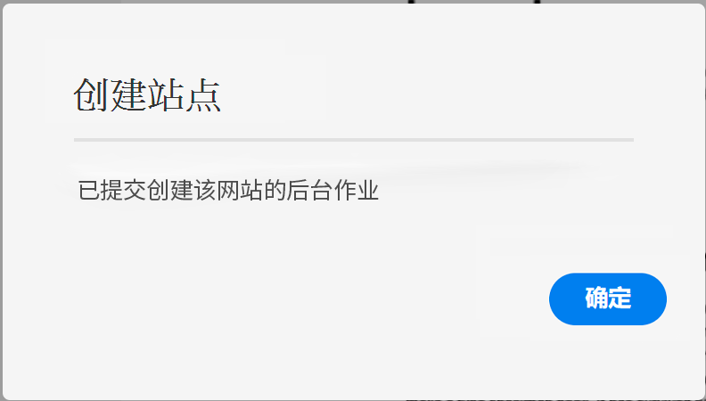
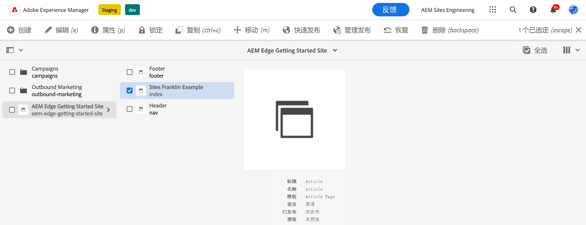
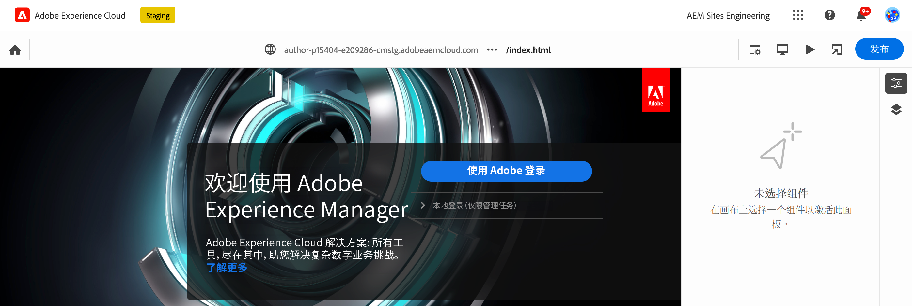
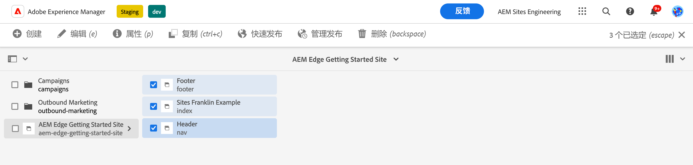
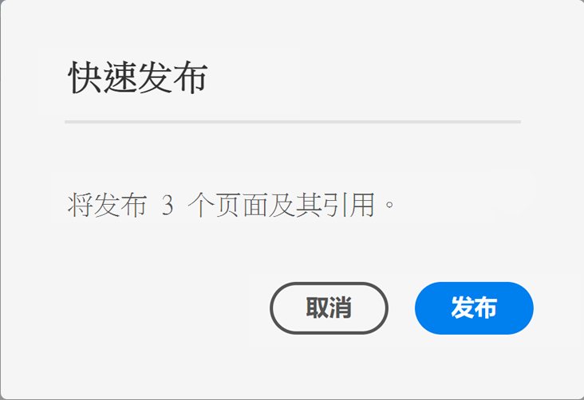

# 使用 Edge Delivery Services 进行 AEM 创作 {#edge-dev-getting-started}

本指南将帮助您让一个使用 Edge Delivery Services 和 Universal Editor 创作内容的新 Adobe Experience Manager 网站投入正常运转。

{{aem-authoring-edge-early-access}}

## 先决条件 {#prerequisites}

在开始阅读本指南之前，您应已熟悉 Edge Delivery Services 的基础知识并有权访问这些服务，其中包括：

* 您已完成 [Edge Delivery Servicetorial（边缘交付服务）。](/help/edge/developer/tutorial.md)
* 您有权访问 [AEM Cloud Service 沙盒](/help/implementing/cloud-manager/getting-access-to-aem-in-cloud/introduction-sandbox-programs.md)。
* 您已[启用同一沙盒环境上的 Universal Editor](/help/implementing/universal-editor/getting-started.md)。

## 选取适当的编辑器 {#editor-choice}

AEM 提供两个不同的内容编辑器，您可根据自己的情况选择要使用哪个。

* **Universal Editor** - 此编辑器应是新网站的默认选择。
* **AEM 页面编辑器** - 对于将现有 AEM Sites 迁移到 Edge Delivery Services 应选择此编辑器。

本指南重点介绍使用 Universal Editor 在 Edge Delivery Services 上创作 AEM 项目。有关选择适当的编辑器以及将现有 AEM Sites 迁移到 Edge Delivery Services 的更多详细信息，请参阅文档[针对 Edge Delivery Services 进行开发](/help/edge/developing.md)。

## AEM 创作和 Edge Delivery Services 快速入门 {#getting-started}

一旦满足[先决条件](#prerequisites)并[选择使用 Universal Editor](#editor-choice)，即可开始您自己的项目。

### 创建您的 GitHub 项目 {#create-github-project}

首先，需要在 GitHub 上基于 Adobe 模板创建新项目。

1. 导航到 [`https://github.com/adobe-rnd/aem-boilerplate-xwalk`](https://github.com/adobe-rnd/aem-boilerplate-xwalk) 并单击&#x200B;**使用此模板**，然后选择&#x200B;**创建新存储库**。

   * 需要登录到 GitHub 才能看到此选项。

   

1. 默认情况下，将为您分配该存储库。按需更改此项并提供存储库名称和描述，然后单击&#x200B;**创建存储库**。

   

1. 在同一浏览器上的新标签页中，导航到 [`https://github.com/apps/aem-code-sync`](https://github.com/apps/aem-code-sync) 并单击&#x200B;**配置**。

   

1. 对于您在上一步从中创建了新存储库的组织单击&#x200B;**配置**。

   

1. 在 AEM Code Sync GitHub 页面上的&#x200B;**存储库访问权限**&#x200B;下，选择&#x200B;**仅某些存储库**，选择在上一步创建的存储库，然后单击&#x200B;**保存**。

   

1. 安装 AEM Code Sync 后，即看到确认屏幕。返回新存储库的浏览器标签页。

   

1. 单击 `fstab.yaml` 文件以打开它，然后单击&#x200B;**编辑此文件**&#x200B;图标以编辑它。

   

1. 编辑 `fstab.yaml` 文件以更新您的项目的挂载点。将默认的 Google 文档 URL 替换为您的 AEM as a Cloud Service 创作实例的 URL，然后单击&#x200B;**提交更改...**。

   * `https://<aem-author>/bin/franklin.delivery/<owner>/<repository>/main`
   * 更改挂载点将告知 Edge Delivery Services 在哪里可找到该站点的内容。

   

1. 按需添加一条提交消息，然后单击&#x200B;**提交更改**，将其直接提交到 `main` 分支。

   

1. 返回您存储库的根目录，然后依次单击 `paths.yaml`、**编辑此文件**&#x200B;图标。

   

1. 将默认映射替换为 `/content/<site-name>/:/`，然后单击&#x200B;**提交更改...**。

   * 提供您自己的 `<site-name>`。您将在稍后的步骤中用到它。
   * 映射告知 Edge Delivery Services 如何将您 AEM 存储库中的内容映射到站点 URL。

   

1. 按需添加一条提交消息，然后单击&#x200B;**提交更改**，将其直接提交到 `main` 分支。

   

### 创建并编辑新 AEM 站点 {#create-aem-site}

既然已有 GitHub 项目，那就必须创建该项目可使用的新 AEM 站点。

>[!NOTE]
>
>要使用 Universal Editor 编辑您的站点，您必须使用基于 Chromium 的浏览器。

1. 通过您的[项目 Slack 频道](/help/edge/docs/slack.md)向 Adobe 工程部门索要最新的“使用 Edge Delivery Services 进行 AEM 创作”站点模板。

1. 登录到您的 AEM as a Cloud Service 创作实例，导航到“站点”控制台，然后点击或单击&#x200B;**创建** -> **从模板创建站点**。

   

1. 在“创建站点”向导的&#x200B;**选择站点模板**&#x200B;选项卡上，单击&#x200B;**导入**&#x200B;按钮以导入新模板。

   

1. 上传 Adobe 工程部门为您提供的“使用 Edge Delivery Services 进行 AEM 创作”站点模板。

1. 导入该模板后，它即出现在向导中。点击或单击以选择它，然后点击或单击&#x200B;**下一步**。

   

1. 为以下字段提供内容，然后点击或单击&#x200B;**创建**。

   * **站点标题** - 添加该站点的描述性标题。
   * **站点标题** - 使用在[上一步](#create-github-project)定义的 `<site-name>`。
   * **GitHub URL** - 使用在上一步创建的 GitHub 项目的 URL。

   

1. AEM 用一个对话框确认创建了该站点。点击或单击&#x200B;**确定**&#x200B;以关闭。

   

1. 在“站点”控制台上，导航到新创建的站点的 `index.html`，然后在工具栏中点击或单击&#x200B;**编辑**。

   

1. Universal Editor 在新标签页中打开。您可能需要点击或单击&#x200B;**使用 Adobe 登录**&#x200B;以进行身份验证才能编辑您的页面。

   

您现在可以使用 Universal Editor 编辑您的站点。有关更多信息，请参阅 [Universal Editor 文档](/help/sites-cloud/authoring/universal-editor/authoring.md)。

### 发布您的新站点 {#publishing}

使用 Universal Editor 编辑完您的新站点后，即可发布您的内容。

1. 在“站点”控制台上，选择为您的新站点创建的所有页面，然后在工具栏中点击或单击&#x200B;**快速发布**。

   

1. 在确认对话框中点击或单击&#x200B;**发布**&#x200B;以开始该过程。

   

1. 在同一浏览器中打开新标签页，然后导航到您新站点的 URL。

   * `https://main--<site-name>--<owner>.hlx.page`

1. 查看您发布的内容。

   

## 后续步骤 {#next-steps}

现在，您已有一个使用 Edge Delivery Services 项目进行的 AEM 创作，您可以开始创建自己的区块并设计其样式。

请参阅[创建经过检测可与 Universal Editor 结合使用的区块](/help/edge/create-block.md)指南以了解更多信息。
