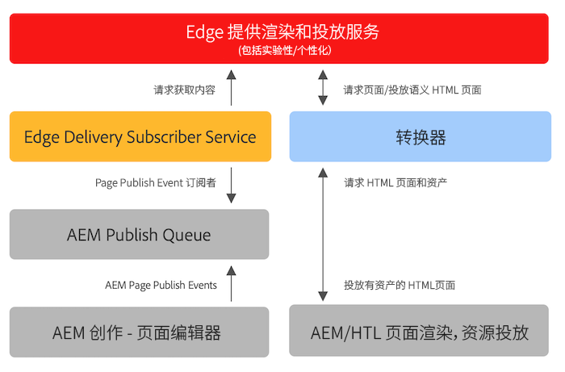

# 将Edge Delivery Services用于现有AEM项目 {#existing-projects}

您无需等待新的AEM项目即可从Edge Delivery Services中受益。 Edge Delivery Services可以集成到您现有的AEM项目中，以便您能够立即利用其性能提升。

## AEM页面编辑器限制 {#page-editor}

在Edge Delivery Services出现之前，使用AEM页面编辑器编辑在AEM中管理的内容。 如果您的项目在引入Edge Delivery Services之前开始，则几乎可以肯定您使用的是页面编辑器。

AEM页面编辑器仅适用于 [AEM组件](/help/implementing/developing/components/overview.md) 例如 [核心组件。](https://experienceleague.adobe.com/docs/experience-manager-core-components/using/introduction.html) 这些组件与Edge Delivery Services不兼容。 因此，需要两个阶段才能将Edge Delivery Services引入现有AEM项目：

* [阶段1 — 更换前端](#replace-front-end)
* [阶段2 — 切换到通用编辑器](#switch-ue)

## 阶段1 — 更换前端 {#replace-front-end}

在第一阶段中，您可以继续使用现有AEM站点结构、组件和创作工具。 将使用JavaScript和CSS的块重新构建网站渲染，并通过Edge Delivery Services交付。

请参阅 [生成部分](https://www.aem.live/docs/#build) 的Edge Delivery Services文档，以了解有关块以及如何为Edge Delivery服务开发的更多详细信息。

App Builder上的转换器需要转换AEM渲染的HTML输出并将它发送到Edge Delivery Services。

第二阶段通过消除技术重叠来完成该过程：带有HTL的AEM核心组件和AEM Author上的Java、基于JS的边缘交付块以及基于nodeJS的转换器。

## 阶段2 — 切换到通用编辑器 {#switch-ue}

在此阶段，AEM页面编辑器将被替换为通用编辑器。 由于通用编辑器可以直接使用块，因此将不再需要AEM核心组件和转换器。

## 如何入门 {#how-to-get-started}

请联系您的Adobe代表以获取此功能的访问权限。
