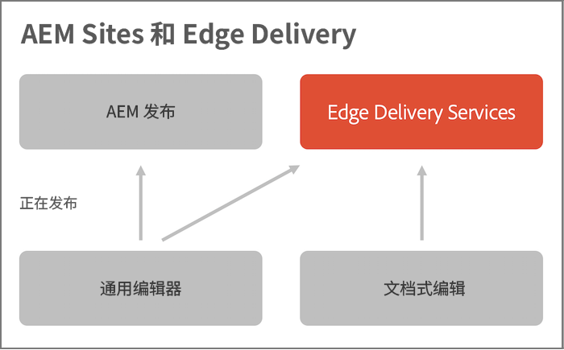

# AEM 和 Edge Delivery Services {#aem-edge}

利用 Edge Delivery Services，AEM 能够提供可提高参与和转化的卓越体验。AEM 通过投放可快速创作并开发且极具影响力的体验实现这一点。这是一组可组合的服务，这些服务构成一个快速开发环境，以使作者可快速更新和发布，并且快速推出新站点。因此，借助 Edge Delivery Services，可提高转化率、降低成本并为内容大幅提速。

通过使用 Edge Delivery Services，您可以：

* 快速创建 Lighthouse 分数优异的站点，并通过真实用户监控 (RUM) 持续监控网站性能。
* 通过分离内容来源而提高创作效率。可直接使用 AEM 创作和基于文档的创作。这样即可在同一网站上使用多个内容源。
* 使用一个内置的试验框架，通过该框架，可快速地创建测试、不影响性能地执行测试并快速地发布到测试获胜方的生产环境。

## Edge Delivery Services 概述 {#edge-overview}

下图说明如何在 Microsoft Word 中编辑内容（基于文档的编辑）并将其发布到 Edge Delivery Services。它还说明了使用 Universal Editor 的 AEM 发布方法。

Edge Delivery Services 是一组可组合的服务，通过这些服务，可非常灵活地在网站上创作内容。如前所述，您可以将 [AEM 内容管理](https://experienceleague.adobe.com/docs/experience-manager-cloud-service/content/sites/authoring/getting-started/concepts.html)用于 [Universal Editor 创作](/help/implementing/universal-editor/introduction.md)以及[基于文档的创作](https://www.aem.live/docs/authoring)。

例如，您可以直接从 Microsoft Word 或 Google Docs 中使用内容。这意味着来自这些来源的文档可成为您网站上的页面。此外，标题、列表、图像、字体元素都可以从初始源转移到网站中。新内容可立即添加，而不经历重建过程。

Edge Delivery Services 使用 GitHub，因此客户可直接从其 GitHub 存储库管理和部署代码。例如，可在 Google 文档或 Microsoft Word 中编写内容，而在 GitHub 中使用 CSS 和 JavaScript 开发您网站的功能。当您就绪时，您即可使用 Sidekick 浏览器扩展预览和发布内容更新。

更多信息请参阅 Edge Delivery Services 文档：

* 有关如何开始使用 Edge Delivery 的详细信息，请参阅[“构建”部分](https://www.aem.live/docs/#build)。
* 要了解如何使用 Edge Delivery 创作和发布内容，请参阅[“发布”部分](https://www.aem.live/docs/authoring)。
* 要了解如何正确地启动您的网站项目，请参阅[“启动”部分](https://www.aem.live/docs/#launch)。

## Edge Delivery Services 和其他 Adobe Experience Cloud 产品 {#edge-other-products}

Edge Delivery Services 是 Adobe Experience Manager 的一部分，因此 Edge Delivery Services 可与 AEM Sites 在相同的域中共存。这是大型网站的常见用例。不仅如此，还可在 AEM Sites 页面中轻松地使用来自 Edge Delivery Services 的内容，并且反之亦然。

请参阅 [使用Edge Delivery Services进行AEM创作的开发人员快速入门指南](/help/edge/edge-dev-getting-started.md) 了解如何开始自己的项目，以便使用AEM和Edge Delivery Services进行创作。

您还可以将 Edge Delivery Services 与 Adobe Target、Analytics 和 Launch 结合使用。

## 获取对 Edge Delivery Services 的访问权限 {#getting-access}

快速入门 Edge Delivery Services 十分容易。遵照[开始使用 - 开发人员教程](https://www.aem.live/developer/tutorial)开始使用。

## 从 Adobe 获取帮助 {#adobe-gethelp}

您可以通过由您提供的产品协作渠道与 Adobe 产品团队联系（有关访问详情，请参阅下文）以回答有关产品使用或最佳实践的疑问。没有服务水平目标 (SLT) 与通过该产品协作渠道进行的对话关联。如果产品问题需要额外调查和故障排除，并且需要满足响应 SLT，则可按照[支持流程](https://experienceleague.adobe.com/?support-tab=home#support)提交支持工单。

Adobe 提供三个渠道帮助您使用 Edge Delivery Services：

* 利用社区资源进行一般查询
* 访问您的产品协作渠道以解决特定问题
* 记录支持工单以解决重大和关键问题

### 访问社区资源 {#community-resource}

Adobe 致力于通过为 Edge Delivery Services 和基于文档的创作营造优秀的社区参与氛围并提供大力支持而为您助力。

* 请加入 [Experience League 社区](https://adobe.ly/3Q6kTKl)，从中您可提问、分享反馈、发起讨论、向 Adobe 专家和 AEM 顾问/支持者寻求帮助并实时与志同道合的人交流。
* 加入我们的 [Discord 频道](https://discord.gg/aem-live)，通过这个更休闲的平台可实时互动和快速交流想法。

### 如何访问您的产品协作渠道 {#collab-channel}

考虑到与客户建立的直接沟通渠道的作用，所有 AEM 客户都将在启动时建立一个 Slack 频道以快速获得关键更新和针对体验质量的大规模报告。您会从 Adobe 收到一条加入您组织特有的 Slack 频道的邀请。

有关更多信息，请参阅[使用 Slack 机器人](https://www.aem.live/docs/slack)文档。

### 记录支持工单 {#support-ticket}

通过 Admin Console 记录支持工单的步骤：

1. [按照标准支持流程](https://experienceleague.adobe.com/?support-tab=home#support)创建一个工单。
1. 在该工单的标题中添加 **Edge Delivery**。
1. 请在描述中提供以下详细信息：

   * 当前网站的 URL。例如：`www.mydomain.com`。
   * 原始网站的 URL (`.hlx` URL)。

## 后续内容 {#whats-next}

首先，请查看[使用 Edge Delivery Services](/help/edge/using.md)。
