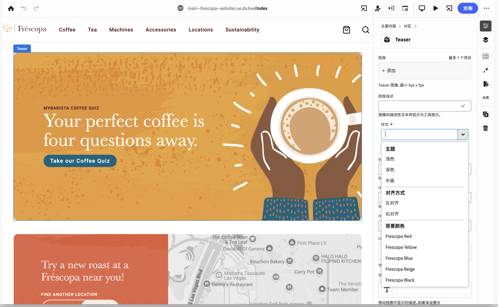

# Edge Delivery Services 概述 {#edge-delivery-services}

利用 Edge Delivery Services，AEM 能够提供可提高参与和转化的卓越体验。AEM 通过投放可快速创作并开发且极具影响力的体验实现这一点。这是一组可组合的服务，这些服务构成一个快速开发环境，以使作者可快速更新和发布，并且快速推出新站点。因此，借助 Edge Delivery Services，可提高转化率、降低成本并为内容大幅提速。

通过使用 Edge Delivery Services，您可以：

* 快速创建 Lighthouse 分数优异的网站，并通过实际使用监控 (RUM) 持续监控网站性能。
* 通过分离内容来源而提高创作效率。开箱即用地使用WYSIWYG和基于文档的创作。 这样即可在同一网站上使用多个内容源。
* 使用一个内置的试验框架，通过该框架，可快速地创建测试、不影响性能地执行测试并快速地发布到测试获胜方的生产环境。

## 对业务需求做出敏捷反应 {#agile-reaction}

作为公认的长期行业领袖，Adobe知道为客户快速创建和发布有意义的新内容是多么重要。 市场已清楚地表明了扩展内容创建的常见挑战，包括：

1. **对内容的需求继续增长。**
   * 需要解锁新的内容作者以满足此需求。
   * 内容创建过程必须在整个业务中有效地扩展。
   * 作者必须能够迅速对不断变化的趋势做出反应。
1. **需要全渠道内容。**
   * 无论内容交付如何，都需要进行布局控制。
   * 需要授权作者直接更改内容布局。
1. **推动内容投资回报的压力增大。**
   * 作者本身需要能够优化他们创建的内容。

事实证明，整个行业都出现了这些趋势。 但个别要求不可避免地因项目而异。 任何Edge Delivery Services项目的目标都集中在查找适用于您的用户的解决方案。

1. **专注于值而不是功能。** — 确定为作者提供的最优化工作流程，而不是在AEM的扩展功能集中丢失。
1. **充分利用AEM的灵活性。** — 不需要在真空中使用AEM功能。 根据用例使用您需要的这些功能。
1. **利用作者的专业知识。** — 从一开始就让真正的内容作者参与项目，以确保通过实施合理的功能为他们提供所需的价值。

通过关注内容创作的价值，您的Edge Delivery Services项目可以满足内容创作者面临的现代行业需求，并快速提供内容以取悦客户。

## 适合内容创作者使用的灵活创作工具 {#overview}

Edge Delivery Services 是一组可组合的服务，通过这些服务，可非常灵活地在网站上创作内容。您既可以使用 [Universal Editor](/help/sites-cloud/authoring/universal-editor/authoring.md) 进行 [AEM 内容管理](https://experienceleague.adobe.com/docs/experience-manager-cloud-service/content/sites/authoring/getting-started/concepts.html)和 WYSIWYG 创作，也可以使用[基于文档的创作。](https://www.aem.live/docs/authoring)

下图说明如何在 Microsoft Word 中编辑内容（基于文档的创作）并将其发布到 Edge Delivery Services。它还显示了使用 Universal Editor 进行 WYSIWYG 的编辑。

Edge Delivery Services 使用 GitHub，因此您可直接从您的 GitHub 存储库管理和部署代码。新内容会立即添加，而无需重建过程。

### 基于文档的创作 {#document-based}

通过基于文档的创作，您可以直接使用Microsoft Word或Google文档中的内容，以便这些源成为您网站上的页面。 标题、列表、图像、字体元素都可以从初始源传输到网站。

* 通过基于文档的创作，每位营销人员都可以使用已知的创作工具(Microsoft Word、Google Docs等)快速创建内容。
* 通过允许直接在源文档中创作、审阅和发布内容，简化了内容创建。
* 由于使用了已知工具，因此内容作者无需载入页面，从而加快了内容速度。
* 可以在GitHub中使用CSS和JavaScript开发站点的功能。

进一步阅读基于文档的创作文档：

* 有关如何开始使用 Edge Delivery 的详细信息，请参阅[“生成”部分](https://www.aem.live/docs/#build)。
* 要了解如何使用 Edge Delivery 创作和发布内容，请参阅[“发布”部分](https://www.aem.live/docs/authoring)。
* 要了解如何正确地启动您的网站项目，请参阅[“启动”部分](https://www.aem.live/docs/#launch)。

### 所见即所得创作 {#wysiwyg-authoring}

“所见即所得”(WYSIWYG)创作利用通用编辑器，它是一个可自定义的一站式位置，可通过可视化预览来编辑实时内容和上下文内容。

* 通过WYSIWYG创作，您可以提高Headless或Headful的创作效率。
* 您可以利用AEM全面的内容管理功能，包括工作流和治理。
* 利用大量扩展点来支持您自己的流程和集成。
* 可以在GitHub中使用CSS和JavaScript开发站点的功能。

进一步阅读WYSIWYG创作文档：

* 有关通用编辑器和WYSIWYG创作的概述，请参阅文档[用于Edge Delivery Services的WYSIWYG内容创作。](/help/edge/wysiwyg-authoring/authoring.md)
* 有关开发人员概述，请参阅文档[用于Edge Delivery Services的WYSIWYG创作的开发人员快速入门指南。](/help/edge/wysiwyg-authoring/edge-dev-getting-started.md)

### 确定您的创作方法 {#authoring-method}

AEM的灵活性可确保满足您的创作需求。 Adobe可以帮助您确定最符合要求的方法（或方法）。

* 始终让内容作者参与决策。
* 可以实施多种创作方法。
* 您始终可以在事后更改创作方法。
* 您不得在实施之前做出决定，而是必须作为实施的一部分做出决定。

有关详细信息，请参阅文档[选择创作方法](authoring-methods.md)。

## Edge Delivery Services 和其他 Adobe Experience Cloud 产品 {#edge-other-products}

Edge Delivery Services 是 Adobe Experience Manager 的一部分，因此 Edge Delivery Services 可与 AEM Sites 在相同的域中共存，这是大型网站的常见用例。此外，还可在 AEM Sites 页面中轻松地使用来自 Edge Delivery Services 的内容，并且反之亦然。

请参阅[使用 Edge Delivery Services 进行 WYSIWYG 的开发人员快速入门指南](/help/edge/wysiwyg-authoring/edge-dev-getting-started.md)，了解如何开始您自己要使用 AEM 和 Edge Delivery Services 创作的项目。

您还可以将 Edge Delivery Services 与 [Adobe Target、](https://www.aem.live/developer/target-integration)[实际使用监控 (RUM)](https://www.aem.live/developer/rum) 结合使用，以诊断网站的使用情况和性能，并且进行[发布。](https://experienceleague.adobe.com/en/docs/experience-platform/tags/home)

## Edge Delivery Services 快速入门 {#getting-started}

按照[快速入门：开发人员教程](https://www.aem.live/developer/tutorial)，可以轻松地开始使用 Edge Delivery Services。

## 从 Adobe 获取帮助 {#getting-help}

Adobe 提供三个渠道帮助您使用 Edge Delivery Services：

* 利用[社区资源](#community-resources)进行一般查询。
* 访问您的[产品协作渠道](#collaboration-channel)以解决特定问题。
* [记录支持工单以](#support-ticket)解决重大和关键问题。

### 访问社区资源 {#community-resources}

Adobe 致力于通过为 Edge Delivery Services、WYSIWYG 以及基于文档的创作营造优秀的社区参与氛围并提供大力支持而为您助力。

* 请加入 [Experience League 社区](https://adobe.ly/3Q6kTKl)，从中您可提问、分享反馈、发起讨论、向 Adobe 专家和 AEM 顾问/支持者寻求帮助并实时与志同道合的人交流。
* 加入我们的 [Discord 频道](https://discord.gg/aem-live)，通过这个更休闲的平台可实时互动和快速交流想法。

### 如何访问您的产品协作渠道 {#collaboration-channel}

考虑到与用户建立的直接沟通渠道的作用，所有 AEM 项目都将在启动时建立一个 Slack 频道以快速获得关键更新和针对体验质量的大规模报告。您将从 Adobe 收到一条加入您组织特有的 Slack 频道的邀请。

有关更多信息，请参阅[使用 Slack 机器人](https://www.aem.live/docs/slack)文档。

您可以通过已配置的产品协作渠道与 Adobe 产品团队互动，回答有关产品使用或最佳实践的问题。没有服务水平目标 (SLT) 与通过该产品协作渠道进行的对话关联。

### 记录支持工单 {#support-ticket}

如果产品问题需要额外调查和故障排除，并且需要满足响应 SLT，则可使用 Admin Console 按照该流程提交支持工单。

1. [按照标准支持流程](https://experienceleague.adobe.com/?support-tab=home#support)创建一个工单。
1. 在该工单的标题中添加 **Edge Delivery**。
1. 在描述中，除了问题描述之外，还要提供以下详细信息：

   * 当前网站的 URL。例如：`www.mydomain.com`。
   * 原始网站的 URL (`.hlx` URL)。

## 后续内容 {#whats-next}

首先，请查看[使用 Edge Delivery Services](/help/edge/using.md)。
