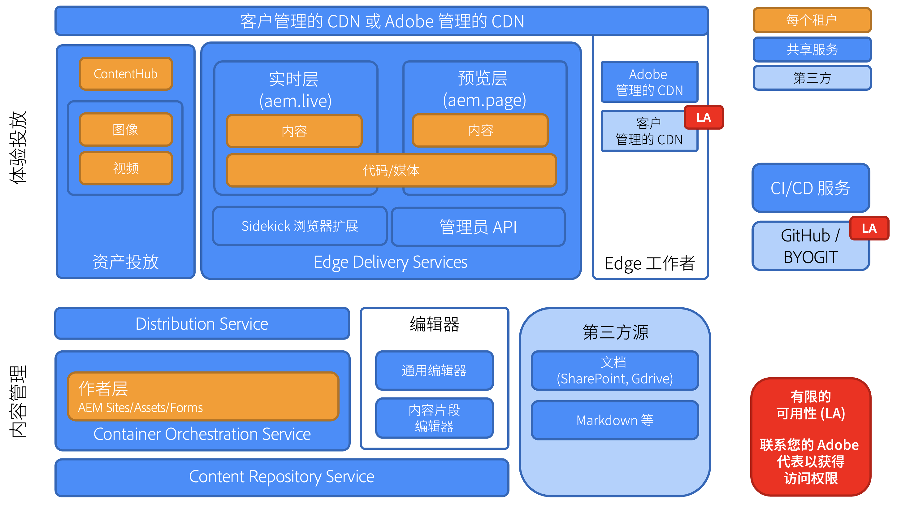

# Edge Delivery Services 概述 {#edge-delivery-services}

## 什么是Edge Delivery Services？ {#what-is-edge}

Edge Delivery Services是一个现代化的内容交付框架，可重新设想网站的构建和交付方式，针对速度、简洁性和可扩展性进行优化。 它是Adobe Experience Manager的核心部分，通过在网络边缘将渲染和交付推送到更接近用户的位置，实现更快的数字体验。

它不是内容交付网络(CDN)的替代产品，而是与您自己的CDN或随附的[Adobe管理的CDN](/help/implementing/dispatcher/cdn.md)无缝集成。

>[!TIP]
>
>**想立即亲身体验吗？**
>
>如果您希望立即动手实践，只需[参考 aem.live 上的教程](https://www.aem.live/developer/ue-tutorial)，即可在 30 分钟内启动一个包含 AEM 创作功能的 Edge Delivery Services 项目。

## 为什么选择Edge Delivery Services？ {#why-edge}

### 提高可发现性和流量 {#increase-traffic}

Edge Delivery网站是针对LLM优化的搜索引擎(SEO)和创成引擎优化(GEO)。 这确保在自然流量的所有现有和即将到来的源头上具有高可见性和可发现性。 **性能优先的端对端体系结构**&#x200B;可确保客户获得愉快的体验，从而积极地影响参与。

### 开发人员效率 {#developer-efficientcy}

只需几天或几周即可上线，而无需几个月或几年！ Edge Delivery提供了&#x200B;**现代Web开发人员**&#x200B;喜爱的所有工具：GitHub、具有自动重新加载功能的本地开发、性能、简单性，并且没有复杂性：无转换、无捆绑包、无配置、无开销。

Edge Delivery的简单性不要求您使用复杂框架、工具或流程，这些都是AI代码创建的理想选择。 使用纯HTML、现代化CSS和vanilla JavaScript，以前所未有的速度创建卓越的体验。 专注于工作，减少花在培训和学习新工具上的时间。

Edge Delivery使每个开发人员都能获得100的Lighthouse分数。

### 支持多个内容源 {#multiple-content-sources}

来自各种解决方案的内容可以直接与Edge Delivery集成，**包括所有现有AEM实例**。 作者可以从任何系统(如SharePoint)管理内容并将内容&#x200B;**发布到Edge Delivery**，以便使用他们已知道的工具获得更快的速度。

### 可组合架构 {#composable-architeture}

无头式或Headful均可按正确的格式提供正确的内容，并添加正确的修饰以使其成为在任何渠道中脱颖而出的体验。

## 它的工作原理 {#how-does-it-work}

Edge Delivery Services 是一组可组合的服务，使您在网站上创作内容时具有高度的灵活性。它将AEM Publish/Dispatcher和使用AEM核心组件构建体验的传统方式替换为多云SaaS解决方案和纯前端开发方法。

Edge Delivery Services 使用 GitHub，因此您可直接从您的 GitHub 存储库管理和部署代码。新内容可立即添加，而不经过重建过程。

## 创作 {#authoring}

### In-context editing {#in-context-editing}

WYSIWYG [通用编辑器](/help/implementing/universal-editor/introduction.md)是一个可自定义的一站式位置，可用于编辑具有可视化预览的实时和上下文内容。

* 通过AEM创作和通用编辑器，您可以提高Headless或Headful的创作效率。
* 您可以利用 AEM 全面的内容管理功能，包括工作流程和治理。
* 您可以利用大量扩展点来支持您自己的流程和集成。
* 您可以使用 GitHub 中的 CSS 和 JavaScript 开发您网站的功能。

### 基于文档的编辑 {#document-based-editing}

[另一种方法是基于文档的创作](https://www.aem.live/docs/authoring)，其中内容作为文档进行管理。 Microsoft Word是一个很受欢迎的选择，因为许多企业都将SharePoint放在初始内容创建的位置。 无需学习新工具，即可直接从SharePoint和Word发布内容，从而消除了将内容复制并粘贴到AEM中的麻烦。 没有SharePoint的客户还可以使用Google Drive作为替代方法。

## 操作遥测 {#telemetry}

Adobe Experience Manager使用[操作遥测](https://www.aem.live/docs/operational-telemetry)来收集发现并修复Adobe Experience Manager支持的站点上的功能和性能问题所必须的操作数据。 使用遥测数据可用来诊断性能问题和衡量试验的有效性。 操作遥测通过[采样](https://www.aem.live/docs/operational-telemetry#operational-telemetry-data-is-sampled)（只监视所有页面查看的一小部分）和[明智地排除个人身份信息](https://www.aem.live/docs/operational-telemetry#what-data-is-being-collected) (PII)来保护访客的隐私。

## 开始浏览 {#start-exploring}

开始将AEM创作与通用编辑器和Edge Delivery Services结合使用：

* Edge Delivery Services文档[Edge Delivery Services](https://www.aem.live)
* 有关使用通用编辑器进行 AEM 创作的概述，请参阅 aem.live 文档中的文档[为 Edge Delivery Services 进行 AEM 创作](https://www.aem.live/docs/aem-authoring)。
* 有关开发人员概述，请参阅 aem.live 文档中的文档[快速入门 - 通用编辑器开发人员教程](https://www.aem.live/developer/ue-tutorial)。

## Edge Delivery Services 和其他 Adobe Experience Cloud 产品 {#edge-other-products}

Edge Delivery Services 是 Adobe Experience Manager 的一部分。因此，Edge Delivery Services 和 AEM Sites 可以在同一个域中共存，这是大型网站的常见用例。此外，您的 AEM Sites 页面可以无缝使用来自 Edge Delivery Services 的内容，反之亦然。

您还可以将Edge Delivery Services与[Adobe Target](https://www.aem.live/developer/target-integration)和[Launch.](https://experienceleague.adobe.com/zh-hans/docs/experience-platform/tags/home)一起使用

## 从 Adobe 获取帮助 {#getting-help}

Adobe提供三层来帮助您使用Edge Delivery Services：

* 利用[社区资源](#community-resources)进行一般查询。
* 访问您的[产品协作渠道](#collaboration-channel)以解决特定问题。
* [记录支持票证](#support-ticket)以解决合同支持SLA **中的主要和关键问题**。

### 访问社区资源 {#community-resources}

Adobe 致力于为您提供最佳社区参与度以及有关 Edge Delivery Services、用通用编辑器进行 AEM 创作以及基于文档的创作的大力支持。

* 请在[Experience League 社区](https://adobe.ly/3Q6kTKl)参与提问、分享反馈、发起讨论、向 Adobe 专家和 AEM 顾问/支持者寻求帮助并实时与志同道合的人交流。
* 加入[Discord 频道](https://discord.gg/aem-live)，通过这个更休闲的平台可实时互动和快速交流想法。

### 记录支持工单 {#support-ticket}

{{support-ticket}}
