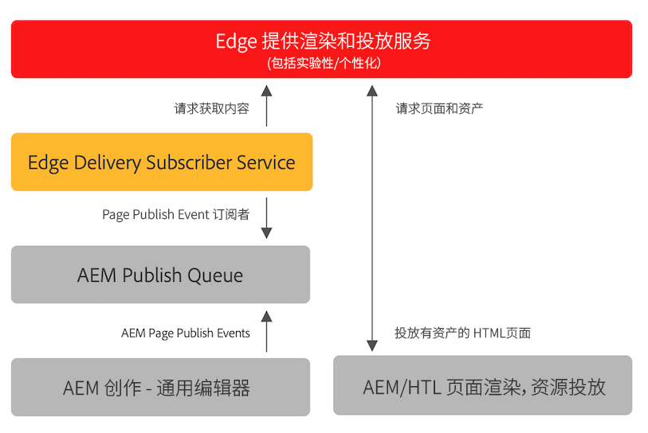

# 为 Edge Delivery Services 发布内容 {#publishing-edge}

利用 Edge Delivery Services，无论内容源如何，都可以无缝发布内容：

* 基于文档的内容 - 请参阅 Edge Delivery Services 文档的[发布部分](/help/edge/docs/authoring.md)。
* AEM 内容 - 请参阅下面的详细信息。

## 来自 AEM 的发布流程 {#publishing-flow}

使用通用编辑器创作 AEM 内容时，发布任务就像单击通用编辑器中的&#x200B;**发布**&#x200B;按钮一样简单。请参阅文档[使用通用编辑器发布内容。](/help/implementing/universal-editor/publishing.md)

发布时的信息流程如下。当作者开始发布时，此流程就会自动进行，并会在此处进行说明以供参考。

1. 内容作者在通用编辑器中发布 AEM 内容。
1. 发布事件被推送到 Adobe 管道队列。
1. Edge Delivery 发布服务将相关事件转发到 Edge Delivery 管理员 API。
1. Edge Delivery 从 AEM Author 处提取和吸收语义 HTML。
1. AEM 已更新发布状态。

## 如何开始使用 {#how-to-get-started}

请联系您的 Adobe 代表以访问此功能。
