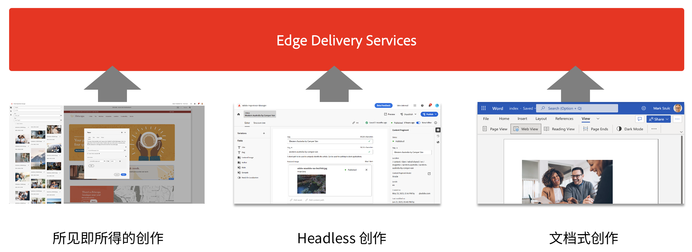
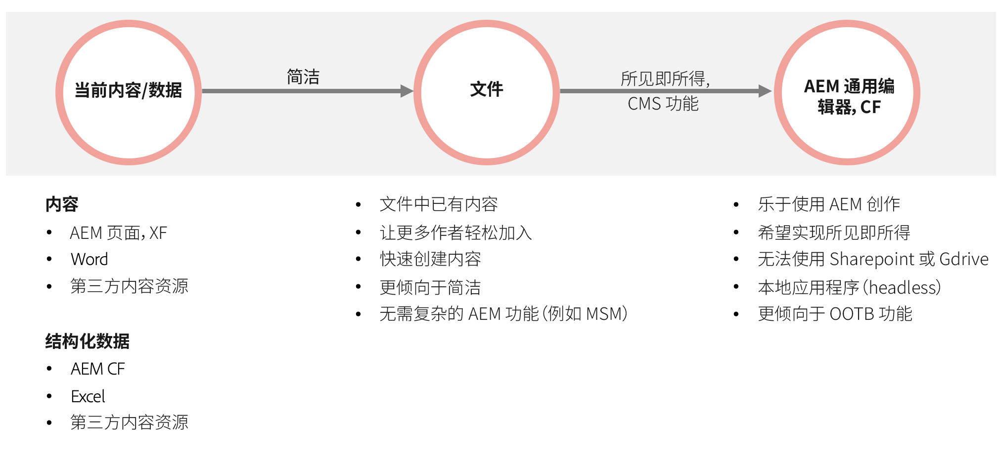

# 结合使用 Edge Delivery Services 与 AEM {#using-edge}

Edge Delivery Services 与内容源分离，并可从不同的内容源摄取内容。这意味着，您可以在同一网站上使用多个内容源，无论您选择的源如何，都可以轻松进行无缝发布。

利用 Edge Delivery Services，您可以创建快速开发环境，作者可在其中快速地更新和发布内容，并快速地推出新网站。从在 Internet 上实时编辑内容到查看内容只需几秒钟。

通过从多个内容源摄取，用户将获得最大的灵活性。Adobe 提供指导以帮助您选择哪些内容源最适合您的项目。

某些情况下预定义了内容源或其存在其他方式的不灵活（例如，项目无法使用 Sharepoint 或 Google Drive）。但在很多情况下并不预定义工具，并且工具的选择也不是非黑即白。

Adobe 的指导原则是简洁。首先基于文档进行创作，当需要时再增加复杂性。如果需要更改工具，AEM 的 Edge Delivery Services 集成涵盖内容迁移。

## 创作 {#authoring-edge}

Edge Delivery Services 让创作变得简单、快速且灵活。您可以选择使用基于文档的创作进行创作，也可以选择使用 Universal Editor 进行 WYSIWYG 的创作。

有关更多信息，请参阅文档[为 Edge Delivery Services 创作内容](/help/edge/wysiwyg-authoring/authoring.md)。

## 发布 {#publishing-edge}

利用 Edge Delivery Services，无论内容源如何，都可以无缝发布内容。

有关更多信息，请参阅文档[为 Edge Delivery Services 发布内容](/help/edge/wysiwyg-authoring/publishing.md)。

## 开发 {#developing-edge}

Edge Delivery Services 基于块的概念。AEM 附带一个全面的预定义的块库，可扩展它以满足您的项目需求。在 GitHub 中管理 Edge Delivery Services 项目的代码。

请参阅文档[使用 Edge Delivery Services 进行 WYSIWYG 的开发人员快速入门指南](/help/edge/wysiwyg-authoring/edge-dev-getting-started.md)，了解更多信息。
