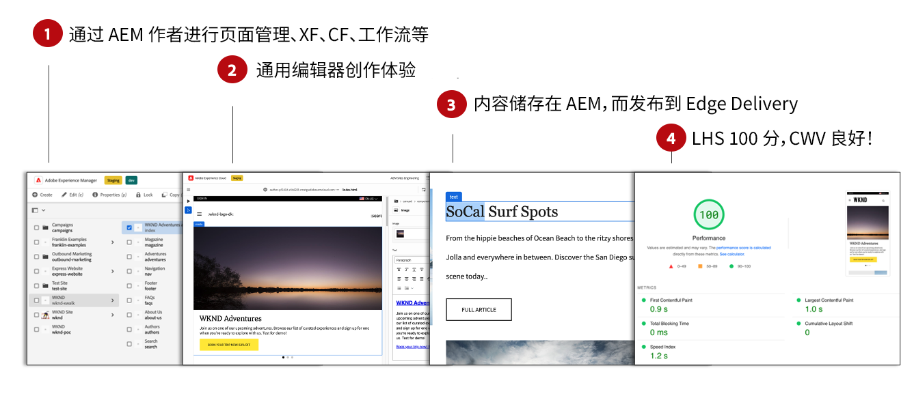
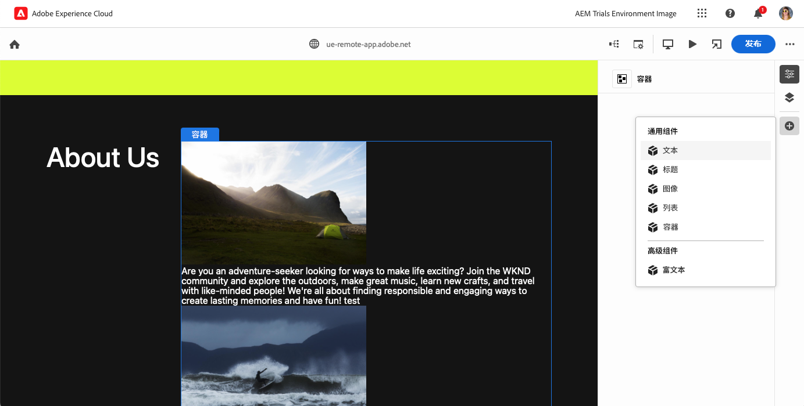
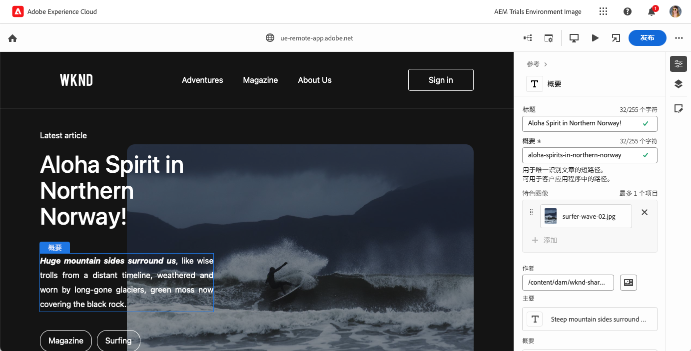

# 面向Edge Delivery Services的WYSIWYG内容创作 {#authoring-edge}

Edge Delivery Services 让创作变得简单、快速且灵活。您有两种选择来为 Edge Delivery Services 创作内容：

* [通用编辑器](#universal-editor) — 用于在AEM中创作内容的现代“所见即所得”(WYSIWYG)UI
* [基于文档的创作](#document-based) - 例如 Microsoft Word 或 Google Docs

## 通用编辑器创作 {#universal-editor}

将 Edge Delivery Services 与 AEM as a Cloud Service 结合使用时，需要了解的最基本情况是您创作的内容将保留在 AEM as a Cloud Service 中。

1. [AEM Sites环境](/help/sites-cloud/authoring/quick-start.md)用于内容管理，例如创建新页面、体验片段、内容片段等。
   * AEM 的所有功能均可用，例如工作流程、MSM、翻译、启动等。
1. [通用编辑器](/help/sites-cloud/authoring/universal-editor/authoring.md)用于创作 AEM 中管理的内容。
   * 通用编辑器为内容创作提供了全新且现代的用户界面。
   * 对于创作，AEM 会呈现 HTML，但包括来自 Edge Delivery Services 的脚本、样式、图标和其他资源。
   * 尽管使用了通用编辑器，但所有更改都会保留到 AEM。
   * 通用编辑器尚未与 AEM Page Editor 具有同等功能，并且某些 AEM 功能在通用编辑器中可能不可用。
1. 您使用通用编辑器创作并保留到 AEM 的内容将发布到 Edge Delivery Services。
   * 内容仍会存储在 AEM 中。
   * AEM 会呈现摄取所需的语义 HTML。
   * 内容发布到 Edge Delivery Services。
1. [Edge Delivery Services](/help/edge/developer/keeping-it-100.md) 确保获得 100% 的 Lighthouse 分数。

区块是 Edge Delivery Services 交付页面的基本组件。作者可以从 Adobe 作为标准提供的默认区块或开发人员为您的项目定制的区块中进行选择。

通用编辑器提供了一个现代且直观的GUI，用于通过添加和排列块来创作内容。

然后，可以在属性面板中配置块的详细信息。

有关如何使用通用编辑器进行创作的详细信息，请参阅文档[使用通用编辑器创作内容。](/help/sites-cloud/authoring/universal-editor/authoring.md)

请参阅[使用Edge Delivery Services进行WYSIWYG创作的开发人员快速入门指南](/help/edge/wysiwyg-authoring/edge-dev-getting-started.md)，了解如何使用AEM和Edge Delivery Services开始您自己的项目以进行创作。

## 其他创作方法  {#authoring-methods}

WYSIWYG创作是适用于内容创作的功能强大且直观的工具。 但是，创作用例多种多样，这就是AEM提供其他创作解决方案的原因。

请参阅文档[选择创作方法](/help/edge/authoring-methods.md)，了解有关AEM提供的创作解决方案（包括基于文档的创作和headless）的更多信息。
