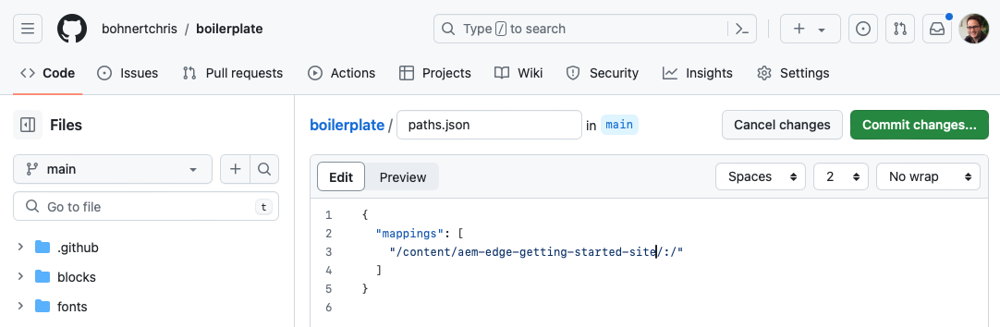
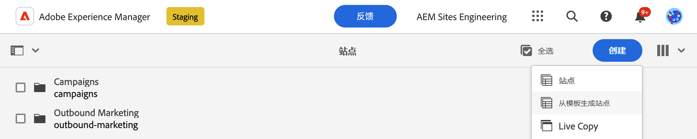
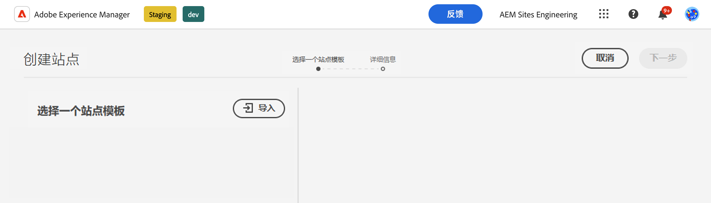
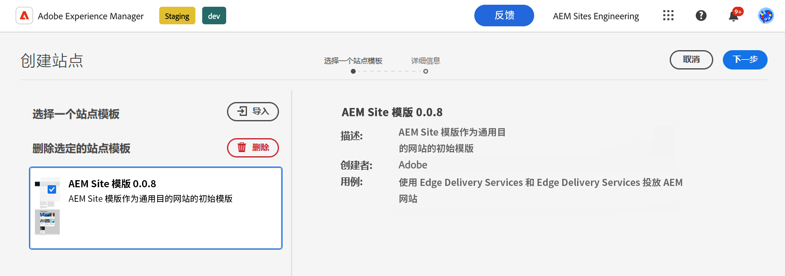
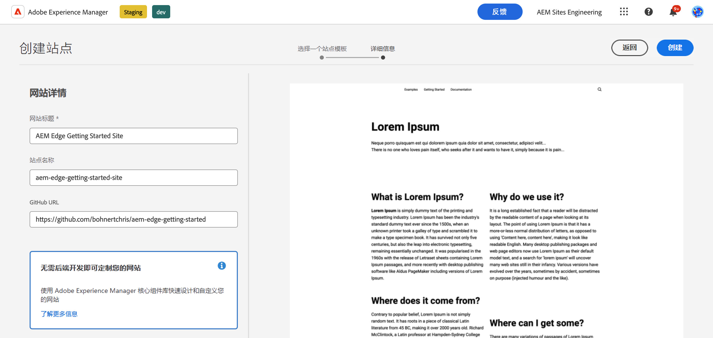
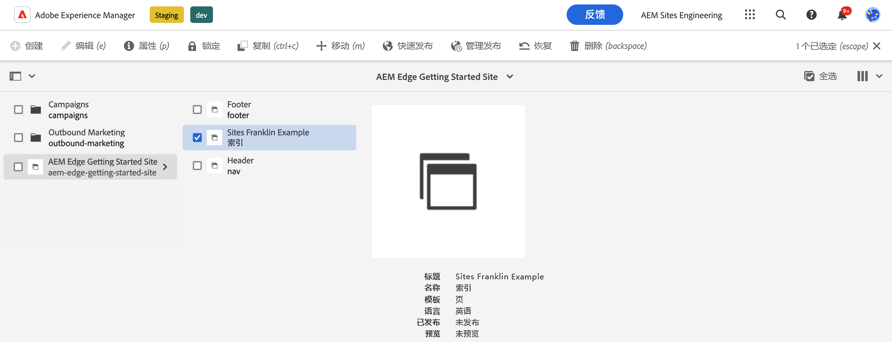
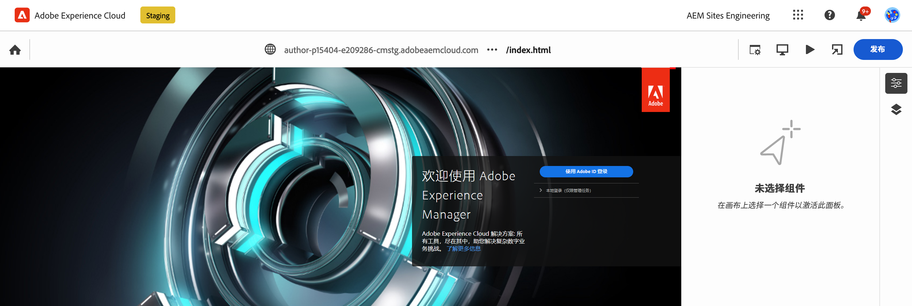
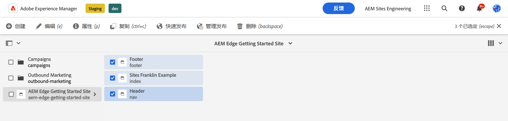
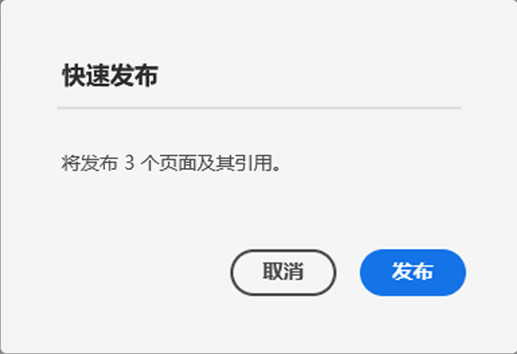

# 使用 Edge Delivery Services 进行所见即所得创作的开发人员快速入门指南 {#edge-dev-getting-started}

本指南将帮助您使用 Edge Delivery Services 和用于所见即所得内容创作的通用编辑器，启动并运行新的 Adobe Experience Manager 网站。

## 先决条件 {#prerequisites}

在开始阅读本指南之前，您应已熟悉 Edge Delivery Services 的基础知识并有权访问这些服务，其中包括：

* 您已学完 [Edge Delivery Services 教程](/help/edge/developer/tutorial.md)。
* 您有权访问 [AEM Cloud Service 沙盒](/help/implementing/cloud-manager/getting-access-to-aem-in-cloud/introduction-sandbox-programs.md)。
* 您已[启用同一沙盒环境上的 Universal Editor](/help/implementing/universal-editor/getting-started.md)。

## Edge Delivery Services 开发的核心概念 {#core-concepts}

Edge Delivery Services 基于块的概念。AEM 附带一个全面的预定义的块库，可扩展它以满足您的项目需求。在 GitHub 中管理 Edge Delivery Services 项目的代码。

### 块 {#blocks}

块是 Edge Delivery Services 传递页面最基本的部分。块封装了用于驱动内容页的逻辑组件的样式和代码。

AEM 提供标准块，作为项目样板中产品的一部分。这些块包括标题、文本、图像、链接、列表等。

>[!TIP]
>
>请参阅 Edge Delivery Services 文档中的[构建部分](/help/edge/developer/block-collection.md)，了解有关块以及如何开发 Edge Delivery Services 的更多详细信息。

### Edge Delivery Services 和 GitHub {#github-edge}

Edge Delivery 利用 GitHub，因此您可直接从您的 GitHub 存储库管理和部署代码。

您的作者可以使用基于文档的创作或使用 Universal Editor 在 AEM 中创建内容。无论作者如何创建其内容，开发人员都可以使用 GitHub 中的 CSS 和 JavaScript 自定义网站的功能。

从内容预览到生产，将自动为您的每个分支创建网站。您放入 GitHub 存储库中的每个资产都在您的网站上可供使用，无需构建过程。

>[!TIP]
>
>请参阅 Edge Delivery Services 文档中的[构建部分](/help/edge/developer/block-collection.md)，了解有关块以及如何开发 Edge Delivery Services 的更多详细信息。

## 所见即所得创作和 Edge Delivery Services 快速入门 {#getting-started}

一旦满足[先决条件](#prerequisites)并[选择使用 Universal Editor](#editor-choice)，即可开始您自己的项目。

### 创建您的 GitHub 项目 {#create-github-project}

首先，需要在 GitHub 上基于 Adobe 模板创建新项目。

1. 导航到 [`https://github.com/adobe-rnd/aem-boilerplate-xwalk`](https://github.com/adobe-rnd/aem-boilerplate-xwalk) 并单击&#x200B;**使用此模板**，然后选择&#x200B;**创建新存储库**。

   * 需要登录到 GitHub 才能看到此选项。

   

1. 默认情况下，将为您分配该存储库。按需更改此项并提供存储库名称和描述，然后单击&#x200B;**创建存储库**。

   

1. 在同一浏览器上的新标签页中，导航到 [`https://github.com/apps/aem-code-sync`](https://github.com/apps/aem-code-sync) 并单击&#x200B;**配置**。

   

1. 对于您在上一步从中创建了新存储库的组织单击&#x200B;**配置**。

   

1. 在 AEM Code Sync GitHub 页面上的&#x200B;**存储库访问权限**&#x200B;下，选择&#x200B;**仅某些存储库**，选择在上一步创建的存储库，然后单击&#x200B;**保存**。

   

1. 安装 AEM Code Sync 后，即看到确认屏幕。返回新存储库的浏览器标签页。

   

1. 单击 `fstab.yaml` 文件以打开它，然后单击&#x200B;**编辑此文件**&#x200B;图标以编辑它。

   

1. 编辑 `fstab.yaml` 文件以更新您的项目的挂载点。将默认的 Google 文档 URL 替换为您的 AEM as a Cloud Service 创作实例的 URL，然后单击&#x200B;**提交更改...**。

   * `https://<aem-author>/bin/franklin.delivery/<owner>/<repository>/main`
   * 更改挂载点将告知 Edge Delivery Services 在哪里可找到该站点的内容。

   

1. 按需添加一条提交消息，然后单击&#x200B;**提交更改**，将其直接提交到 `main` 分支。

   

1. 返回您存储库的根目录，然后依次单击 `paths.json`、**编辑此文件**&#x200B;图标。

   

1. 默认映射将使用存储库的名称。根据项目的需要使用 `/content/<site-name>/:/` 更新默认映射，然后单击 **提交更改……**。

   * 提供您自己的`<site-name>`。您将在稍后的步骤中用到它。
   * 映射告知 Edge Delivery Services 如何将您 AEM 存储库中的内容映射到站点 URL。

   

1. 按需添加一条提交消息，然后单击&#x200B;**提交更改**，将其直接提交到 `main` 分支。

   

>[!TIP]
>
>有关路径映射的更多信息，请参阅文档 [Edge Delivery Services 的路径映射。](/help/edge/wysiwyg-authoring/path-mapping.md)

### 创建并编辑新 AEM 站点 {#create-aem-site}

既然已有 GitHub 项目，那就必须创建该项目可使用的新 AEM 站点。

>[!NOTE]
>
>要使用 Universal Editor 编辑您的站点，您必须使用基于 Chromium 的浏览器。

1. 在 [`https://github.com/adobe-rnd/aem-boilerplate-xwalk/releases`](https://github.com/adobe-rnd/aem-boilerplate-xwalk/releases) 从 GitHub 下载最新的所见即所得创作和 Edge Delivery Services 网站模板。

1. 登录到您的 AEM as a Cloud Service 创作实例，导航到“站点”控制台，然后点击或单击&#x200B;**创建** -> **从模板创建站点**。

   

1. 在“创建站点”向导的&#x200B;**选择站点模板**&#x200B;选项卡上，单击&#x200B;**导入**&#x200B;按钮以导入新模板。

   

1. 上传您从 GitHub 下载的带有 Edge Delivery Services 网站模板的所见即所得创作。

   * 该模板只能上传一次。上传后，即可重复使用，以创建其他站点。

1. 导入该模板后，它即出现在向导中。点击或单击以选择它，然后点击或单击&#x200B;**下一步**。

   

1. 为以下字段提供内容，然后点击或单击&#x200B;**创建**。

   * **站点标题** - 添加该站点的描述性标题。
   * **站点标题** - 使用在`<site-name>`上一步[定义的 ](#create-github-project)。
   * **GitHub URL** - 使用在上一步创建的 GitHub 项目的 URL。

   

1. AEM 用一个对话框确认创建了该站点。点击或单击&#x200B;**确定**&#x200B;以关闭。

   

1. 在“站点”控制台上，导航到新创建的站点的 `index.html`，然后在工具栏中点击或单击&#x200B;**编辑**。

   

1. Universal Editor 在新标签页中打开。您可能需要点击或单击&#x200B;**使用 Adobe 登录**&#x200B;以进行身份验证才能编辑您的页面。

   

您现在可以使用 Universal Editor 编辑您的站点。有关更多信息，请参阅 [Universal Editor 文档](/help/sites-cloud/authoring/universal-editor/authoring.md)。

### 发布您的新站点 {#publishing}

使用 Universal Editor 编辑完您的新站点后，即可发布您的内容。

1. 在“站点”控制台上，选择为您的新站点创建的所有页面，然后在工具栏中点击或单击&#x200B;**快速发布**。

   

1. 在确认对话框中点击或单击&#x200B;**发布**&#x200B;以开始该过程。

   

1. 在同一浏览器中打开新标签页，然后导航到您新站点的 URL。

   * `https://main--<repository-name>--<owner>.aem.page`

1. 查看您发布的内容。

   

## 后续步骤 {#next-steps}

现在，您已经拥有了一个带有 Edge Delivery Services 项目的有效的所见即所得创作环境，您可以开始创建和设计自己的块了。

有关更多信息，请参阅[创建用于通用编辑器的块](/help/edge/wysiwyg-authoring/create-block.md)指南。

>[!TIP]
>
>有关创建新的 Edge Delivery Services 项目的端到端演练，该项目支持使用 AEM as a Cloud Service 作为内容源进行所见即所得创作，请查看[此 AEM GEM 网络研讨会。](https://experienceleague.adobe.com/zh-hans/docs/events/experience-manager-gems-recordings/gems2024/aem-authoring-and-edge-delivery)
