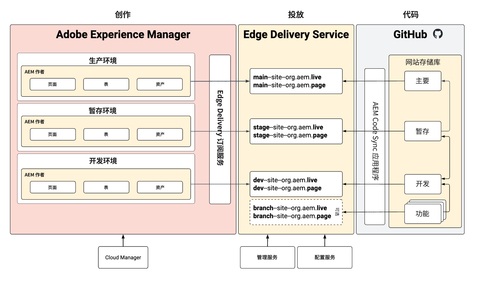

# 无重复的暂存和生产环境 {#repoless-stage-prod}

了解如何使用单一代码库以无重复方式为您的暂存环境和生产环境设置一个单独的 Sites。

## 概述 {#overview}

您可能希望为生产环境设置一个与暂存环境分开的 Site。为一个单独的暂存和生产环境设置第二个 Site，类似于[多 Site 管理所需的设置](/help/edge/wysiwyg-authoring/repoless-msm.md)。事实上，在需要的情况下，它可以与 MSM Site 结构相结合。

此文档使用单独的暂存和生产环境的典型示例。您可以为任何您希望的环境创建单独的环境。

## 要求 {#requirements}

要配置无重复的暂存和生产环境，您必须首先完成以下任务：

* 此文档假设您已经根据[使用 Edge Delivery Services 进行所见即所得创作的开发人员快速入门指南](/help/edge/wysiwyg-authoring/edge-dev-getting-started.md)为您的项目创建了一个 Site。
* 您必须已经[为您的项目启用了无重复功能。](/help/edge/wysiwyg-authoring/repoless.md)

## 配置 {#configuration}

此文档介绍了如何使用相同的代码库为您的项目设置一个单独的生产 Site。做了以下假设。

* 已经设置了暂存 Site，现在您要为生产 Site 创建配置。
* AEM 创作中的内容结构是相似的。
* 暂存和生产将使用相同的路径映射。

在这个例子中，我们假设已经为名为 wknd 的项目创建了一个生产 Site，该项目的 GitHub 重复也称为 wknd。

配置一个单独的生产 Site 有两个步骤。

1. [为您的生产环境创建新的 Edge Delivery Services Sites](#create-edge-site)。
1. [在 AEM 中为您的生产 Site 更新云配置](#update-cloud-configuration)。

### 为您的生产环境创建新的 Edge Delivery Services Sites {#create-edge-site}

1. 为您的程序检索授权令牌和技术帐户。
   * 请参阅文档&#x200B;**跨 Sites 重用代码**，了解如何为您的程序[获取您的访问令牌](/help/edge/wysiwyg-authoring/repoless.md#access-token)和[技术帐户](/help/edge/wysiwyg-authoring/repoless.md#access-control)。
1. 通过以下方式调用配置服务来创建一个新 Site。请考虑：
   * POST URL 中的项目名称必须是您正在创建的新 Site 名称。在这个例子中，它是 `wknd-prod`。
   * `code` 配置应该与您在初始创建项目时使用的配置相同。
   * `content` > `source`  > `url` 必须根据您正在创建的新 Site 的名称进行调整。在这个例子中，它是 `wknd-prod`。
   * 也就是说，POST URL 中的 Site 名称与 `content` > `source`  > `url` 必须相同。
   * 调整 `admin` 块，定义应该对 Site 具有完全管理访问权限的用户。
      * 这是一个电子邮件地址数组。
      * 可以使用通配符 `*`。
      * 查看文档[配置作者的身份验证](https://www.aem.live/docs/authentication-setup-authoring#default-roles)，了解更多信息。

   ```text
   curl --request POST \
     --url https://admin.hlx.page/config/<your-github-org>/sites/wknd-prod.json \
     --header 'x-auth-token: <your-token>' \
     --header 'Content-Type: application/json' \
     --data '{
       "code": {
           "owner": "<your-github-org>",
           "repo": "wknd",
           "source": {
               "type": "github",
               "url": "https://github.com/<your-github-org>/wknd"
           }
       },
       "content": {
           "source": {
               "url": "https://author-p<programID>-e<environmentID>.adobeaemcloud.com/bin/franklin.delivery/<your-github-org>/wknd-prod/main",
               "type": "markup",
               "suffix": ".html"
           }
       },
       "access": {
           "admin": {
               "role": {
                   "admin": [
                       "<email>@<domain>.<tld>"
                   ],
                   "config_admin": [
                       "<tech-account-id>@techacct.adobe.com"
                   ]
               },
               "requireAuth": "auto"
           }
       }
   }'
   ```

1. 通过以下方法调用配置服务，为您的新 Site 添加路径映射。

   ```text
   curl --request POST \
     --url https://admin.hlx.page/config/<your-github-org>/sites/wknd-prod/public.json \
     --header 'x-auth-token: <your-token>' \
     --header 'Content-Type: application/json' \
     --data '{
       "paths": {
           "mappings": [
               "/content/wknd/:/"
           ],
           "includes": [
               "/content/wknd/"
           ]
       }
   }'
   ```

调用 `https://main--wknd-prod--<your-github-org>.aem.page/config.json` 验证新 Site 的公共配置是否正常工作，并验证返回的 JSON 的内容。

### 在 AEM 中为您的生产 Site 更新云配置 {#update-cloud-configuration}

生产 AEM 必须被配置为使用您在上一节中为专用生产 Site 创建的新 Edge Delivery Sites。在这个例子中，您的生产环境中 `/content/wknd` 中的内容需要知道应使用您创建的 `wknd-prod` Site。

1. 登录 AEM 生产实例，然后前往&#x200B;**工具** -> **Cloud Services** -> **Edge Delivery Services 配置**。
1. 选择为您的项目自动创建的配置。
1. 在工具栏中点击或单击&#x200B;**属性**。
1. 在 **Edge Delivery Services 配置**&#x200B;窗口中：
   * 在&#x200B;**组织**&#x200B;字段中提供您的 GitHub 组织。
   * 将 Site 名称改为您在上一节中创建的 Site 的名称。在这个例子中是 `wknd-prod`。
   * 将项目类型改为&#x200B;**带有无重复配置设置的 aem.live**。
1. 点击或单击&#x200B;**保存并关闭**。

## 验证您的设置 {#verify}

现在您完成了所有必要的配置更改，请验证一切是否按预期工作。

1. 登录您的 AEM 生产创作实例。
1. 导航至&#x200B;**Sites 控制台**，即从&#x200B;**导航**  -> **Sites**。
1. 选择您 Site 中的一个页面。
1. 在工具栏中点击或单击&#x200B;**编辑**。
1. 确保页面在通用编辑器中正确呈现，并使用与 Site 根目录相同的代码。
1. 对页面进行更改，然后重新发布。
1. 在 `https://main--wknd-prod--<your-github-org>.aem.page` 访问新的 Edge Delivery Services Site，查看此本地化页面。

如果您能看到所做的更改，就说明单独的生产 Site 设置正常运行。

## 用途 {#usage}

您用无重复的暂存和生产环境配置了项目后，就可以独立管理它们的代码。下图说明了 AEM、Edge Delivery Services Sites 和 GitHub 存储库中各个环境中的内容之间的关系。


