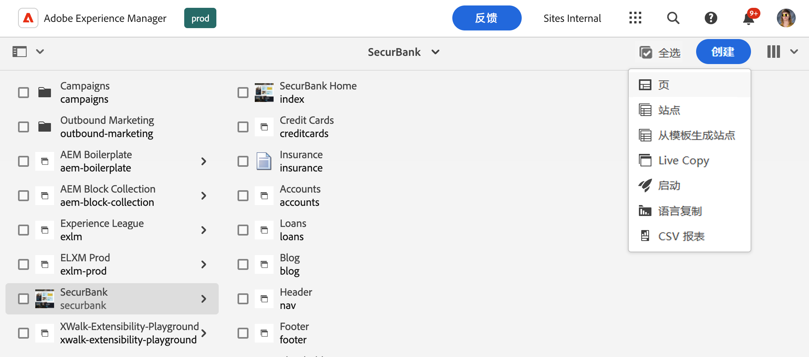
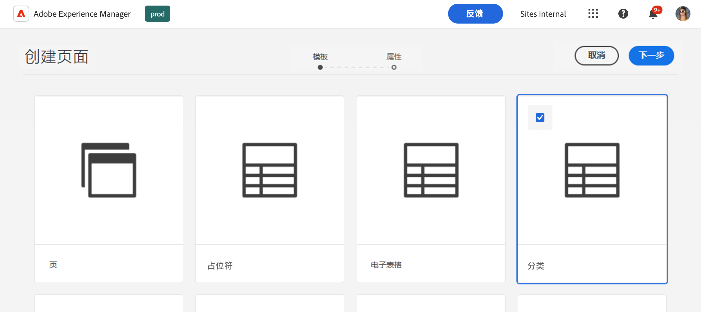
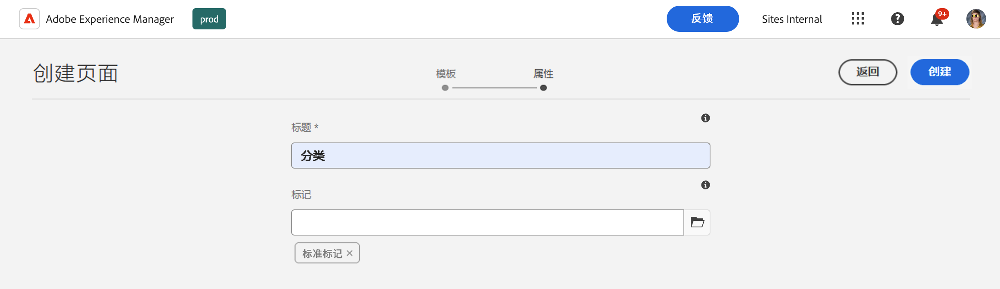
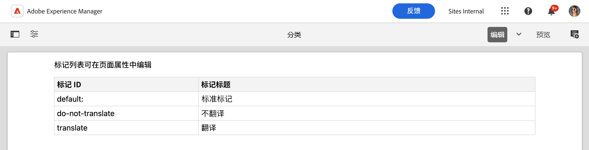
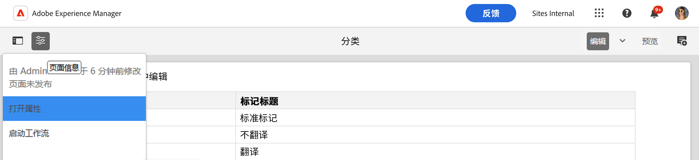
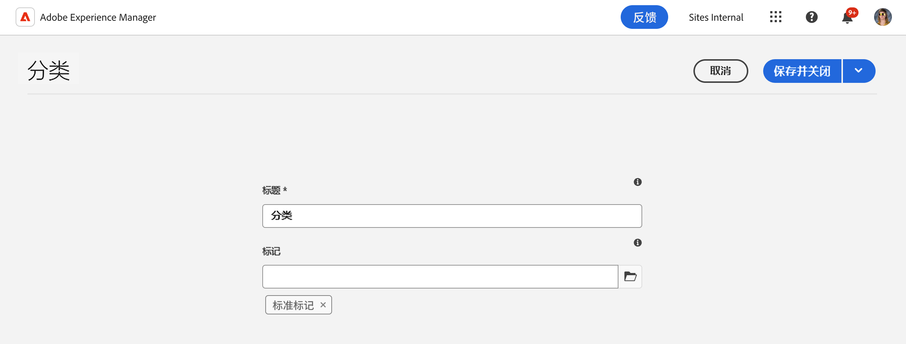

# 管理分类数据 {#managing-taxonomy-data}

了解如何管理分类数据，以便使用 AEM 和 Edge Delivery Services sites的标签进行操作。

## 简介 {#introduction}

标记是一项重要功能，可帮助您组织和管理页面。[AEM 中的标记控制台](/help/sites-cloud/administering/tags.md#tagging-console) 允许您创建丰富的标记分类来组织您的页面。

这些标签不仅对您和您的作者组织内容有用，而且对您的读者也很有用。标签及其分类法可用于页面上的组件，以帮助读者浏览您的内容。

通用编辑器仅适用于您的标签 ID。通过为您的内容创建分类页面，您可以将所有语言的这些标签的描述公开给通用编辑器，以便它可以在呈现内容时使用该信息。

## 创建特征分类 {#creating}

分类法的创建方式与 [AEM 中的任何其他页面一样。](/help/sites-cloud/authoring/sites-console/creating-pages.md)

1. Navigate to the [**Sites** console.](/help/sites-cloud/authoring/sites-console/introduction.md)

1. 选择您想要创建分类法的位置。

1. 点击或单击&#x200B;**创建**-> **页面**。

   

1. 在 **创建页面** 向导的 **模板** 选项卡上，选择 **分类法** 模板，然后点击或单击 **下一步**。

   

1. 在“创建页面” **向导的** “属性” **选项卡上，为页面提供一个有意义的** 标题 **，并在** 标签 **字段中，** 使用标签选择器 [选择您想要包含在分类法中的标签或命名空间。](/help/sites-cloud/authoring/sites-console/tags.md) 

   

1. 点击或单击“**创建**”。

分类页面已创建。在 **成功** 对话框中，您可以点击或单击 **完毕** 对话框以关闭消息或 **打开** 编辑页面 [页面编辑器。](/help/sites-cloud/authoring/page-editor/introduction.md)

记下分类页面的结果页面名称，以便在以下步骤中使用。

## 创建特征分类 {#editing}

您可以开始编辑分类页面，就像编辑 AEM 中的任何其他页面一样。

1. Navigate to the [**Sites** console.](/help/sites-cloud/authoring/sites-console/introduction.md)

1. 选择您想要编辑的分类法。

1. 点击或单击 **编辑** 在操作栏中。

1. 页面编辑器打开并显示分类法。

   * 分类页面在页面编辑器中是只读的。

   

1. 点击或单击 **页面信息** 图标，然后选择 **打开属性**。

   

1. 在 **页面属性** 窗口，您可以更新页面名称并使用标签选择器来更新分类法中包含的标签和命名空间。

   

1. 点按或单击&#x200B;**保存并关闭**。

页面编辑器中显示的页面是只读的，因为分类法的内容是根据所选标签和命名空间自动生成的。它们充当一种过滤器，用于自动生成分类法的内容。因此没有理由直接在编辑器中编辑页面。

当您更新底层标签和命名空间时，AEM 会自动更新分类页面的内容。但是你必须 [重新发布分类法](#publishing) 在任何更改之后，让您的用户可以使用这些更改。

## 更新分类发布的 paths.json {#paths-json}

就像当 [管理和发布 Edge Delivery Services sites的表格数据，](/help/edge/wysiwyg-authoring/tabular-data.md) 你需要更新你的 `paths.json` 您的项目文件以允许发布您的分类数据。

1. 在 GitHub 中打开您的项目的根目录。

1. 点击或单击 `paths.json` 文件以打开其详细信息，然后点击“**编辑**”图标。

   

1. 添加一行以将新电子表格映射到`.json`资源。

   ```json
   {
     "mappings": [
      "/content/<site-name>/:/",
      "/content/<site-name>/<taxonomy-page-name>:/<taxonomy-json-name>.json"
     ]
   }
   ```

   * `<taxonomy-page-name>` 必须与名称匹配 [您创建的分类页面。](#creating)
   * `<taxonomy-json-name>` 可以是您选择的任何有效名称。

1. 单击“**提交更改...**”将更改保存到 `main`。

   * 根据您的流程提交`main`或创建拉取请求。

每个分类页面只需执行一次此过程。完成后，您可以发布您的分类法。

>[!TIP]
>
>有关路径映射的更多信息，请参阅文档 [Edge Delivery Services 的路径映射。](/help/edge/wysiwyg-authoring/path-mapping.md)

## 发布分类法 {#publishing}

分类法在发布之前不可供通用编辑器或您的用户使用。

分类页面像其他页面一样发布， [使用 **快速发布** 或者 **管理出版物** 工具栏中的图标。](/help/sites-cloud/authoring/sites-console/publishing-pages.md)

每次执行以下操作时，都必须重新发布分类页面：

* 编辑分类页面。
* 编辑或添加分类页面中包含的标签和命名空间。

如果你创建新的分类页面，你必须首先 [添加一个映射到 `paths.json` 项目中的文件。](#paths-json)

## 访问分类信息 {#accessing}

一旦您的分类法发布，通用编辑器就可以利用其信息并将其显示给您的用户。

您可以通过以下地址以 JSON 数据形式访问分类法。

`https://<branch>--<repository>--<owner>.aem.page/<taxonomy-json-name>.json`

使用 `<taxonomy-json-name>` 你定义的 [将您的分类法映射到 `paths.json` 项目中的文件。](#paths-json) 分类数据以 JSON 数据形式返回，如下例所示。

```json
{
  "total": 3,
  "offset": 0,
  "limit": 3,
  "data": [
    {
      "tag": "default:",
      "title": "Standard Tags"
    },
    {
      "tag": "do-not-translate",
      "title": "Do Not Translate"
    },
    {
      "tag": "translate",
      "title": "Translate"
    }
  ],
  ":type": "sheet"
}
```

当您更新分类法并重新发布时，此 JSON 数据将自动更新。您的应用可以通过编程为您的用户访问此信息。

[如果你维护多种语言的标签，](/help/sites-cloud/administering/tags.md#managing-tags-in-different-languages) 你可以通过传入 ISO2 语言代码作为 `sheet=` 范围。
