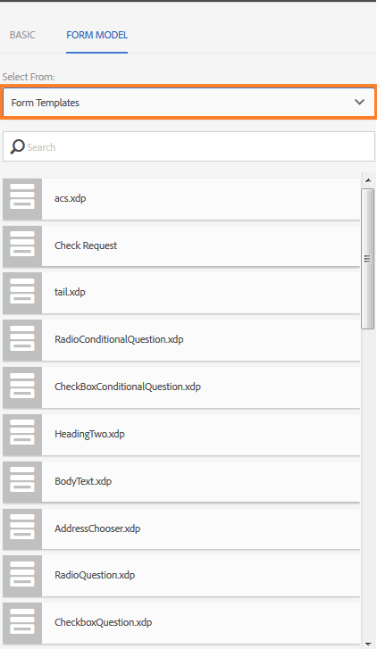

# 自适应表单片段{#adaptive-form-fragments}

虽然每个表单都是为特定目的而设计的，但大多数表单中都存在一些通用区段，例如提供个人详细信息，如姓名和地址、家庭详细信息、收入详细信息等。 每次创建新表单时，表单开发人员都需要创建这些通用区段。

自适应Forms提供了一种便捷的机制，只需像创建面板或一组字段一样创建表单片段一次，即可在自适应Forms中重复使用。 这些可重用的独立区段称为自适应表单片段。

## 创建片段 {#create-a-fragment}

您可以从头开始创建自适应表单片段，或将现有自适应表单中的面板另存为片段。

### 从头开始创建片段 {#create-fragment-from-scratch}

1. 登录 [!DNL AEM Forms] 创作实例，位于https://[*主机名*]：[*端口*]/aem/forms.html.
1. 单击 **创建>自适应表单片段**.
1. 指定片段的标题、名称、描述和标记。

   >[!NOTE]
   >
   >确保为片段指定唯一的名称。 如果已存在另一个同名片段，则创建该片段失败。

1. 单击以打开 **表单模型** 选项卡，然后从 **选择自** 下拉菜单，为片段选择以下模型之一：

   * **无**：指定从头开始创建片段，而不使用任何表单模型。
   * **表单模板**：指定使用上传到的XDP模板创建片段 [!DNL AEM Forms]. 选择适当的XDP模板作为片段的表单模型。

   

   还会显示选定表单模板中标记为片段的子表单。 您可以从下拉列表中选择自适应表单片段的子表单。

   

   此外，您还可以通过在下拉框中为子表单指定SOM表达式，使用在表单模板中未标记为片段的子表单创建自适应表单片段。

   * **XML架构**：指定使用上载到的XML架构创建片段 [!DNL AEM Forms]. 您可以上传或从可用的XML架构中选择作为片段的表单模型。

   

   您还可以通过从下拉框中选择所选架构中存在的complexType来创建自适应表单片段。

   

1. 单击 **创建** 然后单击 **打开** 在编辑模式下使用默认模板打开片段。

在编辑模式下，您可以将任何自适应表单组件从AEM sidekick拖放到片段上。 <!-- For information about Adaptive Form components, see Introduction to authoring Adaptive Forms. -->

此外，如果您选择了XML架构或XDP表单模板作为片段的表单模型，则内容查找器中会显示一个显示表单模型层次结构的新选项卡。 它允许您将表单模型元素拖放到片段上。 添加的表单模型元素被转换为表单组件，同时保留关联XDP或XSD的原始属性。

### 将面板另存为片段 {#save-panel-as-a-fragment}

1. 打开一个自适应表单，其中包含要另存为自适应表单片段的面板。
1. 在面板工具栏中，单击 **[!UICONTROL 另存为片段]**. 这将打开另存为片段对话框。

   >[!NOTE]
   >
   >如果要另存为片段的面板包含子面板，则生成的片段将包含这些子面板。

1. 在片段创建对话框中，指定以下信息：

   * **名称**：片段的名称。 默认值为面板的元素名称。 它是必填字段。
     >[!NOTE]
     >
     >确保为片段指定唯一的名称。 如果已存在另一个同名片段，则创建该片段失败。

   * **标题**：片段的标题。 默认值为面板的标题。

   * **描述**：片段的描述。

   * **标记**：片段的标记元数据。

   * **目标路径**：保存片段的存储库路径。 如果不指定路径，则会在包含自适应表单的节点旁边创建与片段名称相同的节点。 片段将保存在此节点中。

   * **表单模型**：根据自适应表单的表单模型，此字段显示 **XML架构**， **表单模板**，或 **无**. 它是不可编辑的字段。

   * **片段模型根**：仅在基于XSD的自适应Forms中显示。 它指定片段模型的根。 您可以选择 **/** 或从下拉菜单中选取XSD复杂类型。 请注意，只有在选择复杂类型作为片段模型根时，才能在另一个自适应表单中重用片段。
如果您选择 **/** 作为片段模型根，根中的完整XSD树在“自适应表单数据模型”选项卡中可见。 对于复杂类型片段模型根，在“自适应表单数据模型”选项卡中，只有选定复杂类型的后代可见。

   * **XSD参考**：仅在基于XSD的自适应Forms中显示。 它显示XML方案的位置。

   * **XDP参考**：仅在基于XDP的自适应Forms中显示。 它显示XDP表单模板的位置。

   

   “另存为片段”对话框

1. 单击&#x200B;**确定**。

   该面板将保存在存储库中的指定或默认位置。 在自适应表单中，面板被替换为片段的快照。 如下所示，“常规信息”面板及其子面板“个人信息”和“地址”将另存为片段。

   要编辑片段，请单击 **[!UICONTROL 编辑资源]** 在面板工具栏中。 片段在编辑模式下的新选项卡或窗口中打开。

   

## 使用片段 {#working-with-fragments}

### 配置片段外观 {#configure-fragment-appearance}

您在Adaptive Forms中插入的任何片段都显示为占位符图像。 占位符在片段中最多显示十个子面板的标题。 您可以配置 [!DNL AEM Forms] 显示完整片段而不是占位符图像。

执行以下步骤以在表单中显示完整的片段：

1. 转到AEM Web控制台配置页，网址为https：[*主机*]：[*端口*]/system/console/configMgr.

1. 搜索并单击 **[!UICONTROL 自适应表单配置服务]** 以在编辑模式下将其打开。
1. 禁用 **[!UICONTROL 启用占位符代替片段]** 用于显示完整片段而不是占位符图像的复选框。

### 在自适应表单中插入片段 {#insert-a-fragment-in-an-adaptive-form}

您创建的自适应表单片段显示在AEM内容查找器的“自适应表单片段”选项卡中。 要在自适应表单中插入自适应表单片段，请执行以下操作：

1. 在编辑模式下打开自适应表单，您要在其中插入自适应表单片段。
1. 单击 **资产**  在侧栏中。 在资源浏览器中，选择 **自适应表单片段** 从下拉菜单中。

   您还可以选择显示所有自适应表单片段或根据其表单模型（表单模板、XML架构或基本）进行筛选。

1. 将自适应表单片段拖放到自适应表单上。

   >[!NOTE]
   >
   >自适应表单片段未启用在自适应表单中进行创作。 此外，在基于JSON的自适应表单中不能使用基于XSD的片段，反之亦然。

自适应表单片段在自适应表单中通过引用插入，并与独立的自适应表单片段同步。 这意味着当您更新自适应表单片段时，更改会反映在使用片段的所有Adaptive Forms中。

### 在自适应表单中嵌入片段 {#embed-a-fragment-in-adaptive-form}

您可以通过单击 **嵌入资源： &lt;*片段名称*>** 按钮时，将显示所添加片段的面板工具栏上的图标，如下面的示例图像所示。

>[!NOTE]
>
>嵌入的片段不再与独立片段链接。 您可以从自适应表单中编辑嵌入片段中的组件。

### 在片段中使用片段 {#using-fragments-within-fragments}

您可以创建嵌套式自适应表单片段，这意味着您可以将片段拖放到另一个片段中，并且可以具有嵌套式片段结构。

### 更改片段 {#change-fragments}

您可以使用替换或更改自适应表单片段 **选择片段资源** 自适应表单片段面板的编辑组件对话框中的属性。

## 数据绑定的片段自动映射 {#auto-mapping-of-fragments-for-data-binding}

当您使用XFA表单模板或XSD复杂类型创建自适应表单片段并将片段拖放到自适应表单时，XFA片段或XSD复杂类型会自动被对应的自适应表单片段替换，其片段模型根映射到XFA片段或XSD复杂类型。

您可以从“编辑组件”对话框更改片段资源及其绑定。

>[!NOTE]
>
>您还可以从AEM内容查找器中的自适应表单片段库拖放绑定的自适应表单片段，并从自适应表单片段面板的“编辑组件”对话框中提供正确的绑定引用。

## 管理片段 {#manage-fragments}

您可以使用对自适应表单片段执行多个操作 [!DNL AEM Forms] UI。

1. 转到 `https://[hostname]:'port'/aem/forms.html`.

1. 单击 **选择** 在 [!DNL AEM Forms] 用户界面工具栏并选择自适应表单片段。 工具栏显示您可以对选定的自适应表单片段执行的以下操作。

<table>
 <tbody>
  <tr>
   <td>
<strong>操作</strong>
 </td>
   <td>
<strong>描述</strong>
 </td>
  </tr>
  <tr>
   <td>
打开
 </td>
   <td>
在编辑模式下打开选定的自适应表单片段。    
 </td>
  </tr>
  <tr>
   <td>
查看属性
 </td>
   <td>
打开属性面板。 在“属性”面板中，您可以查看和编辑属性、生成预览以及上传所选片段的缩略图图像。 有关更多信息，请参阅 <a href="manage-form-metadata.md" target="_blank">管理元数据</a>.    
 </td>
  </tr>
  <tr>
   <td>
复制
 </td>
   <td>
复制选定的片段。 “粘贴”按钮显示在工具栏中。    
 </td>
  </tr>
  <tr>
   <td>
下载
 </td>
   <td>
下载选定的片段。    
 </td>
  </tr>
  <tr>
   <td>
预览
 </td>
   <td>
通过将XML文件中的数据与片段合并，提供将片段预览为HTML或自定义预览的选项。 <!-- For more information, see <a href="previewing-forms.md" target="_blank">Previewing a form</a>.    -->
 </td>
  </tr>
  <tr>
   <td>
开始审核/管理审核
 </td>
   <td>
允许启动和管理所选片段的审阅。 <!-- For more information, see <a href="create-reviews-forms.md" target="_blank">Creating and managing reviews</a>.    
 --> </td>
  </tr>
  <tr>
   <td>
创建词典
 </td>
   <td>
生成用于本地化所选片段的词典。 <!-- For more information, see <a href="lazy-loading-adaptive-forms.md" target="_blank">Localizing Adaptive Forms</a>.    --> 
 </td>
  </tr>
  <tr>
   <td>
发布/取消发布
 </td>
   <td>
发布/取消发布选定的片段。    
 </td>
  </tr>
  <tr>
   <td>
删除
 </td>
   <td>
删除选定的片段。    
 </td>
  </tr>
 </tbody>
</table>

## 本地化包含片段的自适应表单 {#localizing-adaptive-form-containing-fragments}

要本地化包含自适应表单片段的自适应表单，您需要单独本地化片段和表单。 其思想是将片段本地化一次，并在多个自适应Forms中重复使用。

>[!NOTE]
>
>片段中的本地化键不会显示在自适应表单的XLIFF文件中。

## 使用片段时要记住的要点 {#key-points-to-remember-when-working-with-fragments}

* 确保片段名称是唯一的。 如果存在具有相同名称的现有片段，则创建片段失败。
* 在基于XDP的自适应表单中，如果您将面板另存为包含其他XDP片段的片段，则生成的片段将自动绑定到子XDP片段。 对于基于XSD的自适应表单，生成的片段将绑定到架构根。
* 创建自适应表单片段时，会创建一个片段节点，该节点与CRXDe Lite中自适应表单的guideContainer节点类似。
* 不支持自适应表单中使用其他表单数据模型的片段。 例如，基于XSD的自适应表单中不支持基于XDP的片段，反之亦然。
* 自适应表单片段可通过AEM内容查找器中的“自适应表单片段”选项卡使用。
* 通过引用插入或嵌入自适应表单时，独立自适应表单片段中的任何表达式、脚本或样式都会保留。
* 您无法从自适应表单中编辑通过引用插入的自适应表单片段。 要编辑，您需要编辑独立的自适应表单片段或将片段嵌入自适应表单。
* 发布自适应表单时，您需要发布在自适应表单中通过引用插入的独立自适应表单片段。
* 当您重新发布更新的自适应表单片段时，更改会反映在使用片段的自适应表单的已发布实例中。
* 包含Verify组件的自适应表单不支持匿名用户。 此外，不建议在自适应表单片段中使用验证组件。
* (**仅限Mac**)要确保表单片段功能在所有场景中完全正常工作，请将以下条目添加到/private/etc/hosts文件：
  `127.0.0.1 <Host machine>` **主机**：安装有ID的Apple Mac计算机 [!DNL AEM Forms] 已部署。

## 引用片段 {#reference-fragments}

提供了可用于创建表单的参考自适应表单片段。 有关更多信息，请参阅 [引用片段](reference-adaptive-form-fragments.md).
