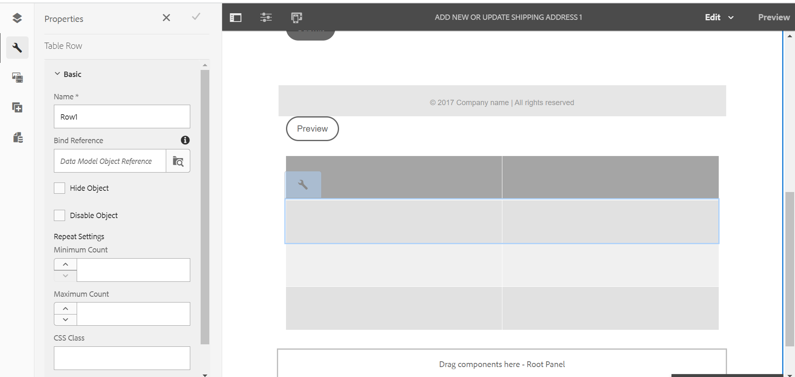
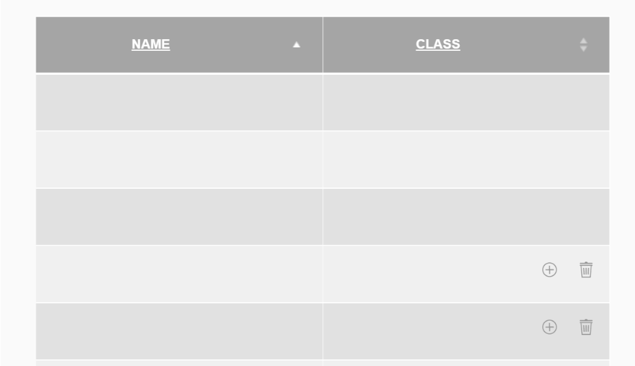

# 自适应表单中的表 {#tables-in-adaptive-forms}

<span class="preview">Adobe 建议使用现代、可扩展的数据捕获[核心组件](https://experienceleague.adobe.com/docs/experience-manager-core-components/using/adaptive-forms/introduction.html)，以[创建新的自适应表单](/help/forms/creating-adaptive-form-core-components.md)或[将自适应表单添加到 AEM Sites 页面](/help/forms/create-or-add-an-adaptive-form-to-aem-sites-page.md)。这些组件代表有关创建自适应表单的重大改进，确保实现令人印象深刻的用户体验。本文介绍了使用基础组件创作自适应表单的旧方法。</span>


| 版本 | 文章链接 |
| -------- | ---------------------------- |
| AEM 6.5 | [单击此处](https://experienceleague.adobe.com/docs/experience-manager-65/forms/adaptive-forms-basic-authoring/adaptive-forms-tables.html) |
| AEM as a Cloud Service | 本文 |


使用表格是呈现复杂数据的一种有效、简化且组织有序的方式。 它帮助用户轻松识别信息，并按行和列的顺序提供输入。 金融服务和政府组织的大多数表单都需要大数据表才能输入数字和执行计算。

AEM Forms在侧栏的组件浏览器中提供了表组件，允许您在自适应表单中创建表。 它提供的一些关键功能包括：

* 移动设备上的响应式布局
* 可配置的行和列
* 在运行时动态添加和删除行
* 合并或合并和拆分单元格
* 可由屏幕阅读器访问
* 使用CSS的自定义布局
* 与XDP表组件兼容并映射
* 支持使用XSD复杂类型元素添加行或单元格
* 从XML文件合并数据

## 创建表 {#create-a-table}

要创建表，请从自适应表单的Sidekick中的组件浏览器拖放表组件。 默认情况下，该表包含两列和三行，包括标题行。


### 关于标题和正文单元格 {#about-header-and-body-cells}

标题单元格是文本字段。 要更改标题的标签，请右键单击标题单元格并单击 **编辑**. 在“编辑”对话框中，更新 **值** 字段并单击 **确定**.

默认情况下，正文单元格是文本框。 您可以将正文单元格替换为Sidekick中提供的任何其他自适应表单组件，例如数值框、日期选取器或下拉列表。

例如，下表中的第一行正文包括文本框、日期选取器和下拉列表组件，作为单元格。


通过选择要合并的单元格、右键单击并选择 **合并**. 此外，也可以通过右键单击合并的单元格并选择 **拆分单元格**.

### 添加、删除、移动行和列 {#add-delete-move-rows-and-columns}

您可以添加和删除行或列，并在表中上下移动行。

#### 添加、删除或移动行

要添加、删除或移动行，请单击行的任意单元格。 打开内容浏览器  并选择相应的行，它会使用工具栏选项突出显示选定的行，您可以从中添加、删除或上下移动行。

* 此 **[!UICONTROL 上移]** 和 **[!UICONTROL 下移]** 操作将选定行上下移动。

* 此 **[!UICONTROL 添加列]** 操作在选定行的下方添加一行。

* 此 **[!UICONTROL 删除列]** 操作删除所选的行。


双击行以配置行的属性，如“名称”、“绑定引用”、“重复设置”、“CSS类”。



#### 添加或删除列

要添加或删除列，请单击标题部分中的文本单元格，此时将打开一个工具栏，其中包含添加或删除列的选项：


>[!NOTE]
>
>虽然您可以在表中添加任意数量的行，但可以添加的最大列数为6。 此外，您无法从表中删除标题行。

### 添加表说明 {#add-table-description}

您可以添加表格的说明，以说明屏幕阅读器可以解释和阅读的信息组织方式。 要添加说明，请执行以下操作：

1. 选择表并点击  以在侧栏中查看其属性。
1. 在“辅助功能”选项卡中指定摘要。
1. 单击&#x200B;**完成**。

### 对表中的列进行排序 {#sortcolumnstable}

您可以根据自适应表单表中任意列对数据排序。 列中的值可以按升序或降序排序。

排序可应用于包含以下内容的表列：

* 静态文本
* 数据模型对象属性
* 静态文本和数据模型对象属性的组合

要对表列应用排序，表列单元格必须包含以下任意组件：数值框、数值步进器、日期输入字段、日期选取器、文本或文本框。

要启用排序，请执行以下操作：

1. 选择表并点击  （配置）。 您也可以使用 **内容** 交互式通信中的浏览器。
1. 选择 **启用排序**.
1. 点按  以保存表属性。 列标题中的排序图标（向上箭头和向下箭头）表示已启用排序。

   

1. 切换到 **预览** 模式以查看输出。 该表会根据表的第一列自动排序。
1. 单击列标题可根据列对值进行排序。

   带向上箭头的列标题表示表根据该列排序。 此外，列中的值以升序显示。

   

   同样，带有向下箭头的列标题表示列中的值以降序显示。

   您还可以在以下表格中进行更改： **预览** 模式，然后再次单击列标题可对列值进行排序。

## 设置表的列宽 {#set-column-width}

执行以下步骤可设置表的列宽：

1. 在 **[!UICONTROL 内容]** 选项卡，点按 **[!UICONTROL 表]** 组件并点按配置()图标。

1.输入以逗号分隔的值列表，以 **[!UICONTROL 列宽]** 字段，用于指定表格中每列的比例宽度。 例如，对于包含3列的表，将2,4，6指定为 **[!UICONTROL 列宽]** 字段导致将第一列的宽度设置为2/12，第二列的宽度设置为4/12，第三列的宽度设置为6/12。 2/12，因为第一列的宽度是表格宽度的六分之一。 同样，4/12将第二列宽设置为表格宽度的三分之一，6/12将第三列宽设置为表格宽度的一半。

## 配置表样式 {#configure}

您可以使用页面工具栏中的“样式”模式来定义表的样式。 执行以下步骤以切换到样式模式并编辑表样式

1. 在页面工具栏中的预览之前，点按  > **样式**.

1. 在侧栏中，选择表格并点按编辑按钮 .
您可以在侧栏中看到样式属性。


>[!NOTE]
>
>您可以通过更改标题行和正文行的值来更改颜色主题 [更少变量](https://lesscss.org//). 有关更多信息，请参阅 [AEM Forms中的主题](/help/forms/themes.md).

## 动态添加或删除行 {#add-or-delete-a-row-dynamically}

表为在运行时动态添加或删除行提供开箱即用支持。

1. 选择表格行并点按 .
1. 在重复设置选项卡中，指定最小和最大计数以限制表中的行数。
1. 单击&#x200B;**完成**。

在运行时或预览时，您会看到 **+** 和  按钮以添加或删除行。



>[!NOTE]
>
>表左侧移动布局的标题不支持动态添加或删除行。

## 表中的表达式 {#expressions-in-a-table}

自适应表单中的表允许您在JavaScript中编写表达式以诱导行为，如显示或隐藏表或行，合计所有数字并在单元格中显示总计，启用或禁用单元格，验证用户输入等。 这些表达式使用自适应表单脚本模型API。

虽然表和行仅支持可见性表达式，以根据表达式返回的值来控制它们的可见性，但单元格支持以下表达式：

* **初始化脚本：** 在字段初始化时执行操作。
* **值提交脚本：** 在字段值更改后更改表单的组件。

>[!NOTE]
>
>如果XFA更改/退出脚本也应用于同一字段，则XFA更改/退出脚本将在值提交脚本之前执行。

* **计算表达式**：用于自动计算字段的值。
* **验证表达式**：验证字段。
* **访问表达式**：启用/禁用字段。
* **可见性表达式**：控制字段和面板的可见性。

表或行的可见性表达式可以在它们对应的“编辑组件”对话框的“面板属性”选项卡中定义。 单元格的表达式可在其“编辑组件”对话框的“脚本”选项卡中定义。

有关自适应表单类、事件、对象和公共API的完整列表，请参阅 [自适应表单的JavaScript库API参考](https://helpx.adobe.com/experience-manager/6-5/forms/javascript-api/index.html).

## 移动设备布局 {#mobile-layouts}

自适应表单中的表格由于其流畅且响应式布局而提供了无与伦比的体验移动设备。 AEM Forms为表格提供两种类型的移动布局 — 左侧标题和可折叠列。

您可以从表的“编辑组件”对话框的“样式”选项卡中配置表的移动布局。

### 左侧标题 {#headers-on-left}

在左侧布局的标题中，表格中的标题在左侧置换，只有一个单元格针对标题出现。 此布局中的每一行都显示为不同的部分。 下图比较了桌面设备上的表与移动设备上的表。


标题位于左侧布局的表的桌面视图


页眉位于左侧布局的表的移动设备视图

### 可折叠列布局 {#collapsible-columns-layout}

在可折叠列布局中，表中的列将折叠以显示一列或两列（具体取决于设备大小），而其他列将折叠。 您可以单击折叠/展开图标以查看表中的其他列。

>[!NOTE]
>
>虽然可折叠列布局已针对移动设备进行了优化，但如果可用的宽度不足以显示表格中的所有列，则它同样适用于桌面。

下图比较了表在带有折叠和展开列的设备上的外观。


在移动设备上只显示两列的表折叠列


移动设备上表的已展开列

## 合并表中的数据 {#merge-data-in-a-table}

自适应表单中的表允许您在运行时使用XML文件中的数据填充该表。 数据XML文件可以驻留在运行AEM Forms服务器的计算机的本地文件系统或CRX存储库中。

让我们以以下银行交易摘要表为例，该表要填入来自XML文件的数据。


在此示例中，的Element name属性用于：

* 行是 **Row1**
* “交易日期”下的正文单元格为 **tableItem1**
* “描述”下的正文单元格为 **tableItem2**
* 交易类型下的正文单元格为 **type**
* “金额（美元）”下的正文单元格为 **表项目3**

包含采用以下格式的数据的XML文件：

```xml
<?xml version="1.0" encoding="UTF-8"?><afData>
  <afUnboundData>
    <data>
 <typeSelect>0</typeSelect>
 <Row1>
      <tableItem1>2015-01-08</tableItem1>
      <tableItem2>Purchase laptop</tableItem2>
      <type>0</type>
      <tableItem3>12000</tableItem3>
 </Row1>
 <Row1>
      <tableItem1>2015-01-05</tableItem1>
      <tableItem2>Transport expense</tableItem2>
      <type>0</type>
      <tableItem3>120</tableItem3>
 </Row1>
 <Row1>
      <tableItem1>2014-01-08</tableItem1>
      <tableItem2>Laser printer</tableItem2>
      <type>0</type>
      <tableItem3>500</tableItem3>
 </Row1>
 <Row1>
      <tableItem1>2014-12-08</tableItem1>
      <tableItem2>Credit card payment</tableItem2>
      <type>0</type>
      <tableItem3>300</tableItem3>
 </Row1>
 <Row1>
      <tableItem1>2015-01-06</tableItem1>
      <tableItem2>Interest earnings</tableItem2>
      <type>1</type>
      <tableItem3>12000</tableItem3>
 </Row1>
 <Row1>
      <tableItem1>2015-01-05</tableItem1>
      <tableItem2>Payment from a client</tableItem2>
      <type>1</type>
      <tableItem3>500</tableItem3>
 </Row1>
 <Row1>
      <tableItem1>2015-01-08</tableItem1>
      <tableItem2>Food expense</tableItem2>
      <type>0</type>
      <tableItem3>120</tableItem3>
 </Row1>
 </data>
  </afUnboundData>
  <afBoundData>
    <data/>
  </afBoundData>
  <afBoundData/>
</afData>
```

在示例XML中，行的数据由 `<Row1>` 标记，即表中行的元素名称。 在 `<Row1>` 标签中，每个单元格的数据在其元素名称对应的标签中定义，例如 `<tableItem1>`， `<tableItem2>`， `<tableItem3>`、和 `<type>`.

要在运行时将此数据与表合并，我们需要将包含该表的自适应表单指向禁用wcmmode的绝对XML位置。 例如，如果自适应表单位于 *https://localhost:4502/myForms/bankTransaction.html* 数据XML文件保存在 *C：/myTransactions/bankSummary.xml*，您可以在以下URL查看包含数据的表：

*https://localhost:4502/myForms/bankTransaction.html?dataRef=file:/// C：/myTransactions/bankSummary.xml&amp;wcmmode=disabled*


## 使用XDP组件和XSD复杂类型 {#use-xdp-components-and-xsd-complex-types}

如果您基于XFA表单模板创建自适应表单，则XFA元素在AEM内容查找器的“数据模型”选项卡中可用。 您可以在自适应表单中拖放这些XFA元素，包括表。

XFA表元素映射到表组件，并在自适应表单中现成使用。 XDP表的所有属性和功能在移动到自适应表单中时都会保留，您可以对其执行任何操作，就像处理本机自适应表单表一样。 例如，如果XDP表中的行被标记为可重复，则在自适应表单中删除该行时也会重复该行。

此外，您可以拖放XDP子表单以在表中添加新行。 但是，请注意，删除嵌套的子表单不起作用。

>[!NOTE]
>
>没有标题行的XDP表将不会映射到自适应表单表组件。 相反，它已映射到具有流式布局的自适应表单面板组件。 此外，当您将嵌套表从XDP添加到自适应表单时，外部表将转换为面板，同时保留内部表。

此外，您可以拖放一组XSD复杂类型元素来创建表行。 系统将在您放置元素的行的正下方创建一个新行。 使用XSD复杂类型元素创建的单元格保留对XSD的绑定引用。 您还可以将一个XSD复杂类型元素放置到单元格上，以将该元素替换为body单元格。

>[!NOTE]
>
>XDP表组件、子表单或XSD复合类型中的元素数不能超过一行中的单元格数。 例如，不能将四个元素拖放到只有三个单元格的行上。 这将会导致错误。
>
>如果元素数小于一行中的单元格数，则新行将首先根据元素添加单元格，然后添加默认单元格以填充行中的其余单元格。 例如，如果将一组三个元素拖放到包含四个单元格的行中，则前三个单元格将基于您拖放的元素，其余一个单元格是默认的表单元格。

## 关键注意事项 {#key-considerations}

* 如果在创作基于XSD的表时上下移动行，则在提交表单时生成的数据XML中会看到表行丢失的一些数据。
* 默认表中的每个正文单元格都有一个与其关联的预定义元素名称。 如果在自适应表单中添加另一个表，则新表中的默认正文单元格将与第一个表中的元素名称相同。 在这种情况下，提交表单时生成的数据将仅包含其中一个表的默认正文单元格中的数据。 因此，请确保重命名默认正文单元格的元素名称，以使其在表中保持唯一性，并避免数据丢失。

  请注意，这仅适用于默认正文单元格。 如果向表中添加更多行或列，则将自动为非默认正文单元格生成唯一的元素名称。

## 另请参阅 {#see-also}

{{see-also}}

