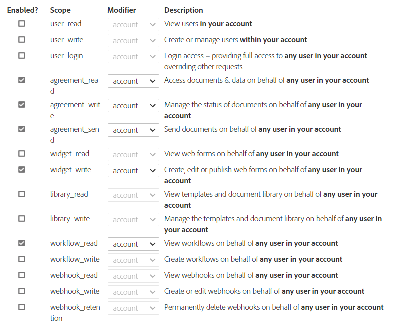

# 将 [!DNL Adobe Sign] 与 [!DNL AEM Forms] as a Cloud Service 集成  {#integrate-adobe-sign-with-aem-forms}

[!DNL Adobe Sign] 支持自适应表单的电子签名工作流。电子签名改进了法律、销售、工资单、人力资源管理和其他许多方面的文档的处理工作流。

在典型的 [!DNL Adobe Sign] 和自适应表单方案中，用户需填写自适应表单来申请服务。例如，信用卡申请表和公民权益表。在用户填写、签署和提交申请表后，该表将发送给服务提供商以执行后续操作。服务提供商将审核申请，并使用 [!DNL Adobe Sign] 将申请标记为已批准。要支持类似的电子签名工作流，您可以将 [!DNL Adobe Sign] 与 [!DNL AEM Forms] 集成。

要将 [!DNL Adobe Sign] 与 [!DNL AEM Forms] 结合使用，请在 AEM Cloud Services 中配置 [!DNL Adobe Sign]：

## 前提条件 {#prerequisites}

要将 [!DNL Adobe Sign] 与 [!DNL AEM Forms] 集成，您需要以下项：

* 有效的 [Adobe Sign 开发人员帐户](https://acrobat.adobe.com/us/en/sign/developer-form.html)。
* [Adobe Sign API 应用程序](https://www.adobe.io/apis/documentcloud/sign/docs.html#!adobedocs/adobe-sign/master/gstarted/create_app.md)。
* [!DNL Adobe Sign] API 应用程序的凭据（客户端 ID 和客户端密码）。
* 针对创作实例和发布实例，使用[相同的加密密钥](https://experienceleague.adobe.com/docs/experience-manager-65/administering/security/security-checklist.html?lang=en#make-sure-you-properly-replicate-encryption-keys-when-needed)。
* （仅适用于基于 Government ID 的身份验证）为 Government ID 身份验证[启用身份验证方法](https://helpx.adobe.com/sign/using/adobesign-authentication-government-id.html#AuditReport)。

## 使用 [!DNL AEM Forms] 配置 [!DNL Adobe Sign] {#configure-adobe-sign-with-aem-forms}

满足前提条件后，执行以下步骤以在创作实例上使用 [!DNL AEM Forms] 配置 [!DNL Adobe Sign]。

1. 在AEM Forms创作实例上，导航到 **[!UICONTROL 工具]**  > **[!UICONTROL 常规]** > **[!UICONTROL 配置浏览器]**.
1. 在 **[!UICONTROL 配置浏览器]** 页面，点按 **[!UICONTROL 创建]**.
1. 在 **[!UICONTROL 创建配置]** 对话框，指定 **[!UICONTROL 标题]** 对于配置，请启用 **[!UICONTROL 云配置]**，然后点按 **[!UICONTROL 创建]**. 系统创建一个配置容器来存储 Cloud Services。确保文件夹名称不包含任何空格。
1. 导航到 **[!UICONTROL 工具]**  > **[!UICONTROL Cloud Services]** > **[!UICONTROL Adobe Sign]** 并打开在上一步中创建的配置容器。

   >[!NOTE]
   >
   >创建自适应表单时，请在 **[!UICONTROL 配置容器]** 字段。

1. 在配置页面上，点按 **[!UICONTROL 创建]** 创建 [!DNL Adobe Sign] 配置AEM Forms。
1. 在 **[!UICONTROL 常规]** 选项卡 **[!UICONTROL 创建Adobe Sign配置]** 页面，指定 **[!UICONTROL 名称]** 对于配置，请点按 **[!UICONTROL 下一个]**. 您可以选择指定 **[!UICONTROL 标题]** 并浏览以选择 **[!UICONTROL 缩略图]** ，以用于配置。

1. 将当前浏览器窗口中的 URL 复制到记事本。在下一个步骤中使用 [!DNL AEM Forms] 配置 [!DNL Adobe Sign] 应用程序时需要此 URL。点按 **[!UICONTROL 下一个]**.

1. 在 **[!UICONTROL 设置]** 选项卡 **[!UICONTROL OAuth URL]** 字段中包含默认URL。 URL 的格式为：

   `https://<shard>/public/oAuth/v2`

   例如：
   `https://secure.na1.echosign.com/public/oauth/v2`

   其中：

   **na1** 指默认数据库分片。您可以修改数据库分片的值。确保 [!DNL  Adobe Sign] 云配置指向[正确分片](https://helpx.adobe.com/sign/using/identify-account-shard.html)。

   如果为 Adobe Experience Manager 功能或组件创建另一个 [!DNL Adobe Sign] 配置，请确保所有 [!DNL Adobe Sign] 云配置指向同一分片。

   >[!NOTE]
   >
   > 保留 **创建Adobe Sign配置** 页面。 不要关闭它。 您可以检索 **客户端Id** 和 **客户端密钥** 在为 [!DNL Adobe Sign] 应用程序，如后续步骤中所述。


1. 配置 [!DNL Adobe Sign] 应用程序的 OAuth 设置：

   1. 打开浏览器窗口，并登录到您的 [!DNL Adobe Sign] 开发人员帐户。
   1. 选择为 [!DNL AEM Forms]，然后点按 **[!UICONTROL 为应用程序配置OAuth]**.
   1. 在 **[!UICONTROL 重定向URL]** 框中，添加在上一步中复制的URL（步骤7）并单击 **[!UICONTROL 保存]**.
   1. 为 [!DNL Adobe Sign] 应用程序并单击 **[!UICONTROL 保存]**.
   * [!DNL aggrement_read]
   * [!DNL aggrement_write]
   * [!DNL aggrement_send]
   * [!DNL widget_read]
   * [!DNL widget_write]
   * [!DNL workflow_read]

   有关为 [!DNL Adobe Sign] 应用程序配置 OAuth 设置并获取密钥的分步信息，请参阅[为应用程序配置 OAuth 设置](https://www.adobe.io/apis/documentcloud/sign/docs.html#!adobedocs/adobe-sign/master/gstarted/configure_oauth.md)开发人员文档。

   

1. 返回到 **[!UICONTROL 创建Adobe Sign配置]** 页面。 指定[**[!UICONTROL 客户端ID]** （也称为应用程序ID）和 **[!UICONTROL 客户端密钥]**]。 使用 [Adobe Sign应用程序的客户端ID和客户端密钥](https://opensource.adobe.com/acrobat-sign/developer_guide/helloworld.html#get-the-app-id-and-secret) 您在上一步中创建。

1. 选择 **[!UICONTROL 为附件启用Adobe Sign]** 用于将附加到自适应表单的文件附加到相应 [!DNL Adobe Sign] 文档已发送以供签名。

1. 点按 **[!UICONTROL 连接到Adobe Sign]**. 在系统提示输入凭据时，提供在创建 [!DNL Adobe Sign] 应用程序时所用帐户的用户名和密码。当要求确认访问 `your developer account`，单击 **[!UICONTROL 允许访问]**. 如果凭据正确，并且您允许 [!DNL AEM Forms] 访问您的 [!DNL Adobe Sign] 开发人员帐户，系统会显示一条与以下内容类似的成功消息。

   

1. 点按 **[!UICONTROL 创建]** 创建 [!DNL Adobe Sign] 配置。

1. 选择配置并单击 **[!UICONTROL 发布]**，选择配置，然后单击 **[!UICONTROL 发布]**. 这会将配置复制到相应的发布环境。

1. 在开发人员实例、暂存实例和生产实例（以剩下的实例为准）上重复上述所有步骤以使用 [!DNL AEM Forms] 为环境配置 [!DNL Adobe Sign]。

现在，您可以[将 Adobe Sign 字段添加到自适应表单](working-with-adobe-sign.md)。确保将用于 Cloud Service 的配置容器添加到为 [!DNL Adobe Sign] 启用的所有自适应表单。您可以在自适应表单的属性中指定配置容器。

## （仅适用于 AEM Workflow）配置 [!DNL Adobe Sign] 调度程序以同步签名状态 {#configure-adobe-sign-scheduler-to-sync-the-signing-status}

在使用 [!DNL Adobe Sign] Workflow 步骤对自适应表单进行签名时，可以将表单逐个传送给签名者，也可以将表单同时发送给所有签名者，具体取决于工作流步骤的配置。仅在所有签名者完成签名过程后，[!DNL Adobe Sign] 支持的自适应表单才提交到 Experience Manager Forms Server。

默认情况下，[!DNL Adobe Sign] 调度程序服务每 24 小时检查（轮询）一次签名者响应。您可以为您的环境更改此默认间隔。

要更改默认间隔，请为 **Adobe Sign Configuration Service** 配置的 **sign.status.exp** 属性指定 [cron 表达式](https://en.wikipedia.org/wiki/Cron#CRON_expression)。

例如，要在每天凌晨 00:00 运行配置服务，请设置 **Adobe Sign Configuration Service** 配置的 **sign.status.exp** 属性以指定 `0 0 0 1/1 * ? *`。以下 JSON 文件显示了每天凌晨 00:00 运行配置服务的示例：

```json
{
  "sign.status.exp":"0 0 0 1/1 * ? *"
}
```

要设置配置的值，请[使用 AEM SDK 生成 OSGi 配置](https://experienceleague.adobe.com/docs/experience-manager-cloud-service/implementing/deploying/configuring-osgi.html?lang=en#generating-osgi-configurations-using-the-aem-sdk-quickstart)，并向 Cloud Service 实例[部署配置](https://experienceleague.adobe.com/docs/experience-manager-cloud-service/implementing/using-cloud-manager/deploy-code.html?lang=en#deployment-process)。

<!-- , perform the following steps:

1. Log in to [!DNL AEM Forms] Server with admin credentials and navigate to **[!UICONTROL Tools]** &gt;**[!UICONTROL Operations]** &gt; **[!UICONTROL Web Console]**.

   You can also open the following URL in a browser window:
   `https://server/system/console/configMgr`

1. Locate and open the **[!UICONTROL Adobe Sign Configuration Service]** option. Specify a [cron expression](https://en.wikipedia.org/wiki/Cron#CRON_expression) in the **Status Update Scheduler Expression** field and click **Save**. For example, to run the configuration service daily at 00:00 am, specify `0 0 0 1/1 * ? *` in the **Status Update Scheduler Expression** field.

Default interval to sync status of [!DNL Adobe Sign] is now changed. -->

## 相关文章 {#related-articles}

* [在自适应表单中使用 Adobe Sign](working-with-adobe-sign.md)

* [有关将 Adobe Sign 与自适应表单结合使用的最佳实践](https://medium.com/adobetech/using-adobe-sign-to-e-sign-an-adaptive-form-heres-the-best-way-to-do-it-dc3e15f9b684)
