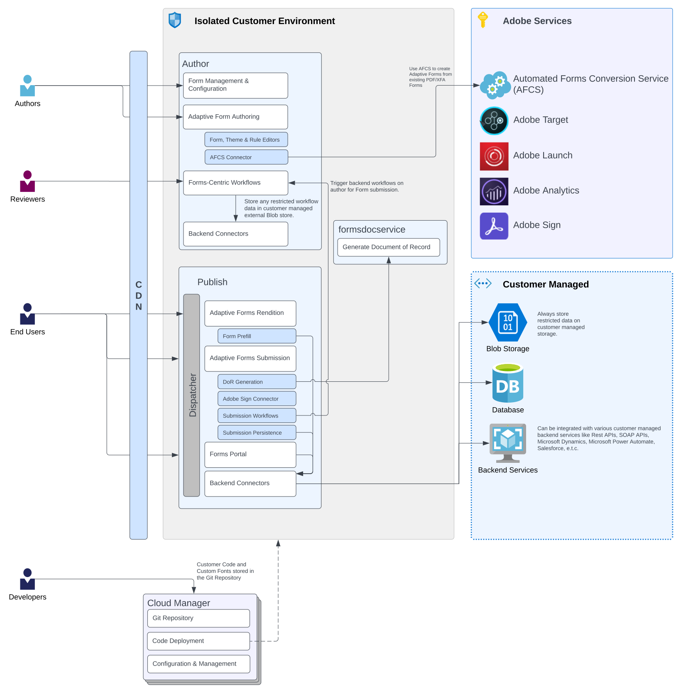
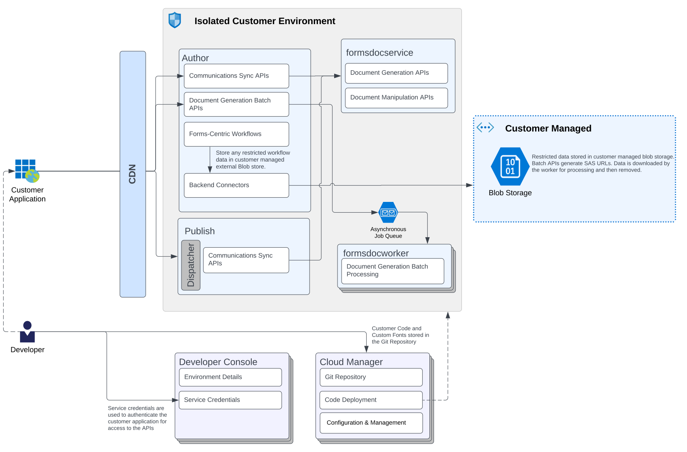

# [!DNL AEM] Formsas a Cloud Service架构 {#architecture}

[!DNL Adobe Experience Manager Forms] as a Cloud Service是一个云原生解决方案，企业可在将提交的数据与后端流程、业务规则集成以及将数据保存到外部数据存储中的同时，创建、管理、发布和更新复杂的数字表单和通信。 它扩展了 [!DNL Adobe Experience Manager as a Cloud Service]. 要了解有关扩展、部署、环境和其他基础架构的更多信息，请参阅 [对 [!DNL Adobe Experience Manager as a Cloud Service]](https://experienceleague.adobe.com/docs/experience-manager-cloud-service/core-concepts/architecture.html).

AEM Forms as a Cloud Service支持两个主要用例：数字注册和客户通信。 下图描述了两个用例的架构。

## Forms数字注册

## Forms通信

## 组件

Formsas a Cloud Service包含多个组件：

### CDN（内容交付网络）

每个AEM Formsas a Cloud Service计划都可以 [内置CDN服务](https://experienceleague.adobe.com/docs/experience-manager-cloud-service/content/implementing/content-delivery/cdn.html). 它作为Cloud Services包含在Forms的许可证中。

### 创作

作者是在标准“作者”运行模式下运行的AEM Formsas a Cloud Service实例。 它面向内部用户、表单设计人员和开发人员。 创作环境可启用以下功能：

* 创作和管理表单。
* 连接到Automated forms conversion服务，将PDF或XDP表单转换为自适应表单。
* 创建并运行以Forms为中心的工作流。
* 管理自适应表单资产。
* 管理通信资产。
* 同步RESTful API（实时API）和批处理API，用于创建、组合和提供面向品牌的个性化通信。
* 同步API，用于合并、重新排列和验证PDF文档。

### 发布

发布实例是在标准发布运行模式下运行的AEM Formsas a Cloud Service。 发布实例适用于基于表单的应用程序的最终用户，例如访问公共网站和提交表单的用户。 它支持以下功能：

* 为最终用户呈现和提交表单。
* 传输原始提交的表单数据，以便在最终记录系统中进一步处理和存储。
* 连接到客户托管存储以存储数据。
* 与Adobe Sign连接以对自适应表单提交记录进行电子签名。
* 同步API以创建、组合和提供面向品牌的个性化通信。
* 同步API以组合、重新排列和验证PDF文档。

在AEMas a Cloud Service上，无法使用反向复制将内容/数据从发布服务发送到创作服务。 但是，您可以将在发布时运行的自适应Forms配置为将数据提交到作者的工作流（工作流只能在作者上运行）。 这在批准用例中非常有用。

#### Dispatcher

[Dispatcher](https://experienceleague.adobe.com/docs/experience-manager-cloud-service/content/implementing/content-delivery/disp-overview.html) 是Adobe Experience Manager的缓存和/或负载平衡工具，可与企业级Web服务器一起使用。

### Adobe Services

**automated forms conversion服务**

[automated forms conversion服务](https://experienceleague.adobe.com/docs/aem-forms-automated-conversion-service/using/introduction.html?lang=zh-Hans) 自动将您的PDF和XFA表单转换为设备友好、响应迅速且基于HTML5的自适应表单。

**Adobe Sign**

Adobe Sign是一项基于云的电子签名服务，允许用户使用浏览器或移动设备发送、签名、跟踪和管理签名流程。 您可以将Adobe Sign与自适应表单集成，以自动执行签名工作流程，简化单个和多签名流程，以及以电子方式签署自适应表单。

<!-- **PDF Service API**
Adobe’s PDF Services API lets create, combine, export, and extract data from PDFs through powerful and flexible cloud-based APIs. -->

### 客户管理的存储

Formsas a Cloud Service提供了用于在外部存储系统（如Blob存储、数据库或存储服务）中存储内容的选项。 您还可以将包含敏感个人数据(SPD)元素的正在处理的工作流数据(AEM工作流变量数据)存储在由客户管理的存储库中，以便进行安全处理。 Adobe建议仅在客户管理的存储上存储敏感数据。

您可以使用 **统一存储连接器** 连接到Blob存储和 **表单数据模型** 连接到数据库或后端服务（RESTful、SOAP、Azure Blob Storage等）。

### 文档服务

文件服务包括：

* **输出服务（通信 — 文档生成API）** 帮助创建品牌认可、个性化且标准化的文档，如业务信函、报表、报销申请处理信函、福利通知、月账单或欢迎资料包。

* **汇编程序服务（通信 — 文档操作API）** 帮助合并、重新排列和验证PDF文档。

* **记录文档(DoR)服务** 帮助生成记录文档(DoR)。 该服务在其自身的Pod中运行，这些Pod分别以Forms as a Cloud Service的“创作”和“发布”实例的形式运行。 它有助于提供更好的性能，并根据负载独立地扩展吊舱。

### Cloud Manager

Cloud Manager是 [AEMas a Cloud Service](https://experienceleague.adobe.com/docs/experience-manager-cloud-service/overview/introduction.html). 它是客户运营和开发人员角色的单一入口点。 它是管理AEM程序和环境的位置。 Cloud Manager已演变为自助门户，可在其中创建和配置AEMas a Cloud Service的主要组件：

* 创建和管理程序
* 在程序中创建和管理AEM环境
* 创建和管理管道以将客户代码和配置部署到特定环境
* 获取有关这些组件的重要生命周期事件（例如，产品更新）的通知。有关Cloud Manager的更多信息，请参阅 [了解AdobeCloud Manager](https://experienceleague.adobe.com/docs/experience-manager-learn/foundation/cloud-manager/understand-cloud-manager-for-aem.html) 和 [Cloud Manager简介](https://experienceleague.adobe.com/docs/experience-manager-cloud-manager/using/introduction-to-cloud-manager.html?lang=zh-Hans).

### 开发人员控制台

开发人员控制台提供了每个运行Forms as a Cloud Service环境的各种详细信息。 这些详细信息有助于调试环境。 有关详细信息，请参阅 [使用开发人员控制台调试AEMas a Cloud Service](https://experienceleague.adobe.com/docs/experience-manager-learn/cloud-service/debugging/debugging-aem-as-a-cloud-service/developer-console.html).

<!--

+++CDN (Content Delivery Network):

Every AEM Forms as a Cloud Service program has access to Fastly CDN service. It is included in the licence of Forms as a Cloud Services.

+++

+++Adaptive Forms
Adaptive Forms enable customers to author web-friendly reflowable web forms and fragments that are used by the customers for their data capture needs. This feature enables customers to manage their complex data capture needs easily, by leveraging multiple integrations with Adobe Sign, Document Services, Form Data Model, Automated Forms Conversion service, and more.

+++

+++Automated Forms Conversion Service (AFCS)
Automated Forms Conversion service helps accelerate digitization and modernization of data capture experience through automated conversion of PDF forms to adaptive forms. The service, powered by Adobe Sensei, automatically converts your PDF forms to device-friendly, responsive, and HTML5-based adaptive forms. While leveraging the existing investments in PDF Forms and XFA, the service also applies appropriate validations, styling, and layout to adaptive form fields during conversion.

+++

+++Form Data Model
The Form Data Model (FDM) feature is the standard way of creating data integrations with external/internal data sources and using them across the different Forms as a Cloud Service features. FDM provides a rich editor for customers to integrate, define, and manage relationships between the different entities and data sources and perform operations on them. Form data is stored in a data store hosted on the customer premises. Organizations can also use blob store hosted by the cloud provider and Adobe Experince Platform to store data.

+++

+++Forms Workflows
Forms-centric workflows is an extension to the default AEM Workflow and provides our customers with additional workflow capabilities like Form Data review, task assignment, and document services invocation.

+++

+++Communications
Forms as a Cloud Service offering consists of multiple services tailored specifically for document processing.

+++

+++Document of Record
A Document of Record is a PDF version of a form. It provides an ability to keep a record of the information  that you provide and submit in an Adaptive Form in PDF fromat. The service provides a default DoR template and tools to develop a custom template.

+++

## Terminologies

<!-- ## Cloud Manager{#cloud-manager}

Cloud Manager is an essential component to [AEM as a Cloud Service](https://experienceleague.adobe.com/docs/experience-manager-cloud-service/overview/introduction.html?lang=en). Each new tenant of the [!DNL AEM Forms] as a Cloud Service is first provisioned for Cloud Manager access. Cloud Manager is the single-entry point for the operations and developer persona of our customers. It is the place from where the AEM programs and environments can be managed. Cloud Manager has evolved as a self-service portal where the main components of the AEM as a Cloud Service can be created and configured:

* Creating and managing programs
* Creating and managing the AEM environments within the programs
* Creating and managing the pipelines for deploying the customer code and configuration to a particular environment
* Getting notified of important lifecycle events for these components (for example, product updates)
For more information about Cloud Manager, see [Understand Adobe Cloud Manager](https://experienceleague.adobe.com/docs/experience-manager-learn/foundation/cloud-manager/understand-cloud-manager-for-aem.html) and [Introduction to Cloud Manager](https://experienceleague.adobe.com/docs/experience-manager-cloud-manager/using/introduction-to-cloud-manager.html).

## Users and Authentication {#users-and-authentication}

AEM as a Cloud Service includes Admin Console support for AEM instances and Adobe Identity Management System (IMS) based authentication. The Admin Console allows administrators to centrally manage all Experience Cloud users. Users and Groups can be assigned to product profiles associated with AEM as a Cloud Service instances, allowing them to log in to that instance. For more information about users, authentication, and, and accessing an instance of AEM as a Cloud Service, see [IMS Support for [!DNL Adobe Experience Manager] as a Cloud Service](https://experienceleague.adobe.com/docs/experience-manager-cloud-service/security/ims-support.html?lang=en#introduction).

Various personas are involved in a typical [!DNL AEM Forms] project. After you log in to your [!DNL AEM Forms] as a Cloud Service instance, you can [add users in admin console](https://experienceleague.adobe.com/docs/experience-manager-cloud-service/security/ims-support.html) for personas applicable to your organization or project and [assign users to built-in groups](forms-groups-privileges-tasks.md) to provide them required privileges.

To learn various in-built [!DNL AEM Forms] specific user groups and privileges available on [!DNL AEM Forms] as a Cloud Services instance, see [Configure, user, roles and groups](forms-groups-privileges-tasks.md). 

## Developer Experience {#developer-experience}

The new architecture supporting AEM as a Cloud Service brings some key changes to the overall developer experience. One of the major goals for the changes to developer experience is to allow migration to AEM as a Cloud Service as quickly as possible, with little modifications to existing custom code.

## Cloud development {#cloud-development}

Here are the guidelines to run your existing code smoothly on AEM as a Cloud Service environment:

* Store your code and configurations to the Git repository of the associated Cloud Manager program. It makes managing and integrating code with CI/CD a breeze.  
* Make application code and configuration compatible with the baseline [!DNL AEM Forms] images. Using the latest APIs helps to build faster and secure applications.
* Use the Cloud Manager pipeline associated with the Cloud Manager environment to build and deploy applications. It helps you bring the latest features and bug fixed for [!DNL AEM Forms] as a Cloud Service to your environment.
* Try that your custom applications pass all the code quality, security, and performance gates enforced in the pipeline. It helps build secure and better performing applications which leads to better customer experience. You can always use Cloud Manager UI to skip some checks.
This process is commonly referred to as cloud-first development. [!DNL AEM Forms] as a Cloud Service also provides an SDK to support rapid development before the pending code and configuration changes are attempted in the cloud.
Some interfaces that were previously part of the AEM QuickStart are no longer available to the users of the AEM as a Cloud Service environment. For instance, the Web Console where OSGI bundles and their associated configuration are managed. The CRXDE Lite content repository browser becomes only accessible on non-production environment types. A subset of the Web Console functionalities that developers require, especially when it comes to diagnostics and status purposes, is made available via a new developer console.
Also, one of the most common requirements for developers is quick access to the log files of the various environments. With [!DNL AEM Cloud Service], the log files of the different nodes in the Author, Publish are made available via the Cloud Manager, either in the form of files that can be downloaded or via APIs for tailing the logs. Due to the clear separation of code and content, developers can leverage a particular process for updating content as part of a deployment. The typical use cases for mutable content are:
* Standard “default” content that is part of the customer project (for example, folders, templates, workflows...)
* Search index definitions
* ACLs and permissions
* Service users and user groups
Set up your development environment, [Configure your CI/CD Pipeline](https://experienceleague.adobe.com/docs/experience-manager-cloud-manager/using/how-to-use/configuring-pipeline.html), and learn to [deploy your code](https://experienceleague.adobe.com/docs/experience-manager-cloud-manager/using/how-to-use/deploying-code.html) on the environment. -->

### 自适应表单创作 {#local-development}

设置和配置 [!DNL AEM Forms] 与环境as a Cloud Service，您可以设置开发、暂存和生产环境。 此外，还设置和配置本地开发环境，以便快速进行迭代和开发。 您可以下载和设置AEM SDK，以及 [!DNL AEM Forms] 附加功能存档以设置本地 [!DNL Forms] as a Cloud Service的开发环境。  有关详细说明，请参阅 [设置本地开发环境](setup-local-development-environment.md).

## 调试 {#debugging}

AEMas a Cloud Service运行于自助式、可扩展的云基础架构上。 它要求AEM开发人员了解和调试AEMas a Cloud Service的各个方面，从构建和部署到获取运行AEM应用程序的详细信息。 有关详细信息，请参阅 [调试AEMas a Cloud Service](https://experienceleague.adobe.com/docs/experience-manager-learn/cloud-service/debugging/debugging-aem-as-a-cloud-service/overview.html).
