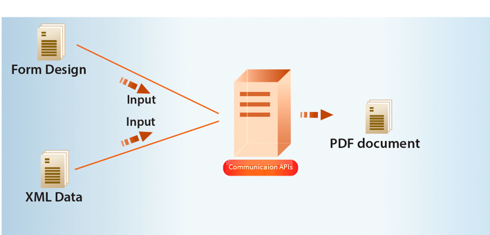

# 使用AEM Formsas a Cloud Service通信 {#frequently-asked-questions}

**AEM Formsas a Cloud Service通信功能处于测试阶段。**

通信功能可帮助您创建面向品牌、个性化且标准化的文档，如业务信函、报表、报销申请处理信函、福利通知、月费或欢迎资料包。


您可以按需生成文档或创建批处理作业，以按定义的间隔生成多个文档。 通信API提供：

* 简化的按需和批量文档生成功能

* HTTP API，可更轻松地与现有系统集成。 包括单独的API，用于按需（低延迟）和批处理操作（高吞吐量操作）。 它使文档生成成为一项高效的任务。

* 安全访问数据。 通信API仅连接到客户指定的数据存储库并从中访问数据，不生成数据的本地副本，从而使通信高度安全。


可以使用通信API创建信用卡对帐单示例。 报表使用相同的模板，但根据每个客户对信用卡的使用情况，将其数据分开。

## 工作原理如何？

通信利用 [PDF和XFA模板](#supported-document-types) with [XML数据](#form-data) 按需生成单个文档，或在定义的间隔内使用批处理作业生成多个文档。

通信API可帮助将模板(XFA或PDF)与客户数据([XML数据](#form-data))以PDF和打印格式（如PS、PCL、DPL、IPL和ZPL格式）生成文档。

通常，您使用 [Designer](use-forms-designer.md) 和使用通信API将数据与模板合并。 您的应用程序可以将输出文档发送到网络打印机、本地打印机或存储系统以进行存档。 典型的开箱即用工作流和自定义工作流如下所示：


根据用例的不同，您还可以通过网站或存储服务器下载这些文档。

## 通信API

通信为按需和批量文档生成提供了HTTP API:

* **[同步API](https://adobedocs.github.io/experience-manager-forms-cloud-service-developer-reference/api/sync/)** 适用于按需、低延迟和单记录文档生成场景。 这些API更适合基于用户操作的用例。 例如，在用户完成填写表单后生成文档。

* **[批量API（异步API）](https://adobedocs.github.io/experience-manager-forms-cloud-service-developer-reference/api/batch/)** 适用于计划、高吞吐量和多文档生成场景。 这些API可批量生成文档。 例如，每月生成的电话账单、信用卡报表和福利报表。

## 入门

通信可作为Formsas a Cloud Service用户的独立附加模块。 您可以联系Adobe销售团队或Adobe代表以请求获取访问权限。

Adobe 可为贵企业开启访问通道，并为您指定的管理员提供各种所需权限。 管理员可以向贵组织的AEM Forms开发人员（用户）授予使用API的访问权限。

<!--

Communication help you combine a template and XML data to generate print documents in various formats. The service allows you to generate documents in synchronous and batch modes. The APIs enables you to create applications that let you:

  * Generate documents by populating template files (PDF and XDP) with XML data.
  * Generate output forms in various formats, including non-interactive PDF print streams.

Consider a scenario where you have one or more templates and multiple records of XML data for each template. You can use Communications APIs to generate a print document for each record.  You can also combine the records into a single document.  The result is a non-interactive PDF document. A non-interactive PDF document does not let users enter data into its fields.

 There are two main Communications APIs. The _generatePDFOutput_ generates PDFs, while the _generatePrintedOutput_ generates PostScript, ZPL, and PCL formats. These APIs are available as REST endpoints on your environment, both on author and publish instances. Since the publish instances are configured to scale faster than the author instances, it is recommended use these APIs via publish instances.

The first parameter of both the operations accept the path and name of the template file (for example ExpenseClaim.xdp). You can specify a fully qualified path, reference path of your AEM Repository, or path of a binary file. The second parameter accepts an XML document that is merged with the template while generating the output document.  

The [API reference documentation](https://documentcloud.adobe.com/link/track?uri=urn:aaid:scds:US:b1223732-ae0f-4921-bdc0-c31e48b56044) provides detailed information about all the parameters, authentication methods, and various services provided by APIs. The API reference documentation is also available in the .yaml format. You can download the .yaml for [Batch APIs](assets/batch-api.yaml) or [non-Batch API.yaml](assets/non-batch-api.yaml) file and upload it to postman to check functionality of APIs.

>[!VIDEO](https://video.tv.adobe.com/v/335771)

Uploading Communication APIs .yaml file to postman to check functionality of APIs.

## Using the Communications APIs {#workflows}

Typically, you create a template using [Designer](use-forms-designer.md) and use communications APIs ( generatePDFOutput and generatePrintedOutput) to:

* Convert these templates to various formats, including PDF, PostScript, ZPL, and PCL.
* Merge XML form data with a form design to generate a document.
* Generate a document without merging XML form data into the document. However, the primary workflow is merging data into the document.

Then, the output document is stored to a file. You can design custom workflows to send the file to a network printer, a local printer, or to a storage system for archival. A typical out of the box and custom workflows look like the following:


### Create PDF documents {#create-pdf-documents}

You can use the _generatePDFOutput_ API to create PDF document that is based on a form design and XML form data. The output is a non-interactive PDF document. That is, users cannot enter or modify form data. A basic workflow is to merge XML form data with a form design to create a PDF document. The following illustration shows the merging of a form design and XML form data to produce a PDF document.



### Create PostScript (PS), Printer Command Language (PCL), Zebra Printing Language (ZPL) document {#create-PS-PCL-ZPL-documents}

You can use Communications APIs to create PostScript (PS), Printer Command Language (PCL), and Zebra Printing Language (ZPL) document that are based on a XDP form design or PDF document. The _generatePrintedOutput_ API merges a form design with form data to generate a document. You can save the document to a file and develop a custom process to send it to a printer.

 ### Processing batch data to create multiple documents

Communications APIs can create separate documents for each record within an XML batch data source. The APIs can also create a single document that contains all records (this functionality is the default). Assume that an XML data source contains ten records and you instruct the APIs to create a separate document for each record (for example, PDF documents). As a result, the APIs generate ten PDF documents.

The following illustration also shows Communications APIs processing an XML data file that contains multiple records. However, assume that you instruct the APIs to create a single PDF document that contains all data records. In this situation, the APIs generate one document that contains all of the records.

The following illustration shows Communications APIs processing an XML data file that contains multiple records. Assume that you instruct the Communications APIs to create a separate PDF document for each data record. In this situation, the APIs generates a separate PDF document for each data record.


### Processing batch data to create multiple documents {#processing-batch-data-to-create-multiple-documents}

You create separate documents for each record within an XML batch data source. You can can also create a single document that contains all records (this functionality is the default). Assume that an XML data source contains ten records and you have a requirement to create a separate document for each record (for example, PDF documents). You can use the Communication APIs to generate ten PDF documents.

The following illustration shows the Communication APIs processing an XML data file that contains multiple records. However, assume that you instruct the Communication APIs to create a single PDF document that contains all data records. In this situation, the Communication APIs generate one document that contains all of the records.


The following illustration shows the Communication APIs processing an XML data file that contains multiple records. Assume that you instruct the Communication APIs to create a separate PDF document for each data record. In this situation, the Communication APIs generates a separate PDF document for each data record.


For detailed information on using Batch APIs, see Communication APIs: Processing batch data to create multiple documents.

### Flatten interactive PDF documents {#flatten-interactive-pdf-documents}

You can use the Communications APIs to transform an interactive PDF document (for example, a form) to a non-interactive PDF document. An interactive PDF document lets users enter or modify data located in the PDF document fields. The process of transforming an interactive PDF document to a non-interactive PDF document is called flattening. When a PDF document is flattened, a user cannot modify the data located in the document’s fields. One reason to flatten a PDF document is to ensure that data cannot be modified.

You can flatten the following types of PDF documents:

* Interactive PDF documents created in Designer (that contain XFA streams).

* Acrobat PDF forms

If you attempt to flatten a non-interactive PDF document, an exception occurs.

### Retain Form State {#retain-form-state}

An interactive PDF document contains various elements that constitute a form. These elements may include fields (to accept or display data), buttons (to trigger events), and scripts (commands to perform a specific action). Clicking a button may trigger an event that changes the state of a field. For example, choosing a gender option may change the color of a field or the appearance of the form. This is an example of a manual event causing the form state to change.

When such an interactive PDF document is flattened using the Communications APIs, the state of the form is not retained. To ensure that the state of the form is retained even after the form is flattened, set the Boolean value _retainFormState_ to True to save and retain the state of the form.  -->

## 注意事项 {#considerations-for-communications-apis}

在开始使用通信API生成文档之前，请考虑以下事项：

### 表单数据 {#form-data}

通信API接受通常在 [Designer](use-forms-designer.md) 和XML表单数据作为输入。 要使用数据填充文档，每个要填充的表单字段的XML表单数据中必须存在XML元素。 XML元素名称必须与字段名称匹配。 如果XML元素与表单字段不对应，或者如果XML元素名称与字段名称不匹配，则忽略XML元素。 不必与XML元素的显示顺序匹配。 重要因素是XML元素是使用相应值指定的。

请考虑以下贷款申请表示例：


要将数据合并到此表单设计中，请创建与表单层次结构、字段命名和数据类型对应的XML数据源。 以下XML表示与示例抵押申请表单对应的XML数据源。

```XML
* <xfa:datasets xmlns:xfa="http://www.xfa.org/schema/xfa-data/1.0/">
* <xfa:data>
* <data>
    * <Layer>
        <closeDate>1/26/2007</closeDate>
        <lastName>Johnson</lastName>
        <firstName>Jerry</firstName>
        <mailingAddress>JJohnson@NoMailServer.com</mailingAddress>
        <city>New York</city>
        <zipCode>00501</zipCode>
        <state>NY</state>
        <dateBirth>26/08/1973</dateBirth>
        <middleInitials>D</middleInitials>
        <socialSecurityNumber>(555) 555-5555</socialSecurityNumber>
        <phoneNumber>5555550000</phoneNumber>
    </Layer>
    * <Mortgage>
        <mortgageAmount>295000.00</mortgageAmount>
        <monthlyMortgagePayment>1724.54</monthlyMortgagePayment>
        <purchasePrice>300000</purchasePrice>
        <downPayment>5000</downPayment>
        <term>25</term>
        <interestRate>5.00</interestRate>
    </Mortgage>
</data>
</xfa:data>
</xfa:datasets>
```

### 支持的文档类型 {#supported-document-types}

要完全访问通信API的渲染功能，建议使用XDP文件作为输入。 有时，可以使用PDF文件。 但是，使用PDF文件作为输入具有以下限制：

不包含XFA流的PDF文档无法呈现为PostScript、PCL或ZPL。 通信API可以使用XFA流（即在中创建的表单）呈现PDF文档 [Designer](use-forms-designer.md))格式。 如果PDF文档已签名、已认证或包含使用权限(使用AEM FormsReader扩展服务应用)，则无法将其呈现为这些打印格式。

<!-- Run-time options such as PDF version and tagged PDF are not supported for Acrobat forms. They are valid for PDF forms that contain XFA streams; however, these forms cannot be signed or certified. 

### Email support {#email-support}

For email functionality, you can create a process in Experience Manager Workflows that uses the Email Step. A workflow represents a business process that you are automating. -->

### 可打印区域 {#printable-areas}

默认的0.25英寸不可打印边距对于标签打印机不精确，因而会因打印机和打印机的不同而异，从标签大小到标签大小，但建议保留0.25英寸边距或将其减小。 但是，建议不要增加不可打印的边距。 否则，可打印区域中的信息无法正确打印。

始终确保为打印机使用正确的XDC文件。 例如，避免为300 dpi打印机选择XDC文件，并将文档发送到200 dpi打印机。

### XFA表单的脚本(仅限XDP/PDF) {#scripts}

与通信API一起使用的表单设计可以包含在服务器上运行的脚本。 确保表单设计不包含在客户端上运行的脚本。 有关创建表单设计脚本的信息，请参阅 [Designer帮助](use-forms-designer.md).

<!-- #### Working with Fonts
 Document Considerations for Working with Fonts>> -->

### 字体映射 {#font-mapping}

要设计使用打印机驻留字体的表单，请在Designer中选择与打印机上可用字体匹配的字体名称。 PCL或PostScript支持的字体列表位于相应的设备配置文件（XDC文件）中。 或者，可以创建字体映射以将非打印机驻留字体映射到不同字体名称的打印机驻留字体。 例如，在PostScript方案中，对Arial®字体的引用可以映射到打印机驻留的Helvetica®字体。

如果字体安装在客户端计算机上，则该字体会显示在Designer的下拉列表中。 如果未安装字体，则需要手动指定字体名称。 Designer中的“永久替换不可用字体”选项可能会关闭。 否则，在Designer中保存XDP文件时，替换字体名称将写入XDP文件。 这意味着不使用打印机驻留字体。

存在两种类型的OpenType®字体。 一种是PCL支持的TrueTypeOpenType®字体。 另一个是CFFOpenType®。 PDF和PostScript输出支持嵌入的Type-1、TrueType和OpenType®字体。 PCL输出支持嵌入的TrueType字体。

Type-1和OpenType®字体未嵌入到PCL输出中。 使用Type-1和Adobe Analytics®字体格式化的内容将作为位图图像进行光栅化和生成，该图像可以大而慢，因此可以生成。

在生成PostScript、PCL或PDF输出时，下载或嵌入的字体会自动替换。 这意味着，在生成的输出中只包含正确呈现生成的文档所需的字体字形子集。

### 使用设备配置文件（XDC文件） {#working-with-xdc-files}

设备配置文件（XDC文件）是XML格式的打印机描述文件。 此文件允许通信API将文档输出为激光打印机格式或标记打印机格式。 通信API使用XDC文件，其中包括：

* hppcl5c.xdc

* hppcl5e.xdc

* ps_plain_level3.xdc

* ps_plain.xdc

* zpl300.xdc

* zpl600.xdc

* zpl300.xdc

* ipl300.xdc

* ipl400.xdc

* tpcl600.xdc

* dpl300.xdc

* dpl406.xdc

* dpl600.xdc

您可以使用提供的XDC文件来生成打印文档或根据您的要求对其进行修改。
<!-- It is not necessary to modify these files to create documents. However, you can modify them to meet your business requirements. -->

这些文件是支持特定打印机功能（如驻留字体、纸盘和订书机）的引用XDC文件。 这些参考旨在帮助您了解如何使用设备配置文件来设置您自己的打印机。 参考也是同一产品线中类似打印机的起点。

### 使用XCI配置文件 {#working-with-xci-files}

通信API使用XCI配置文件来执行任务，例如控制输出是单个面板还是分页。 尽管此文件包含可设置的设置，但修改此值并不是典型操作。 <!-- The default.xci file is located in the svcdata\XMLFormService folder. -->

您可以在使用通信API时传递修改的XCI文件。 这样做时，请创建默认文件的副本，仅更改需要修改以满足业务要求的值，然后使用修改后的XCI文件。

通信API以默认XCI文件（或修改后的文件）开头。 然后，它会应用使用通信API指定的值。 这些值会覆盖XCI设置。

下表指定了XCI选项。

| XCI选项 | 描述 |
| ------------------------------------| ----------------------------------------------------------------------------------------------------------------------------------------------------------------------------------------------------------------------------------------------------------------------------------------------------------------------------------------------------------------------------------------------------------------------------------------------------------------------------------------------------------|
| config/present/pdf/creator | 使用“文档信息”词典中的“创建者”条目标识文档创建者。 有关该词典的信息，请参阅PDF参考指南。 |
| config/present/pdf/producer | 使用“文档信息”词典中的“制作者”条目标识文档制作者。 有关该词典的信息，请参阅PDF参考指南。 |
| 配置/存在/布局 | 控制输出是单个面板还是分页。 |
| config/present/pdf/compression/level | 指定在生成PDF文档时要使用的压缩度。 |
| config/present/pdf/scriptModel | 控制输出PDF文档中是否包含XFA特定信息。 |
| config/present/common/data/adjustData | 控制XFA应用程序是否在合并后调整数据。 |
| config/present/pdf/renderPolicy | 控制是在服务器上完成页面内容的生成，还是将其延迟到客户端。 |
| 配置/存在/常用/区域设置 | 指定输出文档中使用的默认区域设置。 |
| 配置/存在/目标 | 如果包含在当前元素中，则指定输出格式。 当包含在openAction元素中时，指定在交互式客户端中打开文档时要执行的操作。 |
| config/present/output/type | 指定要应用于文件的压缩类型或要生成的输出类型。 |
| config/present/common/temp/uri | 指定表单URI。 |
| config/present/common/template/base | 在表单设计中为URI提供基本位置。 当此元素缺失或为空时，将使用表单设计的位置作为基础。 |
| config/present/common/log/to | 控制写入日志数据或输出数据的位置。 |
| config/present/output/to | 控制写入日志数据或输出数据的位置。 |
| config/present/script/currentPage | 指定打开文档时的初始页面。 |
| config/present/script/exclude | 通知AEM Forms服务器/通信API要忽略的事件。 |
| config/present/pdf/linearized | 控制输出PDF文档是否被线性化。 |
| config/present/script/runScripts | 控制执行哪组脚本AEM Forms。 |
| config/present/pdf/tagged | 控制在输出PDF文档中包含标记。 PDF中的标记是文档中包含的用于显示文档逻辑结构的附加信息。 标记有助于辅助辅助功能和重新设置格式。 例如，页码可以标记为项目，以便屏幕阅读器不会在文本的中间发音它。 尽管标记使文档更有用，但标记也会增加文档的大小和创建文档的处理时间。 |
| config/present/pdf/version | 指定要生成的PDF文档的版本。 |
