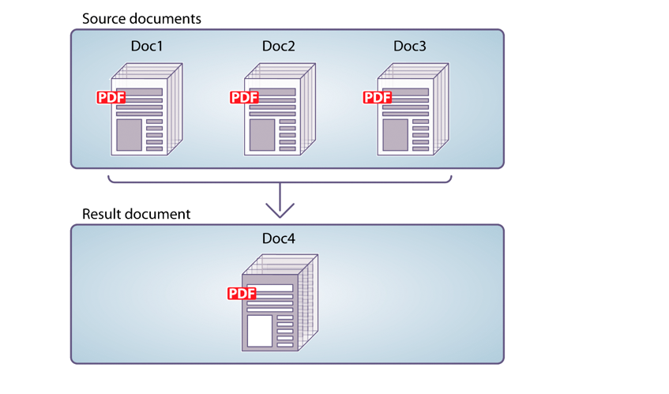

# 使用AEM Formsas a Cloud Service通信 {#frequently-asked-questions}

通信功能可帮助您创建品牌认可、个性化且标准化的文档，如业务信函、报表、报销申请处理信函、福利通知、每月账单或欢迎资料包。

该功能提供了用于生成和操作文档的API。 您可以根据需要生成或操作文档，或创建批处理作业以按定义的间隔生成多个文档。 通信API提供：

* 简化了按需和批量文档生成功能。

* 能够按需组合、重新排列和验证PDF文档。

* HTTP API，更便于与外部系统集成。 包括单独的API，用于按需（低延迟）和批处理操作（高吞吐量操作）。

* 安全访问数据。 通信API仅连接到客户指定的数据存储库并从中访问数据，从而使通信高度安全。

可以使用通信API创建信用卡对帐单。 此示例报表使用相同的模板，但会根据每个客户对信用卡的使用情况，为其分开数据。

## 文档生成

通信文档生成API有助于将模板(XFA或PDF)与客户数据(XML)结合，以生成PDF和打印格式（如PS、PCL、DPL、IPL和ZPL格式）的文档。 这些API将PDF和XFA模板与 [XML数据](communications-known-issues-limitations.md#form-data) 用于按需生成单个文档或使用批处理作业生成多个文档。

通常，您使用 [Designer](use-forms-designer.md) 和使用通信API将数据与模板合并。 您的应用程序可以将输出文档发送到网络打印机、本地打印机或存储系统以进行存档。 典型的开箱即用工作流和自定义工作流如下所示：

根据用例的不同，您还可以通过网站或存储服务器下载这些文档。

文档生成API的一些示例包括：

### 创建PDF文档 {#create-pdf-documents}

您可以使用文档生成API创建基于表单设计和XML表单数据的PDF文档。 输出是非交互式PDF文档。 即用户无法输入或修改表单数据。 基本的工作流程是将XML表单数据与表单设计合并，以创建PDF文档。 下图显示了表单设计和XML表单数据的合并，以生成PDF文档。

图：创建PDF文档的典型工作流

### 创建PostScript(PS)、打印机命令语言(PCL)、Zebra打印语言(ZPL)文档 {#create-PS-PCL-ZPL-documents}

您可以使用文档生成API创建基于XDP表单设计或PDF文档的PostScript(PS)、打印机命令语言(PCL)和Zebra打印语言(ZPL)文档。 这些API有助于将表单设计与表单数据合并以生成文档。 您可以将文档保存到文件并开发一个自定义流程以将其发送到打印机。

<!-- ### Processing batch data to create multiple documents

Communications APIs can create separate documents for each record within an XML batch data source. The APIs can also create a single document that contains all records (this functionality is the default). Assume that an XML data source contains ten records and you instruct the APIs to create a separate document for each record (for example, PDF documents). As a result, the APIs generate ten PDF documents.

The following illustration also shows Communications APIs processing an XML data file that contains multiple records. However, assume that you instruct the APIs to create a single PDF document that contains all data records. In this situation, the APIs generate one document that contains all of the records.

The following illustration shows Communications APIs processing an XML data file that con tains multiple records. Assume that you instruct the Communications APIs to create a separate PDF document for each data record. In this situation, the APIs generates a separate PDF document for each data record.

 -->

### 处理批量数据以创建多个文档 {#processing-batch-data-to-create-multiple-documents}

您可以使用文档生成API为XML批量数据源中的每个记录创建单独的文档。 您可以在批量和异步模式下生成文档。 您可以为转换配置各种参数，然后启动批处理。

<!-- You can can also create a single document that contains all records (this functionality is the default).  Assume that an XML data source contains ten records and you have a requirement to create a separate document for each record (for example, PDF documents). You can use the Communication APIs to generate ten PDF documents. -->

<!-- The following illustration shows the Communication APIs processing an XML data file that contains multiple records. However, assume that you instruct the Communication APIs to create a single PDF document that contains all data records. In this situation, the Communication APIs generate one document that contains all of the records.

The following illustration shows the Communication APIs processing an XML data file that contains multiple records. Assume that you instruct the Communication APIs to create a separate PDF document for each data record. In this situation, the Communication APIs generates a separate PDF document for each data record.

For detailed information on using Batch APIs, see Communication APIs: Processing batch data to create multiple documents. 

### Flatten interactive PDF documents {#flatten-interactive-pdf-documents}

You can use document generation APIs to transform an interactive PDF document (for example, a form) to a non-interactive PDF document. An interactive PDF document lets users enter or modify data located in the PDF document fields. The process of transforming an interactive PDF document to a non-interactive PDF document is called flattening. When a PDF document is flattened, a user cannot modify the data located in the document’s fields. One reason to flatten a PDF document is to ensure that data cannot be modified.

You can flatten the following types of PDF documents:

* Interactive PDF documents created in Designer (that contain XFA streams).

* Acrobat PDF forms

If you attempt to flatten a non-interactive PDF document, an exception occurs.

### Retain Form State {#retain-form-state}

An interactive PDF document contains various elements that constitute a form. These elements may include fields (to accept or display data), buttons (to trigger events), and scripts (commands to perform a specific action). Clicking a button may trigger an event that changes the state of a field. For example, choosing a gender option may change the color of a field or the appearance of the form. This is an example of a manual event causing the form state to change.

When such an interactive PDF document is flattened using the Communications APIs, the state of the form is not retained. To ensure that the state of the form is retained even after the form is flattened, set the Boolean value _retainFormState_ to True to save and retain the state of the form. -->

## 文档操作

通信文档处理API有助于合并、重新排列和验证PDF文档。 通常，您会创建DDX并将其提交到文档处理API以组合或重新排列文档。 的 [DDX文档](https://helpx.adobe.com/content/dam/help/en/experience-manager/forms-cloud-service/ddxRef.pdf) 提供有关如何使用源文档生成一组必需文档的说明。 DDX参考文档提供了有关所有受支持操作的详细信息。 文档操作的一些示例包括：

### 组合PDF文档

您可以使用文档操作API将两个或多个PDF或XDP文档组合到单个PDF文档或PDFPortfolio中。 以下是组合PDF文档的一些方法：

* 组合简单的PDF文档
* 创建PDFPortfolio
* 组合加密文档
* 使用Bates编号来组合文档
* 拼合和组合文档

图：从多个PDF文档组合简单的PDF文档

### 反汇编PDF文档

可以使用文档操作API来拆解PDF文档。 API可以从源文档中提取页面或基于书签划分源文档。 通常，如果PDF文档最初是从许多单独的文档（如语句集合）中创建，则此任务会很有用。

* 从源文档提取页面
* 根据书签划分源文档

图：将基于书签的源文档划分为多个文档

### 转换并验证符合PDF/A的文档

您可以使用文档操作API将PDF文档转换为符合PDF/A的文档，并确定PDF文档是否符合PDF/A。 PDF/A是一种存档格式，用于长期保存文档的内容。 字体嵌入在文档中，且文件未压缩。 因此，PDF/A文档通常比标准PDF文档大。 此外，PDF/文档不包含音频和视频内容。

## 通信API的类型

通信为按需和批量文档生成提供了HTTP API:

* **[同步API](https://www.adobe.io/experience-manager-forms-cloud-service-developer-reference/)** 适用于按需、低延迟和单记录文档生成场景。 这些API更适合基于用户操作的用例。 例如，在用户完成填写表单后生成文档。

* **[批量API（异步API）](https://www.adobe.io/experience-manager-forms-cloud-service-developer-reference/)** 适用于计划、高吞吐量和多文档生成场景。 这些API可批量生成文档。 例如，每月生成的电话账单、信用卡报表和福利报表。

## 入门

通信功能可作为Formsas a Cloud Service用户的独立附加模块使用。 您可以联系Adobe销售团队或Adobe代表以请求获取访问权限。 Adobe 可为贵企业开启访问通道，并为您指定的管理员提供各种所需权限。 管理员可以向贵组织的Formsas a Cloud Service开发人员（用户）授予使用API的访问权限。

入门后，要为Formsas a Cloud Service环境启用通信功能，请执行以下操作：

1. 登录到Cloud Manager并打开AEM Formsas a Cloud Service实例。

1. 打开编辑程序选项，转到解决方案和加载项选项卡，然后选择 **[!UICONTROL Forms — 通信]** 选项。

   

   如果已启用 **[!UICONTROL Forms — 数字注册]** 选项，然后选择 **[!UICONTROL Forms — 通信附加组件]** 选项。

   

1. 单击 **[!UICONTROL 更新]**.

1. 运行生成管道。 构建管道成功后，将为您的环境启用通信API。

>[!NOTE]
>
> 要启用和配置文档操作API，请将以下规则添加到 [调度程序配置](setup-local-development-environment.md#forms-specific-rules-to-dispatcher):
>
> `# Allow Forms Doc Generation requests`
> `/0062 { /type "allow" /method "POST" /url "/adobe/forms/assembler/*" }`

<!--

Communication help you combine a template and XML data to generate print documents in various formats. The service allows you to generate documents in synchronous and batch modes. The APIs enables you to create applications that let you:

  * Generate documents by populating template files (PDF and XDP) with XML data.
  * Generate output forms in various formats, including non-interactive PDF print streams.

Consider a scenario where you have one or more templates and multiple records of XML data for each template. You can use Communications APIs to generate a print document for each record.  You can also combine the records into a single document.  The result is a non-interactive PDF document. A non-interactive PDF document does not let users enter data into its fields.

 There are two main Communications APIs. The _generatePDFOutput_ generates PDFs, while the _generatePrintedOutput_ generates PostScript, ZPL, and PCL formats. These APIs are available as REST endpoints on your environment, both on author and publish instances. Since the publish instances are configured to scale faster than the author instances, it is recommended use these APIs via publish instances.

The first parameter of both the operations accept the path and name of the template file (for example ExpenseClaim.xdp). You can specify a fully qualified path, reference path of your AEM Repository, or path of a binary file. The second parameter accepts an XML document that is merged with the template while generating the output document.  

The [API reference documentation](https://documentcloud.adobe.com/link/track?uri=urn:aaid:scds:US:b1223732-ae0f-4921-bdc0-c31e48b56044) provides detailed information about all the parameters, authentication methods, and various services provided by APIs. The API reference documentation is also available in the .yaml format. You can download the .yaml for [Batch APIs](assets/batch-api.yaml) or [non-Batch API.yaml](assets/non-batch-api.yaml) file and upload it to postman to check functionality of APIs.

>[!VIDEO](https://video.tv.adobe.com/v/335771)

Uploading Communication APIs .yaml file to postman to check functionality of APIs.

## Using the Communications APIs {#workflows}

Typically, you create a template using [Designer](use-forms-designer.md) and use communications APIs ( generatePDFOutput and generatePrintedOutput) to:

* Convert these templates to various formats, including PDF, PostScript, ZPL, and PCL.
* Merge XML form data with a form design to generate a document.
* Generate a document without merging XML form data into the document. However, the primary workflow is merging data into the document.

Then, the output document is stored to a file. You can design custom workflows to send the file to a network printer, a local printer, or to a storage system for archival. A typical out of the box and custom workflows look like the following:

### Create PDF documents {#create-pdf-documents}

You can use the _generatePDFOutput_ API to create PDF document that is based on a form design and XML form data. The output is a non-interactive PDF document. That is, users cannot enter or modify form data. A basic workflow is to merge XML form data with a form design to create a PDF document. The following illustration shows the merging of a form design and XML form data to produce a PDF document.

### Create PostScript (PS), Printer Command Language (PCL), Zebra Printing Language (ZPL) document {#create-PS-PCL-ZPL-documents}

You can use Communications APIs to create PostScript (PS), Printer Command Language (PCL), and Zebra Printing Language (ZPL) document that are based on a XDP form design or PDF document. The _generatePrintedOutput_ API merges a form design with form data to generate a document. You can save the document to a file and develop a custom process to send it to a printer.

 ### Processing batch data to create multiple documents

Communications APIs can create separate documents for each record within an XML batch data source. The APIs can also create a single document that contains all records (this functionality is the default). Assume that an XML data source contains ten records and you instruct the APIs to create a separate document for each record (for example, PDF documents). As a result, the APIs generate ten PDF documents.

The following illustration also shows Communications APIs processing an XML data file that contains multiple records. However, assume that you instruct the APIs to create a single PDF document that contains all data records. In this situation, the APIs generate one document that contains all of the records.

The following illustration shows Communications APIs processing an XML data file that contains multiple records. Assume that you instruct the Communications APIs to create a separate PDF document for each data record. In this situation, the APIs generates a separate PDF document for each data record.

### Processing batch data to create multiple documents {#processing-batch-data-to-create-multiple-documents}

You create separate documents for each record within an XML batch data source. You can can also create a single document that contains all records (this functionality is the default). Assume that an XML data source contains ten records and you have a requirement to create a separate document for each record (for example, PDF documents). You can use the Communication APIs to generate ten PDF documents.

The following illustration shows the Communication APIs processing an XML data file that contains multiple records. However, assume that you instruct the Communication APIs to create a single PDF document that contains all data records. In this situation, the Communication APIs generate one document that contains all of the records.

The following illustration shows the Communication APIs processing an XML data file that contains multiple records. Assume that you instruct the Communication APIs to create a separate PDF document for each data record. In this situation, the Communication APIs generates a separate PDF document for each data record.

For detailed information on using Batch APIs, see Communication APIs: Processing batch data to create multiple documents.

### Flatten interactive PDF documents {#flatten-interactive-pdf-documents}

You can use the Communications APIs to transform an interactive PDF document (for example, a form) to a non-interactive PDF document. An interactive PDF document lets users enter or modify data located in the PDF document fields. The process of transforming an interactive PDF document to a non-interactive PDF document is called flattening. When a PDF document is flattened, a user cannot modify the data located in the document’s fields. One reason to flatten a PDF document is to ensure that data cannot be modified.

You can flatten the following types of PDF documents:

* Interactive PDF documents created in Designer (that contain XFA streams).

* Acrobat PDF forms

If you attempt to flatten a non-interactive PDF document, an exception occurs.

### Retain Form State {#retain-form-state}

An interactive PDF document contains various elements that constitute a form. These elements may include fields (to accept or display data), buttons (to trigger events), and scripts (commands to perform a specific action). Clicking a button may trigger an event that changes the state of a field. For example, choosing a gender option may change the color of a field or the appearance of the form. This is an example of a manual event causing the form state to change.

When such an interactive PDF document is flattened using the Communications APIs, the state of the form is not retained. To ensure that the state of the form is retained even after the form is flattened, set the Boolean value _retainFormState_ to True to save and retain the state of the form.  -->
