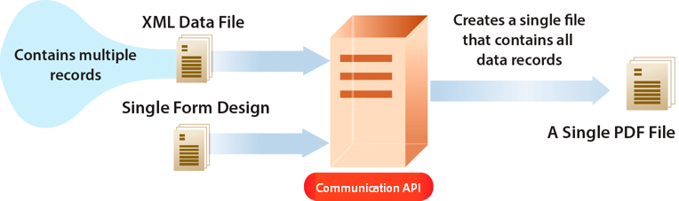

# 使用 AEM Forms as a Cloud Service 通信 {#frequently-asked-questions}

| 版本 | 文章链接 |
| -------- | ---------------------------- |
| AEM 6.5 | [单击此处](https://experienceleague.adobe.com/docs/experience-manager-65/forms/use-document-services/overview-aem-document-services.html) |
| AEM as a Cloud Service | 本文 |

通信功能可帮助您创建品牌批准的、个性化的和标准化的文档，例如商业信函、对帐单、理赔处理函、收益通知函、月度帐单或欢迎套件。

该功能提供 API 来生成和操作文档。您可以按需生成或操作文档，也可以创建批处理作业来按定义的时间间隔生成多个文档。通信 API 提供：

* 按需简化和批量文档生成功能。

* 按需组合、重新排列和验证 PDF 文档的能力。

* 用于更轻松地与外部系统集成的 HTTP API。包括用于按需（低延迟）和批处理操作（高吞吐量操作）的单独 API。

* 对数据的安全访问。通信 API 仅连接到客户指定的数据存储库并从中访问数据，从而使通信变得高度安全。

可以使用通信 API 创建信用卡对帐单。此示例对帐单使用相同的模板，但根据每个客户的信用卡使用情况分离其数据。

## 文档生成

通信文档生成 API 有助于将模板（XFA 或 PDF）与客户数据（XML）相结合，生成 PDF 和打印格式（如 PS、PCL、DPL、IPL 和 ZPL 格式）的文档。这些 API 将 PDF 和 XFA 模板与 [XML 数据](communications-known-issues-limitations.md#form-data)结合使用，按需生成单个文档或使用批处理作业生成多个文档。

通常，您使用 [Designer](use-forms-designer.md) 创建模板，并使用通信 API 将数据与模板合并。您的应用程序可以将输出文档发送到网络打印机、本地打印机或存储系统以进行存档。典型的现成和自定义工作流如下所示：

根据用例，您还可以将这些文档设为通过您的网站或存储服务器下载。

文档生成 API 的一些示例包括：

### 创建 PDF 文档 {#create-pdf-documents}

您可以使用文档生成 API 创建基于表单设计和 XML 表单数据的 PDF 文档。输出是非交互式 PDF 文档。也就是说，用户无法输入或修改表单数据。基本工作流是将 XML 表单数据与表单设计合并来创建 PDF 文档。下图说明如何合并表单设计和 XML 表单数据以生成 PDF 文档。

图：典型的 PDF 文档创建工作流

### 创建 PostScript (PS)、打印机指令语言 (PCL)、Zebra 打印语言 (ZPL) 文档 {#create-PS-PCL-ZPL-documents}

您可以使用文档生成 API 创建基于 XDP 表单设计的 PostScript (PS)、打印机指令语言 (PCL)、Zebra 打印语言 (ZPL) 文档或 PDF 文档。这些 API 有助于将表单设计与表单数据合并以生成文档。您可以将文档保存到文件，并开发一个自定义流程来将它发送到打印机。

<!-- ### Processing batch data to create multiple documents

Communications APIs can create separate documents for each record within an XML batch data source. The APIs can also create a single document that contains all records (this functionality is the default). Assume that an XML data source contains ten records and you instruct the APIs to create a separate document for each record (for example, PDF documents). As a result, the APIs generate ten PDF documents.

The following illustration also shows Communications APIs processing an XML data file that contains multiple records. However, assume that you instruct the APIs to create a single PDF document that contains all data records. In this situation, the APIs generate one document that contains all of the records.

The following illustration shows Communications APIs processing an XML data file that con tains multiple records. Assume that you instruct the Communications APIs to create a separate PDF document for each data record. In this situation, the APIs generates a separate PDF document for each data record.

 -->

### 处理批量数据可创建多个文档 {#processing-batch-data-to-create-multiple-documents}

您可以使用文档生成 API 为 XML 批处理数据源中的每条记录创建单独的文档。您可以批量和在异步架构下生成文档。您可以配置各种用于转换的参数，然后开始批处理。

<!-- You can can also create a single document that contains all records (this functionality is the default).  Assume that an XML data source contains ten records and you have a requirement to create a separate document for each record (for example, PDF documents). You can use the Communication APIs to generate ten PDF documents. -->

<!-- The following illustration shows the Communication APIs processing an XML data file that contains multiple records. However, assume that you instruct the Communication APIs to create a single PDF document that contains all data records. In this situation, the Communication APIs generate one document that contains all of the records.

The following illustration shows the Communication APIs processing an XML data file that contains multiple records. Assume that you instruct the Communication APIs to create a separate PDF document for each data record. In this situation, the Communication APIs generates a separate PDF document for each data record.

For detailed information on using Batch APIs, see Communication APIs: Processing batch data to create multiple documents. 

### Flatten interactive PDF documents {#flatten-interactive-pdf-documents}

You can use document generation APIs to transform an interactive PDF document (for example, a form) to a non-interactive PDF document. An interactive PDF document lets users enter or modify data located in the PDF document fields. The process of transforming an interactive PDF document to a non-interactive PDF document is called flattening. When a PDF document is flattened, a user cannot modify the data located in the document's fields. One reason to flatten a PDF document is to ensure that data cannot be modified.

You can flatten the following types of PDF documents:

* Interactive PDF documents created in Designer (that contain XFA streams).

* Acrobat PDF forms

If you attempt to flatten a non-interactive PDF document, an exception occurs.

### Retain Form State {#retain-form-state}

An interactive PDF document contains various elements that constitute a form. These elements may include fields (to accept or display data), buttons (to trigger events), and scripts (commands to perform a specific action). Clicking a button may trigger an event that changes the state of a field. For example, choosing a gender option may change the color of a field or the appearance of the form. This is an example of a manual event causing the form state to change.

When such an interactive PDF document is flattened using the Communications APIs, the state of the form is not retained. To ensure that the state of the form is retained even after the form is flattened, set the Boolean value _retainFormState_ to True to save and retain the state of the form. -->

## 文档操作

通信文档操作 API 可帮助合并、重新排列和验证 PDF 文档。通常，您创建一个 DDX 并将它提交给文档操作 API 来汇编或重新排列文档。[DDX 文档](https://helpx.adobe.com/content/dam/help/en/experience-manager/forms-cloud-service/ddxRef.pdf)提供了有关如何使用源文档生成一组所需文档的说明。DDX 引用文档提供了有关所有受支持操作的详细信息。文档操作的一些示例包括：

### 汇编 PDF 文档

您可以使用文档操作 API 将两个或更多 PDF 或 XDP 文档汇编成一个 PDF 文档或 PDF 文档组合。以下是可用于汇编 PDF 文档的一些方法：

* 汇编一个简单的 PDF 文档
* 创建 PDF 文档组合
* 汇编加密的文档
* 使用 Bates 编号汇编文档
* 合并和汇编文档

图：将多个 PDF 文档汇编成一个简单 PDF 文档

### 拆分 PDF 文档

您可以使用文档操作 API 来拆分 PDF 文档。API 可以从源文档中提取页面或根据书签拆分源文档。通常，如果 PDF 文档最初是从多个单独文档（例如对帐单集合）创建的，则此任务很有用。

* 从源文档中提取页面
* 根据书签拆分源文档

图：根据书签将一个源文档拆分成多个文档

### 转换为符合 PDF/A 标准的文档并进行验证

您可以使用文档操作 API 将 PDF 文档转换为符合 PDF/A 标准的文档，并确定 PDF 文档是否符合 PDF/A 标准。PDF/A是一种用于长期保存文档内容的存档格式。 字体将嵌入到文档中，并且文件是未压缩的。因此，PDF/A 文档通常比标准 PDF 文档大。此外，PDF/A 文档不包含音频和视频内容。

<!-- 

## Document utilities

Document utilities synchronous APIs helps you convert documents between PDF and XDP file formats, and query information about a PDF document. For example, you can determine whether a PDF document contains comments or attachments. 

### Retrieve PDF document properties

You can [query a PDF document](https://developer.adobe.com/experience-manager-forms-cloud-service-developer-reference/references/pdf-utility-sync/#tag/Document-Extraction/) for the following information:

* Is a PDF Document: Check whether the source document is a PDF document.
* Is a fillable form: Check whether the source PDF document is a fillable form.
* Form Type: Retrieve the form type of the document.
* Check for Attachments: Check whether the source PDF document has any attachments.
* Check for Comments: Check whether the source PDF document has any review comments.
* Is a PDF Package: Check whether the document is a PDF package.
* Get the PDF Version: Retrieve the [version of the PDF document](https://en.wikipedia.org/wiki/History_of_PDF).
* Recommended Acrobat Version: Retrieve the required version of Acrobat (Reader) to open the PDF document.
* Is an XFA Document: Check whether the source PDF document is an XFA-based PDF document.
* Is Shell PDF: Check whether the source PDF document is shell PDF. A shell PDF contains only an XFA stream, font and image resources, and one page that is either blank or contains a warning that the document must be opened using Acrobat or Adobe Reader. The shell PDF is used with PDF transformation to optimize delivery of PDFForm transformations only.
* Get the XFA Version: Retrieve the [XFA Version for an XFA-based PDF document](https://en.wikipedia.org/wiki/XFA#XFA_versions).

### Convert PDF Documents into XDP Documents

The [PDF to XDP API](https://developer.adobe.com/experience-manager-forms-cloud-service-developer-reference/references/pdf-utility-sync/#tag/Document-Conversion) converts a PDF document to an XDP file. For a PDF document to be successfully converted to an XDP file, the PDF document must contain an XFA stream in the dictionary. -->

## 通信 API 的类型

通信功能提供用于按需和批量文档生成的 HTTP API：

* **[同步 API](https://developer.adobe.com/experience-manager-forms-cloud-service-developer-reference/)**&#x200B;适用于按需、低延迟、单一记录文档生成场景。这些 API 更适用于基于用户操作的用例。例如，在用户填写完表单后生成文档。

* **[批处理 API（异步 API）](https://developer.adobe.com/experience-manager-forms-cloud-service-developer-reference/)**&#x200B;适用于计划的、高吞吐量和多文档生成场景。这些 API 会批量生成文档。例如，每月生成的电话帐单、信用卡对帐单和收益对帐单。

## 入门培训

通信功能作为面向 Forms as a Cloud Service 用户的独立和附加模块提供。您可以联系 Adobe 销售团队或 Adobe 代表来请求访问权限。Adobe 可为您的组织开启访问渠道，并为您指定为组织中管理员的人员提供所需的权限。管理员可以向您组织的 Forms as a Cloud Service 开发人员（用户）授予访问权限以使用 API。

入门培训后，要为您的 Forms as a Cloud Service 环境启用通信功能，请执行以下操作：

1. 登录 Cloud Manager，并打开您的 AEM Forms as a Cloud Service 实例。

1. 打开“编辑程序”选项，转到“解决方案和加载项”选项卡，然后选择&#x200B;**[!UICONTROL Forms - 通信]**&#x200B;选项。

   

   如果您已启用 **[!UICONTROL Forms - 数字登记]**&#x200B;选项，则选择 **[!UICONTROL Forms - 通信加载项]**&#x200B;选项。

   

1. 单击&#x200B;**[!UICONTROL 更新]**。

1. 运行构建管道。成功运行构建管道后，将为您的环境启用通信 API。

>[!NOTE]
>
> 要启用和配置文档操作 API，请将以下规则添加到 [Dispatcher 配置](setup-local-development-environment.md#forms-specific-rules-to-dispatcher)：
>
> `# Allow Forms Doc Generation requests`
> `/0062 { /type "allow" /method "POST" /url "/adobe/forms/assembler/*" }`

<!--

Communication help you combine a template and XML data to generate print documents in various formats. The service lets you generate documents in synchronous and batch modes. The APIs enables you to create applications that let you:

  * Generate documents by populating template files (PDF and XDP) with XML data.
  * Generate output forms in various formats, including non-interactive PDF print streams.

Consider a scenario where you have one or more templates and multiple records of XML data for each template. You can use Communications APIs to generate a print document for each record.  You can also combine the records into a single document.  The result is a non-interactive PDF document. A non-interactive PDF document does not let users enter data into its fields.

 There are two main Communications APIs. The _generatePDFOutput_ generates PDFs, while the _generatePrintedOutput_ generates PostScript, ZPL, and PCL formats. These APIs are available as REST endpoints on your environment, both on author and publish instances. Since the publish instances are configured to scale faster than the author instances, it is recommended use these APIs via publish instances.

The first parameter of both the operations accept the path and name of the template file (for example ExpenseClaim.xdp). You can specify a fully-qualified path, reference path of your AEM Repository, or path of a binary file. The second parameter accepts an XML document that is merged with the template while generating the output document.  

The [API reference documentation](https://documentcloud.adobe.com/link/track?uri=urn:aaid:scds:US:b1223732-ae0f-4921-bdc0-c31e48b56044) provides detailed information about all the parameters, authentication methods, and various services provided by APIs. The API reference documentation is also available in the .yaml format. You can download the .yaml for [Batch APIs](assets/batch-api.yaml) or [non-Batch API.yaml](assets/non-batch-api.yaml) file and upload it to postman to check functionality of APIs.

>[!VIDEO](https://video.tv.adobe.com/v/335771)

Uploading Communication APIs .yaml file to postman to check functionality of APIs.

## Using the Communications APIs {#workflows}

Typically, you create a template using [Designer](use-forms-designer.md) and use communications APIs ( generatePDFOutput and generatePrintedOutput) to:

* Convert these templates to various formats, including PDF, PostScript, ZPL, and PCL.
* Merge XML form data with a form design to generate a document.
* Generate a document without merging XML form data into the document. However, the primary workflow is merging data into the document.

Then, the output document is stored to a file. You can design custom workflows to send the file to a network printer, a local printer, or to a storage system for archival. A typical out of the box and custom workflows look like the following:

### Create PDF documents {#create-pdf-documents}

You can use the _generatePDFOutput_ API to create PDF document that is based on a form design and XML form data. The output is a non-interactive PDF document. That is, users cannot enter or modify form data. A basic workflow is to merge XML form data with a form design to create a PDF document. The following illustration shows the merging of a form design and XML form data to produce a PDF document.

### Create PostScript (PS), Printer Command Language (PCL), Zebra Printing Language (ZPL) document {#create-PS-PCL-ZPL-documents}

You can use Communications APIs to create PostScript (PS), Printer Command Language (PCL), and Zebra Printing Language (ZPL) document that are based on an XDP form design or PDF document. The _generatePrintedOutput_ API merges a form design with form data to generate a document. You can save the document to a file and develop a custom process to send it to a printer.

 ### Processing batch data to create multiple documents

Communications APIs can create separate documents for each record within an XML batch data source. The APIs can also create a single document that contains all records (this functionality is the default). Assume that an XML data source contains ten records and you instruct the APIs to create a separate document for each record (for example, PDF documents). As a result, the APIs generate ten PDF documents.

The following illustration also shows Communications APIs processing an XML data file that contains multiple records. However, assume that you instruct the APIs to create a single PDF document that contains all data records. In this situation, the APIs generate one document that contains all of the records.

The following illustration shows Communications APIs processing an XML data file that contains multiple records. Assume that you instruct the Communications APIs to create a separate PDF document for each data record. In this situation, the APIs generates a separate PDF document for each data record.

### Processing batch data to create multiple documents {#processing-batch-data-to-create-multiple-documents}

You create separate documents for each record within an XML batch data source. You can can also create a single document that contains all records (this functionality is the default). Assume that an XML data source contains ten records and you have a requirement to create a separate document for each record (for example, PDF documents). You can use the Communication APIs to generate ten PDF documents.

The following illustration shows the Communication APIs processing an XML data file that contains multiple records. However, assume that you instruct the Communication APIs to create a single PDF document that contains all data records. In this situation, the Communication APIs generate one document that contains all of the records.

The following illustration shows the Communication APIs processing an XML data file that contains multiple records. Assume that you instruct the Communication APIs to create a separate PDF document for each data record. In this situation, the Communication APIs generates a separate PDF document for each data record.

For detailed information on using Batch APIs, see Communication APIs: Processing batch data to create multiple documents.

### Flatten interactive PDF documents {#flatten-interactive-pdf-documents}

You can use the Communications APIs to transform an interactive PDF document (for example, a form) to a non-interactive PDF document. An interactive PDF document lets users enter or modify data located in the PDF document fields. The process of transforming an interactive PDF document to a non-interactive PDF document is called flattening. When a PDF document is flattened, a user cannot modify the data located in the document's fields. One reason to flatten a PDF document is to ensure that data cannot be modified.

You can flatten the following types of PDF documents:

* Interactive PDF documents created in Designer (that contain XFA streams).

* Acrobat PDF forms

If you attempt to flatten a non-interactive PDF document, an exception occurs.

### Retain Form State {#retain-form-state}

An interactive PDF document contains various elements that constitute a form. These elements may include fields (to accept or display data), buttons (to trigger events), and scripts (commands to perform a specific action). Clicking a button may trigger an event that changes the state of a field. For example, choosing a gender option may change the color of a field or the appearance of the form. This is an example of a manual event causing the form state to change.

When such an interactive PDF document is flattened using the Communications APIs, the state of the form is not retained. To ensure that the state of the form is retained even after the form is flattened, set the Boolean value _retainFormState_ to True to save and retain the state of the form.  -->
