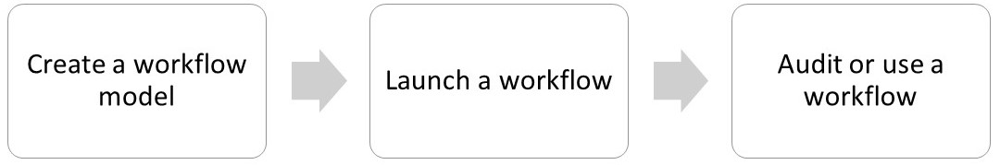

# 基于OSGi的以Forms为中心的工作流{#forms-centric-workflow-on-osgi}

企业从成千上万的表单、各种后端系统以及在线或离线数据源中收集数据。 他们还拥有一组动态的用户来对数据做出决策，其中涉及迭代审核和批准流程。

除了针对内部和外部受众的审核和批准工作流程外，大型组织和企业还会执行重复的任务。 例如，将PDF文档转换为其他格式。 手动完成这些任务时，需要花费大量时间和资源。 企业还有法律要求对文档进行数字签名并将表单数据存档，以供以后以预定义格式使用。

## OSGi上以Forms为中心的工作流简介 {#introduction-to-forms-centric-workflow-on-osgi}

您可以使用AEM工作流快速构建基于Forms的自适应工作流。 这些工作流可用于审核和批准、业务流程、启动文档服务、与Adobe Sign签名工作流集成以及类似操作。 例如，信用卡申请处理、员工休假审批工作流、将表单另存为PDF文档。 此外，这些工作流可以在组织内或跨网络防火墙使用。

借助OSGi上以Forms为中心的工作流，您可以在OSGi堆栈上为各种任务快速构建和部署工作流，而无需在JEE堆栈上安装完整的流程管理功能。 工作流的开发和管理使用了熟悉的AEM工作流和AEM收件箱功能。 工作流是自动化现实业务流程的基础，这些业务流程跨多个软件系统、网络、部门甚至组织进行。

设置后，可以手动触发这些工作流以完成定义的流程，或在用户提交表单时以编程方式运行 <!-- or [correspondence management](cm-overview.md) letter-->. <!-- With this enhanced AEM Workflow capabilities, [!DNL AEM Forms] offers two distinct, yet similar, capabilities. As part of your deployment strategy, you need to decide which one works for you. See a [comparison](capabilities-osgi-jee-workflows.md) of the Forms-centric AEM Workflows on OSGi and Process Management on JEE. Moreover, for the deployment topology see, [Architecture and deployment topologies for [!DNL AEM Forms]]((aem-forms-architecture-deployment.md). -->

基于OSGi的以Forms为中心的工作流扩展 [AEM收件箱](https://experienceleague.adobe.com/docs/experience-manager-cloud-service/sites/authoring/getting-started/inbox.html#authoring) 和为AEM工作流编辑器提供了额外的组件（步骤），以添加对 [!DNL AEM Forms]以中心为中心的工作流。 <!-- The extended AEM Inbox has functionalities similar to [[!DNL AEM Forms] Workspace](introduction-html-workspace.md). Along with managing human-centric workflows (Approval, Review, and so on), you can use AEM workflows to automate [document services](https://experienceleague.adobe.com/docs/experience-manager-65/developing/extending-aem/extending-workflows/workflows-step-ref.html#extending-aem)-related operations (for example, Generate PDF) and electronically signing (Adobe Sign) documents. -->

全部 [!DNL AEM Forms] 工作流步骤支持使用变量。 变量允许工作流步骤在运行时跨步骤保存和传递元数据。 您可以创建不同类型的变量以存储不同类型的数据。 您还可以创建变量集合（数组），以存储相关、相同类型数据的多个实例。 通常，当您需要根据变量所包含的值做出决策或存储流程中稍后需要的信息时，会使用变量或变量集合。 有关在这些以Forms为中心的工作流组件中使用变量的更多信息（步骤），请参阅 [基于OSGi的以Forms为中心的工作流 — 步骤参考](aem-forms-workflow-step-reference.md). 有关创建和管理变量的信息，请参阅 [AEM工作流中的变量](variable-in-aem-workflows.md).

下图描述了在OSGi上创建、运行和监视以Forms为中心的工作流的端到端过程。

## 开始之前 {#before-you-start}

* 工作流是真实业务流程的表示。 让您的真实业务流程和业务流程参与者列表随时可用。 此外，在开始创建工作流之前，请准备好宣传资料(自适应Forms、PDF文档等)。
* 一个工作流可以具有多个阶段。 这些阶段显示在AEM收件箱中，并帮助报告工作流的进度。 将您的业务流程划分为逻辑阶段。
* 您可以配置AEM Workflow的分配任务步骤，以向用户或受分配者发送电子邮件通知。 所以， [启用电子邮件通知](#configure-email-service).
* 工作流还可以使用Adobe符号进行数字签名。 如果您计划在工作流中使用Adobe Sign，则 [配置Adobe Sign [!DNL AEM Forms]](adobe-sign-integration-adaptive-forms.md) 在工作流中使用之前，请执行以下操作：

## 创建工作流模型 {#create-a-workflow-model}

工作流模型由业务流程的逻辑和流程组成。 它由一系列步骤组成。 这些步骤是AEM组件。 您可以根据需要通过参数和脚本扩展工作流步骤，以提供更多功能和控制。 [!DNL AEM Forms] 除了提供开箱即用的AEM步骤之外，还提供了一些步骤。 有关AEM和 [!DNL AEM Forms] 步骤，请参阅 [AEM工作流步骤参考](https://experienceleague.adobe.com/docs/experience-manager-65/developing/extending-aem/extending-workflows/workflows-step-ref.html#extending-aem) 和 [基于OSGi的以Forms为中心的工作流 — 步骤参考](aem-forms-workflow.md).

AEM提供了直观的用户界面，以使用提供的工作流步骤创建工作流模型。 有关创建工作流模型的分步说明，请参阅 [创建工作流模型](https://experienceleague.adobe.com/docs/experience-manager-cloud-service/sites/authoring/workflows/overview.html#workflows). 以下示例提供了为审批和审核工作流创建工作流模型的分步说明：

>[!NOTE]
>
>您必须是工作流编辑器组的成员才能创建或编辑工作流模型。

### 为审批和审核工作流程创建模型 {#create-a-model-for-an-approval-and-review-workflow}

审批和审核工作流是针对需要人为干预才能做出决策的任务。 以下示例为要由前台银行代理填写的按揭贷款应用程序创建工作流模型。 填写申请后，将发送该申请以供审批。 随后，将批准的申请发给申请人，请其使用Adobe Sign进行电子签名。

该示例以下附加的包形式提供。 使用包管理器导入和安装示例。 您还可以执行以下步骤来为应用程序手动创建工作流模型：

该示例创建一个工作流模型，该工作流模型是由前台银行代理填写的抵押申请。 填写完毕后，将发送该申请以供审批。 稍后，批准的申请将发送给客户，以便使用Adobe Sign进行电子签名。 您可以使用包管理器导入和安装示例。

[获取文件](assets/example-mortgage-loan-application.zip)

1. 打开“工作流模型”控制台。 默认URL为 `https://[server]:[port]/libs/cq/workflow/admin/console/content/models.html/etc/workflow/models`
1. 选择 **创建**，则 **创建模型**. 此时将出现“添加工作流模型”(Add Workflow Model)对话框。
1. 输入 **标题** 和 **名称** （可选）。 例如，抵押申请。 点按&#x200B;**完成**。
1. 选择新创建的工作流模型并点按 **编辑**. 现在，您可以添加工作流步骤以构建业务逻辑。 首次创建工作流模型时，它包含：

   * 步骤：流量开始和流量结束。 这些步骤表示工作流的开始和结束。 这些步骤是必需的，无法编辑或删除。
   * 名为步骤1的“参与者”步骤示例。 此步骤配置为将工作项分配给管理员用户。 删除此步骤。

1. 启用电子邮件通知。 您可以在OSGi上配置以Forms为中心的工作流，以向用户或受分配者发送电子邮件通知。 执行以下配置以启用电子邮件通知：

   1. 转到AEM配置管理器(位于 `https://[server]:[port]/system/console/configMgr`.
   1. 打开 **[!UICONTROL Day CQ Mail Service]** 配置。 为 **[!UICONTROL SMTP服务器主机名]**, **[!UICONTROL SMTP服务器端口、]** 和 **[!UICONTROL “发件人”地址]** 字段。 单击“**[!UICONTROL 保存]**”。
   1. 打开 **[!UICONTROL Day CQ链接外部器]** 配置。 在 **[!UICONTROL 域]** 字段，为本地、创作和发布实例指定实际的主机名/IP地址和端口号。 单击“**[!UICONTROL 保存]**”。

1. 创建工作流阶段。 一个工作流可以具有多个阶段。 这些阶段会显示在AEM收件箱中并报告工作流进度。

   要定义舞台，请点按  图标以打开工作流模型属性，请打开 **阶段** ，为工作流模型添加阶段，然后点按 **保存并关闭**. 对于抵押申请示例，请创建阶段：贷款申请、贷款申请状态、待签文件、已签贷款文件。

1. 拖放 **分配任务** 步骤浏览到工作流模型。 将其设为模型的第一步。

   分配任务组件将工作流创建的任务分配给用户或组。 除了分配任务之外，您还可以使用组件为任务指定自适应表单或非交互式PDF。 需要自适应表单才能接受用户输入且非交互式PDF，或者只读自适应表单只能用于审阅工作流。

   您还可以使用步骤来控制任务的行为。 例如，创建自动记录文档，将任务分配给特定用户或组、提交数据的路径、要预填充的数据路径以及默认操作。 有关分配任务步骤选项的详细信息，请参阅 [基于OSGi的以Forms为中心的工作流 — 步骤参考](aem-forms-workflow.md) 文档。

   

   对于抵押申请示例，请将分配任务步骤配置为使用只读自适应表单，并在任务完成后显示PDF文档。 此外，选择允许批准贷款请求的用户组。 在 **操作** 选项卡，禁用 **提交** 选项。 创建 **actionTaked** 变量，并将变量指定为 **路由变量**. 例如，actionTaked。 此外，添加批准和拒绝路由。 路由在AEM收件箱中显示为单独的操作（按钮）。 工作流会根据用户点按的操作（按钮）选择分支。

   您可以导入示例包（可从部分的开头下载），以获取为例如抵押申请配置的分配任务步骤的所有字段的完整值集。

1. 将OR拆分组件从步骤浏览器拖放到工作流模型。 “或拆分”(OR Split)在工作流中创建一个拆分，在该拆分之后，只有一个分支处于活动状态。 通过此步骤，您可以在工作流中引入条件处理路径。 您可以根据需要向每个分支添加工作流步骤。

   您可以使用规则定义、ECMA脚本或外部脚本为分支定义路由表达式。

   使用表达式编辑器为Branch 1和Branch 2创建路由表达式。 这些路由表达式有助于根据AEM收件箱中的用户操作选择分支。

   **分支1的路由表达式**

   用户点按 **批准** 在AEM收件箱中，将激活分支1。

   

   **分支2的路由表达式**

   用户点按 **拒绝** 在AEM收件箱中，将激活分支2。

   

   有关使用变量创建路由表达式的信息，请参阅 [中的变量 [!DNL AEM Forms] 工作流](variable-in-aem-workflows.md).

1. 添加其他工作流步骤以构建业务逻辑。

   对于抵押贷款示例，将生成的记录文档、两个分配任务步骤和一个签名文档步骤添加到模型的分支1，如下图所示。 一个分配任务步骤是显示和发送 **向申请人签署贷款文件** 另一个分配任务组件 **显示已签名文档**. 此外，将分配任务组件添加到分支2。 当用户点按AEM收件箱中的拒绝时，会激活该选项。

   对于为抵押申请配置的分配任务步骤、记录文档步骤和签名文档步骤的所有字段的完整值集，请导入示例包，该示例包可在此部分的开头下载。

   工作流模型已准备就绪。 您可以通过各种方法启动工作流。 有关详细信息，请参阅 [在OSGi上启动以Forms为中心的工作流](#launch).

   

## 创建以Forms为中心的工作流应用程序 {#create-a-forms-centric-workflow-application}

应用程序是与工作流关联的自适应表单。 当应用程序通过收件箱提交时，会启动关联的工作流。 将Forms工作流作为应用程序在AEM收件箱中提供，以及 [!DNL AEM Forms] 应用程序中，执行以下操作以创建工作流应用程序：

>[!NOTE]
>
>您必须是fd-administrator组的成员才能创建和管理工作流应用程序。

1. 在您的AEM创作实例中，转到  > **[!UICONTROL Forms]** > **[!UICONTROL 管理工作流应用程序]** 和点按 **[!UICONTROL 创建]**.
1. 在创建工作流应用程序窗口中，为以下字段提供输入，然后点按 **创建**. 随即会创建新应用程序，该应用程序将列在“工作流应用程序”屏幕中。

<table>
 <tbody>
  <tr>
   <td>字段</td>
   <td>描述</td>
  </tr>
  <tr>
   <td>标题</td>
   <td>标题在AEM收件箱中可见，可帮助用户选择应用程序。 保持描述性。 例如，“储蓄帐户开立”应用程序。  </td>
  </tr>
  <tr>
   <td>名称 </td>
   <td>指定应用程序的名称。 除字母、数字、连字符和下划线之外的所有其他字符都将替换为连字符。 </td>
  </tr>
  <tr>
   <td>描述</td>
   <td>描述显示在AEM收件箱中。 在描述字段中提供有关应用程序的详细信息。 例如，应用程序的用途。  </td>
  </tr>
  <tr>
   <td>自适应表单</td>
   <td>
指定自适应表单的路径。 当用户启动应用程序时，将显示指定的自适应表单。
 
<strong>注意</strong>:工作流应用程序不支持超过一页或需要在Apple iPad上滚动的表单和PDF文档。 当在Apple iPad上打开应用程序，并且自适应表单或PDF文档的长度超过某个页面时，第二页中的表单字段和内容将丢失。
 </td>
  </tr>
  <tr>
   <td>访问组</td>
   <td>
选择群组。 该应用程序仅对选定组的成员显示在AEM收件箱中。 访问组选项可使 [!DNL workflow-users] 组可供选择。 
   </td>
  </tr>
  <tr>
   <td>预填服务</td>
   <td>选择 <a href="prepopulate-adaptive-form-fields.md#aem-forms-custom-prefill-service" target="_blank">预填充服务</a> （在自适应表单中）。  </td>
  </tr>
  <tr>
   <td>工作流模型</td>
   <td>选择 <a href="aem-forms-workflow.md#create-a-workflow-model">工作流模型</a> 中。 工作流模型由业务流程的逻辑和流程组成。 </td>
  </tr>
  <tr>
   <td>数据文件路径</td>
   <td>在crx-repository中指定数据文件的路径。 路径相对于自适应表单有效负载，并且包含数据文件的名称。 始终包含文件的完整名称（包括扩展名）（如果适用）。 例如，[有效负载]/data.xml。 </td>
  </tr>
  <tr>
   <td>附件路径</td>
   <td>在crx-repository中指定附件文件夹的路径。 附件路径相对于有效负载位置。 例如，[有效负载]/data.xml。 </td>
  </tr>
  <tr>
   <td>记录文档路径</td>
   <td>在crx-repository中指定记录文档文件的路径。 路径与自适应表单有效负载位置相关。 始终包含文件的完整名称（包括扩展名）（如果适用）。 例如，[有效负载]/DOR/creditcard.pdf。</td>
  </tr>
 </tbody>
</table>

## 在OSGi上启动以Forms为中心的工作流 {#launch}

您可以通过以下方式启动或触发以Forms为中心的工作流：

* [从AEM收件箱提交应用程序](#inbox)
* [从 [!DNL AEM Forms] 应用程序](#afa)

* [提交自适应表单](#af)
* [使用监视文件夹](#watched)

* [提交交互式通信或信件](#letter)

### 从AEM收件箱提交应用程序 {#inbox}

您创建的工作流应用程序可作为收件箱中的应用程序使用。 属于 [!DNL workflow-users] 群组可以填写并提交触发关联工作流的应用程序。 有关使用AEM收件箱提交应用程序和管理任务的信息，请参阅 [在AEM收件箱中管理Forms应用程序和任务](manage-applications-inbox.md).

<!-- ### Submitting an application from [!DNL AEM Forms] App {#afa}

The [!DNL AEM Forms] app syncs with an [!DNL AEM Forms] server and allows you to make changes to the form data, tasks, workflow applications, and saved information (drafts/templates) in your account. For more information, see [[!DNL AEM Forms] app]((aem-forms-app.md) and related articles.-->

### 提交自适应表单 {#af}

您可以配置自适应表单的提交操作，以在提交自适应表单时启动工作流。 自适应Forms提供 **调用AEM工作流** 提交操作，以在提交自适应表单时启动工作流。 有关提交操作的详细信息，请参阅 [配置提交操作](configuring-submit-actions.md). 通过 [!DNL AEM Forms] 应用程序，启用同步 [!DNL AEM Forms] 应用程序中的“自适应表单”属性。

<!-- You can configure an Adaptive Form to sync, submit, and trigger a workflow from [!DNL AEM Forms] app. For details, see [working with a form]((working-with-form.md). -->

<!-- ### Using a watched folder {#watched}

An administrator (a member of fd-administrators group) can configure a network folder to run a pre-configured workflow when a user places a file (such as a PDF file) in the folder. After the workflow completes, it can save the result file to a specified output folder. Such a folder is known as [Watched Folder](watched-folder-in-aem-forms.md). Perform the following procedure to configure a watched folder to launch a workflow:

1. On your AEM author instance, go to  > **[!UICONTROL Forms]** > **[!UICONTROL Configure Watched Folder]**. A list of already configured watched folders is displayed.
1. Tap **[!UICONTROL New]**. A list of fields is displayed. Specify a value for the following fields to configure a Watched Folder for a workflow:

<table>
 <tbody>
  <tr>
   <td>Field</td>
   <td>Description</td>
  </tr>
  <tr>
   <td>Name</code></td>
   <td>Specify the name of the Watched Folder. This field support only alphanumeric.</td>
  </tr>
  <tr>
   <td>Path</code></td>
   <td>Specify the physical location of the Watched Folder. In a clustered environment, use a shared network folder that is accessible from AEM cluster node.</td>
  </tr>
  <tr>
   <td>Process Files Using</code></td>
   <td>Select the Workflow </code>option. </td>
  </tr>
  <tr>
   <td>Workflow Model</code></td>
   <td>Select a workflow model.  </td>
  </tr>
  <tr>
   <td>Output File Pattern</code></td>
   <td>Specify the directory structure for output files and directories. </a>.</td>
  </tr>
 </tbody>
</table>

1. Tap **Advanced**. Specify a value for the following field and taps **Create**. The Watched Folder is configured to launch a workflow. Now, whenever a file is placed in the input directory of the Watched Folder, the specified workflow is triggered.

   | Field |Description |
   |---|---|
   | Payload Mapper Filter |When you create a watched folder, it creates a folder structure in the crx-repository. The folder structure can serve as a payload to the workflow. You can write a script to map an AEM Workflow to accept inputs from the watched folder structure. An out of the box implementation is available and listed in the Payload Mapper Filter. If you do not have a custom implementation, select the default implementation. |

   The Advanced tab contains more fields. Most of these fields contain a default value. To learn about all the fields, see the [Create or Configure a watched folder]((admin-help/configuring-watched-folder-endpoints.md) article. -->

<!-- ### Submitting an interactive communication or a letter {#letter}

You can associate and execute a Forms-centric workflow on OSGi on submission of an interactive communication or a letter. In correspondence management workflows are used for post processing interactive communications and letters. For example, emailing, printing, faxing, or archiving final letters. For detailed steps, see [Post processing of interactive communications and letters](submit-letter-topostprocess.md).

## Additional Configurations {#additional-configurations}

### Configure email service {#configure-email-service}

You can use the Assign Task and Send Email steps of AEM Workflows to send an email. Perform the following steps to specify email servers and other configurations required to send email:

1. Go to AEM configuration manager at `https://[server]:[port]/system/console/configMgr`.
1. Open the **[!UICONTROL Day CQ Mail Service]** configuration. Specify a value for the **[!UICONTROL SMTP server host name]**, **[!UICONTROL SMTP server port,]** and **[!UICONTROL "From" address]** fields. Click **[!UICONTROL Save]**.
1. Open the **[!UICONTROL Day CQ Link Externalizer]** configuration. In the **[!UICONTROL Domains]** field, specify the actual hostname/IP address and port number for local, author, and publish instances. Click **[!UICONTROL Save]**. -->

### 清除工作流实例 {#purge-workflow-instances}

最大限度地减少工作流实例的数量可以提高工作流引擎的性能，因此，您可以定期从存储库中清除已完成或正在运行的工作流实例。有关详细信息，请参阅 [定期清除工作流实例](https://experienceleague.adobe.com/docs/experience-manager-cloud-service/operations/maintenance.html) 清除工作流实例
