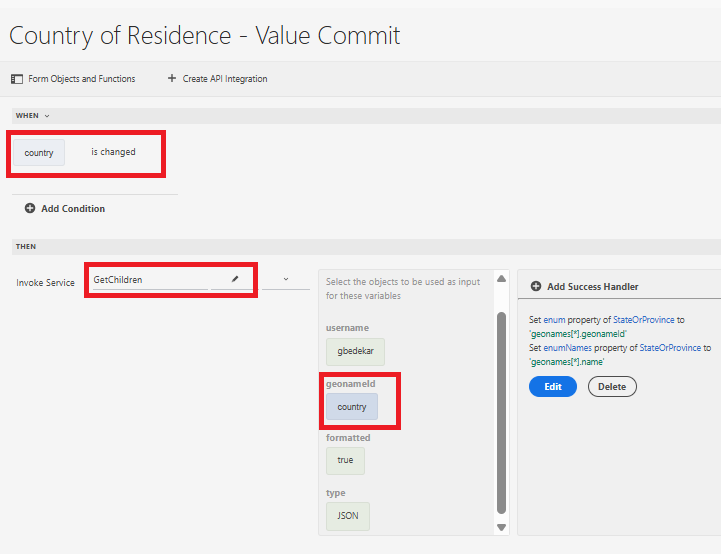
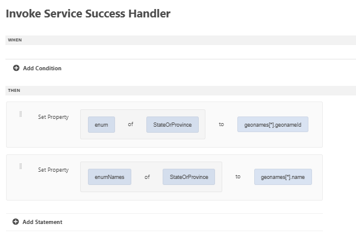

# 使用通用编辑器创建表单

使用通用编辑器创建以下表单。 该表单具有3个下拉列表，其值将使用API集成进行填充

## 居住国家/地区

初始化时，将使用API调用的结果填充居住国家/地区下拉列表。

## 成功处理程序

成功处理程序被定义为使用地理名称数组中的相应值设置国家/地区的枚举和枚举名称下拉列表。 geonames数组在“事件有效负载”选项下可用

## 获取子值

当用户在居住国家/地区下拉列表中进行选择时，将填充省/市/自治区下拉列表。 与所选国家/地区关联的geonameId将作为输入参数传递到GetChildren API集成

已定义序列处理程序来设置StateOrProvidle下拉字段的enum/enumNames

在选中省/市/自治区后，可按照用于填充省/市/自治区下拉列表的上述模式填充城市/自治区下拉列表。