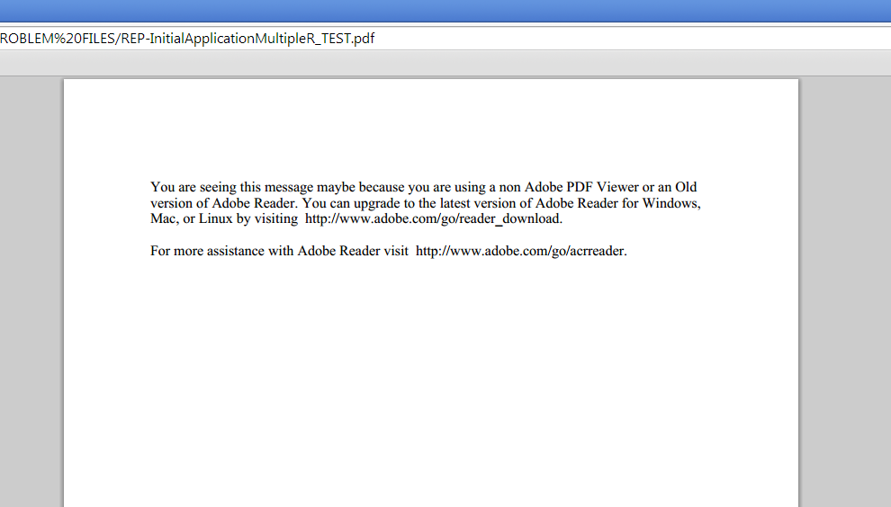

# 在设计器中更改零页内容 {#changing-page-zero-content-in-designer}

当非Adobe PDF查看器(如中的默认PDF查看器)时，默认显示零页内容 [!DNL Chrome] 或 [!DNL Firefox]，无法读取PDF/XFA表单的内容。 默认的Page Zero消息如下所示。

[!DNL AEM Forms] Designer的版本允许您更改显示在第0页上的消息。 要更改Page Zero消息，请执行以下步骤：

1. 确保您拥有 [!DNL AEM Forms] 已安装设计器版本。 您可以从设计器的“关于”屏幕中检查版本。

1. 打开要为其更改“页面零”内容的表单。

1. 单击 **[!UICONTROL 文件]** > **[!UICONTROL 表单属性]**.

1. 在 [!UICONTROL 表单属性] 对话框，请单击  （加号图标）以添加自定义属性。

1. 指定 **_pagezerocontent** 作为资产的名称。
1. 以富文本格式添加新的“页面零”消息作为值。 例如：

   `<body xmlns="https://www.w3.org/1999/xhtml" xmlns:xfa="https://www.xfa.org/schema/xfa-data/1.0/">
 </code>

You are seeing this message maybe because you are using a non Adobe PDF Viewer or an Old version of Adobe Reader. You can upgrade to the latest version of Adobe Reader for Windows, Mac, or Linux by visiting  </code>https://www.adobe.com/go/reader_download.

 </code>

For more assistance with Adobe Reader visit  </code>https://www.adobe.com/go/acrreader.
</body>`

1. 将表单另存为PDF。

1. 在浏览器中查看PDF表单，确认消息已更新。 上面的示例值如下所示：

   

>[!NOTE]
>
>重新打开表单时，您刚刚创建的自定义属性可能无法正确显示在表单属性对话框中。 但是，它可正常使用，并且表单会显示更新的零页消息。

>[!MORELIKETHIS]
>
>* [下载并安装Forms Designer以创建记录文档模板](/help/forms/installing-configuring-designer.md)
>* [使用Forms Designer创建记录文档(DoR)模板和表单片段？](/help/forms/use-forms-designer.md)
