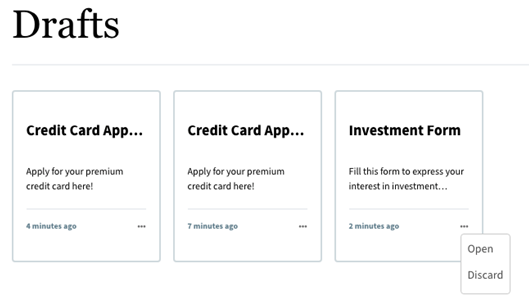

# 将Forms Portal添加到AEM Sites页面 {#publish-forms-on-portal}

<span class="preview">Adobe 建议使用现代、可扩展的数据捕获[核心组件](https://experienceleague.adobe.com/docs/experience-manager-core-components/using/adaptive-forms/introduction.html)，以[创建新的自适应表单](/help/forms/creating-adaptive-form-core-components.md)或[将自适应表单添加到 AEM Sites 页面](/help/forms/create-or-add-an-adaptive-form-to-aem-sites-page.md)。这些组件代表有关创建自适应表单的重大改进，确保实现令人印象深刻的用户体验。本文介绍了使用基础组件创作自适应表单的旧方法。</span>

| 版本 | 文章链接 |
| -------- | ---------------------------- |
| AEM 6.5 | [单击此处](https://experienceleague.adobe.com/docs/experience-manager-65/forms/publish-process-aem-forms/introduction-publishing-forms.html) |
| AEM as a Cloud Service | 本文 |

在以表单为中心的典型门户部署方案中，表单开发和门户开发是两个相互分离的活动。 当表单设计人员将表单设计和存储在存储库中时，Web开发人员会创建一个Web应用程序来列出表单并处理表单提交。 Forms将会复制到Web层，因为Forms存储库和Web应用程序之间没有通信。

这种情形往往导致管理问题和生产延迟。 例如，如果存储库中有较新版本的表单，则需要在Web层上替换表单、修改Web应用程序并在公共站点上重新部署表单。 重新部署Web应用程序可能会导致某些服务器停机。 通常，服务器停机是计划内活动，因此更改无法即时推送到公共站点。

AEM Forms提供门户组件，可减少管理开销和生产延迟。 这些组件让Web开发人员能够在使用Forms (AEM)创作的网站上创建和自定义Adobe Experience Manager门户。

利用表单门户组件，可添加以下功能：

* 以自定义布局列出表单。 开箱即用地提供列表视图和卡片视图布局。 您可以创建自己的自定义布局。
* 允许您在列出自定义元数据和自定义操作时显示它们。
* 列出使用AEM Forms Portal组件的发布实例上由Forms UI发布的表单。
* 允许最终用户以HTML和PDF格式呈现表单。
* 启用基于标题和描述的表单搜索。
* 使用自定义CSS可自定义门户的外观。
* 创建表单链接。
* 列出与用户创建的自适应Forms相关的草稿和提交。

## Forms Portal页面的组件 {#forms-portal-components}

AEM Forms提供了以下开箱即用的门户组件：

* 搜索和列表程序：利用此组件，可将表单存储库中的表单列出到门户页面上，并提供配置选项以根据指定条件列出表单。

* 草稿和提交：当“搜索和列表程序”组件显示由Forms作者公开的表单时，“草稿和提交”组件显示另存为草稿的表单，以供以后填写和提交的表单。 此组件可为任何登录用户提供个性化体验。

* 链接：通过此组件，可在页面上的任意位置创建指向表单的链接。

您可以 [导入现成的Forms Portal组件](#import-forms-portal-components-aem-archetype) 从AEM项目原型中。 导入后，执行以下配置：

* [配置外部存储](#configure-azure-storage-adaptive-forms)

* [启用Forms Portal组件](#enable-forms-portal-components)

* [配置Forms Portal组件](#configure-forms-portal-components)

## 导入Forms Portal组件 {#import-forms-portal-components-aem-archetype}

要在AEM Formsas a Cloud Service上导入现成的Forms Portal组件，请执行以下步骤：

1. **在本地开发实例上克隆Cloud Manager Git存储库：**  您的Cloud Manager Git存储库包含一个默认的AEM项目。 它基于 [AEM原型](https://github.com/adobe/aem-project-archetype/). 使用Cloud Manager UI中的自助Git帐户管理克隆Cloud Manager Git存储库，将项目引入本地开发环境。 有关访问存储库的详细信息，请参阅 [访问存储库](https://experienceleague.adobe.com/docs/experience-manager-cloud-manager/using/managing-code/accessing-repos.html).

1. **创建 [!DNL Experience Manager Forms] as a [Cloud Service] 项目：** 创建 [!DNL Experience Manager Forms] as a [Cloud Service] 项目基于 [AEM原型27](https://github.com/adobe/aem-project-archetype/releases/tag/aem-project-archetype-27) 或更高版本。 原型可帮助开发人员轻松开始开发 [!DNL AEM Forms] as a Cloud Service。 它还包含一些示例主题和模板，可帮助您快速入门。

   创建 [!DNL Experience Manager Forms] 与项目as a Cloud Service，打开命令提示符并运行以下命令。 要包含 [!DNL Forms] 特定配置、主题和模板、集 `includeForms=y`.

   ```shell
   mvn -B archetype:generate -DarchetypeGroupId=com.adobe.aem -DarchetypeArtifactId=aem-project-archetype -DarchetypeVersion=30 -DaemVersion="cloud" -DappTitle="My Site" -DappId="mysite" -DgroupId="com.mysite" -DincludeForms="y"
   ```

   另外，更改 `appTitle`， `appId`、和 `groupId`，以反映您的环境。

   项目准备就绪后，更新 `<core.forms.components.version>x.y.z</core.forms.components.version>` 属性位于顶层 `pom.xml` 原型项目的版本，以反映的最新版本 [core-forms-components](https://github.com/adobe/aem-core-forms-components) 在您的 `AEM Archetype` 项目。

1. **将项目部署到本地开发环境：** 您可以使用以下命令部署到本地开发环境

   `mvn -PautoInstallPackage clean install`

   有关命令的完整列表，请参见 [构建和安装](https://experienceleague.adobe.com/docs/experience-manager-core-components/using/developing/archetype/using.html?lang=en#building-and-installing)

1. [将代码部署到您的 [!DNL AEM Forms] as a Cloud Service环境](https://experienceleague.adobe.com/docs/experience-manager-cloud-service/content/implementing/developing/aem-project-content-package-structure.html#embeddeds).


## 为自适应Forms配置Azure存储 {#configure-azure-storage-adaptive-forms}

[[!DNL Experience Manager Forms] 数据集成](data-integration.md) 提供 [!DNL Azure] 用于集成表单的存储配置 [!DNL Azure] 存储服务。 表单数据模型可用于创建与之交互的自适应Forms [!DNL Azure] 服务器启用业务工作流。

### 创建 Azure 存储配置 {#create-azure-storage-configuration}

在执行这些步骤之前，请确保您拥有Azure存储帐户和访问密钥，以授权对的访问 [!DNL Azure] 存储帐户。

1. 导航到 **[!UICONTROL 工具]** > **[!UICONTROL Cloud Service]** > **[!UICONTROL Azure存储]**.
1. 选择一个文件夹以创建配置，然后点击 **[!UICONTROL 创建]**.
1. 在中指定配置的标题 **[!UICONTROL 标题]** 字段。
1. 指定 [!DNL Azure] 中的存储帐户 **[!UICONTROL Azure存储帐户]** 字段。

### 为Forms Portal配置统一存储连接器 {#configure-usc-forms-portal}

执行以下步骤为AEM Workflow配置统一存储连接器：

1. 导航到 **[!UICONTROL 工具]** > **[!UICONTROL Forms]** > **[!UICONTROL 统一存储连接器]**.
1. 在 **[!UICONTROL Forms门户]** 部分，选择 **[!UICONTROL Azure]** 从 **[!UICONTROL 存储]** 下拉列表。
1. 指定 [Azure存储配置的配置路径](#create-azure-storage-configuration) 在 **[!UICONTROL 存储配置路径]** 字段。
1. 点按 **[!UICONTROL Publish]** 然后点击 **[!UICONTROL 保存]** 以保存配置。

## 启用Forms Portal组件 {#enable-forms-portal-components}

要在Adobe Experience Manager (AEM)站点中使用任何核心组件（包括现成的门户组件），您必须创建代理组件并为您的站点启用它。 有关创建代理组件和启用门户组件的信息，请参阅 [使用核心组件](https://experienceleague.adobe.com/docs/experience-manager-core-components/using/get-started/using.html?lang=en#create-proxy-components).

启用门户组件后，您可以在站点页面的创作实例中使用它。

## 添加和配置Forms Portal组件 {#configure-forms-portal-components}

您可以通过添加和配置门户组件，在使用AEM创作的网站上创建和自定义Forms门户。 确保 [组件已启用](#enable-forms-portal-components) 在Forms门户中使用它们之前。

要添加组件，请将组件从“组件”窗格拖放到页面上的布局容器中，或点击布局容器上的添加图标并从以下位置添加组件： [!UICONTROL 插入新组件] 对话框。

### 配置草稿和提交组件 {#configure-drafts-submissions-component}

草稿和提交组件显示另存为草稿以供稍后完成和提交的表单。 要配置，请点按组件，然后点按 . 在 [!UICONTROL 草稿和提交] 对话框，请指定标题以将表单列为草稿或已提交的表单。 另选择组件应使用卡片格式还是列表格式列出草稿表单或已提交的表单。




### 配置搜索和列表程序组件 {#configure-search-lister-component}

搜索和列表程序组件用于在页面上列出自适应表单，并对列出的表单实施搜索。


要配置，请点按组件，然后点按 . 此 [!UICONTROL 搜索和列表程序] 对话框打开。

1. 在 [!UICONTROL 显示] 选项卡，配置以下内容：
   * 在 **[!UICONTROL 标题]**，指定搜索和列表程序组件的标题。 指示性标题使用户能够在表单列表中执行快速搜索。
   * 从 **[!UICONTROL 布局]** 列表时，选择以卡片或列表格式表示表单的布局。
   * 选择 **[!UICONTROL 隐藏搜索]** 和 **[!UICONTROL 隐藏排序]** 隐藏搜索并按功能排序。
   * 在 **[!UICONTROL 工具提示]**，提供将鼠标悬停在该组件上时显示的工具提示。
1. 在 [!UICONTROL 资产文件夹] 选项卡，指定从何处提取表单并将其列在页面上。 您可以配置多个文件夹位置。
1. 在 [!UICONTROL 结果] 选项卡，配置每页显示的最大表单数。 默认设置是每页八个表单。

### 配置链接组件 {#configure-link-component}

利用链接组件，可在页面上提供指向自适应表单的链接。 要配置，请点按组件，然后点按 . 此 [!UICONTROL 编辑链接组件] 对话框打开。

1. 在 [!UICONTROL 显示] 选项卡中提供链接标题和工具提示，以便于识别链接所表示的表单。
1. 在 [!UICONTROL 资源信息] 选项卡，指定存储资产的存储库路径。
1. 在 [!UICONTROL 查询参数] 选项卡，以键值对格式指定其他参数。 单击链接时，这些附加参数将与表单一起传递。

## 使用Adobe Sign配置异步表单提交 {#configure-asynchronous-form-submission-using-adobe-sign}

您可以将配置为仅在所有收件人都完成签名仪式后提交自适应表单。 执行以下步骤，使用Adobe Sign配置设置。

1. 在创作实例中，以编辑模式打开自适应表单。
1. 从左窗格中，点按属性图标，然后展开 **[!UICONTROL 电子签名]** 选项。
1. 选择 **[!UICONTROL 启用Adobe Sign]**. 将显示各种配置选项。
1. 在 [!UICONTROL 提交表单] 部分，选择 **[!UICONTROL 在每个收件人完成签字仪式后]** 用于配置“提交表单”操作的选项，在该操作中，表单将首先发送给所有收件人进行签名。 所有收件人签署表单后，才提交表单。

## 将自适应Forms另存为草稿 {#save-adaptive-forms-as-drafts}

您可以将表单另存为草稿，以便稍后完成。 将表单另存为草稿的方式有两种：
* 在表单组件上创建“保存表单”规则，例如按钮。 单击按钮时，规则将触发，并且表单将保存为草稿。
* 启用自动保存功能，该功能按照指定的事件或在配置的时间间隔后保存表单。

### 创建规则以将自适应表单另存为草稿 {#rule-to-save-adaptive-form-as-draft}

要在表单组件上创建“保存表单”规则（例如按钮），请执行以下步骤：

1. 在创作实例中，以编辑模式打开自适应表单。
1. 从左窗格中，点按  并拖动 [!UICONTROL 按钮] 组件添加到表单。
1. 点按 [!UICONTROL 按钮] 组件，然后点按 .
1. 点按 [!UICONTROL 编辑规则] 图标以打开规则编辑器。
1. 点按 **[!UICONTROL 创建]** 以配置和创建规则。
1. 在 [!UICONTROL 时间] 部分，选择“已单击”，然后在 [!UICONTROL 则] 选择“保存表单”选项。
1. 点按 **[!UICONTROL 完成]** 以保存规则。

### 启用自动保存 {#enable-auto-save}

您可以为自适应表单配置自动保存功能，如下所示：

1. 在创作实例中，以编辑模式打开自适应表单。
1. 从左窗格中，点按  并展开 [!UICONTROL 自动保存] 选项。
1. 选择 **[!UICONTROL 启用]** 复选框，以启用表单的自动保存。 您可以配置以下内容：
* 默认情况下， [!UICONTROL 自适应表单事件] 设置为“true”，这意味着表单将在每个事件后自动保存。
* 在 [!UICONTROL 触发器]，配置以根据事件的发生或在特定的时间间隔后触发自动保存。

## 另请参阅 {#see-also}

{{see-also}}


<!--

>[!MORELIKETHIS]
>
>* [Configure data sources for AEM Forms](/help/forms/configure-data-sources.md)
>* [Configure Azure storage for AEM Forms](/help/forms/configure-azure-storage.md)
>* [Integrate Microsoft Dynamics 365 and Salesforce with Adaptive Forms](/help/forms/configure-msdynamics-salesforce.md)

-->