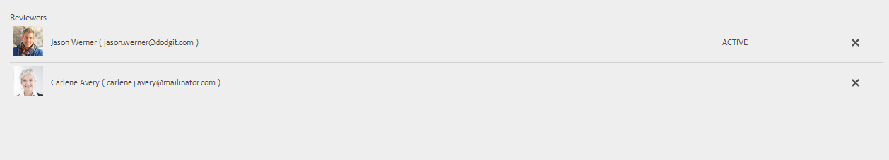

# 创建和管理表单中资产的审阅{#creating-and-managing-reviews-for-assets-in-forms}

## 审核 {#review}

审阅是一种机制，它允许一个或多个审阅人对表单中可用的资产发表评论。

## 设置审阅 {#setting-up-a-review}

1. 导航到Forms选项卡并选择表单。
1. 如果表单没有进行审核，则开始审核  图标。 单击Start Review  图标。
1. 输入以下信息：

   * 标题：必填项，可包含字母数字字符、连字符或下划线。
   * 描述：可选，用于描述审阅目的/内容。
   * 截止日期：可选，审核结束的日期。 在截止时间过后，任务将显示为“逾期”。
   * 审阅人：必须至少设置1。 键入组名称或用户名会列出除服务用户组之外的所有匹配名称。 选择名称，然后单击“添加”。

1. 单击开始以开始审阅。

>[!NOTE]
>
>* 管理员可以访问与表单用户关联的任何组。
>* 无法选择“服务用户”组进行审阅。

### 设置审阅时发生的操作 {#actions-that-occur-when-a-review-is-set-up}

本节介绍在创建或设置审阅时所发生的情况。

1. 将创建新审阅任务并将其分配给所选审阅人。
1. 所有审阅人都被指派了审阅任务。 任务将显示在其“通知”部分中。 审阅人可以单击通知，或转到收件箱以查看任务。 审阅人可以单击以打开审阅任务，查看表单，然后开始添加注释。

   

   审阅者通知警报

1. 表单的审阅人可以使用注释框。 其他人可以查看评论，但无法写评论。

## 管理审阅 {#managing-a-review}

>[!NOTE]
>
>只能修改正在进行的审阅。 无法修改已完成的审阅。

1. 导航到Forms选项卡并选择表单。

1. 如果资产正在进行审核，并且您是审核的发起者，则会进行管理审核  图标。 只有审核启动器才能管理（更新/结束）审核。

   单击Manage Review 图标。

   对于启动器以外的用户，“管理审阅”图标处于禁用状态。

1. 您会看到一个显示信息的屏幕：

   * **标题**:无法编辑。

   * **描述**:可进行编辑。

   * **截止时间**:可进行编辑。 您可以将截止日期修改为超出当前日期和时间的任何日期和时间。

   * **审阅人名称**:可进行编辑。 可以添加或删除审阅人。 如果任务逾期，则只有在将截止日期延长到当前日期之后，才能添加审阅人。

1. 编辑必需的字段，然后单击“完成”。

   

   在任务管理器中查看更新状态

1. 要结束审阅，请单击“结束审阅”(End Review)。

### 修改审阅时发生的操作 {#actions-that-occur-when-a-review-is-modified}

本节介绍审核更新/结束时发生的情况：

1. 如果修改了审阅说明，则会更新审阅人和发起人的相应任务。
1. 如果修改了审阅截止时间，则审阅人的相应任务将更新为新日期。

1. 如果删除了审阅人：

   

   删除审阅人

   1. 如果未完成，则分配的任务将终止。
   1. 审阅人无法再对表单进行注释。

1. 如果添加了审阅人：

   

   添加审阅人

   1. 将创建审核任务并将其分配给新添加的审核人员。
   1. 新添加的审阅人可以添加有关表单的注释。

1. 审核结束时：

   1. **审阅人**:对于每个审阅人，与审阅相关的未完成任务将终止。 该任务在审阅人的“通知”部分中不再显示为“待处理”。
   1. **发起者**:分配给审核启动器的任务标记为完成。 该任务将从审阅启动器的“通知”部分中删除。
   1. **全部**:该审阅显示在“上一审阅”(Previous Reviews)部分中。 无法添加进一步的评论。
      

