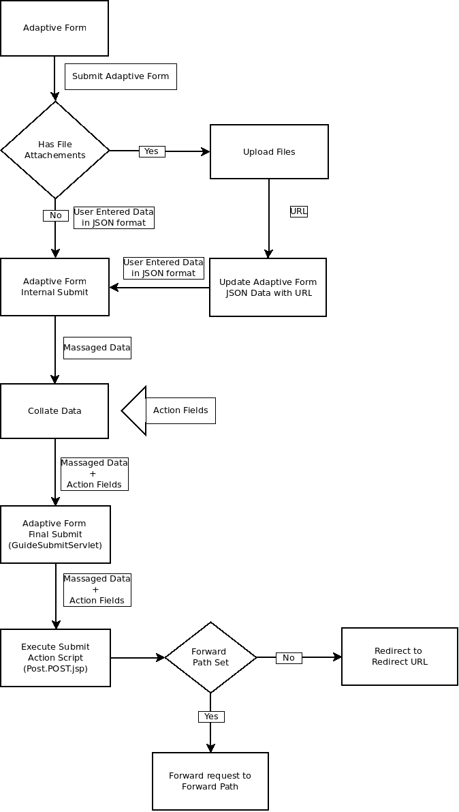

# 为自适应Forms创建自定义提交操作 {#writing-custom-submit-action-for-adaptive-forms}

自适应表单提供了多个现成提交操作(OOTB)。 “提交操作”指定要对通过自适应表单收集的数据执行的操作的详细信息。 例如，通过电子邮件发送数据。

您可以创建自定义提交操作以添加未包含在 [现成的提交操作](configuring-submit-actions.md) 或不通过单个OOTB提交操作提供支持。 例如，将数据提交到工作流、将数据保存到数据存储中、向提交表单的人发送电子邮件通知，以及通过单个提交操作向负责处理已提交表单以供审批和拒绝的人员发送电子邮件。

## XML数据格式 {#xml-data-format}

XML数据将使用 **`jcr:data`** 请求参数。 提交操作可以访问参数以处理数据。 以下代码描述XML数据的格式。 绑定到表单模型的字段显示在 **`afBoundData`** 中。 未绑定字段显示在 `afUnoundData`中。 <!--For more information about the format of the `data.xml` file, see [Introduction to prepopulating Adaptive Form fields](prepopulate-adaptive-form-fields.md).-->

```xml
<?xml ?>
<afData>
<afUnboundData>
<data>
<field1>value</field2>
<repeatablePanel>
    <field2>value</field2>
</repeatablePanel>
<repeatablePanel>
    <field2>value</field2>
</repeatablePanel>
</data>
</afUnboundData>
<afBoundData>
<!-- xml corresponding to the Form Model /XML Schema -->
</afBoundData>
</afData>
```

### 操作字段 {#action-fields}

提交操作可以添加隐藏的输入字段(使用HTML [输入](https://developer.mozilla.org/en/docs/Web/HTML/Element/Input) 标记)到呈现的表单HTML。 这些隐藏字段可以包含处理表单提交时需要的值。 提交表单时，这些字段值将作为请求参数发回，提交操作可在提交处理过程中使用这些参数。 输入字段称为操作字段。

例如，如果“提交操作”（也会捕获填写表单所花费的时间）可以添加隐藏的输入字段 `startTime` 和 `endTime`.

脚本可以提供 `startTime` 和 `endTime` 字段。 提交操作脚本 `post.jsp` 然后，可以使用请求参数访问这些字段并计算填写表单所需的总时间。

### 文件附件 {#file-attachments}

提交操作还可以使用您使用文件附件组件上传的文件附件。 提交操作脚本可以使用sling访问这些文件 [RequestParameter API](https://sling.apache.org/apidocs/sling5/org/apache/sling/api/request/RequestParameter.html). 的 [isFormField](https://sling.apache.org/apidocs/sling5/org/apache/sling/api/request/RequestParameter.html#isFormField()) API的方法可帮助识别请求参数是文件还是表单字段。 您可以在提交操作中迭代请求参数，以标识文件附件参数。

以下示例代码标识请求中的文件附件。 接下来，它使用 [获取API](https://sling.apache.org/apidocs/sling5/org/apache/sling/api/request/RequestParameter.html#get()). 最后，它使用数据创建一个Document对象并将其附加到列表。

```java
RequestParameterMap requestParameterMap = slingRequest.getRequestParameterMap();
for (Map.Entry<String, RequestParameter[]> param : requestParameterMap.entrySet()) {
    RequestParameter rpm = param.getValue()[0];
    if(!rpm.isFormField()) {
        fileAttachments.add(new Document(rpm.get()));
    }
}
```

在将文件附加到自适应表单后，服务器会在提交自适应表单后验证文件附件，并在以下情况下返回错误消息：

* 文件附件包含以(.)开头的文件名 字符，包含\ / :* ? &quot; &lt; > | ;% $字符，或包含为Windows操作系统保留的特殊文件名，例如 `nul`, `prn`, `con`, `lpt`或 `com`.

* 文件附件的大小为0字节。

* 文件附件的格式未在 [支持的文件类型](https://helpx.adobe.com/document-cloud/help/supported-file-formats-fill-sign.html#main-pars_text) 部分。

### 转发路径和重定向URL {#forward-path-and-redirect-url}

执行所需操作后，Submit servlet会将请求转发到转发路径。 操作使用setForwardPath API在指南提交Servlet中设置前进路径。

如果操作未提供转发路径，则提交Servlet会使用重定向URL重定向浏览器。 作者使用自适应表单编辑对话框中的感谢页面配置来配置重定向URL。 您还可以通过提交操作或指南提交servlet中的setRedirectUrl API来配置重定向URL。 您还可以使用指南提交servlet中的setRedirectParameters API配置发送到重定向URL的请求参数。

>[!NOTE]
>
>作者提供了重定向URL（使用感谢页面配置）。 [OOTB提交操作](configuring-submit-actions.md) 使用重定向URL从转发路径引用的资源中重定向浏览器。
>
>您可以编写一个自定义提交操作，将请求转发到资源或Servlet。 Adobe建议负责对前向路径执行资源处理的脚本在处理完成时将请求重定向到重定向URL。

## 提交操作 {#submit-action}

提交操作是sling:Folder，其中包含以下内容：

* **addfields.jsp**:此脚本提供在呈现期间添加到HTML文件的操作字段。 使用此脚本在post.POST.jsp脚本中添加提交期间所需的隐藏输入参数。
* **dialog.xml**:此脚本类似于CQ组件对话框。 它提供作者自定义的配置信息。 当您选择提交操作时，这些字段会显示在自适应表单编辑对话框的提交操作选项卡中。
* **post.POST.jsp**:提交Servlet会使用您提交的数据以及前几节中的附加数据调用此脚本。 在此页中提及运行操作意味着运行post.POST.jsp脚本。 要在自适应Forms中注册“提交操作”以在自适应表单编辑对话框中显示，请将这些属性添加到sling:Folder:

   * **guideComponentType** 字符串类型和值 **fd/af/components/guidesubmittype**
   * **guideDataModel** “字符串”类型，指定“提交操作”适用的“自适应表单”类型。 <!--**xfa** is supported for XFA-based Adaptive Forms while -->**xd** 支持基于XSD的自适应Forms。 **基本** 不支持使用XDP或XSD的自适应Forms。 要对多种类型的自适应Forms显示操作，请添加相应的字符串。 用逗号分隔每个字符串。 例如，要使操作在 <!--XFA- and -->基于XSD的自适应Forms，将值指定为 <!--**xfa** and--> **xd**.

   * **jcr:description** 类型为“字符串”。 此属性的值显示在“自适应表单编辑”对话框的“提交操作”选项卡的“提交操作”列表中。 OOTB操作存在于位于的CRX存储库中 **/libs/fd/af/components/guidesubmittype**.

   * **submitService** 类型为“字符串”。 有关更多信息，请参阅 [计划自定义操作的自适应表单提交](#schedule-adaptive-form-submission).

## 创建自定义提交操作 {#creating-a-custom-submit-action}

执行以下步骤以创建一个自定义提交操作，该操作将数据保存在CRX存储库中，然后向您发送电子邮件。 自适应表单包含将数据保存到CRX存储库的OOTB提交操作存储内容（已弃用）。 此外，AEM还提供 [邮件](https://www.adobe.io/experience-manager/reference-materials/6-5/javadoc/com/day/cq/mailer/package-summary.html) 可用于发送电子邮件的API。 在使用Mail API之前，请通过系统控制台配置Day CQ Mail服务。 您可以重复使用“存储内容（已弃用）”操作将数据存储在存储库中。 “存储内容（已弃用）”操作可在CRX存储库的/libs/fd/af/components/guidesubmittype/store位置执行。

1. 登录到CRXDE Lite，网址为https://&lt;server>:&lt;port>/crx/de/index.jsp。 在/apps/custom_submit_action文件夹中创建一个具有属性sling:Folder和名称store_and_mail的节点。 创建custom_submit_action文件夹（如果文件夹不存在）。

   

1. **提供必填配置字段。**

   添加Store操作所需的配置。 复制 **cq:dialog** 从/libs/fd/af/components/guidesubmittype/store到/apps/custom_submit_action/store_and_email上的action文件夹的“存储”操作节点。

   

1. **提供配置字段以提示作者进行电子邮件配置。**

   自适应表单还提供了电子邮件操作，用于向用户发送电子邮件。 根据您的要求自定义此操作。 导航至/libs/fd/af/components/guidesubmittype/email/dialog。 将cq:dialog节点中的节点复制到“提交操作”的cq:dialog节点(/apps/custom_submit_action/store_and_email/dialog)。

   

1. **使该操作在自适应表单编辑对话框中可用。**

   在store_and_email节点中添加以下属性：

   * **guideComponentType** 类型 **字符串** 和值 **fd/af/components/guidesubmittype**

   * **guideDataModel** 类型 **字符串** 和值 **<!--xfa, -->xsd，基本**

   * **jcr:description** 类型 **字符串** 和值 **存储和电子邮件操作**

   * **submitService** 类型 **字符串** 和值 **存储和电子邮件**. 有关更多信息，请参阅 [计划自定义操作的自适应表单提交](#schedule-adaptive-form-submission).

1. 打开任何自适应表单。 单击 **编辑** 按钮 **开始** 打开 **编辑** 自适应表单容器的对话框。 新操作将显示在 **提交操作** 选项卡。 选择 **存储和电子邮件操作** 显示在对话框节点中添加的配置。

   

1. **使用操作完成任务。**

   将post.POST.jsp脚本添加到您的操作。 (/apps/custom_submit_action/store_and_mail/)。

   运行OOTB存储操作(post.POST.jsp脚本)。 使用 [FormsHelper.runAction](https://www.adobe.io/experience-manager/reference-materials/6-5/javadoc/com/day/cq/wcm/foundation/forms/FormsHelper.html#runAction-java.lang.String-java.lang.String-org.apache.sling.api.resource.Resource-org.apache.sling.api.SlingHttpServletRequest-org.apache.sling.api.SlingHttpServletResponse-)(java.lang.String， java.lang.String， org.apache.sling.api.resource.Resource， org.apache.sling.api.SlingHttpServletRequest， org.apache.sling.api.SlingHttpServletResponse)CQ在您的代码中提供的用于运行存储操作的API。 在JSP文件中添加以下代码：

   `FormsHelper.runAction("/libs/fd/af/components/guidesubmittype/store", "post", resource, slingRequest, slingResponse);`

   要发送电子邮件，此代码会从配置中读取收件人的电子邮件地址。 要在操作的脚本中获取配置值，请使用以下代码读取当前资源的属性。 同样，您也可以读取其他配置文件。

   `ValueMap properties = ResourceUtil.getValueMap(resource);`

   `String mailTo = properties.get("mailTo");`

   最后，使用CQ Mail API发送电子邮件。 使用 [SimpleEmail](https://commons.apache.org/proper/commons-email/apidocs/org/apache/commons/mail/SimpleEmail.html) 类创建电子邮件对象，如下所示：

   >[!NOTE]
   >
   >确保JSP文件的名称为post.POST.jsp。

   ```java
   <%@include file="/libs/fd/af/components/guidesglobal.jsp" %>
   <%@page import="com.day.cq.wcm.foundation.forms.FormsHelper,
          org.apache.sling.api.resource.ResourceUtil,
          org.apache.sling.api.resource.ValueMap,
                   com.day.cq.mailer.MessageGatewayService,
     com.day.cq.mailer.MessageGateway,
     org.apache.commons.mail.Email,
                   org.apache.commons.mail.SimpleEmail" %>
   <%@taglib prefix="sling"
                   uri="https://sling.apache.org/taglibs/sling/1.0" %>
   <%@taglib prefix="cq"
                   uri="https://www.day.com/taglibs/cq/1.0"
   %>
   <cq:defineObjects/>
   <sling:defineObjects/>
   <%
           String storeContent =
                       "/libs/fd/af/components/guidesubmittype/store";
           FormsHelper.runAction(storeContent, "post", resource,
                                   slingRequest, slingResponse);
    ValueMap props = ResourceUtil.getValueMap(resource);
    Email email = new SimpleEmail();
    String[] mailTo = props.get("mailto", new String[0]);
    email.setFrom((String)props.get("from"));
           for (String toAddr : mailTo) {
               email.addTo(toAddr);
      }
    email.setMsg((String)props.get("template"));
    email.setSubject((String)props.get("subject"));
    MessageGatewayService messageGatewayService =
                       sling.getService(MessageGatewayService.class);
    MessageGateway messageGateway =
                   messageGatewayService.getGateway(SimpleEmail.class);
    messageGateway.send(email);
   %>
   ```

   在自适应表单中选择操作。 操作会发送电子邮件并存储数据。

## 对自定义提交操作使用submitService属性 {#submitservice-property}

设置自定义提交操作时，该操作包括 `submitService` 属性时，表单会触发 [FormSubmitActionService](https://helpx.adobe.com/experience-manager/6-5/forms/javadocs/com/adobe/aemds/guide/service/FormSubmitActionService.html) 提交时。 的 `FormSubmitActionService` 使用 `getServiceName` 方法检索的值 `submitService` 属性。 根据 `submitService` 属性中，服务将调用相应的提交方法。 包括 `FormSubmitActionService` 到您上传到的自定义包 [!DNL AEM Forms] 服务器。

添加 `submitService` 字符串类型的属性 `sling:Folder` 自定义提交操作启用 [!DNL Adobe Sign] （在自适应表单中）。 您可以选择 **[!UICONTROL 启用Adobe Sign]** 选项 **[!UICONTROL 电子签名]** 自适应表单容器属性的部分(仅在 `submitService` 自定义提交操作的属性。

<!--As a result of setting an appropriate value for the `submitService` property and enabling [!DNL Adobe Sign], you can schedule the submission of an Adaptive Form to ensure that all configured signers have taken an action on the form. [!DNL Adobe Sign] Configuration Service keeps polling [!DNL Adobe Sign] server at regular intervals to verify the status of signatures. If all the signers complete signing the form, the Submit Action service is started and the form is submitted.-->


<!-- You can't do comments within comments, so I changed comment tags to <start-comment> <end-comment> -->

<!--
## Workflow for a Submit Action {#workflow-for-a-submit-action}

The flowchart depicts the workflow for a Submit Action that is triggered when you click the **[!UICONTROL Submit]** button in an Adaptive Form. The files in the File Attachment component are uploaded to the server, and the form data is updated with the URLs of the uploaded files. Within the client, the data is stored in the JSON format. The client sends an Ajax request to an internal servlet that massages the data you specified and returns it in the XML format. The client collates this data with action fields. It submits the data to the final servlet (Guide Submit servlet) through a Form Submit Action. Then, the servlet forwards the control to the Submit Action. The Submit Action can forward the request to a different sling resource or redirect the browser to another URL.



### XML data format {#xml-data-format}

The XML data is sent to the servlet using the **`jcr:data`** request parameter. Submit Actions can access the parameter to process the data. The following code describes the format of the XML data. The fields that are bound to the Form model appear in the **`afBoundData`** section. Unbound fields appear in the `afUnoundData`section. For more information about the format of the `data.xml` file, see [Introduction to prepopulating Adaptive Form fields](prepopulate-adaptive-form-fields.md).

```xml
<?xml ?>
<afData>
<afUnboundData>
<data>
<field1>value</field2>
<repeatablePanel>
    <field2>value</field2>
</repeatablePanel>
<repeatablePanel>
    <field2>value</field2>
</repeatablePanel>
</data>
</afUnboundData>
<afBoundData>
<start comment> xml corresponding to the Form Model /XML Schema <end comment>
<start comment> </afBoundData> <end comment>
</afData>
```

### Action fields {#action-fields}

A Submit Action can add hidden input fields (using the HTML [input](https://developer.mozilla.org/en/docs/Web/HTML/Element/Input) tag) to the rendered form HTML. These hidden fields can contain values that it needs while processing form submission. When submitting the form, these field values are posted back as request parameters that the Submit Action can use during submission handling. The input fields are called action fields.

For example, a Submit Action that also captures the time taken to fill a form can add the hidden input fields `startTime` and `endTime`.

A script can supply the values of the `startTime` and `endTime` fields when the form renders and before form submission, respectively. The Submit Action script `post.jsp` can then access these fields using request parameters and compute the total time required to fill the form.

### File attachments {#file-attachments}

Submit Actions can also use the file attachments you upload using the File Attachment component. Submit Action scripts can access these files using the sling [RequestParameter API](https://sling.apache.org/apidocs/sling5/org/apache/sling/api/request/RequestParameter.html). The [isFormField](https://sling.apache.org/apidocs/sling5/org/apache/sling/api/request/RequestParameter.html#isFormField()) method of the API helps identify whether the request parameter is a file or a form field. You can iterate over the Request parameters in a Submit Action to identify File Attachment parameters.

The following sample code identifies the file attachments in the request. Next, it reads the data into the file using the [Get API](https://sling.apache.org/apidocs/sling5/org/apache/sling/api/request/RequestParameter.html#get()). Finally, it creates a Document object using the data and appends it to a list.

```java
RequestParameterMap requestParameterMap = slingRequest.getRequestParameterMap();
for (Map.Entry<String, RequestParameter[]> param : requestParameterMap.entrySet()) {
    RequestParameter rpm = param.getValue()[0];
    if(!rpm.isFormField()) {
        fileAttachments.add(new Document(rpm.get()));
    }
}
```

### Forward path and Redirect URL {#forward-path-and-redirect-url}

After performing the required action, the Submit servlet forwards the request to the forward path. An action uses the setForwardPath API to set the forward path in the Guide Submit servlet.

If the action doesn't provide a forward path, the Submit servlet redirects the browser using the Redirect URL. The author configures the Redirect URL using the Thank You Page configuration in the Adaptive Form Edit dialog. You can also configure the Redirect URL through the Submit Action or the setRedirectUrl API in the Guide Submit servlet. You can also configure the Request parameters sent to the Redirect URL using the setRedirectParameters API in the Guide Submit servlet.

>[!NOTE]
>
>An author provides the Redirect URL (using the Thank You Page Configuration). [OOTB Submit Actions](configuring-submit-actions.md) use the Redirect URL to redirect the browser from the resource that the forward path references.
>
>You can write a custom Submit Action that forwards a request to a resource or servlet. Adobe recommends that the script that performs resource handling for the forward path redirect the request to the Redirect URL when the processing completes.

## Submit Action {#submit-action}

A Submit Action is a sling:Folder that includes the following:

* **addfields.jsp**: This script provides the action fields that are added to the HTML file during rendition. Use this script to add hidden input parameters required during submission in the post.POST.jsp script.
* **dialog.xml**: This script is similar to the CQ Component dialog. It provides configuration information that the author customizes. The fields are displayed in the Submit Actions Tab in the Adaptive Form Edit dialog when you select the Submit Action.
* **post.POST.jsp**: The Submit servlet calls this script with the data that you submit and the additional data in the previous sections. Any mention of running an action in this page implies running the post.POST.jsp script. To register the Submit Action with the Adaptive Forms to display in the Adaptive Form Edit dialog, add these properties to the sling:Folder:

    * **guideComponentType** of type String and value **fd/af/components/guidesubmittype**
    * **guideDataModel** of type String that specifies the type of Adaptive Form for which the Submit Action is applicable. **xfa** is supported for XFA-based Adaptive Forms while **xsd** is supported for XSD-based Adaptive Forms. **basic** is supported for Adaptive Forms that do not use XDP or XSD. To display the action on multiple types of Adaptive Forms, add the corresponding strings. Separate each string by a comma. For example, to make an action visible on XFA- and XSD-based Adaptive Forms, specify the values **xfa** and **xsd** respectively.

    * **jcr:description** of type String. The value of this property is displayed in the Submit Action list in the Submit Actions Tab of the Adaptive Form Edit dialog. The OOTB actions are present in the CRX repository at the location **/libs/fd/af/components/guidesubmittype**.

## Creating a custom Submit Action {#creating-a-custom-submit-action}

Perform the following steps to create a custom Submit Action that saves the data in the CRX repository and then sends you an email. The Adaptive Form contains the OOTB Submit Action Store Content (deprecated) that saves the data in the CRX repository. In addition, CQ provides a [Mail](https://www.adobe.io/experience-manager/reference-materials/6-5/javadoc/com/day/cq/mailer/package-summary.html) API that can be used to send emails. Before using the Mail API, configure the Day CQ Mail service through the system console. You can reuse the Store Content (deprecated) action to store the data in the repository. The Store Content (deprecated) action is available at the location /libs/fd/af/components/guidesubmittype/store in the CRX repository.

1. Log in to CRXDE Lite at the URL https://&lt;server&gt;:&lt;port&gt;/crx/de/index.jsp. Create a node with the property sling:Folder and name store_and_mail in the /apps/custom_submit_action folder. Create the custom_submit_action folder if it doesn't exist already.

   

1. **Provide the mandatory configuration fields.**

   Add the configuration the Store action requires. Copy the **cq:dialog** node of the Store action from /libs/fd/af/components/guidesubmittype/store to the action folder at /apps/custom_submit_action/store_and_email.

   

1. **Provide configuration fields to prompt the author for email configuration.**

   The Adaptive Form also provides an Email action that sends emails to users. Customize this action based on your requirements. Navigate to /libs/fd/af/components/guidesubmittype/email/dialog. Copy the nodes within the cq:dialog node to cq:dialog node of your Submit Action (/apps/custom_submit_action/store_and_email/dialog).

   

1. **Make the action available in the Adaptive Form Edit dialog.**

   Add the following properties in the store_and_email node:

    * **guideComponentType** of type **String** and value **fd/af/components/guidesubmittype**

    * **guideDataModel** of type **String** and value **xfa, xsd, basic**

    * **jcr:description** of type **String** and value **Store and Email Action**

1. Open any Adaptive Form. Click the **Edit** button next to **Start** to open the **Edit** dialog of the Adaptive Form container. The new action is displayed in the **Submit Actions** Tab. Selecting the **Store and Email Action** displays the configuration added in the dialog node.

   

1. **Use the action to complete a task.**

   Add the post.POST.jsp script to your action. (/apps/custom_submit_action/store_and_mail/).

   Run the OOTB Store action (post.POST.jsp script). Use the [FormsHelper.runAction](https://www.adobe.io/experience-manager/reference-materials/6-5/javadoc/com/day/cq/wcm/foundation/forms/FormsHelper.html#runAction-java.lang.String-java.lang.String-org.apache.sling.api.resource.Resource-org.apache.sling.api.SlingHttpServletRequest-org.apache.sling.api.SlingHttpServletResponse-(java.lang.String, java.lang.String, org.apache.sling.api.resource.Resource, org.apache.sling.api.SlingHttpServletRequest, org.apache.sling.api.SlingHttpServletResponse)) API that CQ provides in your code to run the Store action. Add the following code in your JSP file:

   `FormsHelper.runAction("/libs/fd/af/components/guidesubmittype/store", "post", resource, slingRequest, slingResponse);`

   To send the email, the code reads the recipient's email address from the configuration. To fetch the configuration value in the action's script, read the properties of the current resource using the following code. Similarly you can read the other configuration files.

   `ValueMap properties = ResourceUtil.getValueMap(resource);`

   `String mailTo = properties.get("mailTo");`

   Finally, use the CQ Mail API to send the email. Use the [SimpleEmail](https://commons.apache.org/proper/commons-email/apidocs/org/apache/commons/mail/SimpleEmail.html) class to create the Email Object as depicted below:

   >[!NOTE]
   >
   >Ensure that the JSP file has the name post.POST.jsp.

   ```java
   <%@include file="/libs/fd/af/components/guidesglobal.jsp" %>
   <%@page import="com.day.cq.wcm.foundation.forms.FormsHelper,
          org.apache.sling.api.resource.ResourceUtil,
          org.apache.sling.api.resource.ValueMap,
                   com.day.cq.mailer.MessageGatewayService,
     com.day.cq.mailer.MessageGateway,
     org.apache.commons.mail.Email,
                   org.apache.commons.mail.SimpleEmail" %>
   <%@taglib prefix="sling"
                   uri="https://sling.apache.org/taglibs/sling/1.0" %>
   <%@taglib prefix="cq"
                   uri="https://www.day.com/taglibs/cq/1.0"
   %>
   <cq:defineObjects/>
   <sling:defineObjects/>
   <%
           String storeContent =
                       "/libs/fd/af/components/guidesubmittype/store";
           FormsHelper.runAction(storeContent, "post", resource,
                                   slingRequest, slingResponse);
    ValueMap props = ResourceUtil.getValueMap(resource);
    Email email = new SimpleEmail();
    String[] mailTo = props.get("mailto", new String[0]);
    email.setFrom((String)props.get("from"));
           for (String toAddr : mailTo) {
               email.addTo(toAddr);
      }
    email.setMsg((String)props.get("template"));
    email.setSubject((String)props.get("subject"));
    MessageGatewayService messageGatewayService =
                       sling.getService(MessageGatewayService.class);
    MessageGateway messageGateway =
                   messageGatewayService.getGateway(SimpleEmail.class);
    messageGateway.send(email);
   %>
   ```

   Select the action in the Adaptive Form. The action sends an email and stores the data. 

-->
