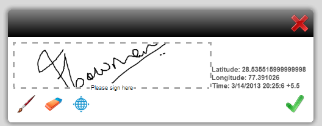

# 为 HTML5 Forms 设计表单模板{#designing-form-templates-for-html-forms}

 HTML5 Forms功能作为提前访问计划的一部分提供。 要请求访问，请将您的官方（工作）电子邮件ID通过电子邮件发送到aem-forms-ea@adobe.com。

AEM中的HTML5表单组件可以将XFA表单模板渲染为HTML5格式。 表单设计人员可以使用Forms Designer设计表单模板并使用HTML5呈现功能。 这些表单模板及其资源可以驻留在AEM存储库和文件系统中，或通过http公开。 但是，如果您计划使用Forms Manager管理表单，则模板和资源应位于AEM存储库中。

虽然HTML5表单在很大程度上与PDF forms的行为相匹配，但两种格式都存在一些不适用于其他格式的功能。 例如，Adobe Reader中对PDF表单应用条形码的方式因移动设备表单而异，对表单进行数字签名的方式也因格式而异。 有关此类变体的更多信息，请参阅[HTML5表单与PDF forms之间的功能区别](/help/forms/feature-differentiation-html5-forms-pdf-forms.md)。

有关常见的XFA功能，请参阅以下最佳实践和指南，以设计可同时满足两种格式的表单。

## 最佳做法 {#best-practices}

设计表单模板的大多数步骤（如架构绑定或编写表单逻辑）都是相同的。 但是，由于Adobe Reader等厚客户端的渲染引擎与基于浏览器的表单的脚本引擎之间存在固有差异，因此[最佳实践](/help/forms/design-accessible-html5-forms.md)文章中介绍了一些建议。 这些最佳实践可帮助您设计两种格式的表单模板，使其按预期工作。

### 适用于HTML5 Forms的AEM Forms Designer中的功能 {#capabilities-in-aem-forms-designer-for-html-forms}

#### 预览HTML {#preview-html}

在“设计”模式下会添加“预览HTML”选项卡，以供表单设计人员在设计过程中以HTML5格式预览表单。 有关如何在AEM Forms Designer中启用和配置此功能的详细信息，请参阅[预览HTML](/help/forms/preview-xdp-forms-html.md)。

#### 连笔签名 {#scribble-signature}

HTML5 Forms的主要目标是触摸设备。 因此，在AEM Forms Designer中添加了新的涂写签名控件。 您可以单击或拖放表单模板上的涂写签名控件并对其进行配置。 它在HTML5呈现版本中呈现为涂写字段，可用于在触控设备上涂写签名。 在桌面计算机上，它可用作使用鼠标控制的涂写字段。 有关如何使用此功能的详细信息，请参阅[XFA涂写字段](/help/forms/signing-forms-using-scribble.md)。

#### 富文本格式 {#rich-text-format}

您可以将文本字段转换为富文本字段。 它向文本字段添加一个格式设置选项列表。 若要进行转换，请打开Forms Designer，然后在&#x200B;**[!UICONTROL 设计视图]**&#x200B;中选择文本字段。 在&#x200B;**[!UICONTROL 字段]**&#x200B;选项卡中，从&#x200B;**[!UICONTROL 字段格式]**&#x200B;下拉列表中选择&#x200B;**[!UICONTROL 富文本]**。 现在，当XFA表单呈现为HTML5表单时，该字段呈现为富文本字段。 选择以查看其他格式选项。
