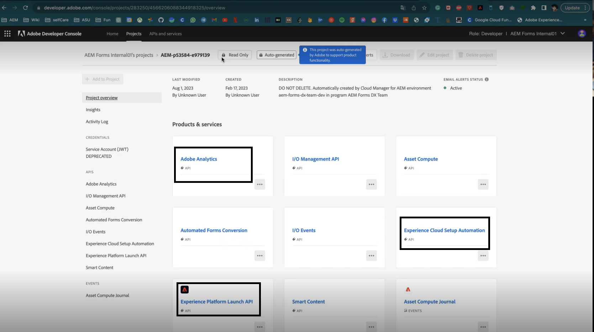

# 使用Experience Cloud设置自动为自适应表单启用Adobe Analytics {#integrate-adobe-analytics-to-aem-forms-with-experience-cloud-setup-automation}

 这是预发行功能，可通过我们的 [预发行渠道](https://experienceleague.adobe.com/docs/experience-manager-cloud-service/content/release-notes/prerelease.html#new-features). 

Experience Cloud设置自动化有助于将Adobe Analytics连接到Adaptive Forms，后者有助于跟踪和分析用户与您的表单的交互，并提供有关访客交互和参与情况的见解。 Experience Cloud设置自动化还有助于监控表单性能，其中涉及评估完成时间和流失点等指标。 此分析有助于优化表单以获得更好的用户体验，同时根据登录状态（例如，匿名用户）区分用户行为以确定一般趋势和模式。

## 将Adobe Analytics与自适应Forms集成的优势 {#advantages-of-integrating-adobe-analytics-with-aem-forms}

* **对最终用户行为的洞察**：Adobe Analytics有助于深入了解最终用户行为，揭示用户操作、流失和完成率，从而更深入地了解个人与表单的互动方式。
* **使非技术性业务用户获得见解**：Adobe Analytics通过其易于使用的界面，甚至非技术用户也可以访问和解释表单使用数据，从而促进数据驱动型决策以增强注册体验。
* **根据使用情况优化数据捕获体验**：组织可以轻松识别数据捕获中的棘手问题，从而实现有针对性的改进，从而提高表单可用性并增加成功提交次数。

## 自适应Forms使用量度的范围 {#scope-of-adaptive-forms-usage-metrics}

Adobe Analytics提供了一系列全面的自适应Forms性能指标，旨在提供有关表单使用的宝贵见解。 这些指标包括：

* **表单呈现、表单提交、验证错误和独特访客**，以便您评估表单的使用情况和有效性。

* **访客分析** 其中包括访问和提交频率以及独特访客计数，从而全面了解表单受众。

* **设备类型** 此数据会通知您用户用于访问表单的设备。

* **地理细分** 显示表单用户的区域分布。

* **流量源** 和 **常用表单** 量度由顶级反向链接域和最常访问的表单组成，可帮助您了解流量的来源地以及哪些表单最受欢迎。

* **热门表单上的用户活动** 提供对字段访问、表单演绎版、验证错误、放弃的表单和表单提交的见解，允许您分析用户行为。

* **表单逗留时间的时间线** 它提供了基于时间线的用户参与表单情况视图。

* **需要访客帮助的区域** 量度包括帮助视图、验证错误实例和字段访问频率，突出显示用户在填写表单时可能需要帮助的位置。

{width="100%"}

有关每个指标的详细信息，请访问 [查看和了解AEM Forms Analytics报表](/help/forms/view-understand-aem-forms-analytics-reports.md)

## 前提条件 {#prerequisites}

<!--
Analytics, Data Collection (Formerly Adobe Launch), and Experience Manager (experience.adobe.com)
-->

Adobe Experience Manager Forms中的Experience Cloud设置自动化需要 **Adobe Analytics许可证**， **数据收集(以前称为Adobe Launch)** 以管理跟踪脚本，并与 **Experience Platform Launch(API)** 以简化数据聚合和见解生成。

如果您拥有Experience Cloud设置自动化、Adobe Analytics和Experience Platform LaunchAPI的有效许可证，则应在开发人员控制台中验证其可用性。

要验证上述内容是否可用于您的Formsas a Cloud Service环境，请访问 [开发人员控制台](https://developer.adobe.com/console/projects)，导航到项目并使用项目ID搜索项目，例如，使用URL搜索环境 `https://author-p45913-e175111-cmstg.adobeaemcloud.com/index.html`，项目ID为 `p45913-e175111`. 确保列出了Experience Cloud设置自动化、Adobe Analytics和Experience Platform LaunchAPI。 如果列出了这些扩展，则可为自适应Forms启用Adobe Analytics。

{width="100%"}

<!-- 
>[!NOTE]
> If you have an active licenses for Experience Cloud Setup Automation, Adobe Analytics, and Experience Platform Launch API, you should verify their availability within your developer console.
-->

<!-- For more information about your available integrations, see [troubleshooting Adaptive Forms with Analytics Integration](https://experienceleague.adobe.com/docs/experience-manager-65/forms/integrate-aem-forms-with-experience-cloud-solutions/view-understand-aem-forms-analytics-reports.html)
-->

## 配置Adobe Analytics {#configure-adobe-analytics}

执行以下列出的步骤可为自适应Forms启用和配置Adobe Analytics：

* [为基于基础组件的自适应Forms启用Adobe Analytics](#integrate-adobe-analytics-with-aem-forms-for-foundation-component)
* [基于核心组件为自适应Forms启用Adobe Analytics](#integrate-adobe-analytics-with-aem-forms-for-core-components)

### 通过自适应Forms for Foundation组件启用Adobe Analytics {#integrate-adobe-analytics-with-aem-forms-for-foundation-component}

1. 为云服务创建配置容器：
   1. 转到 **[!UICONTROL “工具”>“常规”>“配置浏览器”]**.
   1. 选择或创建配置容器，然后启用文件夹 **[!UICONTROL 云配置]**.
   1. 点按 **[!UICONTROL 保存并关闭]** 保存配置并退出对话框。
1. 在您的AEM实例上，转到 **[Forms]** >> **[Forms和文档]**.
1. 选择您的 **[!UICONTROL 表单]** >> **[!UICONTROL 属性]**，在 **[!UICONTROL 配置容器]**，选择您在中创建或选择的配置容器 **[!UICONTROL 配置浏览器]** 步骤1.
1. 在左边栏中选择任务面板，然后单击 **设置Analytics** 和 **激活Adobe Analytics**.
1. 提供您喜欢的报表包名称，单击 **[!UICONTROL 下一个]** 和 **[!UICONTROL 保存]**.
1. 保存项目后，安装程序将运行一段时间，直到Adobe Analytics与自适应表单集成，您还可以检查 **集成状态**.

   >[!NOTE]
   >
   >如果您的设置超过15分钟，请重试为表单启用分析。

1. 在您的AEM实例上，转到 **[!UICONTROL Forms]** >> **[Forms和文档]** 并选择您的 **[!UICONTROL 表单]**，您会看到Adobe Analytics已集成到您的表单中，如下图所示。
1. 现在，您可以查看 [自适应表单Adobe Analytics报表](#view-adobe-analytics-report).

{width="100%"}

### 为核心组件启用具有自适应Forms的Adobe Analytics {#integrate-adobe-analytics-with-aem-forms-for-core-components}

1. 在您的AEM实例上，转到 **[!UICONTROL Forms]** >> **[!UICONTROL Forms和文档]** 并选择您的 **[!UICONTROL 表单]**.
1. 选择左侧的任务面板，然后单击 **设置Analytics** 和 **激活Adobe Analytics**.
1. 提供您喜欢的报表包名称，单击 **[!UICONTROL 下一个]** 和 **[!UICONTROL 保存]**.
1. 保存项目后，安装程序将运行一段时间，直到Adobe Analytics与自适应表单集成，您还可以检查 **集成状态**.

   >[!NOTE]
   >
   >如果您的设置超过15分钟，请重试为表单启用分析。

1. 在您的AEM实例上，转到 **[!UICONTROL Forms]** >> **[!UICONTROL Forms和文档]** 并选择您的 **[!UICONTROL 表单]**，您会看到Adobe Analytics已集成到您的表单中。
1. 现在，您可以查看 [自适应表单Adobe Analytics报表](#view-adobe-analytics-report).

## 查看自适应Forms Adobe Analytics报表 {#view-adobe-analytics-report}

1. 在您的AEM实例上，转到 **[!UICONTROL Forms]** >> **[!UICONTROL Forms和文档]**.
1. 选择您的表单，您会看到Adobe Analytics已集成（如左图所示）到为Adobe Analytics激活的Forms。

   {width="100%"}

1. 单击 **Adobe Analytics** 查看报表和分析性能数据。

要使用手动方法连接自适应表单与Adobe Analytics，请访问 [将AEM Forms与Adobe Analytics集成](/help/forms/integrate-aem-forms-with-adobe-analytics.md).
