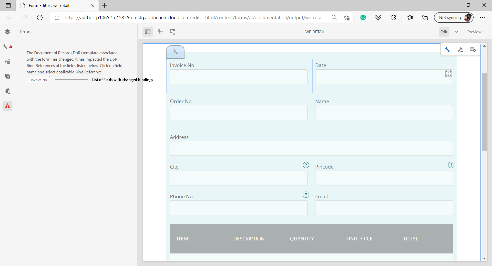

# 为自适应表单生成记录文档

<span class="preview"> Adobe建议使用现代化的、可扩展的数据捕获 [核心组件](https://experienceleague.adobe.com/docs/experience-manager-core-components/using/adaptive-forms/introduction.html) 对象 [创建新的自适应Forms](/help/forms/creating-adaptive-form-core-components.md) 或 [将自适应Forms添加到AEM Sites页面](/help/forms/create-or-add-an-adaptive-form-to-aem-sites-page.md). 这些组件在创建自适应Forms方面实现了重大进步，确保了令人印象深刻的用户体验。 本文介绍了使用基础组件创作自适应Forms的旧方法。 </span>


| 版本 | 文章链接 |
| -------- | ---------------------------- |
| AEM 6.5 | [单击此处](https://experienceleague.adobe.com/docs/experience-manager-65/forms/adaptive-forms-advanced-authoring/generate-document-of-record-for-non-xfa-based-adaptive-forms.html) |
| AEM as a Cloud Service | 本文 |

## 概述 {#overview}

填写或提交表单时，您可以以打印或文档格式保留表单记录。 此记录称为记录文档(DoR)。 它是已提交表单的便于打印的副本。 您还可以参考记录文档，以了解客户在以后日期填写的信息，或者使用记录文档以PDF格式将表单和内容存档在一起。


要创建记录文档，基于XFA或Acroform的模板将与通过自适应表单收集的数据合并。 您可以自动或根据需要生成记录文档。
“按需”选项允许您指定基于XFA或Acroform的自定模板，为记录文档提供自定义外观。

您可以：

* [生成基于XFA的记录文档](#generate-an-XFA-based-document-of-record)
* [生成基于Acroform(Acrobat表单PDF)的记录文档](#generate-an-Acroform-based-document-of-record)
* [自动生成记录文档](#auto-generate-a-document-of-record)

## 开始之前 {#components-to-automatically-generate-a-document-of-record}

在开始学习并准备记录文档所需的资产之前：

**基本模板：** 在Forms Designer或Acrobat表单(AcroForm)中创建的XFA模板（XDP文件）。 [基本模板](#base-template-of-a-document-of-record) 用于指定记录文档的样式和品牌信息。 在之前将您的XFA模板（XDP文件）上传到您的AEM Forms实例

**自适应表单：** 要为其生成记录文档的自适应表单。

## 生成基于XFA的记录文档 {#generate-an-XFA-based-document-of-record}

将您的XFA模板（XDP文件）上传到AEM Forms实例。 执行以下步骤来配置自适应表单，以使用XFA模板（XDP文件）作为记录文档的模板：

1. 在Experience Manager创作实例中，单击 **[!UICONTROL Forms]** > **[!UICONTROL Forms和文档].**
1. 选择表单，然后单击 **[!UICONTROL 属性]**.
1. 在“属性”窗口中，点按 **[!UICONTROL 表单模型]**.
1. 在  **[!UICONTROL 表单模型]** 选项卡，在 **[!UICONTROL 选择自]** 下拉列表，选择 **[!UICONTROL 架构]** 或 **[!UICONTROL 无]**. 您还可以在创建表单时选择表单模型。
1. 在表单模型选项卡的记录文档模板配置部分中，选择 **将表单模板关联为记录文档模板**. 选择此选项时，将显示计算机上可用的所有XFA模板（XDP文件）。 选择适当的文件。 此外，请确保自适应表单和选定的XFA模板（XDP文件）使用相同的架构（数据架构）。
1. 单击 **[!UICONTROL 完成。]**

您的自适应表单现在配置为使用XDP文件作为记录文档的模板。 接下来的步骤是 [将自适应表单组件与相应的模板字段绑定](#bind-adaptive-form-components-with-template-fields).

## 生成基于Acroform的记录文档 {#generate-an-Acroform-based-document-of-record}

将您的Adobe AcrobatPDF(Acroform)上传到AEM Forms实例。 执行以下步骤来配置自适应表单，以使用Adobe AcrobatPDF(Acroform)作为记录文档的模板：

1. 在Experience Manager创作实例中，单击 **[!UICONTROL Forms]** > **[!UICONTROL Forms和文档].**
1. 选择表单，然后单击 **[!UICONTROL 属性]**.
1. 在“属性”窗口中，点按 **[!UICONTROL 表单模型]**.
1. 在  **[!UICONTROL 表单模型]** 选项卡，在 **[!UICONTROL 选择自]** 下拉列表，选择 **[!UICONTROL 架构]** 或 **[!UICONTROL 无]**. 您还可以在创建表单时选择表单模型。
1. 在表单模型选项卡的记录文档模板配置部分中，选择 **将表单模板关联为记录文档模板**. 选择此选项后，将显示计算机上可用的所有AcrobatPDF(Acroform)。 选择适当的文件。
1. 单击 **[!UICONTROL 完成。]**

您的自适应表单现在配置为使用Acroform作为记录文档的模板。 接下来的步骤是 [将自适应表单组件与相应的模板字段绑定](#bind-adaptive-form-components-with-template-fields).

## 自动生成记录文档 {#auto-generate-a-document-of-record}

将自适应表单配置为自动生成记录文档时，每次更改表单时，都会立即更新其记录文档。 例如，如果从现有自适应表单中移除字段，则相应的字段也会被移除，并且在记录文档中不可见。 自动生成记录文档还有许多其他优点。 : 

* 表单开发人员不必手动维护数据绑定。 自动生成的记录文档负责数据绑定相关更新。
* 表单开发人员不必手动隐藏标记为从记录文档排除的字段。 自动生成的记录文档预配置为排除此类字段。
* 自动生成的记录文档选项节省了为记录文档创建表单模板所需的时间。
* “自动生成的记录文档”选项允许您使用不同的基本模板来使用不同的样式和外观。 它有助于为您的组织的记录文档选择最佳样式和外观。 如果不指定样式，系统样式将设置为默认值。
* 自动生成的记录文档确保表单中的任何更改都立即反映在记录文档中。

执行以下步骤来配置自适应表单以自动生成记录文档：

1. 在Experience Manager创作实例中，单击 **[!UICONTROL Forms]** > **[!UICONTROL Forms和文档].**
1. 选择表单，然后单击 **[!UICONTROL 属性]**.
1. 在“属性”窗口中，点按 **[!UICONTROL 表单模型]**.
1. 在  **[!UICONTROL 表单模型]** 选项卡，在 **[!UICONTROL 选择自]** 下拉列表，选择 **[!UICONTROL 架构]** 或 **[!UICONTROL 无]**. 您还可以在创建表单时选择表单模型。
1. 在表单模型选项卡的记录文档模板配置部分中，选择 **生成记录文档**.
1. 单击 **[!UICONTROL 完成。]**

## 将自适应表单组件与模板字段绑定 {#bind-adaptive-form-components-with-template-fields}

将自适应表单字段与模板字段绑定以在相应的记录文档字段显示捕获的表单数据。 要将自适应表单组件与相应的记录文档模板字段绑定，请执行以下操作：

1. 打开自适应表单，配置为使用自定义表单模板进行编辑。

1. 选择一个自适应表单组件，然后单击打开配置  图标。 它会打开属性浏览器。

1. 在属性浏览器中，浏览并选择字段。

   * （对于AcroForm模板） **[!UICONTROL 记录文档绑定引用字段]** 属性。
   * （对于XFA模板） **[!UICONTROL 数据模型绑定引用]** 属性。

1. 单击“**[!UICONTROL 保存]**”。

<!-- 
In the following video Adaptive Form components are binded with corresponding Acroform template fields and the Document of Record is sent as an email attachment.
-->

您可以将“发送电子邮件”、“Experience Manager工作流”提交操作与 [记录文档步骤和其他提交操作](configuring-submit-actions.md) 以接收记录文档。

## 记录文档模板的增量更新 {#document-of-record-template-incremental-updates}

自适应表单和相应的记录文档模板可能会随着时间的推移而不断变化。 您可以选择向自适应表单或记录文档模板添加、删除或修改字段。

当您更改记录文档模板并将更改的记录文档模板上载到AEM Forms时，自适应Forms编辑器会自动检测更改的绑定，并通知您有关需要新绑定的自适应表单组件。 它允许您对记录文档模板进行增量更新。

例如，组织、 *We.Retail*，具有基于AcroForm的记录文档模板， *we-retail-invoice.pdf*. 该模板如下所示：


在使用模板一段时间后，组织决定重命名 `invoice-number` 字段至 `bill-number` 字段和捕获购买者的电子邮件地址。 开发人员更新以下项目的名称： `invoice-number` 字段，并将电子邮件字段添加到模板。 他还创建了一个名为的新版本的模板  *we-retail-invoice-v2.pdf*.


开发人员上传更新后的模板并将其应用于自适应表单。 自适应表单自动检测并显示绑定已更改的字段列表。



表单开发人员将自适应Forms字段与相应的记录文档模板绑定。
>[!VIDEO](assets/we-retail-binding.mp4)

现在，提交自适应表单时，会创建更新的记录文档。


## 使用记录文档时的主要注意事项 {#key-considerations-when-working-with-document-of-record}

处理自适应Forms的记录文档时，请牢记以下注意事项和限制。

* 记录文档模板不支持富文本。 因此，静态自适应表单中或最终用户填写的信息中的任何富文本都会在记录文档中显示为纯文本。
* 自适应表单中的文档片段未出现在记录文档中。 但是，支持自适应表单片段。
* 不支持为基于XML架构的自适应表单生成的记录文档中的内容绑定。
* 当用户请求呈现记录文档时，记录文档的本地化版本是应区域设置要求创建的。 记录文档的本地化伴随着自适应表单的本地化。 <!-- For more information on localization of Document of Record and Adaptive Forms see Using AEM translation workflow to localize Adaptive Forms and Document of Record.-->

<!-- ## Configure an adaptive form to generate  Document of Record {#adaptive-form-types-and-their-documents-of-record}

While creating an adaptive form, in the Form Model tab of Adaptive Form properties, select one the following option: 

* **None**
  Select the option to create an Adaptive Form without a form model. When the option is selected, the Document of Record is automatically generated for your Adaptive Form.

* **[Associate form template as a Document of Record template](creating-adaptive-form.md#create-an-adaptive-form-based-on-an-xfa-form-template)**
  
  Select the option to use an XFA Form as a template for Document of Record. 

* **[Generate Document of Record](creating-adaptive-form.md#create-an-adaptive-form-based-on-xml-or-json-schema)**
  Select the option to use an XFA Form as a template. When the option is selected, the Document of Record is automatically generated for your Adaptive Form. When you use an XML schema as a template for an Adaptive Form, ensure that the adaptive form and associated XFA Form use the same XML schema as your Adaptive Form
  

When you select a form model, configure Document of Record using options available under Document of Record Template Configuration. See [Document of Record Template Configuration](#document-of-record-template-configuration). -->

## 自适应表单元素映射 {#mapping-of-adaptive-form-elements}

下表介绍了自适应表单组件和相应的XFA组件，以及这些组件是否显示在记录文档中。

### 字段 {#fields}

<table>
 <tbody>
  <tr>
   <th>自适应表单组件</th>
   <th>对应的XFA组件</th>
   <th>默认情况下包含在记录文档模板中？</th>
   <th>注释</th>
  </tr>
  <tr>
   <td>按钮</td>
   <td>按钮</td>
   <td>false</td>
   <td> </td>
  </tr>
  <tr>
   <td>复选框</td>
   <td>复选框</td>
   <td>true</td>
   <td> </td>
  </tr>
  <tr>
   <td>日期选取器</td>
   <td>日期/时间字段</td>
   <td>true</td>
   <td> </td>
  </tr>
  <tr>
   <td>下拉列表</td>
   <td>下拉列表</td>
   <td>true</td>
   <td> </td>
  </tr>
  <tr>
   <td>潦草签名</td>
   <td>签名涂鸦</td>
   <td>true</td>
   <td> </td>
  </tr>
  <tr>
   <td>数值框</td>
   <td>数值字段</td>
   <td>true</td>
   <td> </td>
  </tr>
  <tr>
   <td>密码框</td>
   <td>密码字段</td>
   <td>false</td>
   <td> </td>
  </tr>
  <tr>
   <td>单选按钮</td>
   <td>单选按钮</td>
   <td>true</td>
   <td> </td>
  </tr>
  <tr>
   <td>文本框</td>
   <td>文本字段</td>
   <td>true</td>
   <td> </td>
  </tr>
  <tr>
   <td>“重置”按钮</td>
   <td>“重置”按钮</td>
   <td>false</td>
   <td> </td>
  </tr>
  <tr>
   <td>“提交”按钮</td>
   <td><p>电子邮件提交按钮</p> <p>HTTP提交按钮</p> </td>
   <td>false</td>
   <td> </td>
  </tr>
  <tr>
   <td>条款和条件</td>
   <td> </td>
   <td>true</td>
   <td> </td>
  </tr>
  <tr>
   <td>文件附件</td>
   <td> </td>
   <td>false</td>
   <td>在记录文档模板中不可用。 仅通过附件在记录文档中可用。</td>
  </tr>
 </tbody>
</table>

### 容器 {#containers}

<table>
 <tbody>
  <tr>
   <th>自适应表单组件</th>
   <th>对应的XFA组件</th>
   <th>注释</th>
  </tr>
  <tr>
   <td>面板<br /> </td>
   <td>子表单<br /> </td>
   <td>可重复面板映射到可重复的子表单。</td>
  </tr>
 </tbody>
</table>

### 静态组件 {#static-components}

| 自适应表单组件 | 对应的XFA组件 | 注释 |
|---|---|---|
| 图像 | 图像 | 对于基于XSD的自适应表单，TextDraw和Image组件（无论已绑定还是未绑定）始终显示在记录文档中，除非使用记录文档设置进行排除。 |
| 文本 | 文本 |

### 表 {#tables}

自适应Forms表组件（如页眉、页脚和行）映射到相应的XFA组件。 可将可重复面板映射到记录文档中的表格。

## 记录文档的基础模板 {#base-template-of-a-document-of-record}

基本模板为记录文档提供样式和外观信息。 它允许您自定义自动生成的记录文档的默认外观。 例如，您可以使用基本模板在记录文档的页眉中添加公司徽标并在页脚中添加版权信息。

与基础模板的主控页面用作记录文档模板的主控页面。 主控页面可以包含可应用于记录文档的页眉、页脚和页码等信息。 您可以使用基本模板将此类信息应用于记录文档，以自动生成记录文档。 使用基本模板可以更改字段的默认属性。

始终关注 [基本模板约定](#base-template-conventions) 当您设计基础模板时。

## 基本模板约定 {#base-template-conventions}

基本模板用于定义记录文档的页眉、页脚、样式和外观。 页眉和页脚可以包含公司徽标和版权文本等信息。 复制基本模板中的第一个主控页面并将其用作记录文档的主控页面，该页面包含页眉、页脚、页码或应显示在记录文档所有页面上的任何其他信息。 如果您使用不符合基础模板约定的基础模板，则基础模板中的第一个主控页面仍会用于记录文档模板中。 强烈建议您按照其惯例设计基础模板，并将其用于自动生成记录文档。

**主控页面惯例**

* 在基本模板中，将根子表单命名为 `AF_METATEMPLATE` 主控页面为 `AF_MASTERPAGE`.

* 名为的主控页面 `AF_MASTERPAGE` 位于 `AF_METATEMPLATE` 根子表单最好用于提取页眉、页脚和样式信息。

* 如果 `AF_MASTERPAGE` 不存在，则使用基本模板中存在的第一个主控页面。

**字段的样式约定**

* 要对记录文档中的字段应用样式，基本模板提供位于 `AF_FIELDSSUBFORM` subfrom位于 `AF_METATEMPLATE` 根子表单。

* 这些字段的属性应用于记录文档中的字段。 这些字段应遵循 `AF_<name of field in all caps>_XFO` 命名约定。 例如，复选框的字段名称应为 `AF_CHECKBOX_XFO`.

要创建基本模板，请在Forms Designer中执行以下操作。

1. 单击 **[!UICONTROL 文件]** > **[!UICONTROL 新]**.
1. 选择 **[!UICONTROL 基于模板]** 选项。

1. 选择 **[!UICONTROL Forms — 记录文档]** 类别。
1. 选择 **[!UICONTROL DoR基本模板]**.
1. 单击 **[!UICONTROL 下一个]** 并提供所需信息。

1. （可选）修改要应用于记录文档中的字段的样式和外观。
1. 保存表单。

您现在可以将保存的表单用作记录文档的基础模板。 请勿修改或删除基本模板中存在的任何脚本。

**修改基本模板**

* 如果不对基础模板中的字段应用任何样式，则建议从基础模板中删除这些字段，以便自动获取对基础模板的任何升级。
* 修改基本模板时，请勿删除、添加或修改脚本。

请严格遵循上述约定和说明来设计基本模板。

## 自定义记录文档中的品牌信息 {#customize-the-branding-information-in-document-of-record}

生成记录文档时，您可以在记录文档选项卡上更改记录文档的品牌信息。 “记录文档”选项卡包括如下选项：徽标、外观、布局、页眉和页脚、免责声明，以及是否包括未选定的复选框和单选按钮选项。

要本地化您在“记录文档”选项卡中输入的品牌信息，请确保正确设置了浏览器的区域设置。 要自定义记录文档的品牌信息，请执行以下步骤：

1. 在记录文档中选择一个面板（根面板），然后点按 .
1. 点按 . 此时将显示记录文档选项卡。
1. 选择用于呈现记录文档的默认模板或自定义模板。 如果选择默认模板，则记录文档的缩略图预览将显示在“模板”下拉列表下方。
1. 根据您选择的是默认模板还是自定义模板，以下部分或全部属性将出现在“记录文档”选项卡中。 指定以下所述属性以定义记录文档的外观：

   1. **基本属性**:
      * **模板**：如果选择选择自定义模板，请浏览并在中选择XDP [!DNL AEM Forms] 服务器。 如果要使用的模板尚未在 [!DNL AEM Forms] 服务器，您应该首先将XDP上传到 [!DNL AEM Forms] 服务器。
      * **重点颜色**：标题文本和分隔行在文档或记录PDF中呈现的颜色。
      * **字体系列**：记录文档PDF中文本的字体系列。
      * **包括未绑定到数据模型的表单对象**：设置属性后，记录文档中包含来自基于架构的自适应表单的未绑定字段。
      * **从记录文档排除隐藏字段**：设置属性可标识要从记录文档中排除的隐藏字段。
      * **隐藏面板描述**：设置属性会从记录文档中排除面板/表的描述。 适用于面板和表格。

      

   1. **表单字段属性**:
      * **对于复选框和单选按钮组件，仅显示选定的值**：设置属性，则在中仅显示复选框和单选按钮的选定值 [!UICONTROL 记录文档].
      * **多个值的分隔符**：您可以选择任意分隔符（如逗号或换行符）来显示多个值。
      * **选项对齐方式**：您可以选择所需的对齐方式（水平、垂直、与自适应表单相同）来设置要显示的复选框或单选按钮等字段的对齐方式 [!UICONTROL 记录文档]. 默认情况下，中的字段会设置垂直对齐方式 [!UICONTROL 记录文档]. 从设置属性 [!UICONTROL 表单字段属性] DoR的属性会覆盖 [!UICONTROL 项目对齐方式] 用于自适应表单上的字段。 如果是，您选择 [!UICONTROL 与自适应表单相同] 选项，自适应表单创作实例中配置的对齐方式用于 [!UICONTROL 记录文档] 字段。
      * **水平对齐选项的数量**：您可以为水平对齐设置要在记录文档上显示的选项数量。

      

   1. **母版页  属性**:
      * **徽标图像**：您可以选择使用自适应表单中的徽标图像、从DAM中选择徽标图像，或从您的计算机上传徽标图像。
      * **表单标题**：记录文件的标题。
      * **标题文本**：在记录文档的标题部分显示的文本。
      * **免责声明标签**：免责声明的标签。
      * **免责声明**：指定记录文档上权利和义务范围的文本。
      * **免责声明文本**：免责声明文本。

      

   >[!NOTE]
   >
   >如果您使用的自适应表单模板是使用6.3之前的Designer版本创建的，为了使重色和字体系列属性正常工作，请确保根子表单下的自适应表单模板中存在以下内容：

   ```xml
   <proto>
   <font typeface="Arial"/>
   <fill>
   <color value="4,166,203"/>
   </fill>
   <edge>
   <color value="4,166,203"/>
   </edge>
   </proto>
   ```

1. 要保存品牌更改，请点按 **[!UICONTROL 完成]**.

## 自适应表单编辑器中的记录文档支持 {#dor-support-in-adaptiveform}

您可以配置 [!UICONTROL 记录文档] 自适应表单编辑器或自适应表单模板编辑器中的模板。

从自适应表单编辑器的创作实例中执行以下步骤：

1. 选择 **[!UICONTROL 自适应表单容器（根）]** 组件。
1. 单击  图标以打开 **[!UICONTROL 属性]** 自适应表单容器的。
1. 打开 **[!UICONTROL 记录文档模板]** 选项卡并从以下选项中进行选择：
   * **[!UICONTROL 无]**：选中此选项后，否 [!UICONTROL 记录文档] 为自适应表单创建的模板。

   * **[!UICONTROL 将表单模板关联为记录文档模板]**：选择此选项时，XFA表单将用作记录文档的模板。

   * **[!UICONTROL 生成记录文档]**：如果选择此选项，则 [!UICONTROL 记录文档] 模板是为您的自适应表单自动生成的。

1. 点按  以保存属性。


>[!NOTE]
>
>时间 [!UICONTROL 记录文档] 模板是使用自适应表单模板编辑器创建的，因此下只有两个选项可用 [!UICONTROL 记录文档模板] 制表符为 [!UICONTROL 无] 和 [!UICONTROL 生成记录文档].

## 记录文档中面板的表格和列布局 {#table-and-column-layouts-for-panels-in-document-of-record}

您的自适应表单可能很长，包含多个表单字段。 您可能不希望将记录文档另存为自适应表单的精确副本。 现在，您可以选择表格或列布局，以便在记录文档PDF中保存一个或多个自适应表单面板。

在生成记录文档之前，在面板的设置中，选择该面板的记录文档的布局（表格或列）。 面板中的字段在记录文档中相应组织。


面板中的字段以记录文档中的表布局渲染


面板中的字段在记录文档的列布局中渲染

## 记录文档设置 {#document-of-record-settings}

记录文档设置允许您选择要包含在记录文档中的选项。 例如，银行接受表单中的姓名、年龄、社会保险号码和电话号码。 该表单会生成银行帐号和分行详细信息。 您可以选择在记录文档中仅显示名称、社会保险编号、银行帐户和分行详细信息。

记录文档组件的设置在其属性下可用。 要访问组件的属性，请选择该组件并单击  在叠加图中。 这些属性列在侧栏中，您可以在其中找到以下设置。

**字段级别设置**

* **从记录文档排除**：将属性设置为true会从记录文档中排除字段。 这是名为的可编写脚本的属性 `excludeFromDoR`. 其行为取决于 **如果隐藏，则从记录文档排除字段** 表单级别属性。

* **将面板显示为表格：** 如果面板中的字段少于6个，则设置属性后，面板会在记录文档中显示为表格。 仅适用于面板。
* **从记录文档排除标题：** 设置属性会从记录文档中排除面板/表的标题。 仅适用于面板和表格。
* **从记录文档排除描述：** 设置属性会从记录文档中排除面板/表的描述。 仅适用于面板和表格。

**表单级别设置**

* **包括DoR中未绑定字段：** 设置属性后，记录文档中包含来自基于架构的自适应表单的未绑定字段。 默认情况下，它为true。
* **如果隐藏，则从DoR排除字段：** 设置属性以在表单提交时从记录文档排除隐藏字段。 当您启用时 [在服务器上重新验证](/help/forms/configuring-submit-actions.md#server-side-revalidation-in-adaptive-form-server-side-revalidation-in-adaptive-form)，服务器会重新计算隐藏字段，然后再从记录文档排除这些字段。

## 使用自定义XCI文件

XCI文件可帮助您设置文档的各种属性。 Formsas a Cloud Service有一个主控的XCI文件。 您可以使用自定义XCI文件覆盖主控XCI文件中指定的一个或多个默认属性。 例如，您可以选择将字体嵌入文档或为所有文档启用标记属性。 下表指定了XCI选项：

| XCI选项 | 描述 |
|--- |--- |
| config/present/pdf/creator | 使用“文档信息”词典中的“创建者”条目标识文档创建者。 有关此词典的信息，请参见 [PDF参考指南](https://opensource.adobe.com/dc-acrobat-sdk-docs/acrobatsdk/). |
| config/present/pdf/producer | 使用文档信息词典中的制作者条目标识文档制作者。 有关此词典的信息，请参见 [PDF参考指南](https://opensource.adobe.com/dc-acrobat-sdk-docs/acrobatsdk/). |
| config/present/layout | 控制输出是单个面板还是分页。 |
| config/present/pdf/compression/level | 指定生成PDF文档时使用的压缩程度。 |
| config/present/pdf/fontInfo/embed | 控制输出文档中的字体嵌入。 |
| config/present/pdf/scriptModel | 控制输出PDF文档中是否包含XFA特定的信息。 |
| config/present/common/data/adjustData | 控制XFA应用程序在合并后是否调整数据。 |
| config/present/pdf/renderPolicy | 控制页面内容的生成是在服务器上完成还是延迟到客户端。 |
| config/present/common/locale | 指定输出文档中使用的默认区域设置。 |
| config/present/destination | 当由当前元素包含时，指定输出格式。 当由openAction元素包含时，指定在交互式客户端中打开文档时要执行的操作。 |
| config/present/output/type | 指定要应用于文件的压缩类型或要生成的输出类型。 |
| config/present/common/temp/uri | 指定表单URI。 |
| config/present/common/template/base | 在窗体设计中提供URI的基本位置。 当此元素不存在或为空时，将使用窗体设计的位置作为基础。 |
| config/present/common/log/to | 控制日志数据或输出数据写入的位置。 |
| config/present/output/to | 控制日志数据或输出数据写入的位置。 |
| config/present/script/currentPage | 指定文档打开时的初始页面。 |
| config/present/script/exclude | 通知Formsas a Cloud Service要忽略哪些事件。 |
| config/present/pdf/linearized | 控制输出PDF文档是否线性化。 |
| config/present/script/runScripts | 控制Formsas a Cloud Service执行的脚本集。 |
| config/present/pdf/tagged | 控制标签在输出PDF文档中的包含。 在PDF上下文中，标记是文档中包含的其他信息，用于公开文档的逻辑结构。 标记有助于辅助功能和重新格式化。 例如，页码可能会被标记为工件，这样屏幕阅读器就不会在文本中间朗读它。 尽管标记使文档更加有用，但它们也会增加文档的大小和创建文档所需的处理时间。 |
| config/present/pdf/fontInfo/alwaysEmbed | 指定嵌入到输出文档中的字体。 |
| config/present/pdf/fontInfo/neverEmbed | 指定不得嵌入到输出文档中的字体。 |
| config/present/pdf/pdfa/part | 指定文档符合的PDF/A规范的版本号。 |
| config/present/pdf/pdfa/amd | 指定PDF/A规范的修订级别。 |
| config/present/pdf/pdfa/conformance | 指定符合PDF/A规范的级别。 |
| config/present/pdf/version | 指定要生成的PDF文档的版本 |
| config/present/pdf/version/map | 指定文档的回退字体 |

### 在Formsas a Cloud Service环境中使用自定义XCI文件

1. 将自定义XCI文件添加到开发项目中。
1. 指定以下内容 [内联属性](/help/implementing/deploying/configuring-osgi.md)：

   ```JSON
    {
     "xciFilePath": "[path of XCI file]"
    }
   ```

   例如，

   ```JSON
    {
     "xciFilePath": "/content/dam/formsanddocuments/customMinionProBoldAndTagged.xci"
    }
   ```

1. 将项目部署到您的Cloud Service环境。

### 在本地Formsas a Cloud Service开发环境中使用自定义XCI文件

1. 将XCI文件上传到您的本地开发环境。
1. 打开Cloud ServiceSDK配置管理器。 默认URL为： <http://localhost:4502/system/console/configMgr>.
1. 找到并打开 **[!UICONTROL 自适应Forms和交互式通信Web渠道]** 配置。
1. 指定XCI文件的路径，然后单击 **[!UICONTROL 保存]**.
