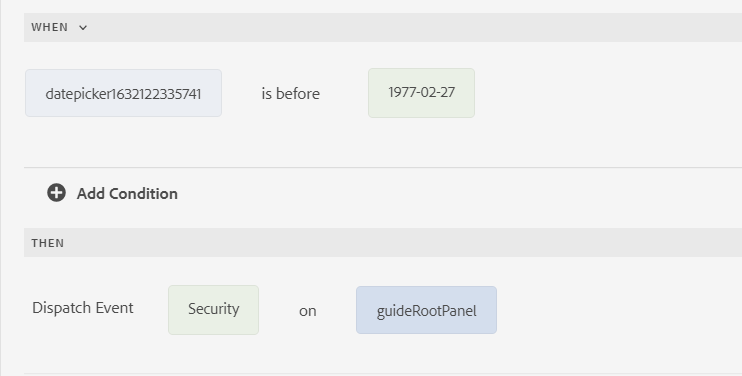

# 将AEM Forms与[!DNL Adobe Analytics]集成 {#integrate-aem-forms-with-adobe-analytics}

| 版本 | 文章链接 |
| -------- | ---------------------------- |
| AEM 6.5 | [单击此处](https://experienceleague.adobe.com/docs/experience-manager-65/forms/integrate-aem-forms-with-experience-cloud-solutions/configure-analytics-forms-documents.html) |
| AEM as a Cloud Service | 本文 |

<span class="preview">本文档概述了在自适应表单上启用Adobe Analytics的手动过程。 但是，Adobe建议使用[通过Experience Cloud设置自动化为自适应表单启用Adobe Analytics](/help/forms/enable-adobe-analytics-adaptive-form-using-experience-cloud-setup-automation.md)。</span>

AEM Forms与[Adobe Analytics](https://experienceleague.adobe.com/docs/analytics-learn/tutorials/overview.html?lang=en)集成，允许您捕获和跟踪已发布表单的性能指标。 分析这些量度背后的目标是使商业用户能够洞察最终用户行为并优化数据捕获体验。 您可以通过Adobe Analytics for Adaptive Forms捕获和跟踪已登录和未登录（匿名）用户的行为。

执行本文中提到的操作后，您可以在[!DNL Adobe Analytics]中配置和查看报表，如以下视频所示：

>[!VIDEO](https://video.tv.adobe.com/v/337262)

您可以使用[!DNL Adobe Analytics]来发现用户在使用自适应表单时遇到的交互模式和问题。 [!DNL Adobe Analytics]开箱即用地跟踪和存储有关以下事件的信息：

* **渲染**：表单被打开的次数。

* **提交**：提交表单的次数。

* **放弃**：用户未完成表单而离开的次数。

* **错误**：在面板和面板的字段中遇到的错误数。

* **帮助**：用户打开面板帮助和面板字段的次数。

* **字段访问**：用户访问表单中的字段的次数。

* **保存**：用户将表单保存到Forms门户的次数。

除了这些开箱即用的事件之外，您还可以使用规则编辑器在自适应表单中定义自定义事件，并将这些事件映射到[!DNL Adobe Analytics]中的事件

下图说明了在[!DNL Adobe Analytics]中查看报告之前需要执行的操作：


## 1.配置[!DNL Adobe Analytics] {#Configure-adobe-analytics}

在配置[!DNL Adobe Analytics]之前，创建：

* 用于登录到[Adobe Experience Cloud](https://experience.adobe.com/#/home)的Adobe ID。
* [报告包](https://experienceleague.adobe.com/docs/analytics/admin/manage-report-suites/new-report-suite/t-create-a-report-suite.html)。


### 安装AEM Forms和[!DNL Adobe Analytics]扩展 {#install-extensions}

执行以下步骤以配置AEM Forms和[Adobe Analytics](https://experienceleague.adobe.com/docs/experience-platform/tags/extensions/adobe/analytics/overview.html)扩展：

1. 登录到Adobe Experience Cloud，然后为公司选择适当的名称。

1. 选择&#x200B;**[!UICONTROL 启动/数据收集]**&#x200B;并选择&#x200B;**[!UICONTROL 转到启动/数据收集]**。

1. 选择&#x200B;**[!UICONTROL 新建属性]**&#x200B;并指定配置名称。

1. 指定域名，然后选择&#x200B;**[!UICONTROL 保存]**&#x200B;以保存属性。

1. 选择标记属性列表中可用的配置名称。

1. 在&#x200B;**[!UICONTROL 创作]**&#x200B;部分中，选择&#x200B;**[!UICONTROL 扩展]**。

1. 为&#x200B;**[!UICONTROL Adobe Experience Manager Forms]**&#x200B;扩展选择&#x200B;**[!UICONTROL 目录]**&#x200B;并选择&#x200B;**[!UICONTROL 安装]**。 **[!UICONTROL Adobe Experience Manager Forms]**&#x200B;显示在&#x200B;**已安装**&#x200B;选项卡中可用的已安装扩展列表中。

1. 为&#x200B;**[!UICONTROL Adobe Analytics]**&#x200B;扩展选择&#x200B;**[!UICONTROL 安装]**。
1. 在&#x200B;**[!UICONTROL 开发报表包]**、**[!UICONTROL 暂存报表包]**&#x200B;和&#x200B;**[!UICONTROL 产品报表包]**&#x200B;下拉列表中选择报表包名称，然后选择&#x200B;**[!UICONTROL 保存]**&#x200B;以保存扩展。

### 配置数据元素 {#configure-data-elements}

您可以在为事件创建的规则中选择任何已配置的数据元素。 当自适应表单上发生事件时，AEM Forms将这些数据元素发送给[!DNL Adobe Analytics]。

安装&#x200B;**[!UICONTROL Adobe Experience Manager Forms]**&#x200B;扩展后，您可以创建以下数据元素：

<table>
 <tbody>
  <tr>
   <td>字段名称</th>
   <td>字段标题</th>
   <td>FormInstance</th>
  </tr>
  <tr>
   <td>表单名称<br /> </td>
   <td>表单标题<br /> </td>
   <td>页面名称</td>
  </tr>
  <tr>
   <td>PageURL<br /> </td>
   <td>面板标题<br /> </td>
   <td>逗留时间</td>
  </tr>
 </tbody>
</table>

执行以下步骤以配置数据元素：

1. 在&#x200B;**[!UICONTROL 创作]**&#x200B;部分中，选择&#x200B;**[!UICONTROL 数据元素]**。

1. 选择&#x200B;**[!UICONTROL 创建新数据元素]**。

1. 指定数据元素的名称。 例如，FormTitle数据元素类型的表单标题。

1. 将&#x200B;**[!UICONTROL Adobe Experience Manager Forms]**&#x200B;指定为扩展名称。

1. 选择&#x200B;**[!UICONTROL 数据元素类型]**。

1. 选择&#x200B;**[!UICONTROL 保存]**&#x200B;以保存数据元素。

   >[!VIDEO](https://video.tv.adobe.com/v/337472)

### 配置规则 {#configure-rules}

执行以下步骤以创建基于&#x200B;**[!UICONTROL Adobe Experience Manager Forms]**&#x200B;扩展的规则：

1. 在&#x200B;**[!UICONTROL 创作]**&#x200B;部分中，选择&#x200B;**[!UICONTROL 规则]**。

1. 选择&#x200B;**[!UICONTROL 创建新规则]**。

1. 指定规则的名称。 例如，表单提交以记录表单提交。

1. 在&#x200B;**[!UICONTROL 事件]**&#x200B;部分中，选择&#x200B;**[!UICONTROL 添加]**。

1. 将&#x200B;**[!UICONTROL Adobe Experience Manager Forms]**&#x200B;指定为扩展名称。

1. 选择事件类型。 **[!UICONTROL Name]**&#x200B;字段的输入根据所选事件类型自动填充。

1. 选择&#x200B;**[!UICONTROL 保留更改]**&#x200B;以保存该事件。

1. 在&#x200B;**[!UICONTROL 操作]**&#x200B;部分中，选择&#x200B;**[!UICONTROL 添加]**。

1. 将&#x200B;**[!UICONTROL Adobe Analytics]**&#x200B;指定为扩展名称。

1. 选择&#x200B;**[!UICONTROL Set Variables]**&#x200B;作为操作类型。 下拉列表中的可用选项包括：

   * **[!UICONTROL 设置变量]**：使用此操作类型定义从AEM Forms向[!DNL Adobe Analytics]发送所选数据元素的事件类型。

   * **[!UICONTROL 发送信标]**：使用此操作类型将数据从AEM Forms发送到[!DNL Adobe Analytics]。

   * **[!UICONTROL 清除变量]**：使用此操作类型清除数据跟踪，以便事件在[!DNL Adobe Analytics]中仅注册一次。

     建议的方法是使用&#x200B;**[!UICONTROL Set Variables]**&#x200B;操作类型配置事件和数据元素，然后使用&#x200B;**[!UICONTROL Send Beacon]**&#x200B;发送数据，然后使用&#x200B;**[!UICONTROL Clear Variables]**&#x200B;清除数据跟踪。

1. 在&#x200B;**[!UICONTROL Props]**&#x200B;部分中，将下拉列表中可用的报表包选项映射到使用[配置数据元素](#configure-data-elements)定义的数据元素。

   例如，要在提交表单时将&#x200B;**表单标题**&#x200B;数据元素从AEM Forms发送到[!DNL Adobe Analytics]，请执行以下操作：
   1. 在&#x200B;**[!UICONTROL Props]**&#x200B;部分中，为报表包中可用的表单标题选择一个prop，然后选择以将其映射到在[配置数据元素](#configure-data-elements)中创建的表单标题。

      

   1. 选择&#x200B;**[!UICONTROL 添加其他]**&#x200B;以向列表中添加更多数据元素。

1. 在&#x200B;**[!UICONTROL 事件]**&#x200B;部分中，从报表包中可用的选项中选择一个事件，然后选择&#x200B;**[!UICONTROL 保留更改]**。

1. 在&#x200B;**[!UICONTROL 操作]**&#x200B;部分中，选择+并指定&#x200B;**[!UICONTROL Adobe Analytics]**&#x200B;作为扩展名称。

1. 选择&#x200B;**[!UICONTROL 发送信标]**&#x200B;作为操作类型。 在右窗格中，选择&#x200B;**[!UICONTROL s.t()]**&#x200B;将数据发送到[!DNL Adobe Analytics]并将它视为页面视图，或选择&#x200B;**[!UICONTROL s.tl()]**&#x200B;将数据发送到[!DNL Adobe Analytics]，而不将其视为页面视图。 选择&#x200B;**[!UICONTROL 保留更改]**。

1. 在&#x200B;**[!UICONTROL 操作]**&#x200B;部分中，选择+并指定&#x200B;**[!UICONTROL Adobe Analytics]**&#x200B;作为扩展名称。

1. 选择&#x200B;**[!UICONTROL 清除变量]**&#x200B;作为操作类型。 选择&#x200B;**[!UICONTROL 保留更改]**。 执行这些步骤后，**[!UICONTROL 操作]**部分显示为：
   

   根据您的要求自定义&#x200B;**[!UICONTROL 操作]**&#x200B;部分。 例如，您可以在操作流中定义两个&#x200B;**发送信标**&#x200B;步骤以将数据发送到[!DNL Adobe Analytics]，并在一个步骤中将其视为页面查看，在第二个步骤中将其视为页面查看，但不会将其视为页面查看。[!DNL Adobe Analytics]

   

1. 选择&#x200B;**[!UICONTROL 保存]**&#x200B;以保存规则。

   您可以为所有事件类型创建规则，例如“放弃”、“错误”、“字段访问”、“帮助”、“渲染”、“保存”和“提交”。

   >[!VIDEO](https://video.tv.adobe.com/v/337425)


### Publish流程 {#publish-flow}

创建数据元素并在规则中使用它们后，发布配置以在[!DNL Adobe Analytics]中收集表单数据。

执行以下步骤以发布配置：

1. 在&#x200B;**[!UICONTROL 发布]**&#x200B;部分中，选择&#x200B;**[!UICONTROL 发布流]**。

1. 选择&#x200B;**[!UICONTROL 添加库]**&#x200B;并指定库名称并选择库环境。

1. 选择&#x200B;**[!UICONTROL 添加所有更改的资源]**，然后选择&#x200B;**[!UICONTROL 保存并生成到开发]**。

1. 在&#x200B;**[!UICONTROL 开发]**&#x200B;部分中，选择，然后选择&#x200B;**[!UICONTROL 批准Publish到生产环境]**。

1. 确认更改和发布流很快显示在&#x200B;**[!UICONTROL 已发布]**&#x200B;部分中。


## 2.配置AEM Forms {#configure-aem-forms}

在创建AdobeLaunch配置之前，请使用AdobeLaunch作为云解决方案](https://experienceleague.adobe.com/docs/experience-manager-learn/sites/integrations/experience-platform-launch/connect-aem-launch-adobe-io.html)创建[Adobe IMS配置。

### 创建 Adobe Launch 配置 {#create-adobe-launch-configuration}

执行以下步骤以创建AdobeLaunch配置：

1. 在AEM Forms创作实例上，导航到&#x200B;**[!UICONTROL 工具]** > **[!UICONTROL Cloud Service]** > **[!UICONTROL Adobe启动配置]**。

1. 选择要创建配置的文件夹，然后选择&#x200B;**[!UICONTROL 创建]**。

1. 在&#x200B;**[!UICONTROL 标题]**&#x200B;字段中指定配置的标题。

1. 选择[关联的Adobe IMS配置](https://experienceleague.adobe.com/docs/experience-manager-learn/sites/integrations/experience-platform-launch/connect-aem-launch-adobe-io.html)。

1. 选择在[配置Adobe Analytics](#Configure-adobe-analytics)时使用的公司名称。

1. 选择在[配置Adobe Analytics](#install-extensions)时创建的属性的名称。

1. 选择&#x200B;**[!UICONTROL 保存并关闭]**。

1. Publish配置。

### 为自适应表单启用[!DNL Adobe Analytics] {#enable-analytics-adaptive-form}

要在现有自适应表单中使用[!DNL Adobe Launch]配置，请执行以下操作：

1. 在AEM Forms创作实例上，导航到&#x200B;**[!UICONTROL Adobe Experience Manager]** > **[!UICONTROL Forms]** > **[!UICONTROL Forms和文档]**。
1. 选择自适应表单并选择&#x200B;**[!UICONTROL 属性]**。
1. 在&#x200B;**[!UICONTROL 基本]**&#x200B;选项卡中，选择创建Adobe启动项配置时使用的[配置容器](#create-adobe-launch-configuration)。
1. 选择&#x200B;**[!UICONTROL 保存并关闭]**。 已为[!DNL Adobe Analytics]启用自适应表单。
1. Publish表单。

为自适应表单启用[!DNL Adobe Analytics]后，如果AEM Forms和[!DNL Adobe Analytics]之间存在适当的数据事件流，则可以[验证](https://experienceleague.adobe.com/docs/launch-learn/implementing-in-websites-with-launch/implement-solutions/analytics.html?lang=en#validate-the-page-view-beacon)。 AEM Forms与Adobe Analytics的集成已完成。 您现在可以[在Adobe Analytics](#view-reports-adobe-analytics)中配置和查看报告。

### 创建规则以捕获自定义事件（可选） {#capture-custom-events}

使用规则编辑器针对自适应表单的特定字段创建规则，以将Analytics数据从自适应表单发送到[!DNL Adobe Analytics]。

在两阶段流程中，您需要在自适应表单中的字段上定义规则。 规则调度事件。 事件的名称将映射到Adobe启动项中的自定义捕获事件。

要使用自适应表单中的规则编辑器创建规则，请执行以下操作：

1. 选择字段并选择以打开规则编辑器页面。
1. 在规则的[!UICONTROL When]部分中定义条件。
1. 在规则的[!UICONTROL Then]部分中，从&#x200B;**[!UICONTROL 选择操作]**&#x200B;下拉列表中选择&#x200B;**[!UICONTROL 调度事件]**。
1. 在&#x200B;**[!UICONTROL 类型事件名称]**&#x200B;字段中指定事件的名称。

例如，如果出生日期在某个日期之前，则AEM Forms会调度&#x200B;**安全**&#x200B;事件。



要将事件映射到[!DNL Adobe Analytics]中的自定义捕获事件，请执行以下操作：

1. [创建规则](#configure-rules)。

1. 在&#x200B;**[!UICONTROL 事件]**&#x200B;部分中，选择&#x200B;**[!UICONTROL 添加]**。

1. 将&#x200B;**[!UICONTROL Adobe Experience Manager Forms]**&#x200B;指定为扩展名称。

1. 从&#x200B;**[!UICONTROL 事件类型]**&#x200B;下拉列表中选择&#x200B;**[!UICONTROL 捕获自定义事件]**。

1. 使用规则编辑器创建规则时，指定您在步骤4中指定的事件的名称。

1. 选择&#x200B;**保留更改**&#x200B;并执行[配置规则](#configure-rules)中指定的其余操作。

## 3.在[!DNL Adobe Analytics]中配置和查看报告 {#view-reports-adobe-analytics}

将自适应表单配置为将事件数据发送到[!DNL Adobe Analytics]后，您可以在[!DNL Adobe Analytics]中开始查看报表：

1. 选择并选择&#x200B;**[!UICONTROL Analytics]**。

1. 选择&#x200B;**[!UICONTROL 创建项目]**&#x200B;并选择&#x200B;**[!UICONTROL 空白项目]**。

1. 从自由格式右上角的下拉列表中选择报表包名称。

1. 在&#x200B;**[!UICONTROL 搜索维度项]**&#x200B;文本中指定&#x200B;**表单标题**&#x200B;以查看所有表单标题。

1. 将自适应表单标题拖放到&#x200B;**[!UICONTROL 在此处放置区段（或任何其他组件）]**&#x200B;文本框中。

1. 从&#x200B;**[!UICONTROL 指标]**&#x200B;部分中，放置要跟踪的事件以&#x200B;**[!UICONTROL 在此处放置指标（或任何其他组件）]**&#x200B;文本框。

1. 选择并将图表类型拖放到自由格式节。 同样，可以向自由格式部分添加多个图表类型。

1. 选择Ctrl + S键，并指定名称以保存项目。

<!--

## Add AEM Forms and Adobe Analytics integration specific rules to Dispatcher {#forms-specific-rules-to-dispatcher}

Add AEM Forms and Adobe Analytics integration specific rules to filter the data traffic that is sent to the backend.

Perform the following steps to add AEM Forms and Adobe Analytics integration specific rules to Dispatcher for Experience Manager Forms as a Cloud Service:

1. Open your AEM Project and navigate to `\src\conf.dispatcher.d\filters`.
1. Open `filters.any` file for editing and add the following rule at the end of the file:

     ```json
     /00XX { /type "allow" /path "/content/forms/af/*" /method "POST" /selectors '(analyticsconfigparser)' /extension '(jsp|json)' }
     ```

1. Save and close the file.
1. Compile and deploy the project to your [!DNL AEM Forms] as a Cloud Service environment.


## Limitations {#limitations}

* Adobe Analytics can track form metrics only for authenticated users.

-->

>[!MORELIKETHIS]
>
>*[将Adobe Analytics启用为自适应表单](/help/forms/enable-adobe-analytics-adaptive-form-using-experience-cloud-setup-automation.md)