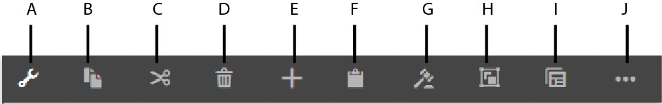

# 自适应表单编辑器 {#introduction-to-authoring-adaptive-forms}

Adobe 建议使用现代、可扩展的数据捕获[核心组件](https://experienceleague.adobe.com/docs/experience-manager-core-components/using/adaptive-forms/introduction.html)以[创建新的自适应表单](/help/forms/creating-adaptive-form-core-components.md)或[将自适应表单添加到 AEM Sites 页面](/help/forms/create-or-add-an-adaptive-form-to-aem-sites-page.md)。这些组件代表有关创建自适应表单的重大改进，确保实现令人印象深刻的用户体验。本文介绍了使用基础组件创作自适应表单的旧方法。

| 版本 | 文章链接 |
| -------- | ---------------------------- |
| AEM 6.5 | [单击此处](https://experienceleague.adobe.com/docs/experience-manager-65/forms/getting-started/introduction-forms-authoring.html) |
| AEM as a Cloud Service | 本文 |

## 概述 {#overview}

自适应表单可让您创建引人入胜、响应式、动态和自适应的表单。[!DNL AEM Forms] 提供了一个直观的用户界面和许多现成组件，可用于创建和使用自适应表单。您可以选择基于表单模型或架构创建自适应表单，也可以选择不基于表单模型创建自适应表单。请务必仔细选择不仅符合您的要求，而且可扩展现有基础设施投资和资源的表单模型。您可以从以下选项中进行选择来创建自适应表单：

* **使用表单数据模型**
  [数据集成](data-integration.md)可让您将来自不同数据源的实体和服务集成到可用于创建自适应表单的表单数据模型中。如果您创建的自适应表单需要从多个数据源获取数据和向多个数据源写入数据，请选择表单数据模型。

* **使用 XDP 表单模板**
如果您投资于基于 XFA 的表单或 XDP 表单，那么这将是理想的表单模型。它提供了一种将基于 XFA 的表单转换为自适应表单的直接方法。任何现有 XFA 规则都保留在关联的自适应表单中。生成的自适应表单支持 XFA 结构，例如验证、事件、属性和模式。

* **使用 XML 架构定义 (XSD) 或 JSON 架构**
XML 和 JSON 架构代表组织中的后端系统在其中生成或使用数据的结构。您可以将架构与自适应表单相关联，并使用其元素将动态内容添加到自适应表单。在创作自适应表单时，架构的元素可用于内容浏览器的“数据模型对象”选项卡。

* **不使用任何模型或不带表单模型**
使用此选项创建的自适应表单不使用任何表单模型。从此类表单生成的数据 XML 具有带字段和相应值的平面结构。

  >[!NOTE]
  >
  > 您可以在自适应表单编辑器或自适应表单模板编辑器中修改表单模型属性。有关更多信息，请参阅[编辑自适应表单的表单模型属性](/help/forms/creating-adaptive-form.md#edit-form-model-properties-of-an-adaptive-form-edit-form-model)。

要创建自适应表单，请参阅[创建自适应表单](creating-adaptive-form.md)。

## 自适应表单创作 UI {#adaptive-form-authoring-ui}

用于创作自适应表单的触控优化的 UI 非常直观，并提供：

* 拖放功能
* 标准表单组件
* 集成的资源存储库

在创建新的自适应表单或编辑现有自适应表单时，您将使用以下 UI 元素：

* [侧栏](#sidebar)
* [页面工具栏](#page-toolbar)
* [组件工具栏](#component-toolbar)
* [自适应表单页面](#af-page)

<!-- 

**A.** Sidebar **B.** Page toolbar **C.** Adaptive Form page -->

### 侧栏 {#sidebar}

侧边栏让您

* 在您的 AEM 数字资源管理 (DAM) 存储库中搜索、查看和使用资源。
* 查看面板、组件、字段和布局等表单内容。
* 在表单上添加组件。
* 编辑组件属性。

**A.** 内容浏览器 **B.** 属性浏览器 **C.** 资源浏览器 **D.** 组件浏览器

<!--Click to enlarge

](assets/sidebar-comps-1.png) -->

侧栏包含以下浏览器：

* **内容浏览器**
在内容浏览器中，您可以查看：

   * **表单对象**
显示表单的对象层级。作者可以通过在表单对象树中点按特定表单组件来导航到该组件。作者可以从该树中搜索对象并重新排列它们。

   * **数据模型对象**
可让您查看表单模型层级。
它可让您将表单模型元素拖放到自适应表单上。已添加的元素会自动转换为表单组件，同时保留其原始属性。当表单使用 XML 架构、JSON 架构或 XDP 模板时，您会看到数据模型对象。

* **属性浏览器**

  可让您编辑组件的属性。属性根据组件而变化。要查看自适应表单容器的属性，请执行以下操作：

  选择一个组件，然后点按 > **[!UICONTROL 自适应表单容器]**，然后点按。

* **资源浏览器**

  使不同类型的内容分离开来，例如图像、文档、页面、电影等。

* **组件浏览器**

  包括可用于生成自适应表单的组件。您可以在自适应表单上拖动组件来添加表单元素，并根据需要配置已添加的元素。下表描述了组件浏览器中列出的组件。

<table>
 <tbody>
  <tr>
   <th><strong>组件</strong></th>
   <th><strong>功能</strong></th>
  </tr>
  <tr>
   <td>Adobe Sign Block</td>
   <td>对使用 Adobe Sign 签名时需要填写的字段添加含占位符的文本块。</td>
  </tr>
  <tr>
   <td>按钮</td>
   <td>添加一个按钮，可配置该按钮以执行保存、重置、下一步、上一步等操作。</td>
  </tr>
  <tr>
   <td>验证码</td>
   <td>使用 Google reCAPTCHA 服务添加验证码验证。</td>
  </tr>
  <tr>
   <td>图表</td>
   <td>添加可在自适应表单和文档中使用的图表，这些图表用于在可重复面板和表格行中直观表示二维数据。</td>
  </tr>
  <tr>
   <td>复选框</td>
   <td>添加复选框。</td>
  </tr>
  <tr>
   <td>数据输入字段</td>
   <td>在您的表单中使用日期输入字段组件，让客户分别在三个框中填写日、月和年。您可以自定义组件的外观，并更改日期格式。例如，您可以让客户以 MM/DD/YYYY 或 DD/MM/YYYY 格式输入日期。</td>
  </tr>
  <tr>
   <td>日期选取器</td>
   <td>添加日历字段以选择日期。</td>
  </tr>
  <tr>
   <td>文档片段</td>
   <td>可让您添加通信的可重用组件。</td>
  </tr>
  <tr>
   <td>文档片段组</td>
   <td>可让您添加一组相关的文档片段，可以在信件模板中将这些片段用作一个单元。</td>
  </tr>
  <tr>
   <td>下拉列表</td>
   <td>添加下拉列表 – 单选或多选</td>
  </tr>
  <tr>
   <td>电子邮件</td>
   <td>
添加字段以捕获电子邮件地址。默认情况下，电子邮件组件使用以下正则表达式来验证电子邮件地址。
 
<code>^[a-zA-Z0-9.!#$%&amp;'*+/=?^_`{|}~-]+@[a-zA-Z0-9-]+(?:.[a-zA-Z0-9-]+)*$</code>
 </td>
  </tr>
  <tr>
   <td>文件附件</td>
   <td>
添加一个按钮，可让用户浏览支持文档并将其附加到表单。
 
<strong>注意：</strong>文件附件组件支持为 Adobe Sign 启用的自适应表单中的一组预定义的文件格式。有关更多信息，请参阅<a href="https://helpx.adobe.com/cn/document-cloud/help/supported-file-formats-fill-sign.html#main-pars_text">支持的文件格式</a>。
 </td>
  </tr>
  <tr>
   <td>文件附件列表</td>
   <td>添加一个字段，该字段将列出使用文件附件组件上传的所有附件。</td>
  </tr>
  <tr>
   <td>页脚  </td>
   <td>添加通常包括公司徽标、表单标题和摘要的页面标题。  </td>
  </tr>
  <tr>
   <td>页眉</td>
   <td>添加通常包括版权信息和指向其他页面的链接的页脚。 </td>
  </tr>
  <tr>
   <td>图像</td>
   <td>让您插入图像。</td>
  </tr>
  <tr>
   <td>图像选择</td>
   <td>可让您的客户选择图像以提供信息。您可以使用这些信息向您的客户提供个性化服务。</td>
  </tr>
  <tr>
   <td>“下一个”按钮</td>
   <td>添加按钮以导航到表单中的下一面板。</td>
  </tr>
  <tr>
   <td>数值框</td>
   <td>添加用于捕获数值的字段</td>
  </tr>
  <tr>
   <td>数值步进器</td>
   <td>在您的表单中使用数值步进器以让您的客户输入一个数值，他们可以根据预定义的步骤增大或减小该数值。</td>
  </tr>
  <tr>
   <td>面板</td>
   <td>
添加面板或子面板。
 
您还可以使用添加子面板从父面板工具栏添加面板组件。</code> 按钮. 同样，您可以使用添加面板工具栏来添加特定于面板的工具栏。</code> 按钮. 您可以使用“编辑面板”对话框配置面板工具栏的位置。
 </td>
  </tr>
  <tr>
   <td>密码框</td>
   <td>添加用于捕获密码的字段。</td>
  </tr>
  <tr>
   <td>“上一个”按钮</td>
   <td>添加一个按钮，用户需要使用该按钮来返回上一个页面或面板。</td>
  </tr>
  <tr>
   <td>单选按钮</td>
   <td>添加单选按钮。</td>
  </tr>
  <tr>
   <td>“重置”按钮</td>
   <td>添加按钮以重置表单字段。</td>
  </tr>
  <tr>
   <td>“保存”按钮</td>
   <td>添加按钮以保存表单数据。</td>
  </tr>
  <tr>
   <td>连笔签名</td>
   <td>添加用于捕获连笔签名的字段。</td>
  </tr>
  <tr>
   <td>分隔符</td>
   <td>在表单中启用面板的可视分离。</td>
  </tr>
  <tr>
   <td>签名步骤</td>
   <td>显示表单中提供的信息以及供用户用来验证和签署表单的签名字段。</td>
  </tr>
  <tr>
   <td>文本</td>
   <td>让您指定静态文本。</td>
  </tr>
  <tr>
   <td>“提交”按钮</td>
   <td>添加提交按钮以将表单提交到配置的提交操作。</td>
  </tr>
  <tr>
   <td>摘要步骤</td>
   <td>提交表单并显示作者在提交表单后指定的摘要文本。 </td>
  </tr>
  <tr>
   <td>开关</td>
   <td>添加用于执行切换或启用/禁用操作的开关。您无法在开关组件中添加两个以上的选项。由于开关只能有两个值：“开”或“关”，因此“强制”不适用。不管用户输入如何，至少保存一个值。  </td>
  </tr>
  <tr>
   <td>表</td>
   <td>添加表格以便按行和列整理数据。 </td>
  </tr>
  <tr>
   <td>电话</td>
   <td>
添加字段以捕获电话号码。电话组件可让作者配置下列电话号码类型之一。每种类型均与一个用于验证的默认正则表达式关联。

    <ul>
     <li>类型“国际”由 <code>^[+][0-9]{0,14}$</code> 进行验证。</li>
     <li>类型“USPhoneNumber”由 <code>{'+1 ('999') '999-9999}</code> 进行验证。</li>
     <li>类型“UKPhoneNumber”由 <code>text{'+'99 999 999 9999}</code> 进行验证。</li>
     <li>类型“自定义”不提供默认验证模式。它采用最后选择的电话号码类型的值。您也可以指定建自己的自定义验证模式。</li>
    </ul> </td>
  </tr>
  <tr>
   <td>条款和条件  </td>
   <td>添加一个字段，作者可使用该字段指定用户在填写表单之前要查看的条款和条件。</td>
  </tr>
  <tr>
   <td>文本框 </td>
   <td>
添加一个文本框，用户可以在其中指定所需的信息。 
 
默认情况下，文本框组件只接受纯文本。您可以启用文本框组件以接受富文本。支持富文本的文本组件提供了用于添加标题、更改字符样式（将字符设为粗体、将字符设为斜体、为字符加下划线）、创建有序列表和无序列表、更改文本背景和文本颜色以及添加超链接的选项。要为文本框启用富文本，请在组件属性中启用<strong>允许富文本</strong>选项。
 </td>
  </tr>
  <tr>
   <td>标题</td>
   <td>指定自适应表单的标题。</td>
  </tr>
  <tr>
   <td>验证步骤</td>
   <td>
添加占位符以显示已填好的表单供用户验证。
 
<strong>注意</strong>：包含验证组件的自适应表单不支持匿名用户。此外，建议不要在自适应表单片段中使用验证组件。
 </td>
  </tr>
 </tbody>
</table>

### 页面工具栏 {#page-toolbar}

顶部的页面工具栏提供了各种选项，以便您能够预览表单、更改表单属性和编辑表单布局。您可以在创作表单时预览表单，并进行相应的更改。在页面工具栏中，您会看到：

* **切换侧面板**：可让您显示或隐藏侧栏。

* **页面信息**：可让您查看页面属性、发布/取消发布表单、启动表单工作流以及在经典 UI 中打开表单。

* **模拟器**：可让您针对不同的显示尺寸（如平板电脑和手机）模拟表单外观。

* **编辑**：可让您选择其他模式，例如：**[!UICONTROL 编辑]**、**[!UICONTROL 样式]**、**[!UICONTROL 开发人员]**&#x200B;和&#x200B;**[!UICONTROL 设计]**。

   * **Edit**：可让您编辑表单及其组件的属性。例如，添加组件、删除图像和指定必填字段。
   * **样式**：可让您设计表单组件的外观。例如，在样式模式下，您可以选择一个面板并指定其背景颜色。

   * **开发人员**：可让开发人员：

      * 发现表单的组成部分。
      * 调试何时何地发生的情况，这反过来有助于解决问题。

      * **设计**。可让您启用或禁用自定义组件，或侧栏中未列出的现成组件。

* **预览**：可让您预览表单在发布时的外观。

### 组件工具栏 {#component-toolbar}

在选择一个组件时，将显示一个可用于使用该组件的工具栏。您可以获得用于剪切、粘贴、移动和指定组件属性的选项。您的选项包括：

A. **配置**：在点按&#x200B;**[!UICONTROL 配置]**&#x200B;时，组件属性将显示在侧栏中。通过配置这些属性，您可以自定义数据捕获体验。您可以更改组件的元素名称，在组件的“标题”字段中指定标签文本。利用元素名称，可以捕获用户使用组件输入的值。在组件属性中，可以指定组件的行为，并管理用户输入。在侧栏中配置属性以捕获用户数据并将它用于进一步处理。自适应表单容器的属性可让您指定客户端库、布局、主题、记录文档设置、保存设置、提交设置和元数据设置。

B. **复制**：可以使用复制选项来复制一个组件并将其粘贴到表格中的其他位置。粘贴组件时，粘贴的组件将获得一个新的元素名称，但保留已复制组件的属性。

C. **剪切**：可以使用剪切选项将组件从自适应表单中的一个位置移动到另一个位置。

D. **删除**：可让您从表单中删除组件。

E. **插入**：可让您在选定组件的上方插入组件。

F. **粘贴**：可让您粘贴使用上述选项剪切或复制的组件。

G. **编辑规则**：可让您打开规则编辑器。有关更多信息，<!-- see [Rule Editor](rule-editor.md). -->

H. **分组**：可让您选择多个组件（如果要剪切、复制或粘贴多个组件）。

I **父项**：可让您选择组件的父项。例如，文本字段位于子分区中，后者位于分区中。分区位于指南根面板中，自适应表单容器是指南根面板的父级。对于组件，您会看到层级自下而上排序的所有选项。

例如，如果您点按文本框的&#x200B;**[!UICONTROL 父项]**，则会看到：

* 子分区
* 分区
* guideRootPanel
* 自适应表单容器

J. **其他**：提供更多选项来处理所选组件。

* 查看 SOM 表达式
* 将面板另存为片段（仅适用于面板）
* 添加子面板（仅适用于面板）
* 添加面板工具栏（仅适用于面板）
* 替换（不适用于面板）

### 自适应表单页面 {#af-page}

自适应表单页面是实际表单。它类似于任何其他建模为 WCM `cq:Page` 组件的 WCM 页面。下图显示了典型自适应表单的内容结构。

内容结构通常包含以下主要组件：

* **guideContainer**：自适应表单的根，它在自适应表单 UI 中标记为&#x200B;**[!UICONTROL 自适应表单的开头]**。在此组件中，您可以指定：

   * *自适应表单的移动布局*：定义移动设备上的表单外观。
   * *感谢页面*：定义用户在提交表单后被重定向到的页面。
   * *提交操作*：定义用户提交表单后在服务器上处理表单的方式。
   * *样式*：指定用于自定义表单外观的 CSS 文件的路径。

* **rootPanel：**&#x200B;自适应表单的根面板。它可以包含项目节点下的子面板。每个包含根面板的面板都可以有一个与之关联的布局。面板的布局指示表单的布局方式。例如，在折叠布局中，其项目被布置为折叠步骤。

* **工具栏：**&#x200B;自适应表单容器有一个关联的全局工具栏，它是表单的全局工具栏。可以使用编辑栏中的&#x200B;**[!UICONTROL 添加工具栏]**&#x200B;操作来添加此工具栏，这可让作者添加操作，例如提交、保存、重置等。

* **资源：**&#x200B;此节点包含用于表单创作的附加信息。例如，表单模型详细信息、本地化详细信息等。

## 另请参阅 {#see-also}

{{see-also}}