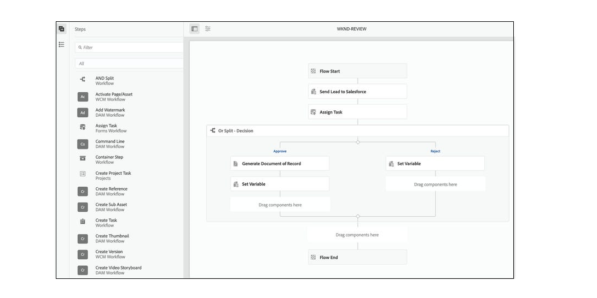

<!-- # Introduction to [!DNL AEM Forms] as a Cloud Service {#overview}

Adobe Experience Manager Forms as a Cloud Service offers a cloud-native, Platform as a Service (PaaS) solution for businesses to create, manage, publish, and update complex digital forms while integrating submitted data with back-end processes, business rules, and saving data in an external data store. The service is always current, always available, and always learning.

You can use the service to create and rollout  interactive and engaging digital forms. For example, an organization is looking to digitize their customer enrollment journey. They have multiple data sources with existing customer data, they are looking to pre-populate forms, add e-sign their forms, and archive filled forms as PDF files. Besides, the organization has multiple print forms (PDF forms), they are also looking to convert all of their print forms to digital forms.

The organization can use [!DNL AEM Forms] as a Cloud Service to create digital forms, connect forms to existing data sources, integrate forms with [!DNL Adobe Sign] to add e-signatures to forms, and generate Document of Record (DoR) to archive filled forms as PDF files. The organization can also use the service to convert their existing PDF forms to digital forms. 

An organization can sign up for [!DNL AEM Forms] as a Cloud Service and start using all these features without waiting to buy and set up a local infrastructure. The service also frees the organizations from the cycle of upgrades as it is always up to date and always offers the latest feature.  -->

# 主要特性和功能 {#key-features}

[!DNL AEM Forms] as a Cloud Service提供了多项云原生功能，例如云原生架构、自动扩展、升级无停机、CDN（内容交付网络）、云原生开发环境，以及通过Cloud Manager自助为环境提供服务。 您可以使用该服务：

* [创建自适应Forms](creating-adaptive-form.md#strong-create-an-adaptive-form-strong) 自动呈现给用户设备和浏览器的附加内容。

   

* [创建像素完美PDF forms](use-forms-designer.md#create-an-adaptive-form) 看起来像纸。

* 使用 [automated forms conversion服务](https://experienceleague.adobe.com/docs/aem-forms-automated-conversion-service/using/introduction.html?lang=zh-Hans) 将PDF表单转换为自适应表单。 它可帮助您加快组织数据捕获体验的数字化和现代化。

   

* [创建业务流程](aem-forms-workflow-step-reference.md#create-form-centric-workflows). 例如，您可以在提交自适应表单时创建并触发批准和拒绝工作流。

除了上述内容之外 [!DNL AEM Forms] as a Cloud Service提供以下特性和功能：

* 易于使用的图形用户界面，使企业用户能够轻松导入、管理、预览和发布表单
* 响应式表单目录，具有使用关键字、标记和元数据的强大搜索功能
* 动态检测用户的设备和位置，以在Web和移动渠道中正确呈现表单
* [与Adobe Sign集成](adobe-sign-integration-adaptive-forms.md) 服务或涂写文档，以电子方式签署包含机密信息的文档
* 能够 [将服务连接到各种类型的数据源](data-integration.md#create-an-adaptive-form) 来发送和检索数据。 该服务支持从RESTful Web服务、基于SOAP的Web服务以及启用OData的服务发送和检索数据。
* 与AEM Sites集成。 它允许在AEM Sites页面中嵌入自适应表单。 您还可以将自适应表单集成到任何网页。
* 能够创建记录文档(DoR)，以保留您提供并在自适应表单中提交的信息的记录，以便您以后可以引用它。 DoR是表单的PDF版本。 它包括模板和数据。 该服务提供了默认的DoR模板和工具来开发自定义模板。
* 能够创建自适应Forms以生成符合模式的数据。 它可帮助您将捕获的数据提交到现有流程和数据源，而无需进行任何或极少的修改。
* 能够创建预填服务，以根据条件使用现有客户数据填写表单。 它有助于加快表单填写过程，降低放弃率。

<!-- 

## Enterprise-class forms {#enterprise-class-forms}

You can create enterprise class forms (Adaptive Forms) and deliver beautiful, interactive, responsive, and personalized experiences to your customers. These forms change behavior and appearance based on the underlying device. You can also use themes and templates with Adaptive Forms to mandate a uniform structure and appearance for all the forms of an organization or a department.

## Automatic conversion of PDF forms to Adaptive Forms {#automatic-conversion-of-pdf-forms-to-adaptive-forms}

You can use Automated Forms Conversion service to convert a PDF Form to an Adaptive Form. It helps you accelerate digitization and modernization of data capture experiences of your organization.

## Data Integration {#data-integration}

You can connect the service to various types of data sources to send and retrieve data. The service supports sending and retrieving data from RESTful web services, SOAP-based web services, and OData enabled services.

## Integration with [!DNL Adobe Sign] {#integration-with-adobe-sign}

 You can integrate the service with [!DNL Adobe Sign] and add [!DNL Adobe Sign] fields to an Adaptive Form. It allows your users to e-sign an Adaptive Form and use [!DNL Adobe Sign] with AEM Workflows. You can use AEM Workflows to develop a business logic and send forms and documents to recipients for signatures based on the business logic.

## Integration with [!DNL AEM Sites] {#integration-with-aem-sites}

You can embed an adaptive form in an AEM Sites or an external webpage. The service provides a component out of the box to integrate an adaptive forms to an AEM Sites page.

## Business Processes Automation {#bpa}

You can use AEM Workflows to create business processes and automate operations. For example, You can create and trigger an approval and rejection workflow on submission of an Adaptive Form. 

## Document of Record {#dor}

You can create a Document of Record (DoR) to keep a record of the information that you provide and submit in an Adaptive Form so that you can refer to it later. A DoR is a PDF version of a form. It includes both a template and data. The service provides a default DoR template and tools to develop a custom template.

## Rule editor {#rule-editor}

Rule editor empowers you to build dynamism and interactivity to Adaptive Forms. These rules define actions to trigger on form objects based on preset conditions, user inputs, and user actions on the form. It helps  streamline the form filling experience while ensuring accuracy and speed.
  

## WYSIWYG editors {#wysiwyg-editor} 

The service provides several WYSIWYG editors: Adaptive Forms editor, Theme editor, and Template editor. These help you create and edit forms and related assets in WYSIWYG manner. The editors also provide out-of-the-box options to simulate views for popular mobile devices, tablets, and desktop screen configurations.

## Schema-compliant data {#schema-complaint-data}

You can create Adaptive Forms to produce schema-compliant data. It helps you submit captured data to existing processes and data sources without any or minimal modifications.

## Prefill a form

You can create a prefill service to fill a form with existing customer data based on a criteria. It helps fasten the form filling process and reduce the abandon rate.

## Submit Actions

A Submit Action allows you to persist and process captured data. The service provides several Submit Actions out-of-the-box. You can use these Submit Actions to send submitted data to a REST endpoint, database, or an AEM Workflow. You can also email submitted data along with attachments and Document of Record(DoR). You can also develop a custom Submit Action to perform an action specific to your business.

* **Emulators:** You can view an Adaptive Form in an in-built emulator. It helps you simulate how an Adaptive Form appears on different devices to an end user. It provides out-of-the-box options to simulate views for popular mobile devices, tablets, and desktop screen configurations. 

In addition to standard [!DNL AEM Forms] features, [!DNL AEM Forms] as a Cloud Service provides several cloud-native capabilities such as a cloud-native architecture, auto-scaling, zero downtime for upgrades, a CDN (Content Delivery Network), cloud-native development environment, and ability to self-Service the environments via Cloud Manager. -->
