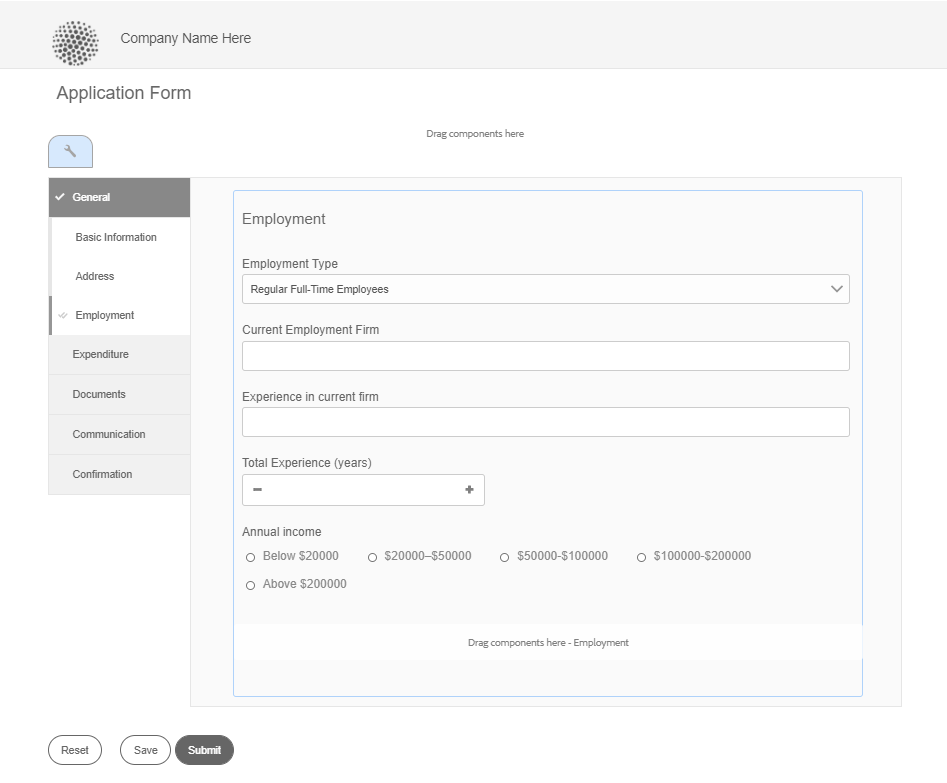
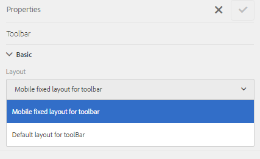

# 自适应Forms的布局功能 {#layout-capabilities-of-adaptive-forms}

[!DNL Adobe Experience Manager] 允许您创建易于使用的自适应Forms，以向最终用户提供动态体验。 表单布局控制项目或组件在自适应表单中的显示方式。

<!-- ## Prerequisite knowledge {#prerequisite-knowledge}

Before learning about the different layout capabilities of Adaptive Forms, read [Introduction to authoring forms](introduction-forms-authoring.md) to know more about Adaptive Forms. -->

## 布局类型 {#types-of-layouts}

自适应表单提供了以下类型的布局：

**[!UICONTROL 面板布局]** 控制面板内的项目或组件在设备上的显示方式。

**[!UICONTROL 移动设备布局]** 控制移动设备上表单的导航。 如果设备宽度为768像素或更多，则该布局会被视为移动设备布局，并针对移动设备进行了优化。

**[!UICONTROL 工具栏布局]** 在表单的工具栏或面板工具栏中控制“操作”按钮的位置。

所有这些面板布局均在 `/libs/fd/af/layouts` 位置。

要更改自适应表单的布局，请在 [!DNL Experience Manager].

## [!UICONTROL 面板布局] {#panel-layout}

表单作者可以将布局与自适应表单的每个面板（包括根面板）相关联。

面板布局位于 `/libs/fd/af/layouts/panel` 位置。 点按面板并选择  查看面板属性。


### [!UICONTROL 响应式 — 在一个页面上执行所有操作，无需导航] {#responsive-everything-on-one-page-without-navigation-br}

使用此面板布局可创建响应式布局，该布局可根据设备的屏幕大小进行调整，而无需进行专门的导航。

使用此布局，您可以放置多个 **[!UICONTROL 面板自适应表单]** 组件在面板中逐个显示。


### [!UICONTROL 向导] {#wizard}

使用此面板布局可在表单内提供引导式导航。 例如，当您想要在表单中捕获强制信息并逐步引导用户时，可使用此布局。

使用 **[!UICONTROL 面板自适应表单]** 组件在面板中提供分步导航。 使用此布局时，用户只有在当前步骤完成后才会移至下一步

```javascript
window.guideBridge.validate([], this.panel.navigationContext.currentItem.somExpression)
```


### [!UICONTROL 折叠] {#layout-for-accordion-design}

使用此布局，您可以将 **[!UICONTROL 面板自适应表单]** 组件。 使用此布局，您还可以创建可重复面板。 可重复面板允许您根据需要动态添加或删除面板。 您可以定义面板重复的最小次数和最大次数。 此外，可以根据在面板项目中提供的信息动态地确定面板的标题。

摘要表达式可用于在最小化面板的标题中显示最终用户提供的值。


### [!UICONTROL 选项卡式布局 — 选项卡显示在左侧 ]{#tabbed-layout-tabs-appear-on-the-left}

使用此布局，您可以将 **[!UICONTROL 面板自适应表单]** 组件。 选项卡位于面板内容的左侧。



面板左侧显示制表符

### [!UICONTROL 选项卡式布局 — 选项卡显示在顶部] {#tabbed-layout-tabs-appear-on-the-top}

使用此布局，您可以将 **[!UICONTROL 面板自适应表单]** 组件在面板中的选项卡导航。 选项卡位于面板内容的顶部。


## 移动设备布局 {#mobile-layouts}

移动设备布局允许在屏幕相对较小的移动设备上进行用户友好的导航。 移动设备布局使用选项卡式样式或向导样式进行表单导航。 应用移动布局可为整个表单提供单个布局。

此布局使用导航栏和导航菜单控制导航。 导航栏会显示 **&lt;** 和 **>** 图标指示 **[!UICONTROL 下一步]** 和 **[!UICONTROL 上一个]** 导航步骤。

移动设备布局位于 `/libs/fd/af/layouts/mobile/` 位置。 默认情况下，自适应Forms中提供了以下移动布局。


选择 **[!UICONTROL 将响应式布局的可导航项目添加到移动菜单]** 选项，以查看移动设备布局中面板可用的可导航选项。 仅当您选择 **[!UICONTROL 响应式]** 面板的布局。

使用移动设备布局时，通过点按可访问各种表单面板的表单菜单  图标。

### [!UICONTROL 表单标题中包含面板标题的布局] {#layout-with-panel-titles-in-the-form-header}

如名称所示，此布局显示面板标题以及导航菜单和导航栏。 此布局还提供“下一步”和“上一步”图标以进行导航。


### [!UICONTROL 表单标题中不带面板标题的布局 ]{#layout-without-panel-titles-in-the-form-header}

此布局（如名称所示）仅显示导航菜单和没有面板标题的导航栏。 此布局还提供“下一步”和“上一步”图标以进行导航。


<!-- ## Toolbar layouts {#toolbar-layouts}

A Toolbar Layout controls positioning and display of any action buttons that you add to your Adaptive Forms. The layout can be added at a form level or at a panel level.



A list of Toolbar Layouts in Adaptive Forms

Toolbar layouts are available at `/libs/fd/af/layouts/toolbar` location. Adaptive Forms provide the following Toolbar Layouts, by default.

### [!UICONTROL Default layout for toolbar] {#default-layout-for-toolbar}

This layout is selected as the default layout when you add any action buttons in an Adaptive Form. Selecting this layout displays the same layout for both, desktop and mobile devices.

Also, you can add multiple toolbars containing action buttons configured with this layout. An action button is associated with a form control. You can configure the toolbars to be before or after a panel.


Default view for toolbar

### [!UICONTROL Mobile fixed layout for toolbar] {#mobile-fixed-layout-for-toolbar}

Select this layout to provide alternate layouts for desktop and mobile devices.

For the desktop layout, you can add Action buttons using some specific labels. Only one toolbar can be configured with this layout. If more than one toolbar is configured with this layout, there is an overlap for mobile devices and only one toolbar is visible. For example, you can have a toolbar at the bottom or the top of the form, or, after or before panels in the form.

For the Mobile layout, you can add action buttons using icons.


Mobile fixed layout for toolbar-->
