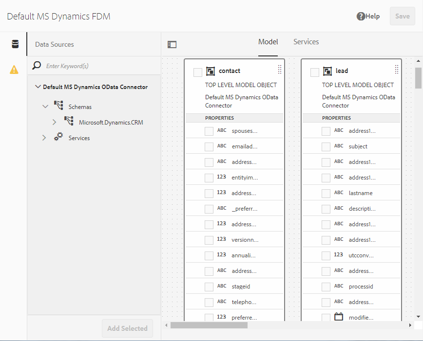

# [!DNL Microsoft Dynamics] OData配置 {#microsoft-dynamics-odata-configuration}


[!DNL Microsoft Dynamics] 是一款客户关系管理(CRM)和企业资源规划(ERP)软件，为创建和管理客户帐户、联系人、潜在客户、商机和案例提供企业解决方案。 [[!DNL Experience Manager Forms] 数据集成](data-integration.md) 提供OData云服务配置，以将Forms与在线和本地集成 [!DNL Microsoft Dynamics] 服务器。 它允许您根据 [!DNL Microsoft Dynamics] 服务。 表单数据模型可用于创建与交互的自适应Forms [!DNL Microsoft Dynamics] 服务器启用业务工作流。 例如：

* 查询 [!DNL Microsoft Dynamics] 数据服务器和预填充自适应Forms
* 将数据写入 [!DNL Microsoft Dynamics] 论自适应表单提交
* 将数据写入 [!DNL Microsoft Dynamics] 通过表单数据模型中定义的自定义实体，反之亦然

<!--[!DNL Experience Manager Forms] add-on package also includes reference OData configuration that you can use to quickly integrate [!DNL Microsoft Dynamics] with [!DNL Experience Manager Forms].-->

<!--When the package is installed, the following entities and services are available on your [!DNL Experience Manager Forms] instance:

* MS Dynamics OData Cloud Service (OData Service)-->
<!--* Form Data Model with preconfigured [!DNL Microsoft Dynamics] entities and services.-->

<!-- Preconfigured [!DNL Microsoft Dynamics] entities and services in a Form Data Model are available on your [!DNL Experience Manager Forms] instance only if the run mode for the [!DNL Experience Manager] instance is set as `samplecontent` (default). -->  MS Dynamics OData Cloud Service (OData Service) is available with all run modes. For more information on configuring run modes for an [!DNL Experience Manager] instance, see [Run Modes](https://experienceleague.adobe.com/docs/experience-manager-cloud-service/implementing/deploying/overview.html#runmodes).

## 前提条件 {#prerequisites}

在开始设置和配置之前 [!DNL Microsoft Dynamics]，请确保您具有：

<!--* Installed the [[!DNL Experience Manager Forms] add-on package](installing-configuring-aem-forms-osgi.md) -->
* 已配置 [!DNL Microsoft Dynamics] 365联机或安装了以下任一实例 [!DNL Microsoft Dynamics] 版本：

   * [!DNL Microsoft Dynamics] 365本地
   * [!DNL Microsoft Dynamics] 2016年内部部署

* [已注册 [!DNL Microsoft Dynamics] 在线服务 [!DNL Microsoft Azure] Active Directory](https://docs.microsoft.com/en-us/dynamics365/customer-engagement/developer/walkthrough-register-dynamics-365-app-azure-active-directory). 记下注册服务的客户端ID（也称为应用程序ID）值和客户端密钥。 这些值在 [为 [!DNL Microsoft Dynamics] 服务](#configure-cloud-service-for-your-microsoft-dynamics-service).

## 设置已注册的回复URL [!DNL Microsoft Dynamics] 应用程序 {#set-reply-url-for-registered-microsoft-dynamics-application}

请执行以下操作，为已注册的设置回复URL [!DNL Microsoft Dynamics] 应用程序：

>[!NOTE]
>
>仅在集成时使用此过程 [!DNL Experience Manager Forms] 在线 [!DNL Microsoft Dynamics] 服务器。

1. 转到 [!DNL Microsoft Azure] Active Directory帐户，并在 **[!UICONTROL 回复URL]** 注册应用程序的设置：

   `https://[server]:[port]/libs/fd/fdm/gui/components/admin/fdmcloudservice/createcloudconfigwizard/cloudservices.html`

   

1. 保存配置。

## 配置 [!DNL Microsoft Dynamics] (IFD) {#configure-microsoft-dynamics-for-ifd}

[!DNL Microsoft Dynamics] 使用基于声明的身份验证来提供对 [!DNL Microsoft Dynamics] 将CRM服务器发送给外部用户。 要启用此功能，请执行以下操作以配置 [!DNL Microsoft Dynamics] 用于面向Internet的部署(IFD)并配置声明设置。

>[!NOTE]
>
>仅在集成时使用此过程 [!DNL Experience Manager Forms] 内部 [!DNL Microsoft Dynamics] 服务器。

1. 配置 [!DNL Microsoft Dynamics] IFD的本地实例，如 [为配置IFD [!DNL Microsoft Dynamics]](https://technet.microsoft.com/en-us/library/dn609803.aspx).
1. 使用Windows PowerShell运行以下命令，以在启用IFD时配置声明设置 [!DNL Microsoft Dynamics]:

   ```shell
   Add-PSSnapin Microsoft.Crm.PowerShell
    $ClaimsSettings = Get-CrmSetting -SettingType OAuthClaimsSettings
    $ClaimsSettings.Enabled = $true
    Set-CrmSetting -Setting $ClaimsSettings
   ```

   请参阅 [内部部署CRM(IFD)的应用程序注册](https://msdn.microsoft.com/sl-si/library/dn531010(v=crm.7).aspx#bkmk_ifd) 以了解详细信息。

## 在AD FS计算机上配置OAuth客户端 {#configure-oauth-client-on-ad-fs-machine}

执行以下操作，以在Active Directory联合身份验证服务(AD FS)计算机上注册OAuth客户端，并在AD FS计算机上授予访问权限：

>[!NOTE]
>
>仅在集成时使用此过程 [!DNL Experience Manager Forms] 内部 [!DNL Microsoft Dynamics] 服务器。

1. 运行以下命令：

   `Add-AdfsClient -ClientId “<Client-ID>” -Name "<name>" -RedirectUri "<redirect-uri>" -GenerateClientSecret`

   其中：

   * `Client-ID` 是可以使用任何GUID生成器生成的客户端ID。
   * `redirect-uri` 是 [!DNL Microsoft Dynamics] OData云服务启用 [!DNL Experience Manager Forms]. 默认云服务随 [!DNL Experience Manager Forms] 部署在以下URL上：
      `https://'[server]:[port]'/libs/fd/fdm/gui/components/admin/fdmcloudservice/createcloudconfigwizard/cloudservices.html`

1. 运行以下命令以在AD FS计算机上授予访问权限：

   `Grant-AdfsApplicationPermission -ClientRoleIdentifier “<Client-ID>” -ServerRoleIdentifier <resource> -ScopeNames openid`

   其中：

   * `resource` 是 [!DNL Microsoft Dynamics] 组织URL。

1. [!DNL Microsoft Dynamics] 使用HTTPS协议。 从调用AD FS端点 [!DNL Forms] 服务器，安装 [!DNL Microsoft Dynamics] 将站点证书发送到Java证书存储区(使用 `keytool` 命令 [!DNL Experience Manager Forms].

## 为 [!DNL Microsoft Dynamics] 服务 {#configure-cloud-service-for-your-microsoft-dynamics-service}

OData服务由其服务根URL标识。 在 [!DNL Experience Manager] as a Cloud Service的是，确保您具有服务的服务根URL，并执行以下操作：

<!--The **MS Dynamics OData Cloud Service (OData Service)** configuration comes with default OData configuration. To configure it to connect with your [!DNL Microsoft Dynamics] service, do the following.-->

>[!NOTE]
>
>有关配置的分步指南 [!DNL Microsoft Dynamics 365]，请参阅 [[!DNL Microsoft Dynamics] OData配置](ms-dynamics-odata-configuration.md).

1. 转到 **[!UICONTROL 工具>Cloud Services>数据源]**. 点按以选择要在其中创建云配置的文件夹。

   请参阅 [为云服务配置配置文件夹](#cloud-folder) 有关为云服务配置创建和配置文件夹的信息。

1. 点按 **[!UICONTROL 创建]** 打开 **[!UICONTROL 创建数据源配置向导]**. 为配置指定名称和（可选）标题，选择 **[!UICONTROL OData服务]** 从 **[!UICONTROL 服务类型]** （可选）浏览并选择配置的缩略图，然后点按 **[!UICONTROL 下一个]**.
在 **[!UICONTROL 身份验证设置]** 选项卡：

   1. 输入 **[!UICONTROL 服务根]** 字段。 转到Dynamics实例，然后导航到 **[!UICONTROL 开发人员资源]** 查看服务根字段的值。 例如， https://&lt;tenant-name>/api/data/v9.1/

   1. 选择 **[!UICONTROL OAuth 2.0]** 作为身份验证类型。

   1. 替换 **[!UICONTROL 客户端Id]** (也称为 **应用程序ID**)、 **[!UICONTROL 客户端密钥]**, **[!UICONTROL OAuth URL]**, **[!UICONTROL 刷新令牌URL]**, **[!UICONTROL 访问令牌URL]**&#x200B;和 **[!UICONTROL 资源]** 的值 [!DNL Microsoft Dynamics] 服务配置。 必须在 **[!UICONTROL 资源]** 配置字段 [!DNL Microsoft Dynamics] ，其中包含表单数据模型。 使用服务根URL派生dynamics实例URL。 例如， [https://org.crm.dynamics.com](https://org.crm.dynamics.com/).

   1. 指定 **[!UICONTROL openid]** 在 **[!UICONTROL 授权范围]** 上的授权过程字段 [!DNL Microsoft Dynamics].

      
表单数据模型
1. 单击 **[!UICONTROL 连接到OAuth]**. 系统会将您重定向到 [!DNL Microsoft Dynamics] 登录页面。
1. 使用 [!DNL Microsoft Dynamics] 凭据和接受，以允许云服务配置连接到 [!DNL Microsoft Dynamics] 服务。 在云服务与服务之间建立表单数据模型是一次性的任务。

   您是云服务配置页面的表单数据模型，该页面会显示一条消息，指示OData配置已成功保存。

MS Dynamics ODataCloud Service（OData服务）云服务已配置并与您的Dynamics服务连接。 表单数据模型表单数据模型

## 创建表单数据模型 {#create-form-data-model}

<!--When you install the [!DNL Experience Manager Forms] package, a form data model, **[!DNL Microsoft Dynamics] FDM**, is deployed on your [!DNL Experience Manager] instance. By default, the Form Data Model uses [!DNL Microsoft Dynamics] service configured in the MS Dynamics OData Cloud Service (OData Service) as its data source.

On opening the Form Data Model for the first time, it connects to the configured [!DNL Microsoft Dynamics] service and fetches entities from your [!DNL Microsoft Dynamics] instance. The "contact" and "lead" entities from [!DNL Microsoft Dynamics] are already added in the form data model.

To review the form data model, go to **[!UICONTROL Form Data Model egrations]**. Select **[!DNL Microsoft Dynamics] FDM** and click **[!UICONTROL Edit]** to open the Form Data Model in edit mode. Alternatively, you can open the Form Data Model directly from the following URL:

`https://'[server]:[port]'/aem/fdm/editor.html/content/dam/formsanddocuments-fdm/ms-dynamics-fdm`
 Form Data Model 
-->

配置MS Dynamics OData Cloud用户表单数据模型(ce)云服务后，您可以在创建表单数据模型时使用该服务。 有关更多信息，请参阅 [创建表单数据模型](create-form-data-models.md).

接下来，您可以基于表单数据模型模型创建自适应表单，并将其用于各种自适应表单用例，例如：

* 通过从中查询信息来预填自适应表单 [!DNL Microsoft Dynamics] 实体和服务
* 调用 [!DNL Microsoft Dynamics] 使用自适应表单规则在表单数据模型中定义的服务器操作
* 将提交的表单数据写入 [!DNL Microsoft Dynamics] 实体

<!--It is recommended to create a copy of the Form Data Model provided with the [!DNL Experience Manager Forms] package and configure data models and services to suit your requirements. It will ensure that any future updates to the package do not override your form data model.-->

有关在业务工作流中创建和使用表单数据模型的更多信息，请参阅 [数据集成](data-integration.md).
