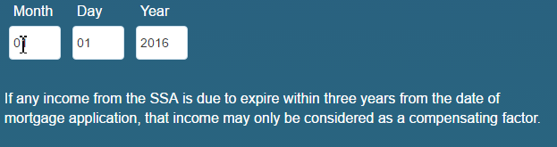

# 规则编辑器的不同用例

文章提供了基于核心组件的自适应表单的规则编辑器的详细示例，提供了有关不同场景下正确实施的见解。 规则编辑器允许开发人员定义和管理用于控制表单行为的逻辑。
现在，让我们讨论规则编辑器的不同实施。

## 在具有函数的可重复面板中简化复杂的计算

规则编辑器允许您对可重复面板中的字段直接使用开箱即用的函数，如Sum、Min、Max和Join。 您还可以将一个可重复的面板字段值传递到接受数字数组、字符串数组、布尔数组等的函数。 这释放了强大的自动化功能，允许您实施复杂的业务逻辑而无需自定义代码。

假设有一个带有可重复面板的表单，其中每个面板实例都收集有关资产的声明值的信息。

您可以使用`Sum`函数自动计算所有面板的总资产值，而无需手动计算，并降低错误的可能性。

在填写表单时，添加实例以声明资产值，`Calculate Asset Value`按钮计算所有已声明资产值的总和，并将结果显示在`assetvalue`文本框中的总计中。

>[!NOTE]
>
> 如果可重复面板字段的值传递到不接受数组的函数，则来自可重复面板的最后一个实例的字段值传递到函数。

这只是个例子！ 探索可用的[功能](#b-form-objects-and-functions-br)以简化工作流程并提高表单中的数据准确性。

## 嵌套表达式 {#nestedexpressions}

规则编辑器允许您使用多个AND和OR运算符创建嵌套规则。 您可以在规则中混合使用多个AND和OR运算符。

以下是嵌套规则的示例，该规则会在满足所需条件时向用户显示有关儿童监护权资格的消息。

您还可以拖放规则中的条件以进行编辑。 选择并将鼠标悬停在条件前面的句柄（）上。 指针变为手形符号后（如下所示），将条件拖放到规则中的任意位置。 规则结构会发生变化。

## 日期表达式条件 {#dateexpression}

规则编辑器允许您使用日期比较来创建条件。

以下是一个示例条件，当房屋抵押贷款已被抵押时，该条件会显示一个静态文本对象，用户通过填写日期字段来表示该条件。

当用户填写的财产抵押日期为过去时，自适应表单会显示有关收入计算的说明。 以下规则将用户填写的日期与当前日期进行比较，如果用户填写的日期早于当前日期，则表单将显示文本消息（名为Income）。

如果填写日期早于当前日期，则表单会显示如下文本消息（收入）：

满足

## 数字比较条件 {#number-comparison-conditions}

规则编辑器可让您创建比较两个数字的条件。

下面是一个示例条件，它显示申请人在当前地址停留的月数小于36时的静态文本对象。

当用户表示在当前居住地址居住不到36个月时，该表格显示可以请求更多居住证明的通知。

<!-- ## Impact of rule editor on existing scripts {#impact-of-rule-editor-on-existing-scripts}

In [!DNL Experience Manager Forms] versions prior to [!DNL Experience Manager 6.1 Forms] feature pack 1, form authors and developers used to write expressions in the Scripts tab of the Edit component dialog to add dynamic behavior to Adaptive Forms. The Scripts tab is now replaced by the rule editor.

Any scripts or expressions that you must have written in the Scripts tab are available in the rule editor. While you cannot view or edit them in visual editor, if you are a part of the forms-power-users group you can edit scripts in code editor. -->

### 调用表单数据模型服务 {#invoke}

考虑一个Web服务`GetInterestRates`，它将贷款金额、保有权和申请人的信用得分作为输入并返回包括EMI金额和利率的贷款计划。 可使用Web服务作为数据源创建表单数据模型(FDM)。 向表单模型添加数据模型对象和`get`服务。 该服务将显示在表单数据模型(FDM)的“服务”选项卡中。 然后，创建一个自适应表单，其中包含数据模型对象中的字段，以捕获贷款金额、使用期和信用评分的用户输入。 添加触发Web服务获取计划详细信息的按钮。 输出将填充到相应的字段中。

以下规则显示了如何配置Invoke service操作以完成示例方案。

>[!NOTE]
>
>如果输入的类型为数组，则支持数组的字段在“输出”下拉部分下可见。

### 使用When规则触发多个操作 {#triggering-multiple-actions-using-the-when-rule}

在贷款申请表中，您要获取贷款申请人是否为现有客户。 根据用户提供的信息，客户ID字段应显示或隐藏。 此外，如果用户是现有客户，则还需要将焦点设置为“客户ID”字段。 贷款申请表包括以下组成部分：

* 单选按钮&#x200B;**[!UICONTROL 您是现有Geometrixx客户吗？]**，提供[!UICONTROL 是]和[!UICONTROL 否]选项。 “是”的值为&#x200B;**0**，“否”的值为&#x200B;**1**。

* 用于指定客户ID的文本字段&#x200B;**[!UICONTROL 客户ID]** Geometrixx。

在用于实施此行为的单选按钮上编写When规则时，该规则在可视规则编辑器中如下所示。

在示例规则中，When部分中的语句是条件，当返回True时，该条件将执行Then部分中指定的操作。

<!-- The rule appears as follows in the code editor.

 

Rule in the code editor -->

### 在规则中使用函数输出 {#using-a-function-output-in-a-rule}

在采购订单表单中，您有下表，用户可在其中填写订单。 在此表中：

* 第一行是可重复的，因此用户可以订购多个产品并指定不同的数量。 其元素名称为`Row1`。
* 可重复行的“产品数量”列中的单元格的标题为“数量”。 此单元格的元素名称为`productquantity`。
* 表中的第二行是不可重复的，该行中“产品数量”列中的单元格的标题为“总数量”。

**A.**&#x200B;行1 **B.**&#x200B;数量&#x200B;**C.**&#x200B;总数量

现在，您要在所有产品的“产品数量”列中添加指定数量，并在“总数量”单元格中显示总和。 通过在“总数量”单元格中写入“设置值”规则，可以实现此总和，如下所示。

### 使用表达式验证字段值 {#validating-a-field-value-using-expression}

在上一个示例中说明的采购订单表单中，您需要限制用户订购任何数量超过此10000价的产品。 要执行此验证，您可以编写验证规则，如下所示。

## 另请参阅

{{see-also-rule-editor}}
