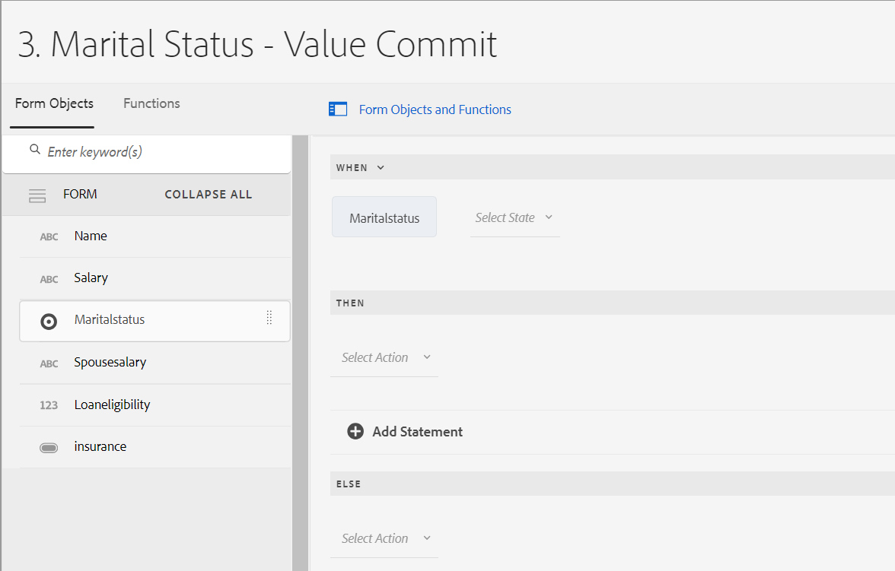

| 版本 | 文章链接 |
| -------- | ---------------------------- |
| AEM as a Cloud Service（核心组件） | 本文 |
| AEM as a Cloud Service（基础组件） | [单击此处](/help/forms/rule-editor.md) |
| AEM 6.5 | [单击此处](https://experienceleague.adobe.com/docs/experience-manager-65/forms/adaptive-forms-advanced-authoring/rule-editor.html) |

# 将规则添加到自适应表单（核心组件） {#adaptive-forms-rule-editor}

规则编辑器功能使表单业务用户和开发人员能够编写关于自适应表单对象的规则。 这些规则根据预设条件、用户输入和用户对表单的操作，定义要在表单对象上触发的操作。 它有助于进一步简化表单填写体验，确保准确性和速度。

规则编辑器提供了用于编写规则的直观且简化的用户界面。 规则编辑器为所有用户提供可视编辑器。<!-- In addition, only for forms power users, rule editor provides a code editor to write rules and scripts. -->您可以使用规则对自适应表单对象执行的一些关键操作包括：

* 显示或隐藏对象
* 启用或禁用对象
* 为对象设置值
* 验证某个对象的值
* 通过执行函数来计算对象的值
* 调用表单数据模型 (FDM) 服务并执行操作
* 设置对象的属性

<!-- Rule editor replaces the scripting capabilities in [!DNL Experience Manager 6.1 Forms] and earlier releases. However, your existing scripts are preserved in the new rule editor. For more information about working with existing scripts in the rule editor, see [Impact of rule editor on existing scripts](rule-editor.md#p-impact-of-rule-editor-on-existing-scripts-p). -->

添加到forms-power-users组的用户可以创建脚本并编辑现有脚本。 [!DNL forms-users]组中的用户可以使用脚本，但不能创建或编辑脚本。

## 核心组件中的规则编辑器与基础组件中的规则编辑器之间的区别

{{rule-editor-diff}}

>[!NOTE]
>
> 要详细了解如何创建和使用自定义函数，请参阅自适应Forms （核心组件）中的[自定义函数](/help/forms/create-and-use-custom-functions.md)一文。

## 了解规则 {#understanding-a-rule}

规则是操作和条件的组合。 在规则编辑器中，操作包括隐藏、显示、启用、禁用或计算表单中对象值等活动。 条件是对表单对象的状态、值或属性执行检查和操作而计算的布尔表达式。 根据通过评估条件返回的值（`True`或`False`）执行操作。

规则编辑器提供了一组预定义的规则类型（如When、Show、Hide、Enable、Disable、Set Value Of和Validate）以帮助您编写规则。 每种规则类型均允许您定义规则中的条件和操作。 本文档进一步详细说明了每种规则类型。

规则通常遵循以下结构之一：

**Condition-Action**&#x200B;在此构造中，规则首先定义条件，然后定义要触发的操作。 这种构造与编程语言中的if-then语句类似。

在规则编辑器中，**When**&#x200B;规则类型强制使用condition-action结构。

**Action-Condition**&#x200B;在此构造中，规则首先定义要触发的操作，然后定义评估条件。 此结构的另一个变体是action-condition-alternate action ，它还会定义在条件返回False时要触发的替代操作。

规则编辑器中的“显示”、“隐藏”、“启用”、“禁用”、“设置值”和“验证”规则类型强制实施操作条件规则结构。 默认情况下，“显示”的替代操作是“隐藏”，而“启用”的替代操作是“禁用”，反之亦然。 您不能更改默认替代操作。

>[!NOTE]
>
>可用的规则类型（包括在规则编辑器中定义的条件和操作）还取决于创建规则的表单对象的类型。 规则编辑器仅显示有效的规则类型和选项，用于为特定表单对象类型编写条件和操作语句。 例如，您看不到面板对象的“验证并设置类型的值”。

有关规则编辑器中可用规则类型的详细信息，请参阅规则编辑器中的[可用规则类型](rule-editor.md#p-available-rule-types-in-rule-editor-p)。

### 选择规则结构的准则 {#guidelines-for-choosing-a-rule-construct}

虽然您可以使用任何规则构建来实现大多数用例，但以下是选择一种构建而不是另一种构建的一些准则。 有关规则编辑器中可用规则的更多信息，请参阅规则编辑器中的[可用规则类型](rule-editor.md#p-available-rule-types-in-rule-editor-p)。

* 创建规则时，一个典型的经验法则是考虑您所编写规则的对象的上下文。 假定您要根据用户在字段A中指定的值隐藏或显示字段B。在这种情况下，您要评估字段A的条件，并根据它返回的值，触发字段B的操作。

  因此，如果您在字段B（评估条件的对象）上编写规则，请使用condition-action结构或When规则类型。 同样，在字段A上使用操作条件结构或显示或隐藏规则类型。

* 有时，您必须根据一个条件执行多个操作。 在这种情况下，建议使用条件 — 操作构造。 在此构造中，您可以计算一次条件并指定多个操作语句。

  例如，要根据检查用户在字段A中指定的值的条件隐藏字段B、C和D，请编写一条规则，其中在字段A上使用condition-action结构或When规则类型，并指定操作以控制字段B、C和D的可见性。否则，您需要在字段B、C和D上分别使用三个规则，其中每个规则都会检查条件，并显示或隐藏各自的字段。 在此示例中，在一个对象上编写When规则类型比在三个对象上编写Show或Hide规则类型更有效。

* 要根据多个条件触发操作，建议使用action-condition构造。 例如，要通过评估字段B、C和D的条件来显示和隐藏字段A，请在字段A上使用显示或隐藏规则类型。
* 如果规则包含一个条件的一个操作，则使用condition-action或action condition结构。
* 如果规则检查条件，并在字段中提供值或退出字段时立即执行操作，则建议在评估条件的字段中编写具有condition-action结构或When规则类型的规则。
* 当用户更改应用When规则的对象的值时，将评估When规则中的条件。 但是，如果您希望操作在服务器端更改时触发（如预填充值），则建议编写一个When规则以在字段初始化时触发操作。
* 在编写下拉列表、单选按钮或复选框对象的规则时，表单中这些表单对象的选项或值会在规则编辑器中预填充。

## 规则编辑器中的可用运算符类型和事件 {#available-operator-types-and-events-in-rule-editor}

规则编辑器提供了以下逻辑运算符和事件，您可以使用这些运算符和事件创建规则。

* **等于**
* **不等于**
* **开头为**
* **结尾为**
* **包含**
* **不包含**
* **为空**
* **不为空**
* **已选择：**&#x200B;当用户为复选框、下拉菜单单选按钮选择特定选项时，返回true。
* **已初始化（事件）：**&#x200B;当表单对象在浏览器中呈现时返回true。
* **Is Changed (event)：**&#x200B;当用户更改表单对象的输入值或选定选项时，返回true。

<!--
* **Navigation(event):** Returns true when the user clicks a navigation object. Navigation objects are used to move between panels. 
* **Step Completion(event):** Returns true when a step of a rule completes.
* **Successful Submission(event):** Returns true on successful submission of data to a form data model.
* **Error in Submission(event):**  Returns true on unsuccessful submission of data to a form data model. -->

## 规则编辑器中的可用规则类型 {#available-rule-types-in-rule-editor}

规则编辑器提供了一组可用于编写规则的预定义规则类型。 让我们详细了解一下每种规则类型。 有关在规则编辑器中编写规则的更多信息，请参阅[编写规则](rule-editor.md#p-write-rules-p)。

### [!UICONTROL 时间] {#whenruletype}

**[!UICONTROL When]**&#x200B;规则类型遵循&#x200B;**condition-action-alternate action**&#x200B;规则结构，有时只遵循&#x200B;**condition-action**&#x200B;结构。 在此规则类型中，首先指定评估条件，然后指定满足该条件时要触发的操作(`True`)。 在使用When规则类型时，您可以使用多个AND和OR运算符来创建[嵌套表达式](#nestedexpressions)。

使用When规则类型，您可以评估表单对象的条件，并对一个或多个对象执行操作。

简单地说，典型的When规则的结构如下所示：

`When on Object A:`

`(Condition 1 AND Condition 2 OR Condition 3) is TRUE;`

`Then, do the following:`

`Action 2 on Object B;`
`AND`
&#39;对对象C执行操作3；

`Else, do the following:`

`Action 2 on Object C;`
_

当具有多值组件（如单选按钮或列表）时，在为该组件创建规则时，会自动检索选项并使这些选项可用于规则创建者。 您无需再次键入选项值。

例如，列表包含四个选项：红色、蓝色、绿色和黄色。 创建规则时，将自动检索选项（单选按钮）并使规则创建者可以使用此选项，如下所示：


编写When规则时，可以触发Clear Value Of操作。 清除值操作清除指定对象的值。 通过在When语句中将Clear Value设置为选项，可以创建具有多个字段的复杂条件。 您可以添加Else语句以添加更多条件

的值

>[!NOTE]
>
> 当规则类型仅支持单级then-else语句时。

#### [!UICONTROL When]中允许使用多个字段 {#allowed-multiple-fields}

在&#x200B;**When**&#x200B;条件中，您可以选择添加应用规则的字段以外的其他字段。

例如，使用When规则类型，您可以评估不同表单对象上的条件并执行操作：

时间：

（对象A条件1）

和/或

（对象B条件2）

然后，执行以下操作：

对对象A执行操作1

_


##### 在“当条件”功能中使用“允许的多个字段”时的注意事项

* 确保 [将核心组件设置为版本 3.0.14 或更高版本](https://github.com/adobe/aem-core-forms-components) ，以便在规则编辑器中使用此功能。
* 如果规则应用于 When 条件中的不同字段，则即使仅更改其中一个字段，也会触发规则。


<!--
* It is not possible to add multiple fields in the When condition while applying rules to a button.

##### To enable Allowed Multiple fields in When condition feature

Allowed Multiple fields in When condition feature is disabled by default. To enable this feature, add a custom property at the template policy:

1. Open the corresponding template associated with an Adaptive Form in the template editor.
1. Select the existing policy as **formcontainer-policy**.
1. Navigate to the **[!UICONTROL Structure]**  view and, from the **[!UICONTROL Allowed Components]** list, open the **[!UICONTROL Adaptive Forms Container]** policy.
1. Go to the **[!UICONTROL Custom Properties]** tab and to add a custom property, click **[!UICONTROL Add]**.
1. Specify the **Group Name** of your choice. For example, in our case, we added the group name as **allowedfeature**.
1. Add the **key** and **value** pair as follows:
   * key: fd:changeEventBehaviour
   * value: deps
1. Click **[!UICONTROL Done]**. -->

如果When条件功能中允许的多个字段遇到任何问题，请按照以下疑难解答步骤操作：

1. 在编辑模式下打开表单。
1. 打开内容浏览器，然后选择自适应表单的&#x200B;**[!UICONTROL 指南容器]**&#x200B;组件。
1. 单击指南容器属性图标。这将打开“自适应表单容器”对话框。
1. 单击完成，然后再次保存对话框。

**[!UICONTROL 隐藏]**&#x200B;隐藏指定的对象。

**[!UICONTROL 显示]**&#x200B;显示指定的对象。

**[!UICONTROL 启用]**&#x200B;启用指定的对象。

**[!UICONTROL 禁用]**&#x200B;禁用指定的对象。

**[!UICONTROL 调用服务]**&#x200B;调用表单数据模型(FDM)中配置的服务。 选择“调用服务”操作时，会出现一个字段。 点按该字段时，会显示在[!DNL Experience Manager]实例上的所有表单数据模型(FDM)中配置的所有服务。 在选择表单数据模型服务时，会出现更多字段，您可以在其中映射具有指定服务的输入和输出参数的表单对象。 请参阅调用表单数据模型(FDM)服务的规则示例。

除了表单数据模型服务之外，您还可以指定直接WSDL URL来调用Web服务。 但是，表单数据模型服务具有许多好处，并且推荐调用服务的方法。

有关在表单数据模型(FDM)中配置服务的详细信息，请参阅[[!DNL Experience Manager Forms] 数据集成](data-integration.md)。

**[!UICONTROL 设置值]**&#x200B;计算并设置指定对象的值。 您可以将对象值设置为字符串、另一个对象的值、使用数学表达式或函数的计算值、对象的属性值或来自已配置表单数据模型服务的输出值。 当您选择Web服务选项时，它将显示在[!DNL Experience Manager]实例上的所有表单数据模型(FDM)中配置的所有服务。 在选择表单数据模型服务时，会出现更多字段，您可以在其中映射具有指定服务的输入和输出参数的表单对象。

有关在表单数据模型(FDM)中配置服务的详细信息，请参阅[[!DNL Experience Manager Forms] 数据集成](data-integration.md)。

**[!UICONTROL Set Property]**&#x200B;规则类型允许您根据条件操作设置指定对象的属性值。 您可以将属性设置为以下项之一：
* 可见（布尔值）
* label.value（字符串）
* label.visible（布尔值）
* description（字符串）
* 已启用（布尔值）
* readOnly（布尔值）
* 必需（布尔值）
* screenReaderText（字符串）
* 有效（布尔值）
* errorMessage（字符串）
* 默认（数字、字符串、日期）
* enumNames （字符串[]）
* chartType（字符串）

例如，您可以定义规则以在单击按钮时显示文本框。 您可以使用自定义函数、表单对象、对象属性或服务输出来定义规则。


要基于自定义函数定义规则，请从下拉列表中选择&#x200B;**[!UICONTROL 函数输出]**，然后从&#x200B;**[!UICONTROL 函数]**&#x200B;选项卡中拖放自定义函数。 如果满足条件操作，则文本输入框将可见。

要基于表单对象定义规则，请从下拉列表中选择&#x200B;**[!UICONTROL 表单对象]**，然后从&#x200B;**[!UICONTROL 表单对象]**&#x200B;选项卡中拖放表单对象。 如果满足条件操作，则文本输入框在自适应表单中可见。

通过基于对象属性的“设置属性”规则，您可以根据自适应表单中包含的其他对象属性使文本输入框在自适应表单中可见。

下图展示了一个动态启用复选框的示例，该复选框基于自适应表单中文本框的隐藏或显示：


**[!UICONTROL 清除值]**&#x200B;清除指定对象的值。

**[!UICONTROL 设置焦点]**&#x200B;设置指定对象的焦点。

**[!UICONTROL 提交表单]**&#x200B;提交表单。

**[!UICONTROL 重置]**&#x200B;重置表单或指定的对象。

**[!UICONTROL 验证]**&#x200B;验证表单或指定的对象。

**[!UICONTROL 添加实例]**&#x200B;添加指定可重复面板或表行的实例。

**[!UICONTROL 删除实例]**&#x200B;删除指定的可重复面板或表行的实例。

**[!UICONTROL 函数输出]**&#x200B;根据预定义的函数或自定义函数定义规则。

**[!UICONTROL 导航到]**&#x200B;导航到其他<!--Interactive Communications,-->自适应Forms、其他资源（如图像或文档片段）或外部URL。<!-- For more information, see [Add button to the Interactive Communication](create-interactive-communication.md#addbuttontothewebchannel). -->

**[!UICONTROL 调度事件]**&#x200B;根据预定义的条件或事件触发特定操作或行为。


### [!UICONTROL 设置值] {#set-value-of}

]**规则类型的**[!UICONTROL &#x200B;设置值允许您根据是否满足指定的条件来设置表单对象的值。 该值可以设置为另一个对象的值、文本字符串、从数学表达式或函数派生的值、另一个对象的属性值或表单数据模型服务的输出。 同样，您可以检查组件、字符串、属性或从函数或数学表达式派生的值的条件。

**Set Value Of**&#x200B;规则类型不适用于所有表单对象，例如面板和工具栏按钮。 标准的“设置值”规则具有以下结构：

将对象 A 的值设置为：

（字符串 ABC）或
（对象 C 的对象属性 X）或
（函数的值）或
（来自数学表达式的值）或
（数据模型服务的输出值）;

时间（可选）：

（条件 1 和条件 2 和条件 3）为 TRUE;

以下示例选择`Question2`的值作为`True`，并将`Result`的值设置为`correct`。


使用表单数据模型服务的设置值规则的示例。

### [!UICONTROL 节目] {#show}

使用&#x200B;**[!UICONTROL Show]**&#x200B;规则类型，您可以编写规则以根据条件是否满足来显示或隐藏表单对象。 Show规则类型还会触发Hide操作，以防条件不满足或返回`False`。

典型的显示规则的结构如下所示：

`Show Object A;`

`When:`

`(Condition 1 OR Condition 2 OR Condition 3) is TRUE;`

`Else:`

`Hide Object A;`

### [!UICONTROL 隐藏] {#hide}

与“显示”规则类型类似，您可以使用&#x200B;**[!UICONTROL 隐藏]**&#x200B;规则类型，根据是否满足条件来显示或隐藏表单对象。 如果条件不满足或返回`False`，隐藏规则类型还会触发“显示”操作。

典型的“隐藏”规则的结构如下所示：

`Hide Object A;`

`When:`

`(Condition 1 AND Condition 2 AND Condition 3) is TRUE;`

`Else:`

`Show Object A;`

### [!UICONTROL 启用] {#enable}

**[!UICONTROL 启用]**&#x200B;规则类型允许您根据条件是否满足来启用或禁用表单对象。 Enable规则类型也会在条件不满足或返回`False`时触发Disable操作。

典型的Enable规则的结构如下所示：

`Enable Object A;`

`When:`

`(Condition 1 AND Condition 2 AND Condition 3) is TRUE;`

`Else:`

`Disable Object A;`

### [!UICONTROL 禁用] {#disable}

与“启用”规则类型类似，**[!UICONTROL 禁用]**&#x200B;规则类型允许您根据条件是否满足来启用或禁用表单对象。 Disable规则类型还会触发Enable操作，以防条件不满足或返回`False`。

典型的禁用规则的结构如下所示：

`Disable Object A;`

`When:`

`(Condition 1 OR Condition 2 OR Condition 3) is TRUE;`

`Else:`

`Enable Object A;`

### [!UICONTROL 验证] {#validate}

**[!UICONTROL Validate]**&#x200B;规则类型使用表达式验证字段中的值。 例如，您可以编写一个表达式来检查用于指定名称的文本框是否不包含特殊字符或数字。

典型的验证规则的结构如下所示：

`Validate Object A;`

`Using:`

`(Expression 1 AND Expression 2 AND Expression 3) is TRUE;`

>[!NOTE]
>
>如果指定的值不符合验证规则，则可以为用户显示验证消息。 您可以在侧边栏中组件属性的&#x200B;**[!UICONTROL 脚本验证消息]**&#x200B;字段中指定消息。


<!--
### [!UICONTROL Set Options Of] {#setoptionsof}

The **[!UICONTROL Set Options Of]** rule type enables you to define rules to add check boxes dynamically to the Adaptive Form. You can use a Form Data Model or a custom function to define the rule.

To define a rule based on a custom function, select **[!UICONTROL Function Output]** from the drop-down list, and drag-and-drop a custom function from the **[!UICONTROL Functions]** tab. The number of checkboxes defined in the custom function are added to the Adaptive Form.


To create a custom function, see [custom functions in rule editor](#custom-functions).

To define a rule based on a form data model:

1. Select **[!UICONTROL Service Output]** from the drop-down list.
1. Select the data model object.
1. Select a data model object property from the **[!UICONTROL Display Value]** drop-down list. The number of checkboxes in the Adaptive Form is derived from the number of instances defined for that property in the database.
1. Select a data model object property from the **[!UICONTROL Save Value]** drop-down list.

 -->

## 了解规则编辑器用户界面 {#understanding-the-rule-editor-user-interface}

规则编辑器提供了一个全面而简单的用户界面来编写和管理规则。 您可以在创作模式下从自适应表单中启动规则编辑器用户界面。

要启动规则编辑器用户界面，请执行以下操作：

1. 在创作模式下打开自适应表单。
1. 选择要为其编写规则的表单对象，然后在组件工具栏中选择。 此时将显示规则编辑器用户界面。

   

   此视图中列出了选定表单对象上的任何现有规则。 有关管理现有规则的信息，请参阅[管理规则](rule-editor.md#p-manage-rules-p)。

1. 选择&#x200B;**[!UICONTROL 创建]**&#x200B;以编写新规则。 默认情况下，首次启动规则编辑器时会打开规则编辑器用户界面的可视化编辑器。

   

让我们详细了解一下规则编辑器UI的每个组件。

### A.组件规则显示 {#a-component-rule-display}

显示自适应表单对象的标题（通过自适应表单对象启动规则编辑器）和当前选定的规则类型。 在上述示例中，规则编辑器从标题为问题1的自适应表单对象启动，并且选定的规则类型为何时。

### B.表单对象和功能 {#b-form-objects-and-functions-br}

规则编辑器用户界面左侧的窗格包含两个选项卡 — **[!UICONTROL Forms对象]**&#x200B;和&#x200B;**[!UICONTROL 函数]**。

“表单对象”选项卡显示自适应表单中包含的所有对象的分层视图。 它显示对象的标题和类型。 在编写规则时，可以将表单对象拖放到规则编辑器中。 在将对象或函数拖放到占位符中时，在创建或编辑规则时，占位符会自动采用相应的值类型。

应用了一个或多个有效规则的表单对象将标有绿点。 如果应用于表单对象的任意规则无效，则表单对象将标有黄点。

“函数”选项卡包含一组内置函数，例如“总和”、“最小值”、“最大值”、“平均值”、“数目”和“验证表单”。 您可以使用这些函数计算可重复面板和表格行中的值，并在编写规则时在操作和条件语句中使用它们。 但是，您也可以创建自定义函数。

图中显示了一些函数列表：


>[!NOTE]
>
>您可以在Forms的“对象”和“函数”选项卡中对对象和函数名称和标题执行文本搜索。

在表单对象的左树中，您可以选择表单对象以显示应用于每个对象的规则。 您不仅可以浏览各种表单对象的规则，还可以复制粘贴表单对象之间的规则。 有关详细信息，请参阅[复制粘贴规则](rule-editor.md#p-copy-paste-rules-p)。

### C.表单对象和功能切换 {#c-form-objects-and-functions-toggle-br}

点按切换按钮可切换表单对象和函数窗格。

### D.可视规则编辑器 {#visual-rule-editor}

可视规则编辑器是规则编辑器用户界面的可视编辑器模式中用于编写规则的区域。 它允许您选择规则类型并相应地定义条件和操作。 在规则中定义条件和操作时，您可以从表单对象和函数窗格中拖放表单对象和函数。

有关使用可视化规则编辑器的更多信息，请参阅 [编写规则](rule-editor.md#p-write-rules-p)。
<!-- 
### E. Visual-code editors switcher {#e-visual-code-editors-switcher}

Users in the forms-power-users group can access code editor. For other users, code editor is not available. If you have the rights, you can switch from visual editor mode to code editor mode of the rule editor, and conversely, using the switcher right above the rule editor. When you launch rule editor the first time, it opens in the visual editor mode. You can write rules in the visual editor mode or switch to the code editor mode to write a rule script. However, note that if you modify a rule or write a rule in code editor, you cannot switch back to the visual editor for that rule unless you clear the code editor.

[!DNL Experience Manager Forms] tracks the rule editor mode you used last to write a rule. When you launch the rule editor next time, it opens in that mode. However, you can also configure a default mode to open the rule editor in the specified mode. To do so:

1. Go to [!DNL Experience Manager] web console at `https://[host]:[port]/system/console/configMgr`.
1. Click to edit **[!UICONTROL Adaptive Form Configuration Service]**.
1. choose **[!UICONTROL Visual Editor]** or **[!UICONTROL Code Editor]** from the **[!UICONTROL Default Mode for Rule Editor]** drop-down

1. Click **[!UICONTROL Save]**.
-->

### E. “完成”和“取消”按钮 {#done-and-cancel-buttons}

“完成”****&#x200B;按钮用于保存规则。您可以保存不完整的规则。 但是，不完整是无效的，不会运行。 当您下次从同一表单对象启动规则编辑器时，将列出表单对象上保存的规则。 您可以在该视图中管理现有规则。 有关详细信息，请参阅 [管理规则](rule-editor.md#p-manage-rules-p)。

使用&#x200B;**[!UICONTROL 取消]**&#x200B;按钮可放弃对规则所做的任何更改并关闭规则编辑器。

## 写入规则 {#write-rules}

您可以使用可视规则编辑器<!-- or the code editor. When you launch the rule editor the first time, it opens in the visual editor mode. You can switch to the code editor mode and write rules. However, if you write or modify a rule in code editor, you cannot switch to the visual editor for that rule unless you clear the code editor. When you launch the rule editor next time, it opens in the mode that you used last to create rule. -->编写规则

我们首先看一下如何使用可视编辑器编写规则。

### 使用可视编辑器 {#using-visual-editor}

让我们了解如何使用以下示例表单在可视编辑器中创建规则。


示例贷款申请表中的“贷款要求”部分要求申请人指定其婚姻状况、工资，如果已婚，还须指定其配偶的工资。 根据用户输入，规则将计算贷款资格金额，并显示在贷款资格字段中。 应用以下规则来实施方案：

* 配偶的“薪金”字段仅在婚姻状况为已婚时显示。
* 贷款资格金额为工资总额的50%。

要编写规则，请执行以下步骤：

1. 首先，根据用户为“婚姻状况”单选按钮选择的选项，编写规则以控制“配偶薪金”字段的可见性。

   以创作模式打开贷款申请表单。 选择&#x200B;**[!UICONTROL 婚姻状况]**&#x200B;组件并选择。 接下来，选择&#x200B;**[!UICONTROL 创建]**&#x200B;以启动规则编辑器。

   

   在启动规则编辑器时，默认情况下会选中When规则。 此外，从中启动规则编辑器的表单对象（在本例中为“婚姻状况”）在When语句中指定。

   虽然不能更改或修改所选对象，但可以使用如下所示的规则下拉列表选择其他规则类型。 如果要在其他对象上创建规则，请选择“取消”以退出规则编辑器，然后从所需的表单对象中再次启动该编辑器。

1. 选择&#x200B;**[!UICONTROL 选择状态]**&#x200B;下拉列表并选择&#x200B;**[!UICONTROL 等于]**。 出现&#x200B;**[!UICONTROL 输入字符串]**&#x200B;字段。

   

<!--  In the Marital Status radio button, **[!UICONTROL Married]** and **[!UICONTROL Single]** options are assigned **0** and **1** values, respectively. You can verify assigned values in the Title tab of the Edit radio button dialog as shown below.

   -->

1. 在规则的&#x200B;**[!UICONTROL 输入字符串]**&#x200B;字段中，从下拉菜单中选择&#x200B;**已婚**。

   

   您已将条件定义为`When Marital Status is equal to Married`。 接下来，定义此条件为True时要执行的操作。

1. 在Then语句中，从&#x200B;**[!UICONTROL 选择操作]**&#x200B;下拉列表中选择&#x200B;**[!UICONTROL 显示]**。

   

1. 从“表单对象”选项卡中拖放&#x200B;**[!UICONTROL 放置对象上的**[!UICONTROL  Warbant Salary ]**字段，或选择此处]**&#x200B;字段。 或者，选择&#x200B;**[!UICONTROL Drop对象或选择此处]**&#x200B;字段，然后从弹出菜单中选择&#x200B;**[!UICONTROL Berpha Salary]**&#x200B;字段，该字段列出了表单中的所有表单对象。

   

   接下来，定义此条件为False时要执行的操作。
1. 单击&#x200B;**[!UICONTROL 添加其他部分]**&#x200B;为&#x200B;**[!UICONTROL 配偶薪金]**&#x200B;字段添加其他条件，以防您选择婚姻状况作为单身。

   


1. 在Else语句中，从&#x200B;**[!UICONTROL 选择操作]**&#x200B;下拉列表中选择&#x200B;**[!UICONTROL 隐藏]**。
   

1. 从“表单对象”选项卡中拖放&#x200B;**[!UICONTROL 放置对象上的**[!UICONTROL  Warbant Salary ]**字段，或选择此处]**&#x200B;字段。 或者，选择&#x200B;**[!UICONTROL Drop对象或选择此处]**&#x200B;字段，然后从弹出菜单中选择&#x200B;**[!UICONTROL Berpha Salary]**字段，该字段列出了表单中的所有表单对象。
   

   规则在规则编辑器中如下所示。

   


1. 选择&#x200B;**[!UICONTROL 完成]**&#x200B;以保存规则。

<!--
1. Repeat steps 1 through 5 to define another rule to hide the Spouse Salary field if the marital Status is Single. The rule appears as follows in the rule editor.

    -->

>[!NOTE]
>
> 或者，您可以在“配偶薪金”字段上编写显示规则，而不是“婚姻状况”字段上的显示规则，以实施相同的行为。


1. 接下来，编写规则以计算贷款资格金额（占总薪金的50%），并在“贷款资格”字段中显示。 若要获得此结果，请在贷款资格字段中创建&#x200B;**[!UICONTROL 设置值]**。

   在创作模式下，选择&#x200B;**[!UICONTROL 贷款资格]**&#x200B;字段并选择。 接下来，选择&#x200B;**[!UICONTROL 创建]**&#x200B;以启动规则编辑器。

1. 从规则下拉列表中选择&#x200B;**[!UICONTROL 设置规则值]**。

   

1. 选择&#x200B;**[!UICONTROL 选择选项]**&#x200B;并选择&#x200B;**[!UICONTROL 数学表达式]**。 用于编写数学表达式的字段打开。

   

1. 在表达式字段中：

   * 从Forms的“对象”选项卡中，选择或拖放第一个&#x200B;**[!UICONTROL 放置对象中的**[!UICONTROL  Salary ]**字段，或选择此处]**&#x200B;字段。

   * 从&#x200B;**[!UICONTROL 选择运算符]**&#x200B;字段中选择&#x200B;**[!UICONTROL 加号]**。

   * 从Forms的“对象”选项卡中选择或拖放另一个&#x200B;**[!UICONTROL 拖放对象中的**[!UICONTROL  Berphor Salary ]**字段，或选择此处]**&#x200B;字段。

   

1. 接下来，在表达式字段周围高亮显示的区域中选择，然后选择&#x200B;**[!UICONTROL 扩展表达式]**。

   

   在扩展表达式字段中，从&#x200B;**[!UICONTROL “选择运算符]**”字段中选择“除以&#x200B;]**”，**[!UICONTROL &#x200B;从“**[!UICONTROL 选择选项]**”字段中选择&#x200B;**[!UICONTROL “数字]**”。然后，在数字字段中指定 **[!UICONTROL 2]** 。

   

   >[!NOTE]
   >
   >您可以使用“选择选项”字段中的组件、函数、数学表达式和属性值来创建复杂表达式。

   接下来，创建一个条件，当该条件返回True时，表达式将执行。

1. 选择&#x200B;**[!UICONTROL 添加条件]**&#x200B;以添加When语句。

   

   在When语句中：

   * 从Forms对象选项卡中选择或拖放第一个&#x200B;**[!UICONTROL 放置对象中的**[!UICONTROL &#x200B;婚姻状况&#x200B;]**字段，或选择此处]**&#x200B;字段。

   * 从&#x200B;**[!UICONTROL Select Operator]**&#x200B;字段中选择&#x200B;**[!UICONTROL 等于]**。

   * 在其他&#x200B;**[!UICONTROL 放置对象中选择String或选择此处]**&#x200B;字段，并在&#x200B;**[!UICONTROL 输入字符串]**&#x200B;字段中指定&#x200B;**[!UICONTROL 已婚]**。

   规则编辑器中的结果如下所示。  

1. 选择&#x200B;**[!UICONTROL 完成]**。 保存规则。

1. 重复步骤7至14，定义另一条规则，以计算婚姻状况为“单身”的贷款资格。 规则在规则编辑器中如下所示。

   

或者，您可以使用设置值规则在您创建的When规则中计算贷款资格，以显示 — 隐藏“配偶薪金”字段。 当“婚姻状况”为“单身”时，生成的合并规则将在规则编辑器中显示如下。


您可以使用Else条件编写组合规则，以控制“配偶薪金”字段的可见性，并在婚姻状况为“已婚”时计算贷款资格。


<!-- ### Using code editor {#using-code-editor}

Users added to the forms-power-users group can use code editor. The rule editor auto generates the JavaScript code for any rule you create using visual editor. You can switch from visual editor to the code editor to view the generated code. However, if you modify the rule code in the code editor, you cannot switch back to the visual editor. If you prefer writing rules in code editor rather than visual editor, you can write rules afresh in the code editor. The visual-code editors switcher helps you switch between the two modes.

The code editor JavaScript is the expression language of Adaptive Forms. All the expressions are valid JavaScript expressions and use Adaptive Forms scripting model APIs. These expressions return values of certain types. For the complete list of Adaptive Forms classes, events, objects, and public APIs, see [JavaScript Library API reference for Adaptive Forms](https://helpx.adobe.com/experience-manager/6-5/forms/javascript-api/index.html).

For more information about guidelines to write rules in the code editor, see [Adaptive Form Expressions](adaptive-form-expressions.md).

While writing JavaScript code in the rule editor, the following visual cues help you with the structure and syntax:

* Syntax highlights

* Auto Indentation

* Hints and suggestions for Form objects, functions, and their properties

* Auto completion of form component names and common JavaScript functions


-->

#### 规则编辑器中的自定义函数 {#custom-functions}

除了在&#x200B;**函数输出**&#x200B;下列出的现成函数（如&#x200B;*总和*）之外，您还可以在规则编辑器中使用自定义函数。 规则编辑器支持脚本和自定义函数的JavaScript ECMAScript 2019语法。 有关创建自定义函数的说明，请参阅文章[自适应Forms中的自定义函数](/help/forms/create-and-use-custom-functions.md)。

<!--

Ensure that the function you write is accompanied by the `jsdoc` above it. Adaptive Form supports the various [JavaScript annotations for custom functions](/help/forms/create-and-use-custom-functions.md#js-annotations).

For more information, see [jsdoc.app](https://jsdoc.app/).

Accompanying `jsdoc` is required:

* If you want custom configuration and description
* Because there are multiple ways to declare a function in `JavaScript,` and comments let you keep a track of the functions.

Supported `jsdoc` tags:

* **Private**
  Syntax: `@private`
  A private function is not included as a custom function.

* **Name**
  Syntax: `@name funcName <Function Name>`
  Alternatively `,` you can use: `@function funcName <Function Name>` **or** `@func` `funcName <Function Name>`.
  `funcName` is the name of the function (no spaces allowed).
  `<Function Name>` is the display name of the function.

* **Parameter**
  Syntax: `@param {type} name <Parameter Description>`
  Alternatively, you can use: `@argument` `{type} name <Parameter Description>` **or** `@arg` `{type}` `name <Parameter Description>`.
  Shows parameters used by the function. A function can have multiple parameter tags, one tag for each parameter in the order of occurrence.
  `{type}` represents parameter type. Allowed parameter types are:

    1. string
    2. number
    3. boolean
    4. scope
    5. string[]
    6. number[]
    7. boolean[]
    8. date
    9. date[]
    10. array
    11. object

   `scope` refers to a special globals object which is provided by forms runtime. It must be the last parameter and is not be visible to the user in the rule editor. You can use scope to access readable form and field proxy object to read properties, event which triggered the rule and a set of functions to manipulate the form.

   `object` type is used to pass readable field object in parameter to a custom function instead of passing the value.

   All parameter types are categorized under one of the above. None is not supported. Ensure that you select one of the types above. Types are not case-sensitive. Spaces are not allowed in the parameter name.  Parameter description can have multiple words.

* **Optional Parameter**
Syntax: `@param {type=} name <Parameter Description>` 
Alternatively, you can use: `@param {type} [name] <Parameter Description>`
By default all parameters are mandatory. You can mark a parameter optional by adding `=` in type of the parameter or by putting param name in square brackets.
   
   For example, let us declare `Input1` as optional parameter:
    * `@param {type=} Input1`
    * `@param {type} [Input1]`

* **Return Type**
  Syntax: `@return {type}`
  Alternatively, you can use `@returns {type}`.
  Adds information about the function, such as its objective.
  {type} represents the return type of the function. Allowed return types are:

    1. string
    2. number
    3. boolean
    4. string[]
    5. number[]
    6. boolean[]
    7. date
    8. date[]
    9. array
    10. object

  All other return types are categorized under one of the above. None is not supported. Ensure that you select one of the types above. Return types are not case-sensitive.

**Adding a custom function**

For example, you want to add a custom function which calculates area of a square. Side length is the user input to the custom function, which is accepted using a numeric box in your form. The calculated output is displayed in another numeric box in your form. To add a custom function, you have to first create a client library, and then add it to the CRX repository.

To create a client library and add it in the CRX repository, perform the following steps:

1. Create a client library. For more information, see [Using Client-Side Libraries](https://experienceleague.adobe.com/docs/experience-manager-cloud-service/implementing/developing/full-stack/clientlibs.html#developing).
2. In CRXDE, add a property `categories`with string type value as `customfunction` to the `clientlib` folder.

   >[!NOTE]
   >
   >`customfunction`is an example category. You can choose any name for the category you create in the `clientlib`folder.

After you have added your client library in the CRX repository, use it in your Adaptive Form. It lets you use your custom function as a rule in your form. To add the client library in your Adaptive Form, perform the following steps:

1. Open your form in edit mode.
   To open a form in edit mode, select a form and select **[!UICONTROL Open]**.
1. In the edit mode, select a component, then select  &gt; **[!UICONTROL Adaptive Form Container]**, and then select .
1. In the sidebar, under Name of Client Library, add your client library. ( `customfunction` in the example.)

   

1. Select the input numeric box, and select  to open the rule editor.
1. Select **[!UICONTROL Create Rule]**. Using options shown below, create a rule to save the squared value of the input in the Output field of your form.

   [](assets/add-custom-rule.png)
  
1. Select **[!UICONTROL Done]**. Your custom function is added.

   >[!NOTE]
   >
   > To invoke a form data model from rule editor using custom functions, [see here](/help/forms/using-form-data-model.md#invoke-services-in-adaptive-forms-using-rules-invoke-services). 

#### Function declaration supported types {#function-declaration-supported-types}

**Function Statement**

```javascript
function area(len) {
    return len*len;
}
```

This function is included without `jsdoc` comments.

**Function Expression**

```javascript
var area;
//Some codes later
/** */
area = function(len) {
    return len*len;
};
```

**Function Expression and Statement**

```javascript
var b={};
/** */
b.area = function(len) {
    return len*len;
}
```

**Function Declaration as Variable**

```javascript
/** */
var x1,
    area = function(len) {
        return len*len;
    },
    x2 =5, x3 =true;
```

Limitation: custom function picks only the first function declaration from the variable list, if together. You can use function expression for every function declared.

**Function Declaration as Object**

```javascript
var c = {
    b : {
        /** */
        area : function(len) {
            return len*len;
        }
    }
};
```

>[!NOTE]
>
>Ensure that you use `jsdoc` for every custom function. Although `jsdoc`comments are encouraged, include an empty `jsdoc`comment to mark your function as custom function. It enables default handling of your custom function.
-->

## 管理规则 {#manage-rules}

选择表单对象并选择时，会列出该对象上的任何现有规则。 您可以查看标题并预览规则摘要。 此外，您还可以通过UI展开和查看完整的规则摘要、更改规则的顺序、编辑规则以及删除规则。


您可以对规则执行以下操作：

* **展开/折叠**：规则列表中的“内容”列显示规则内容。 如果整个规则内容在默认视图中不可见，请选择以展开它。

* **重新排序**：您创建的任何新规则都栈叠在规则列表的底部。 规则将从上到下执行。 顶部的规则先执行，然后是相同类型的其他规则。 例如，如果您分别从顶部开始，在第一、第二、第三和第四个位置执行When、Show、Enable和When规则，则顶部的When规则将首先执行，然后在第四个位置执行When规则。 然后，执行显示和启用规则。
您可以通过点按来更改规则的顺序，也可以将其拖放到列表中的所需顺序。

* **编辑**：要编辑规则，请选中规则标题旁边的复选框。 将显示用于编辑和删除规则的选项。 选择&#x200B;**[!UICONTROL 编辑]**&#x200B;以在规则编辑器<!-- in visual  or code editor mode depending on the mode used to create the rule -->中打开所选规则。

* **删除**：要删除规则，请选择该规则并选择&#x200B;**[!UICONTROL 删除]**。

* **启用/禁用**：当必须临时暂停使用规则时，您可以选择一个或多个规则，并在“操作”工具栏中选择&#x200B;**[!UICONTROL 禁用]**&#x200B;以禁用它们。 如果禁用某个规则，则它不会在运行时执行。 要启用已禁用的规则，可以选择该规则并选择操作工具栏中的启用。 规则的状态列显示规则是启用还是禁用。


## 复制粘贴规则 {#copy-paste-rules}

您可以将规则从一个字段复制粘贴到其他类似字段，以节省时间。

要复制粘贴规则，请执行以下操作：

1. 选择要从中复制规则的表单对象，然后在组件工具栏中选择。 此时将显示规则编辑器用户界面，其中选定了表单对象，并显示现有规则。

   

   有关管理现有规则的信息，请参阅[管理规则](rule-editor.md#p-manage-rules-p)。

1. 选中规则标题旁边的复选框，将显示用于管理规则的选项。 选择&#x200B;**[!UICONTROL 复制]**。

   

1. 选择要将规则粘贴到的其他表单对象，然后选择&#x200B;**[!UICONTROL 粘贴]**。 此外，您可以编辑规则以对其进行更改。

   >[!NOTE]
   >
   >仅当表单对象支持复制的规则事件时，才能将规则粘贴到另一个表单对象。 例如，按钮支持click事件。 您可以将包含点击事件的规则粘贴到按钮，但不能粘贴到复选框。

1. 选择&#x200B;**[!UICONTROL 完成]**&#x200B;以保存规则。

## 嵌套表达式 {#nestedexpressions}

规则编辑器允许您使用多个AND和OR运算符创建嵌套规则。 您可以在规则中混合使用多个AND和OR运算符。

以下是嵌套规则的示例，该规则会在满足所需条件时向用户显示有关儿童监护权资格的消息。


您还可以拖放规则中的条件以进行编辑。 选择并将鼠标悬停在条件前面的句柄（）上。 一旦指针变为手形符号（如下所示），将条件拖放到规则中的任意位置。 规则结构发生变化。


## 日期表达式条件 {#dateexpression}

规则编辑器允许您使用日期比较来创建条件。

以下是一个示例条件，当房屋抵押贷款已被抵押时，该条件会显示一个静态文本对象，用户通过填写日期字段来表示该条件。

当用户填写的财产抵押日期为过去时，自适应表单会显示有关收入计算的说明。 以下规则将用户填写的日期与当前日期进行比较，如果用户填写的日期早于当前日期，则表单将显示文本消息（名为Income）。


如果填写日期早于当前日期，则表单会显示如下文本消息（收入）：

满足

## 数字比较条件 {#number-comparison-conditions}

规则编辑器可让您创建比较两个数字的条件。

下面是一个示例条件，它显示申请人在当前地址停留的月数小于36时的静态文本对象。


当用户表示在当前居住地址居住不到36个月时，该表格显示可以请求更多居住证明的通知。


<!-- ## Impact of rule editor on existing scripts {#impact-of-rule-editor-on-existing-scripts}

In [!DNL Experience Manager Forms] versions prior to [!DNL Experience Manager 6.1 Forms] feature pack 1, form authors and developers used to write expressions in the Scripts tab of the Edit component dialog to add dynamic behavior to Adaptive Forms. The Scripts tab is now replaced by the rule editor.

Any scripts or expressions that you must have written in the Scripts tab are available in the rule editor. While you cannot view or edit them in visual editor, if you are a part of the forms-power-users group you can edit scripts in code editor. -->

## 示例规则 {#example}

### 在具有内置功能的可重复面板中简化复杂的计算

规则编辑器允许您对可重复面板中的字段直接使用开箱即用的函数，如Sum、Min、Max和Join。 这释放了强大的自动化功能，允许您实施复杂的业务逻辑而无需自定义代码。
想象一个带有可重复面板的表单。 每个面板实例可能会收集产品数量等数据。 您可以使用Sum函数自动计算所有面板的总数量，从而消除人工计算和潜在错误。


这只是个例子！ 探索可用的[功能](#b-form-objects-and-functions-br)以简化工作流程并提高表单中的数据准确性。

### 调用表单数据模型服务 {#invoke}

考虑一个Web服务`GetInterestRates`，它将贷款金额、保有权和申请人的信用得分作为输入并返回包括EMI金额和利率的贷款计划。 可使用Web服务作为数据源创建表单数据模型(FDM)。 向表单模型添加数据模型对象和`get`服务。 该服务将显示在表单数据模型(FDM)的“服务”选项卡中。 然后，创建一个自适应表单，其中包含数据模型对象中的字段，以捕获贷款金额、使用期和信用评分的用户输入。 添加触发Web服务获取计划详细信息的按钮。 输出将填充到相应的字段中。

以下规则显示了如何配置Invoke service操作以完成示例方案。


>[!NOTE]
>
>如果输入的类型为数组，则支持数组的字段在“输出”下拉部分下可见。

### 使用When规则触发多个操作 {#triggering-multiple-actions-using-the-when-rule}

在贷款申请表中，您要获取贷款申请人是否为现有客户。 根据用户提供的信息，客户ID字段应显示或隐藏。 此外，如果用户是现有客户，则还需要将焦点设置为“客户ID”字段。 贷款申请表包括以下组成部分：

* 单选按钮&#x200B;**[!UICONTROL 您是现有Geometrixx客户吗？]**，提供[!UICONTROL 是]和[!UICONTROL 否]选项。 “是”的值为&#x200B;**0**，“否”的值为&#x200B;**1**。

* 用于指定客户ID的文本字段&#x200B;**[!UICONTROL 客户ID]** Geometrixx。

在用于实施此行为的单选按钮上编写When规则时，该规则在可视规则编辑器中如下所示。


可视编辑器中的规则

在示例规则中，When部分中的语句是条件，当返回True时，该条件将执行Then部分中指定的操作。

<!-- The rule appears as follows in the code editor.

 

Rule in the code editor -->

### 在规则中使用函数输出 {#using-a-function-output-in-a-rule}

在采购订单表单中，您有下表，用户可在其中填写订单。 在此表中：

* 第一行是可重复的，因此用户可以订购多个产品并指定不同的数量。 其元素名称为`Row1`。
* 可重复行的“产品数量”列中的单元格的标题为“数量”。 此单元格的元素名称为`productquantity`。
* 表中的第二行是不可重复的，该行中“产品数量”列中的单元格的标题为“总数量”。


**A.**&#x200B;行1 **B.**&#x200B;数量&#x200B;**C.**&#x200B;总数量

现在，您要在所有产品的“产品数量”列中添加指定数量，并在“总数量”单元格中显示总和。 通过在“总数量”单元格中写入“设置值”规则，可以实现此总和，如下所示。


可视编辑器中的规则

<!-- he rule appears as follows in the code editor.


Rule in the code editor -->

### 使用表达式验证字段值 {#validating-a-field-value-using-expression}

在上一个示例中说明的采购订单表单中，您需要限制用户订购任何数量超过此10000价的产品。 要执行此验证，您可以编写验证规则，如下所示。


<!-- The rule appears as follows in the code editor.


Rule in the code editor -->
