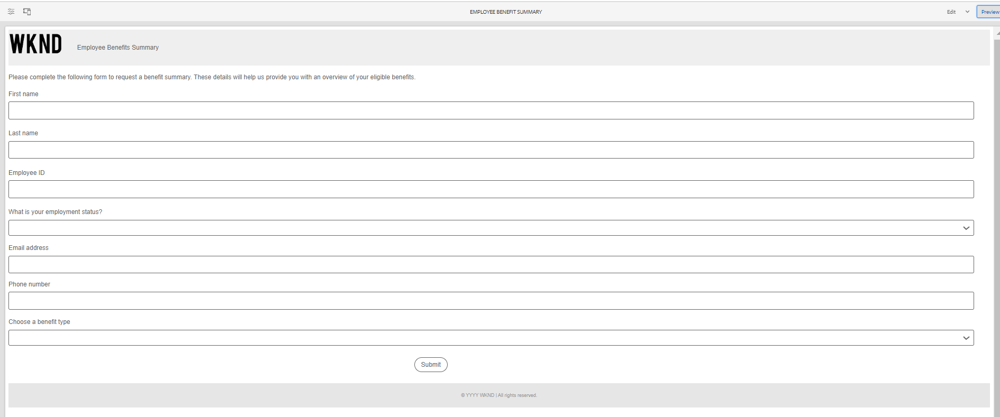

# 核心组件中的示例主题、模板和表单数据模型 {#sample-themes-templates-and-data-models}

AEM Formsas a Cloud Service提供了几个示例参考主题、模板和表单数据模型，可帮助您快速开始使用核心组件创建自适应Forms。 您可以 [启用自适应Forms核心组件](https://experienceleague.adobe.com/docs/experience-manager-cloud-service/content/forms/setup-configure-migrate/enable-adaptive-forms-core-components.html) 在AEM Formsas a Cloud Service和本地开发环境中，获取参考OOTB模板和 [使用和自定义主题](https://experienceleague.adobe.com/docs/experience-manager-cloud-service/content/forms/adaptive-forms-authoring/authoring-adaptive-forms-core-components/create-an-adaptive-form-on-forms-cs/using-themes-in-core-components.html) 在 [!DNL AEM Forms].

参考内容包中包含的示例主题、模板和表单数据模型包括：

| 模板 | 主题 | 表单数据模型 |
---------|----------|---------
| 基本 | 画布 | Microsoft® Dynamics 365 |
| 空白 | WKND | Salesforce |
| 联系我们 | 画架 |  |
| 同意书 | |  |
| 提出投诉 | | |
| 记录服务请求 |  |  |
| 提供反馈 |  |  |
| 福利登记 |  |   |
| 雇员福利汇总 |   |   |
| 申请帐户对帐单 |   |   |
| 联系人详细信息更新 |   |   |
| 安全检查表 |   |   |
| 质量控制检查 |   |   |
| 购买请求 |  |  |

## 示例主题 {#Sample-Themes}

引用主题可帮助您定义表单的样式，而无需具备CSS专业知识，即使您可以根据需要自定义主题。 您可以 [启用自适应Forms核心组件](https://experienceleague.adobe.com/docs/experience-manager-cloud-service/content/forms/setup-configure-migrate/enable-adaptive-forms-core-components.html) 在AEM Formsas a Cloud Service和本地开发环境中获取这些主题，描述如下：

### 画布 {#Canvas}

画布是自适应Forms的默认主题，它强调使用基本颜色、透明度和平面图标。 在下面的屏幕截图中，您可以看到画布主题的外观。

### WKND {#WKND}

WKND主题体现了生动、富有想象力且引人入胜的设计，以您的形式展示时尚的外观。 主题基于 [WKND站点](https://wknd.site/us/en.html) 这是一个旅游和冒险网站 [Adobe Experience Manager核心组件](https://experienceleague.adobe.com/docs/experience-manager-core-components/using/introduction).

### 画架 {#Easel}

画架主题是指易于设置的特定类型的模板设计，并且经过自定义以简化和便于用户使用。 画架主题是基于一个概念，即艺术家在创作画作时，使用便携式展位支撑画布。

## 示例模板 {#Sample-templates}

模板定义了要在表单中复制的初始表单结构、内容和操作，或者使用与表单类似的模板结构，例如同意表单、福利注册表单等。 您可以通过以下方式获取以下模板 [启用自适应Forms核心组件](https://experienceleague.adobe.com/docs/experience-manager-cloud-service/content/forms/setup-configure-migrate/enable-adaptive-forms-core-components.html) 在AEM Formsas a Cloud Service或本地开发环境中。 自适应Forms核心组件中的示例模板包括：

### 基本 {#Basic}

基本模板可帮助您快速创建注册体验表单。 您还可以用它来预览自适应Forms核心组件的功能。 它提供了用于逐节呈现数据的向导布局。

>[!BEGINTABS]

>[!TAB 桌面]

    

>[!TAB 手机]

    

>[!TAB 平板电脑]

    

>[!ENDTABS]

### 空白 {#Blank}

使用空白画布模板从头开始创建自适应表单结构、内容和规则。 未合并任何表组件。

### 帐户对帐单请求 {#Request-for-Account-Statement}

请求帐户对帐单表单，以请求交易对帐单。 本报表详细记录个人的财务交易、活动或其他相关信息。 通过填写此表单，您可以启动获取记录的准确和最新报表的过程。

### 联系人详细信息更新 {#Contact-Details-Update}

地址和联系人详细信息更新表单旨在帮助您更新与订阅或权益相关的个人信息，以确保无缝通信以及无中断访问您获得的服务或权益。

### 安全检查 {#Safety-Inspection}

《安全检查表》是维护安全工作环境的。 通过使用此表格进行定期检查，可以识别潜在危险。 它涵盖了紧急出口、消防安全、电气安全、危险材料、个人防护设备、工作站人机工程学等各个方面。 为员工、访客和客户的安全与福祉着想，并为所有人创造安全的环境。

### 购买请求 {#Purchase-Request}

采购申请表，用于启动采购流程，并允许员工正式申请购买其工作所需的货物或服务。 该表单可捕获基本详细信息，如物料说明、数量、首选供应商（如果适用）、预算分配、采购理由、交货信息和所需批准。 该表单的目的是简化采购流程并记录采购流程，确保对请求的采购进行适当的授权和跟踪。

### 员工福利汇总 {#Employee-Benefits-Summary}

“员工福利汇总”表单用于收集有关个人福利的基本详细信息。 它有助于快速准确地评估覆盖范围，为高效的协助和支持提供全面的概述。

### 福利登记 {#Benefits-Enrollment}

福利登记表单模板，用于从其员工收集有关其首选福利和保险选项的基本信息。 它通常伴随年度福利登记期。

### 质量控制检验 {#Quality-Control-Inspection}

质量控制检查表，用于评估和记录产品或项目的视觉外观、尺寸、功能、文档、测试结果以及总体质量。 它有助于识别缺陷、不符合项以及确保符合质量标准所必需的纠正措施。

### 同意书 {#Consent-Form}

同意书是一种法律文件，在个人或参与者参与特定活动、研究学习、医疗程序或可能涉及其个人信息或权利的任何情况之前，试图获得他们的自愿和知情同意。 同意书的目的是确保透明度，保护参与者的权利，并明确了解个人同意的内容。

### 联系我们 {#Contact-Us}

地址和联系人详细信息更新表单旨在帮助您更新与订阅或权益相关的个人信息，以确保无缝通信以及无中断访问您获得的服务或权益。

### 记录服务请求 {#Log-Service-Request}

向服务提供商请求特定日志记录服务的日志服务请求表单。 该表单用作创建票证的正式请求，该票证记录了特定事件、活动或数据以便监控或跟踪状态。

### 提供反馈 {#Give-Feedback}

“提供反馈”模板，用于向其他人员或团队提供建设性的反馈。 该模板有助于确保反馈清晰、具体和可操作，促进开放式沟通和改进。

## 引用表单数据模型 {#reference-models}

然后，自适应Forms可以与Microsoft® Dynamics 365和Salesforce服务器交互以启用业务工作流。 例如：

* 将数据写入Microsoft® Dynamics 365和Salesforce on Adaptive Form提交。
* 通过表单数据模型中定义的自定义实体在Microsoft®Dynamics 365和Salesforce中写入数据，反之亦然。
* 查询Microsoft®Dynamics 365和Salesforce服务器以获取数据并预填充自适应Forms。
* 从Microsoft®Dynamics 365和Salesforce服务器读取数据。

您可以通过安装 [参考内容包](https://experience.adobe.com/#/downloads/content/software-distribution/en/aemcloud.html?package=/content/software-distribution/en/details.html/content/dam/aemcloud/public/aem-forms-reference-content.ui.content-2.1.0.zip)：

* Microsoft® Dynamics 365
* Salesforce

有关使用这些模型的信息，请参阅 [配置Microsoft®Dynamics 365和Salesforce云服务](https://experienceleague.adobe.com/docs/experience-manager-cloud-service/content/forms/integrate/use-form-data-model/configure-msdynamics-salesforce.html?lang=en#configure-dynamics-cloud-service)
