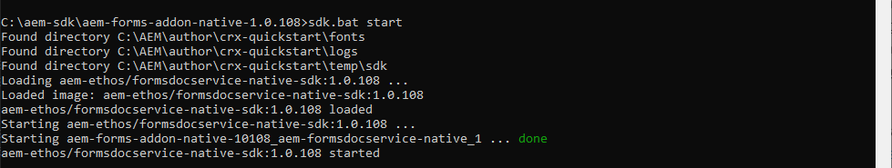

# 为AEM Forms设置本地开发环境 {#overview}

当您设置和配置 [!DNL  Adobe Experience Manager Forms] as a [!DNL  Cloud Service] 环境，您可以在云上设置开发、暂存和生产环境。 此外，您还可以设置和配置本地开发环境。

您可以使用本地开发环境执行以下操作，而无需登录到云开发环境：

* [创建表单](creating-adaptive-form.md) 和相关资产（主题、模板、自定义提交操作等）
* [将 PDF 表单转换为自适应表单](https://experienceleague.adobe.com/docs/aem-forms-automated-conversion-service/using/convert-existing-forms-to-adaptive-forms.html?lang=zh-Hans)
* 构建要生成的应用程序 [客户通信](aem-forms-cloud-service-communications-introduction.md) 按需或批处理模式。

在本地开发实例或应用程序上准备好自适应表单或相关资产以生成后 [客户通信] 准备就绪，可将自适应表单或客户通信应用程序从本地开发环境导出到Cloud Service环境，以便进一步测试或迁移到生产环境。

您还可以在本地开发环境中开发和测试自定义代码，如自定义组件和预填充服务。 测试自定义代码并准备就绪后，您可以使用Cloud Service开发环境的Git存储库来部署自定义代码。

要设置新的本地开发环境并使用它来开发活动，请按列出的顺序执行以下操作：

* [设置开发工具](#setup-development-tools-for-AEM-projects)

* [设置本地创作和发布实例](#set-up-local-experience-manager-environment-for-development)

* [将Forms存档添加到本地开发实例并配置用户](#add-forms-archive-configure-users)

* [为微服务设置本地开发环境](#docker-microservices)

* [设置开发项目](#forms-cloud-service-local-development-environment)

* [设置本地Dispatcher工具](#setup-local-dispatcher-tools)

<!--
You can use the local development environment to create and test Adaptive Forms without connecting to the Cloud Service. [!DNL AEM Forms] provides an SDK to help test all the cloud-ready functionalities on the local development environment. When your forms and related assets are ready and tested on the local development environment, you can import these forms and related assets to an [!DNL AEM Forms] as a Cloud Service instance for publishing. 

You can also develop and test custom code like custom components and prefill service on the local development environment. When the custom code is tested and ready, you can use the Git repository of your [!DNL AEM Forms] as a Cloud Service development environment to deploy the custom code. 

>[!NOTE]
>
> Pre-pilot release does not support using an [!DNL AEM Forms] as a Cloud Service development instance to create forms. You can create forms, related assets, and custom code only on a local development environment.-->

<!--
You configure two types of development environments:

* **[!DNL AEM Forms] as a Cloud Service development environment:** Use the [[!DNL AEM Forms] as a Cloud Service](setup-forms-cloud-service.md) environment to store, manage, and publish Adaptive Forms and related assets. Do not use an [!DNL AEM Forms] as a Cloud Service environment to create Adaptive Forms and related assets <!--, form-centric workflows, a form data model, or to generate a Document of Record. -->

<!--
* **Local development environment:** You can use the local development environment to create and test Adaptive Forms without connecting to the service. Adobe provides a SDK for the local development to help test all the cloud-ready functionalities. 
Use a local development environment:
    
    * To create forms and related assets (themes, templates, custom Submit Actions, and more) and convert PDF forms to Adaptive Forms. After an Adaptive Form or related assets are ready on the local development instance, you can export the Adaptive Form and related assets from the local development environment to an [!DNL AEM Forms] as a Cloud Service development environment for publishing.  
    
    * To update configuration settings and develop and test custom code like custom components and prefill service. When the custom code is tested and ready, you can use the Git repository of your [!DNL AEM Forms] as a Cloud Service development environment to deploy the custom code.  

You can use the local development environment to create and test Adaptive Forms without connecting to the service. Adobe provides a SDK for the local development to help test all the cloud-ready functionalities. When your forms and related assets are ready and tested on the local development environment, you can import these forms and related assets to an [!DNL AEM Forms] as a Cloud Service instance for publishing. 

You can use the [development tools](https://experienceleague.adobe.com/docs/experience-manager-65/developing/devtools/dev-tools.html) to write custom code, customize or create new Adaptive Forms components, create a custom prefill service, or modify default configurations of an [!DNL AEM Forms] as a Cloud Service instance. 

-->

## 先决条件

您需要以下软件来设置本地开发环境。 在开始设置本地开发环境之前，请下载以下内容：

| 软件 | 描述 | 下载链接 |
|---|---|---|
| ADOBE EXPERIENCE MANAGER AS A CLOUD SERVICE SDK | SDK包含 [!DNL Adobe Experience Manager] QuickStart和Dispatcher工具 | 从下载最新的SDK [Software Distribution](#software-distribution) |  |
| Adobe Experience Manager Forms功能存档(AEM Forms附加组件) | 用于创建、设置和优化自适应Forms和其他Adobe Experience Manager Forms功能的工具 | 下载自 [Software Distribution](#software-distribution) |
| （可选）Adobe Experience Manager Forms参考内容 | 用于创建、设置和优化自适应Forms和其他Adobe Experience Manager Forms功能的工具 | 下载自 [Software Distribution](#software-distribution) |
| （可选）Adobe Experience Manager Forms Designer | 用于创建、设置和优化自适应Forms和其他Adobe Experience Manager Forms功能的工具 | 下载自 [Software Distribution](#software-distribution) |

### 从软件分发下载最新版本的软件 {#software-distribution}

要下载最新版本的Adobe Experience Manager as a Cloud Service SDK、Experience Manager Forms功能存档(AEM Forms附加组件)、表单引用资源或Forms Designer，请访问 [Software Distribution](https://experience.adobe.com/#/downloads/content/software-distribution/en/aemcloud.html)：

1. 登录 <https://experience.adobe.com/#/downloads> 使用您的Adobe ID

   >[!NOTE]
   >
   > 必须为AEMas a Cloud Service配置您的Adobe组织才能下载AEMas a Cloud ServiceSDK。

1. 导航至 **[!UICONTROL AEMas a Cloud Service]** 选项卡。
1. 按发布日期降序排序。
1. 单击最新的Adobe Experience Manager as a Cloud Service SDK、Experience Manager Forms功能存档(AEM Forms加载项)、表单引用资源或Forms Designer。
1. 查看并接受EULA。 选择&#x200B;**[!UICONTROL 下载]**&#x200B;按钮。

## 为AEM项目设置开发工具 {#setup-development-tools-for-AEM-projects}

Adobe Experience Manager Forms项目是一个自定义代码库。 它包含通过Cloud Manager部署的代码、配置和内容 [!DNL Adobe Experience Manager] as a Cloud Service。 此 [AEM项目Maven原型](https://github.com/adobe/aem-project-archetype) 提供项目的基线结构。

设置以下开发工具以用于您的 [!DNL Adobe Experience Manager] 开发项目：

* [Java™](https://experienceleague.adobe.com/docs/experience-manager-learn/cloud-service/local-development-environment-set-up/development-tools.html?lang=en#local-development-environment-set-up)
* [Git](https://experienceleague.adobe.com/docs/experience-manager-learn/cloud-service/local-development-environment-set-up/development-tools.html?lang=en#install-git)
* [Node.js (npm)](https://experienceleague.adobe.com/docs/experience-manager-learn/cloud-service/local-development-environment-set-up/development-tools.html?lang=en#node-js)
* [Maven](https://experienceleague.adobe.com/docs/experience-manager-learn/cloud-service/local-development-environment-set-up/development-tools.html?lang=en#install-maven)

有关设置前面提到的开发工具的详细说明，请参阅 [设置开发工具](https://experienceleague.adobe.com/docs/experience-manager-learn/cloud-service/local-development-environment-set-up/development-tools.html).

## 设置本地Experience Manager环境以进行开发

Cloud ServiceSDK提供了一个快速启动文件。 它运行本地版本的Experience Manager。 您可以在本地运行创作实例或发布实例。

虽然QuickStart提供了本地开发体验，但它并没有提供所有功能 [!DNL Adobe Experience Manager] as a Cloud Service。 因此，请始终使用测试您的功能和代码 [!DNL Adobe Experience Manager] 在将功能移至暂存或生产环境之前，需要as a Cloud Service的开发环境。

要安装和配置本地Experience Manager环境，请执行以下步骤：

* [下载并解压缩](https://experience.adobe.com/#/downloads/content/software-distribution/en/aemcloud.html) 该 [!DNL Adobe Experience Manager] AS A CLOUD SERVICE SDK
* [设置创作实例](https://experienceleague.adobe.com/docs/experience-manager-learn/cloud-service/local-development-environment-set-up/aem-runtime.html?lang=en#set-up-local-aem-author-service)
* [设置发布实例](https://experienceleague.adobe.com/docs/experience-manager-learn/cloud-service/local-development-environment-set-up/aem-runtime.html?lang=en#set-up-local-aem-publish-service)

## 将Forms存档添加到本地创作和发布实例，并配置特定于Forms的用户 {#add-forms-archive-configure-users}

按照列出的顺序执行以下步骤，将Forms存档添加到Experience Manager实例并配置特定于表单的用户：

### 安装最新的Forms附加功能存档 {#add-forms-archive}

Adobe Experience Manager Formsas a Cloud Service功能存档提供了用于在本地开发环境中创建、样式化和优化自适应Forms的工具。 安装该包以创建自适应表单并使用的各种其他功能 [!DNL AEM Forms]. 要安装包，请执行以下操作：

1. 下载并提取最新信息 [!DNL AEM Forms] 存档适用于您的操作系统，来自 [Software Distribution](https://experience.adobe.com/#/downloads/content/software-distribution/en/aemcloud.html).

1. 导航到crx-quickstart/install目录。 如果该文件夹不存在，请创建它。

1. 停止AEM实例，放置 [!DNL AEM Forms] 附加功能存档， `aem-forms-addon-<version>.far`，位于install文件夹中。
1. 转到活动命令窗口并按 `Ctrl + C` 命令以重新启动SDK。

   >[!NOTE]
   >
   > 建议使用“Ctrl + C”命令重新启动SDK。 使用替代方法（例如，停止Java进程）重新启动AEM SDK可能会导致AEM开发环境不一致。

### 配置用户和权限 {#configure-users-and-permissions}

创建表单开发人员和表单从业者等用户，并 [将这些用户添加到预定义表单组](https://experienceleague.adobe.com/docs/experience-manager-learn/cloud-service/accessing/aem-users-groups-and-permissions.html?lang=en#accessing) 以向他们提供所需的权限。 下表列出了所有类型的用户和每种表单用户的预定义组：

| 用户类型 | AEM组 |
|---|---|
| 表单操作者/ | [!DNL forms-users] (AEM Forms用户)， [!DNL template-authors]， [!DNL workflow-users]， [!DNL workflow-editors]、和 [!DNL fdm-authors] |
| 表单开发人员 | [!DNL forms-users] (AEM Forms用户)， [!DNL template-authors]， [!DNL workflow-users]， [!DNL workflow-editors]、和 [!DNL fdm-authors] |
| 客户体验主管或UX设计人员 | [!DNL forms-users]、[!DNL template-authors] |
| AEM 管理员 | [!DNL aem-administrators]、[!DNL fd-administrators] |
| 最终用户 | 当用户必须登录才能查看并提交自适应表单时，请将这些用户添加到 [!DNL forms-users] 组。 </br> 当访问自适应Forms不需要用户身份验证时，不要向此类用户分配任何组。 |

<!--  

## Set up a local AEM instance for development

Perform the following steps in the listed order to set up and configure your local development environment:

1. **Set up an AEM author instance:** You require an author instance to create Adaptive Forms. Download and extract the latest AEM SDK archive. Run the quick start file in author run mode to set up an author instance. For detailed instructions, see [default local instance](https://experienceleague.adobe.com/docs/experience-manager-learn/cloud-service/local-development-environment-set-up/aem-runtime.html).  

1. **Install the latest [!DNL AEM Forms] add-on feature archive:** [!DNL AEM Forms] add-on feature archive provides tools to create, style, and optimize Adaptive Forms on the local development environment. Install the package to create an Adaptive Form and use various other features of [!DNL AEM Forms]. To install the package:

    1. Download and extract the latest [!DNL AEM Forms] archive for your operating system from [Software Distribution](https://experience.adobe.com/#/downloads/content/software-distribution/en/aemcloud.html).

    1. Navigate to the crx-quickstart/install directory. If the folder does not exist, create it.

    1. Stop your Cloud ready AEM instance, place the [!DNL AEM Forms] add-on feature archive, `aem-forms-addon-<version>.far`,  in the install folder, and restart the instance.

1. **Configure users and permissions:** Create users like Form Developer and Form Practitioner a nd add these users to pre-defined forms group to provide them required permissions. The table below lists all types of users and pre-defined groups for each type of forms users:
  
    | User Type | AEM Group |
    |---|---|
    | Form Practitioner  | forms-users (AEM Forms Users), template-authors  |
    | Form Developer | forms-users (AEM Forms Users), template-authors |
    | End-User| everyone* |

    `*` When a user should log in to access or submit Adaptive Forms, add such users to the everyone group.  -->

<!--    
### Set up an AEM project for the development tasks related to local AEM 6.5.5 Forms instance

Use this project to update configurations, create overlays, develop custom Adaptive Form components, and custom code using the local development environment. To set up the project:

1. **Install and configure Maven and set up an AEM project based on Apache Maven:** Apache Maven is an open-source tool for managing software projects. It helps automate builds and provides quality project information. It is the recommended build management tool for AEM projects. For detailed instructions to set up an AEM project based on Apache Maven, see [How to Build AEM Projects using Apache Maven](https://experienceleague.adobe.com/docs/experience-manager-65/developing/devtools/ht-projects-maven.html).

1. Configure the project to use [uber-jar](https://experienceleague.adobe.com/docs/experience-manager-65/release-notes/release-notes.html?lang=en#install-aem-forms-jee-installer) version 6.5.5 or later and [[!DNL AEM Forms] Client SDK](https://repo1.maven.org/maven2/com/adobe/aemfd/aemfd-client-sdk/) version 6.0.160 or later.  

1. **Set Up an Integrated Development Environment:**  Set up an IDE of your choice for development, see [Set Up an Integrated Development Environment](https://experienceleague.adobe.com/docs/experience-manager-learn/foundation/development/set-up-a-local-aem-development-environment.html#set-up-an-integrated-development-environment) for detailed instructions.
 -->

## 为记录文档(DoR)设置本地开发环境{#docker-microservices}

AEM Forms as aCloud Service提供了基于Docker的SDK环境，可更轻松地开发记录文档并使用其他微服务。 它使您无需手动配置特定于平台的二进制文件和自适应。 要设置环境，请执行以下操作：

1. 安装和配置Docker：

   * (对于Microsoft® Windows)安装 [Docker桌面](https://www.docker.com/products/docker-desktop). 它配置 `Docker Engine` 和 `docker-compose` 在你的电脑上。

   * (Apple macOS)安装 [适用于Mac的Docker Desktop](https://hub.docker.com/editions/community/docker-ce-desktop-mac). 它包括Docker引擎、Docker CLI客户端、Docker撰写、Docker内容信任、Kubernetes和凭据帮助程序。

   * (对于Linux®)安装 [Docker引擎](https://docs.docker.com/engine/install/#server) 和 [Docker撰写](https://docs.docker.com/compose/install/) 在你的电脑上。

   >[!NOTE]
   >
   > * 对于Apple macOS，请允许列表包含本地AEM创作实例的文件夹。
   >
   > * Docker Desktop for Windows支持两个后端：Hyper-V
   > （旧版）和WSL2（新版）。 文件共享是自动的
   > 使用WSL2（现代）时由Docker管理。 您必须
   > 在使用Hyper-V（旧版）时显式配置文件共享。

1. 创建文件夹（例如aem-sdk）与创作实例和发布实例并行进行。 例如，C:\aem-sdk。

1. 提取 `aem-forms-addon-<version>.zip\aem-forms-addon-native-<version>.zip` 文件。

   

1. 创建环境变量AEM_HOME ，并指向本地AEM Author安装。 例如，C:\aem\author\。

1. 打开sdk.bat或sdk.sh进行编辑。 将AEM_HOME设置为指向本地AEM Author安装。 例如，C:\aem\author\。

1. 打开命令提示符并导航至 `aem-forms-addon-native-<version>` 文件夹。

1. 确保您的本地AEM创作实例已启动并正在运行。 运行以下命令以启动SDK：

   * 在Microsoft® Windows上

     ```shell
     sdk.bat start
     ```


   * Linux®或Apple macOS

   ```Shell
       export AEM_HOME=[local AEM Author installation]
       ./sdk.sh start
   ```

   >[!NOTE]
   >
   > 如果已在sdk.sh文件中定义了环境变量，则可以在命令行中指定该变量。 提供了在命令行定义环境变量的选项，用于执行命令而不更新shell脚本。

   

您现在可以使用本地开发环境呈现记录文档。 要进行测试，请将XDP文件上传到您的环境并进行渲染。 例如， <http://localhost:4502/libs/xfaforms/profiles/default.print.pdf?template=crx:///content/dam/formsanddocuments/cheque-request.xdp> 将XDP文件转换为PDF文档。

## 为基于Experience Manager原型的Forms设置开发项目 {#forms-cloud-service-local-development-environment}

使用此项目可在本地创建自适应Forms、部署配置更新、叠加、创建自定义自适应表单组件、测试和自定义代码 [!DNL Experience Manager Forms] SDK。 在本地测试后，您可以将项目部署到  [!DNL Experience Manager Forms] as a Cloud Service的生产和非生产环境。 在部署项目时，还会部署以下AEM Forms资源：

| 主题 | 模板 | 表单数据模型 |
---------|----------|---------
| Canvas 3.0 | 基本 | Microsoft® Dynamics 365 |
| 宁静 | 空白 | Salesforce |
| 城镇 |   |  |
| 超海洋 |  |  |
| 贝里尔 |  |  |

>[!NOTE]
>
> 设置基于AEM Archetype版本30或更高版本的项目以获取并使用Microsoft®Dynamics 365和Salesforce表单数据模型与AEM Formsas a Cloud Service。
> 设置基于AEM Archetype版本32或更高版本的项目，以获取并使用AEM Formsas a Cloud Service的Tranquil、Urbane和Ultraminary主题。

要设置项目，请执行以下操作：

1. **在本地开发实例上克隆Cloud Manager Git存储库：**  您的Cloud Manager Git存储库包含一个默认的AEM项目。 它基于 [AEM原型](https://github.com/adobe/aem-project-archetype/). 使用Cloud Manager UI中的自助Git帐户管理克隆Cloud Manager Git存储库，将项目引入本地开发环境。 有关访问存储库的详细信息，请参阅 [访问存储库](https://experienceleague.adobe.com/docs/experience-manager-cloud-manager/using/managing-code/accessing-repos.html).

<!-- 1. 
After the repository is cloned, [integrate your Git repo with Cloud Manager](https://experienceleague.adobe.com/docs/experience-manager-cloud-manager/using/managing-code/setup-cloud-manager-git-integration.html)

**Make cloned AEM project compatible with [!DNL AEM Forms] as a Cloud Service:** Remove uber-jar and other non-cloud dependencies from the pom.xml files of the project. You can refer the pom.xml files of the [sample AEM project](assets/FaaCSample.zip) for the list of required dependencies and update your AEM project accordingly. You can also refer [AEM Project Structure](https://experienceleague.adobe.com/docs/experience-manager-cloud-service/content/implementing/developing/aem-project-content-package-structure.html) to learn changes required to make an AEM project compatible with AEM as a Cloud Service.  -->

1. **创建 [!DNL Experience Manager Forms] as a [Cloud Service] 项目：** 创建 [!DNL Experience Manager Forms] as a [Cloud Service] 基于最新项目的项目 [AEM原型](https://github.com/adobe/aem-project-archetype) 或更高版本。 原型可帮助开发人员轻松开始开发 [!DNL AEM Forms] as a Cloud Service。 它还包含一些示例主题和模板，可帮助您快速入门。

   打开命令提示符并运行以下命令以创建 [!DNL Experience Manager Forms] as a Cloud Service项目。

   ```shell
   mvn -B org.apache.maven.plugins:maven-archetype-plugin:3.2.1:generate -D archetypeGroupId=com.adobe.aem -D archetypeArtifactId=aem-project-archetype -D archetypeVersion="41" -D appTitle=mysite -D appId=mysite -D groupId=com.mysite -D includeFormsenrollment="y" -D aemVersion="cloud"
   ```

   更改 `appTitle`， `appId`、和 `groupId` （在上面命令中）以反映环境。 此外，将includeFormsenrollment、includeFormscommunications和includeFormsheadless的值设置为 `y` 或 `n` 取决于您的许可证和要求。 要基于核心组件创建自适应Forms，必须使用includeFormsheadless。

   * 使用 `includeFormsenrollment=y` 选项以包括创建自适应Forms所需的Forms特定配置、主题、模板、核心组件和依赖项。 如果您使用Forms Portal，请设置 `includeExamples=y` 选项。 它还将Forms Portal核心组件添加到项目中。

   * 使用 `includeFormscommunications=y` 选项以包括Forms核心组件和包含客户通信功能所需的依赖项。

     >[!WARNING]
     >
     >* 使用版本45创建原型项目时， [AEM原型项目文件夹]/pom.xml最初将forms核心组件版本设置为2.0.64。在构建或部署原型项目之前，请将Forms核心组件版本更新为2.0.62。

1. 将项目部署到您的本地开发环境。 您可以使用以下命令部署到本地开发环境

   `mvn -PautoInstallPackage clean install`

   有关命令的完整列表，请参见 [构建和安装](https://experienceleague.adobe.com/docs/experience-manager-core-components/using/developing/archetype/using.html?lang=en#building-and-installing)

1. [将代码部署到您的 [!DNL AEM Forms] as a Cloud Service环境](https://experienceleague.adobe.com/docs/experience-manager-cloud-service/implementing/deploying/overview.html?lang=en#customer-releases).

## 设置本地Dispatcher工具 {#setup-local-dispatcher-tools}

Dispatcher是一个Apache HTTP Web服务器模块，在CDN和AEM发布层之间提供了一个安全和性能层。 Dispatcher是整个Experience Manager架构的一个组成部分，应当是本地开发环境的一部分。

执行以下步骤以配置本地Dispatcher，然后向其添加特定于Forms的规则：

### 设置本地调度程序 {#setup-local-dispatcher}

此 [!DNL Experience Manager] as a Cloud ServiceSDK包括推荐的Dispatcher工具版本，该版本便于在本地配置、验证和模拟Dispatcher。 Dispatcher工具基于Docker，提供了命令行工具，用于将Apache HTTP Web Server和Dispatcher配置文件转换为兼容的格式并将其部署到Docker容器中运行的Dispatcher。

Dispatcher上的缓存允许 [!DNL AEM Forms] 在客户端预填充自适应Forms。 它提高了预填充表单的渲染速度。

有关设置Dispatcher的详细说明，请参阅 [设置本地Dispatcher工具](https://experienceleague.adobe.com/docs/experience-manager-learn/cloud-service/local-development-environment-set-up/dispatcher-tools.html?lang=en#local-development-environment-set-up)

### 将特定于Forms的规则添加到Dispatcher {#forms-specific-rules-to-dispatcher}

执行以下步骤可为Experience Manager Formsas a Cloud Service配置Dispatcher缓存：

1. 打开您的AEM项目并导航到 `\src\conf.dispatcher.d\available_farms`
1. 创建 `default.farm` 文件。 例如：`forms.farm`。
1. 打开已创建的 `forms.farm` 文件来编辑和替换以下代码：

   ```json
   #/ignoreUrlParams {
   #/0001 { /glob "*" /type "deny" }
   #/0002 { /glob "q" /type "allow" }
   #}
   ```

   替换为

   ```json
   /ignoreUrlParams {
   /0001 { /glob "*" /type "deny" }
   /0002 { /glob "dataRef" /type "allow" }
   }
   ```

1. 保存并关闭文件。
1. 转到 `conf.d/enabled_farms` 并创建指向 `forms.farm` 文件。
1. 编译项目并将其部署到您的 [!DNL AEM Forms] as a Cloud Service的环境。

### 有关缓存的注意事项 {#considerations-about-caching}

* 调度程序缓存允许 [!DNL AEM Forms] 在客户端预填充自适应Forms。 它提高了预填充表单的渲染速度。
* 默认情况下，缓存受保护内容功能处于禁用状态。 要启用该功能，您可以按照 [缓存受保护内容](https://experienceleague.adobe.com/docs/experience-manager-dispatcher/using/configuring/permissions-cache.html?lang=en) 文章
* Dispatcher可能无法使某些自适应Forms和相关自适应Forms失效。 要解决此类问题，请参阅 [[!DNL AEM Forms] 缓存](troubleshooting-caching-performance.md) 在疑难解答部分。
* 缓存本地化的自适应Forms：
   * 使用URL格式 `http://host:port/content/forms/af/<afName>.<locale>.html` 请求自适应表单的本地化版本，而不是 `http://host:port/content/forms/af/afName.html?afAcceptLang=<locale>`
   * 默认情况下，“浏览器区域设置”选项处于禁用状态。 要更改浏览器区域设置设置，
* 当您使用URL格式时 `http://host:port/content/forms/af/<adaptivefName>.html`，并且在配置管理器中禁用使用浏览器区域设置，则会提供自适应表单的非本地化版本。 非本地化语言是开发自适应表单时使用的语言。 不会考虑为浏览器配置的区域设置（浏览器区域设置），并且会提供自适应表单的非本地化版本。
* 当您使用URL格式时 `http://host:port/content/forms/af/<adaptivefName>.html`，并且在配置管理器中启用了使用浏览器区域设置，则会提供自适应表单的本地化版本（如果可用）。 本地化的自适应表单的语言基于为您的浏览器配置的区域设置（浏览器区域设置）。 它可能会导致 [仅缓存自适应表单的第一个实例]. 要防止问题在实例中发生，请参阅 [仅缓存自适应表单的第一个实例](troubleshooting-caching-performance.md) 在疑难解答部分。

您的本地开发环境已准备就绪。

## 在 AEM Forms as a Cloud Service 和本地开发环境上启用自适应表单核心组件

在AEM Formsas a Cloud Service上启用自适应Forms核心组件，允许您使用AEM FormsCloud Service实例在多个渠道中创建、发布和交付基于核心组件的自适应Forms和Headless Forms。 您需要具备启用了自适应表单核心组件的环境才能使用 Headless 自适应表单。

有关说明，请参阅 [在AEM Formsas a Cloud Service和本地开发环境中启用自适应Forms核心组件](/help/forms/enable-adaptive-forms-core-components.md)


## 升级本地开发环境 {#upgrade-your-local-development-environment}

将SDK升级到新版本需要替换整个本地开发环境，从而导致本地存储库中所有代码、配置和内容的丢失。 确保任何不应销毁的代码、配置或内容都会安全提交到Git，或从本地Experience Manager实例中导出为CRX包。

### 如何在升级SDK时避免内容丢失 {#avoid-content-loss-when-upgrading--SDK}

升级SDK会有效地创建全新的创作和发布实例，包括新的存储库([设置AEM项目](#forms-cloud-service-local-development-environment))，这意味着对先前SDK存储库所做的任何更改都将丢失。 有关帮助在SDK升级之间保留内容的可行策略，请参阅 [如何避免在升级AEM SDK时丢失内容](https://experienceleague.adobe.com/docs/experience-manager-learn/cloud-service/local-development-environment-set-up/aem-runtime.html?lang=en#optional-local-aem-runtime-set-up-tasks)

<!--When you update any  Forms-specifc configuration, create overlays, develop custom Adaptive Form components, or develop and test any custom code in AEM project for the development tasks related to local development instance, use the AEM project cloned from the Cloud Manager Git repository to [deploy the custom code and other changes to your [!DNL AEM Forms] as a Cloud Service's production or non-production environment](https://video.tv.adobe.com/v/30191?quality=9).

## Upgrade your local development environment {#update-local-setup}

Update the local AEM setup (AEM SDK) to latest version at least monthly on, or shortly after, the last Thursday of each month, which is the release cadence for AEM as a Cloud Service "feature releases". You can download local AEM SDK from [Software Distribution](https://experience.adobe.com/#/downloads/content/software-distribution/en/aemcloud.html).

Updating the AEM SDK to a new version requires replacing the entire local development environment, resulting in a loss of all code, configuration and content in the local AEM repositories. Ensure that any code, config or content that should not be destroyed is safely committed to Git, or exported from the local AEM instance as AEM Packages.

### How to avoid content loss when upgrading the AEM SDK {#avoid-content-loss-when-upgrading--AEM-SDK}

Upgrading the AEM SDK is effectively creating a brand new AEM runtime ([Set up a local AEM instance](setup-forms-cloud-service.md)), including a new repository ([Set up AEM project](#forms-cloud-service-local-development-environment)), meaning any changes made to a prior AEM SDK's repository are lost. The following are viable strategies for aiding in persisting content between AEM SDK upgrades, and can be used discretely or in concert:

1. Create a content package dedicated to containing the sample content to aid in development and maintain it in Git. Any content that should be persisted through AEM SDK upgrades would be persisted into this package and re-deployed after upgrading the AEM SDK.
1. Use [oak-upgrade](https://jackrabbit.apache.org/oak/docs/migration.html) with the `includepaths` directive, to copy content from the prior AEM SDK repository to the new AEM SDK repository.
1. Back up any content using AEM Package Manager and content packages on the prior AEM SDK and re-install them on the new AEM SDK.

Remember, using the above approaches to maintain code between AEM SDK upgrades, indicates a development anti-pattern. Non-disposable code should originate in your Development IDE and flow into AEM SDK via deployments.

For information about troubleshooting, stopping local AEM environment, run modes, and deployment, see [Set up local AEM Runtime](https://experienceleague.adobe.com/docs/experience-manager-learn/cloud-service/local-development-environment-set-up/aem-runtime.html#local-development-environment-set-up).-->

### 备份特定于Forms的内容并将其导入到新的SDK环境中 {#backup-and-import-Forms-specific-content-to-new-SDK-environment}

要将资产从现有SDK备份并移动到新的SDK环境，请执行以下操作：

* 创建现有内容的备份。

* 设置全新SDK环境。

* 将备份导入到新的SDK环境。

### 创建现有内容的备份 {#create-backup-of-your-existing-content}

备份自适应Forms、模板、表单数据模型、主题、配置和自定义代码。 您可以执行以下操作来创建备份：

1. [下载](import-export-forms-templates.md#manage-forms-and-related-assets) 自适应Forms、主题和PDF forms。
1. 导出自适应表单模板。

1. 下载表单数据模型

1. 导出可编辑的模板、云配置和工作流模型。 要从现有SDK中导出前面提到的所有项目，请创建 [CRX包](https://experienceleague.adobe.com/docs/experience-manager-cloud-service/implementing/deploying/overview.html) 的过滤器：

   * /conf/ReferenceEditableTemplates
   * /conf/global/settings/cloudconfigs
   * /conf/global/settings/wcm
   * /var/workflow/model
   * /conf/global/settings/workflow
1. 从本地开发环境导出电子邮件配置、提交和预填充操作代码。 要导出这些设置和配置，请在本地开发环境中创建以下文件夹和文件的副本：

   * `[Archetype Project in Cloud Service Git]/core/src/main/java/com/<program name>/core/service`
   * `[Archetype Project in Cloud Service Git] /core/src/main/java/com/<program name>/core/servlets/FileAttachmentServlet.java`
   * `[Archetype Project in Cloud Service Git]/ui.apps/src/main/content/jcr_root/apps/<program name>/config`

### 将备份导入到新的SDK环境 {#import-the-backup-to-your-new-SDK-environment}

将自适应Forms、模板、表单数据模型、主题、配置和自定义代码导入新环境。 您可以执行以下操作来导入备份：

1. [导入](import-export-forms-templates.md#manage-forms-and-related-assets) 自适应Forms、主题和新SDK环境的PDF forms。
1. 将自适应表单模板导入到新的SDK环境。

1. 将表单数据模型上传到新的SDK环境。

1. 导入可编辑的模板、云配置和工作流模型。 要导入新SDK环境中前面提到的所有项目，请将包含这些项目的CRX包导入到新SDK环境中。

1. 从本地开发环境导入电子邮件配置、提交和预填充操作代码。 要导入这些设置和配置，请将以下文件从旧的原型项目放置到新原型项目中：

   * `[Archetype Project in Cloud Service Git]/core/src/main/java/com/<program name>/core/service`
   * `[Archetype Project in Cloud Service Git] /core/src/main/java/com/<program name>/core/servlets/FileAttachmentServlet.java`
   * `[Archetype Project in Cloud Service Git]/ui.apps/src/main/content/jcr_root/apps/<program name>/config`

您的新环境现在具有旧环境的表单和相关资源。
