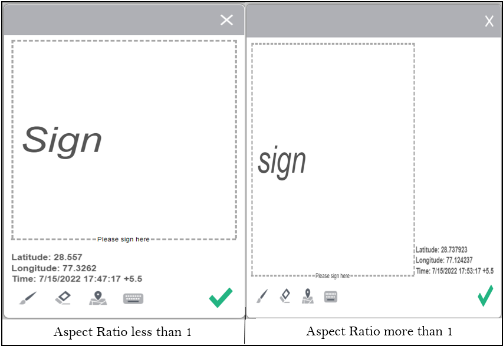

# 使用涂鸦签名对表单进行电子签名{#apply-electronic-signatures-to-a-form-using-deprecated-scribble-signatures}

Adobe 建议使用现代、可扩展的数据捕获[核心组件](https://experienceleague.adobe.com/docs/experience-manager-core-components/using/adaptive-forms/introduction.html)，以[创建新的自适应表单](/help/forms/creating-adaptive-form-core-components.md)或[将自适应表单添加到 AEM Sites 页面](/help/forms/create-or-add-an-adaptive-form-to-aem-sites-page.md)。这些组件代表有关创建自适应表单的重大改进，确保实现令人印象深刻的用户体验。本文介绍了使用基础组件创作自适应表单的旧方法。

| 版本 | 文章链接 |
| -------- | ---------------------------- |
| AEM 6.5 | [单击此处](https://experienceleague.adobe.com/docs/experience-manager-65/forms/adaptive-forms-basic-authoring/signing-forms-using-scribble.html) |
| AEM as a Cloud Service | 本文 |

您可以使用&#x200B;**涂写签名**&#x200B;组件在自适应表单上绘制（涂写）签名。<!-- The Signature step component displays a PDF version of the Adaptive Form. You require a Document of Record option enabled or form template based Adaptive Forms to use the Signature step component. -->

## 签名窗口中可用的各种选项

* **A：**&#x200B;单击&#x200B;**画笔**&#x200B;图标在画布上绘制您的签名。
* **B：**&#x200B;单击&#x200B;**清除**&#x200B;图标以清除画布上的签名。
* **C：**&#x200B;单击&#x200B;**地理位置**&#x200B;图标可添加地理位置以及签名。
* **D：**&#x200B;单击&#x200B;**键盘**&#x200B;图标在画布上键入您的姓名。

在涂鸦签名窗口中选择完成图标后，便无法编辑该签名。 如果想要编辑签名，则必须忽略当前签名并使用上面的“画笔/键盘”选项重新签名。

您可以选择&#x200B;**配置** 图标来设置涂写签名画布的长宽比。
* 当Scribble签名画布的长宽比小于1时，地理位置信息将添加到Scribble签名画布的底部。

* 当Scribble签名画布的长宽比大于1时，地理位置信息将添加到Scribble签名画布的右侧。

>[!NOTE]
>
>签名始终以PNG格式保存。
>

## 配置自适应表单以使用涂写签名 {#configure-an-adaptive-form-to-use-scribble-signature}

1. 在编辑模式下打开自适应表单。
1. 将&#x200B;**涂写签名**&#x200B;组件从组件浏览器拖放到自适应表单。
1. 选择&#x200B;**配置** 图标。 它打开属性浏览器并显示涂写签名组件的属性。 [按照下一节中的讨论配置Scribble签名的属性](#properties-of-scribble-signature-component)。

   

1. 选择完成图标以保存更改。 已成功配置签名。

## 配置涂写签名组件的属性

通过“配置”对话框，您可以轻松为访客自定义涂写签名组件。

### “基本”选项卡

* **名称** - 可在表单和规则编辑器中通过唯一名称轻松地标识表单组件，但该名称不得包含空格或特殊字符。

* **标题** - 通过组件的标题，可轻松地标识表单中的组件，默认情况下，标题显示在该组件的顶部。如果不添加标题，则显示该组件的名称而非标题文本。

* **允许标题为富文本**：此功能使用户能够格式化纯文本标题，结合粗体、斜体、下划线文本、各种字体、字体大小、颜色和附加选项等功能，以增强视觉呈现和定制效果。它提供了更大的灵活性以及对创作的控制度，使标题在文档、网站或应用程序中脱颖而出。\
  选中&#x200B;**允许标题为富文本**&#x200B;复选框后，可以看到格式化选项，用于设置组件标题的样式。要访问所有可用的格式选项，您可以点击选项卡。

  

* **隐藏标题** - 选中此选项可隐藏该组件的标题。
* **必填字段** — 选择将该字段设为必填字段的选项。
* **必填字段消息** - **必填字段消息**&#x200B;是当用户尝试提交表单但未填写必填字段时向用户显示的可自定义消息。
* **数据模型绑定引用** — 绑定引用是对存储在外部数据源中并在表单中使用的数据元素的引用。 通过绑定引用，可动态地将数据绑定到表单字段，以使表单可显示来自数据源的最新数据。例如，可使用绑定引用，根据输入到表单中的客户 ID，在该表单中显示该客户的姓名和地址。还可使用绑定引用，通过输入到表单中的数据更新数据源。这样通过 AEM Forms 即可创建与外部数据源交互的表单，从而为收集和管理数据提供一种无缝的用户体验。
* **隐藏对象** — 选择该选项以在表单中隐藏该组件。 仍可访问该组件作其他用途，如在规则编辑器中使用它进行计算。当需要存储用户无需看到或直接更改的信息时，此项很有用。
* **禁用对象** — 选择选项以禁用该组件。 被禁用的组件不再活跃或最终用户无法编辑它。用户可看到但无法修改字段的值。仍可访问该组件作其他用途，如在规则编辑器中使用它进行计算。
* **宽高比** — 涂写签名组件中的宽高比定义了宽度和高度之间的比例关系。
* **字段布局** - **字段布局**&#x200B;选项确定表单元素(包括标签（标题）和错误消息)相对于组件的放置方式。 作为小组件顶部的&#x200B;**标题和错误**&#x200B;将字段的标题（标签）和错误消息放置在组件上方。 **从自适应表单配置继承**&#x200B;使用自适应表单配置中指定的默认字段布局设置。
* **CSS类** - **CSS类**&#x200B;允许您通过分配样式表中定义的一个或多个CSS类，将自定义样式应用到组件。 它支持在自适应表单中进行一致的样式和布局自定义。

### 帮助内容

* **简短描述** - 简短描述是一段简短的文字说明，其中提供关于特定表单字段的用途的其他信息或阐述。它帮助用户了解应将什么类型的数据输入到字段中，并可提供准则或示例以帮助确保所输入的信息有效且符合预期的标准。默认情况下，简短描述保持隐藏状态。启用&#x200B;**始终显示简短描述**&#x200B;选项以在组件下方显示它。

* **始终显示简短描述** - 启用该选项以在组件下方显示简短描述。

* **详细描述** — 它是指为帮助用户正确填写表单字段而提供给用户的附加信息或指南。 当用户单击组件旁的“帮助”图标 (i) 时显示它。它提供比表单字段的标签或占位符文本更详细的信息，旨在帮助用户了解字段的要求或限制。 它还可提供建议或示例，以使填写表单更轻松且更准确。

### “辅助功能”选项卡 {#accessibility}

在&#x200B;**辅助功能**&#x200B;选项卡上，为组件的 [ARIA 辅助功能](https://www.w3.org/WAI/standards-guidelines/aria/)标签设置值。使用屏幕阅读器文本时有多个选项：

* **屏幕Reader优先顺序** — 屏幕Reader优先顺序是指专门供视障人士使用的辅助技术（如屏幕阅读器）阅读的其他文本。 此文本提供表单字段用途的音频描述，并可包括关于字段的标题、描述、名称和任何相关消息（自定义文本）的信息。屏幕阅读器文本帮助确保包括视障用户在内的所有用户均可访问表单，并使其完整地了解表单字段及其要求。

   * **自定义文本**：选中此选项以将自定义文本用于 ARIA 辅助功能标签。选中此选项将显示“自定义文本”对话框。可在“自定义文本”对话框中添加相关信息。
   * **简短说明**：选择此选项可使用ARIA辅助功能标签的说明。
   * **标题**：选中此选项以将标题用于 ARIA 辅助功能标签。
   * **名称**：选中此选项以将名称用于 ARIA 辅助功能标签。
   * **无**：如果不想为 ARIA 辅助功能标签添加任何内容，请选中此选项。

<!--

 * **Element Name**: Specify name of the component.

    * **Title:** Specify unique title of the component.
    * **Template message:** Specify the message to be displayed while the signature PDF is being loaded. Adobe Sign services take some time to prepare and load signature PDF.
    * **Signing Service:** Select the **Scribble Signature** option.

    * **CSS Class**: Specify CSS class of the client library, if any. Adobe recommends using [themes](themes.md) and [in-line styles](inline-style-adaptive-forms.md) instead of CSS Class.
## Sign an Adaptive Form using Scribble Signature {#sign-an-adaptive-form-using-scribble-signature}

1. After you fill an Adaptive Form and reach the Signature Step page, the signature screen is displayed.

   

1. Click **[!UICONTROL Sign]**. The scribble sign dialog appears. Sign the form and click the Done  icon to save the signature.

   

1. Click complete to finish the signing process.

   

The signatures are added to the form and the form control moves to the next panel. -->

## 另请参阅 {#see-also}

{{see-also}}