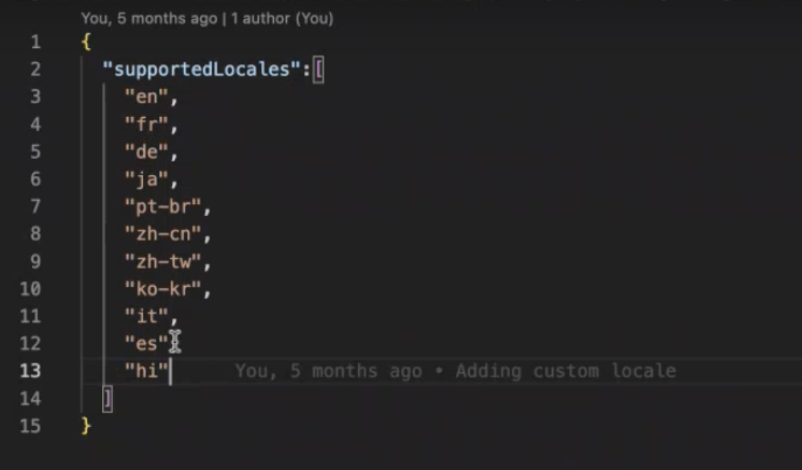

# 为基于核心组件的自适应Forms添加区域设置 {#supporting-new-locales-for-adaptive-forms-localization}

| 版本 | 文章链接 |
| -------- | ---------------------------- |
| Foundation 组件 | [单击此处](supporting-new-language-localization.md) |
| 核心组件 | 本文 |

AEM Forms为英语(en)、西班牙语(es)、法语(fr)、意大利语(it)、德语(de)、日语(ja)、葡萄牙语 — 巴西语(pt-BR)、中文(zh-CN)、中文 — 台湾(zh-TW)和韩语(ko-KR)语言环境提供开箱即用支持。 您还可以添加对更多区域设置的支持，如印地语(hi_IN)。

## 如何为自适应表单选择区域设置？

在开始为自适应Forms添加区域设置之前，请先了解如何为自适应表单选择区域设置。 在呈现自适应表单时，可通过两种方法识别和选择区域设置：

* **使用 `locale` URL中的选择器**：在渲染自适应表单时，系统通过检查 [区域设置] 自适应表单URL中的选择器。 URL遵循以下格式： http:/[AEM Forms服务器URL]/content/forms/af/[afName].[区域设置].html？wcmmode=disabled. 对的使用 [区域设置] 选择器允许缓存自适应表单。 例如，URL `www.example.com/content/forms/af/contact-us.hi.html?wcmmmode=disabled` 以印地语呈现表单。

* 按照以下列出的顺序检索参数：

   * **使用 `afAcceptLang`请求参数**：要覆盖用户的浏览器区域设置，您可以传递afAcceptLang请求参数。 例如， `https://'[server]:[port]'/<contextPath>/<formFolder>/<formName>.html?wcmmode=disabled&afAcceptLang=ca-fr` URL强制AEM Forms服务器以加拿大法文区域设置呈现表单。

   * **使用浏览器区域设置（Accept-Language标头）**：系统还会考虑用户的浏览器区域设置，在使用请求的请求中指定了该区域设置 `Accept-Language` 标题。

  如果所请求区域设置的客户端库（本文稍后将介绍创建和使用库的过程）不可用，则系统会检查区域设置中是否存在语言代码的客户端库。 例如，如果请求的区域设置为 `en_ZA` （南非英语），并且没有客户库 `en_ZA`，则自适应表单会使用en（英语）的客户端库（如果可用）。 如果两者都未找到，则自适应表单会使用词典查找 `en` 区域设置。

  标识了区域设置后，自适应表单会选择相应的表单特定词典。 如果未找到所请求区域设置的词典，则默认使用创作自适应表单时所用语言的词典。

  如果区域设置信息不可用，则自适应表单会以其原始语言（在表单开发期间使用的语言）显示


## 前提条件 {#prerequistes}

开始添加区域设置之前：

* 安装纯文本编辑器(IDE)以便于编辑。 本文档中的示例基于 [Microsoft® Visual Studio代码](https://code.visualstudio.com/download).
* 安装版本 [Git](https://git-scm.com)，如果您的计算机上不可用。
* 克隆 [自适应Forms核心组件](https://github.com/adobe/aem-core-forms-components) 存储库。 要克隆存储库：
   1. 打开命令行或终端窗口，然后导航到存储库的存储位置。 例如，`/adaptive-forms-core-components`
   1. 运行以下命令以克隆存储库：

      ```SHELL
          git clone https://github.com/adobe/aem-core-forms-components.git
      ```

  存储库包括添加区域设置所需的客户端库。

  成功执行命令后，存储库将克隆到 `aem-core-forms-components` 个文件夹。 在文章的其余部分中，该文件夹重命名为， [自适应Forms核心组件存储库].


## 添加区域设置 {#add-localization-support-for-non-supported-locales}

要添加新区域设置支持，请执行以下步骤：


### 1.克隆AEMas a Cloud Service的Git存储库 {#clone-the-repository}

1. 打开命令行并选择一个目录以存储AEM Formsas a Cloud Service的存储库，例如 `/cloud-service-repository/`.

1. 运行以下命令以克隆存储库：

   ```SHELL
   git clone https://git.cloudmanager.adobe.com/<my-org>/<my-program>/
   ```

   替换 `<my-org>` 和 `<my-program>` 在上面URL中，使用您的组织名称和项目名称。 有关获取组织名称、程序名称或Git存储库的完整路径以及克隆存储库所需的凭据的详细说明，请参阅 [访问Git](https://experienceleague.adobe.com/docs/experience-manager-cloud-service/content/onboarding/journey/developers.html#accessing-git) 文章。

   成功完成命令后，将创建一个文件夹 `<my-program>` 创建。 它包含从Git存储库克隆的内容。 在文章的其余部分中，该文件夹重命名为， `[AEM Forms as a Cloud Service Git repository]`.


### 2.将新区域设置添加到指南本地化服务 {#add-a-locale-to-the-guide-localization-service}

1. 以纯文本编辑器打开上一部分中克隆的存储库文件夹。
1. 导航到 `[AEM Forms as a Cloud Service Git repository]/ui.config/src/main/content/jcr_root/apps/<appid>/osgiconfig/config` 文件夹。您可以找到 `<appid>` 在 `archetype.properties` 项目的文件。
1. 打开 `[AEM Forms as a Cloud Service Git repository]/ui.config/src/main/content/jcr_root/apps/<appid>/osgiconfig/config/Guide Localization Service.cfg.json` 文件以供编辑。如果文件不存在，请创建该文件。 具有支持的区域设置的示例文件如下所示：

   

1. 添加 [语言的区域设置代码](https://en.wikipedia.org/wiki/List_of_ISO_639-1_codes) 例如，您想要添加的内容，为印地语添加“hi”。
1. 保存并关闭该文件。

### 3.创建客户端库以添加区域设置

AEM Forms提供了一个示例客户端库，以帮助您轻松添加新区域设置。 您可以下载并添加 `clientlib-it-custom-locale` 客户端库来自 [自适应Forms核心组件存储库] 在GitHub上访问Formsas a Cloud Service存储库。 要添加客户端库，请执行以下步骤：

1. 打开您的 [自适应Forms核心组件存储库] 在纯文本编辑器中。 如果没有克隆存储库，请参阅 [先决条件](#prerequistes) 有关克隆存储库的说明。
1. 导航至 `/aem-core-forms-components/it/apps/src/main/content/jcr_root/apps/forms-core-components-it/clientlibs` 目录。
1. 复制 `clientlib-it-custom-locale` 目录。
1. 导航到 `[AEM Forms as a Cloud Service Git repository]/ui.apps/src/main/content/jcr_root/apps/moonlightprodprogram/clientlibs` 并粘贴 `clientlib-it-custom-locale` 目录。


### 4.创建特定于区域设置的文件 {#locale-specific-file}

1. 导航至 `[AEM Forms as a Cloud Service Git repository]/ui.apps/src/main/content/jcr_root/apps/<program-id>/clientlibs/clientlib-it-custom-locale/resources/i18n/`
1. 找到 [GitHub上的英语区域设置.json文件](https://github.com/adobe/aem-core-forms-components/blob/master/ui.af.apps/src/main/content/jcr_root/apps/core/fd/af-clientlibs/core-forms-components-runtime-all/resources/i18n/en.json)，其中包含产品中包含的最新默认字符串集。
1. 为您的特定区域设置创建一个.json文件。
1. 在新创建的.json文件中，镜像了英语区域设置文件的结构。
1. 将.json文件中的英语字符串替换为语言的相应本地化字符串。
1. 保存并关闭文件。


### 5.向词典添加区域设置支持 {#add-locale-support-for-the-dictionary}

仅当满足以下条件，才执行此步骤： `<locale>` 您添加的内容不属于 `en`， `de`， `es`， `fr`， `it`， `pt-br`， `zh-cn`， `zh-tw`， `ja`， `ko-kr`.

1. 导航到 `[AEM Forms as a Cloud Service Git repository]/ui.content/src/main/content/jcr_root/etc/` 文件夹。

1. 创建 `etc` 下的文件夹 `jcr_root` 文件夹（如果尚未存在）。

1. 创建文件夹 `languages` 在 `etc` 文件夹（如果尚未存在）。

   

1. 创建 `.content.xml` 文件位于 `languages` 文件夹。 将以下内容添加到文件：

   ```XML
   <?xml version="1.0" encoding="UTF-8"?>
   <jcr:root xmlns:jcr="http://www.jcp.org/jcr/1.0" xmlns:nt="http://www.jcp.org/jcr/nt/1.0"
   jcr:primaryType="nt:unstructured"
   languages="[de,es,fr,it,pt-br,zh-cn,zh-tw,ja,ko-kr]"/>
   ```

1. 将区域设置代码添加到 `languages` 属性。 例如，在以下示例代码中添加了hindi。


   ```XML
   <?xml version="1.0" encoding="UTF-8"?>
   <jcr:root xmlns:jcr="http://www.jcp.org/jcr/1.0" xmlns:nt="http://www.jcp.org/jcr/nt/1.0"
   jcr:primaryType="nt:unstructured"
   languages="[de,es,fr,it,pt-br,zh-cn,zh-tw,ja,ko-kr,hi]"/>
   ```

1. 将新创建的文件夹添加到 `filter.xml` 下 `/ui.content/src/main/content/meta-inf/vault/filter.xml` 作为：

   ```
   <filter root="/etc/languages"/>
   ```

   

### 6.提交更改并部署管道 {#commit-changes-in-repo-deploy-pipeline}

添加新区域设置后，将更改提交到GIT存储库。 使用全栈管道部署代码。 学习 [如何设置管道](https://experienceleague.adobe.com/docs/experience-manager-cloud-service/content/onboarding/journey/developers.html?lang=en#setup-pipeline) 以添加新的区域设置支持。

管道运行成功后，新添加的区域设置即可使用。

## 预览具有新添加区域设置的自适应表单 {#use-added-locale-in-af}

执行以下步骤以预览具有新添加区域设置的自适应：

1. 登录到您的AEM Formsas a Cloud Service实例。
1. 转到 **Forms** >  **Forms和文档**.
1. 选择自适应表单并单击 **添加字典** 和 **将字典添加到翻译项目** 出现向导。
1. 指定 **项目标题** 并选择 **目标语言** 从 **将字典添加到翻译项目** 向导。
1. 单击 **完成** 并执行创建的翻译项目。
1. 选择自适应表单并单击 **HTML预览**.
1. 添加 `&afAcceptLang=<locale-name>` 在自适应表单的URL中。
1. 刷新页面，自适应表单在指定的区域设置中呈现。

## 支持新本地化的最佳实践 {#best-practices}

* Adobe建议在创建自适应表单之后创建翻译项目。

* 在现有自适应表单中添加新字段时：
   * **对于机器翻译**：重新创建词典并 [运行翻译项目](/help/forms/using-aem-translation-workflow-to-localize-adaptive-forms-core-components.md). 创建翻译项目后添加到自适应表单的字段保持未翻译状态。
   * **对于人工翻译**：使用位于的UI导出词典 `[AEM Forms Server]/libs/cq/i18n/gui/translator.html`. 更新新添加字段的字典并上传。

## 查看更多

* [使用机器翻译或人工翻译来翻译基于核心组件的自适应表单](/help/forms/using-aem-translation-workflow-to-localize-adaptive-forms-core-components.md)
* [为自适应Forms生成记录文档](/help/forms/generate-document-of-record-core-components.md)
* [将自适应表单添加到 AEM Sites 页面或体验片段](/help/forms/create-or-add-an-adaptive-form-to-aem-sites-page.md)
