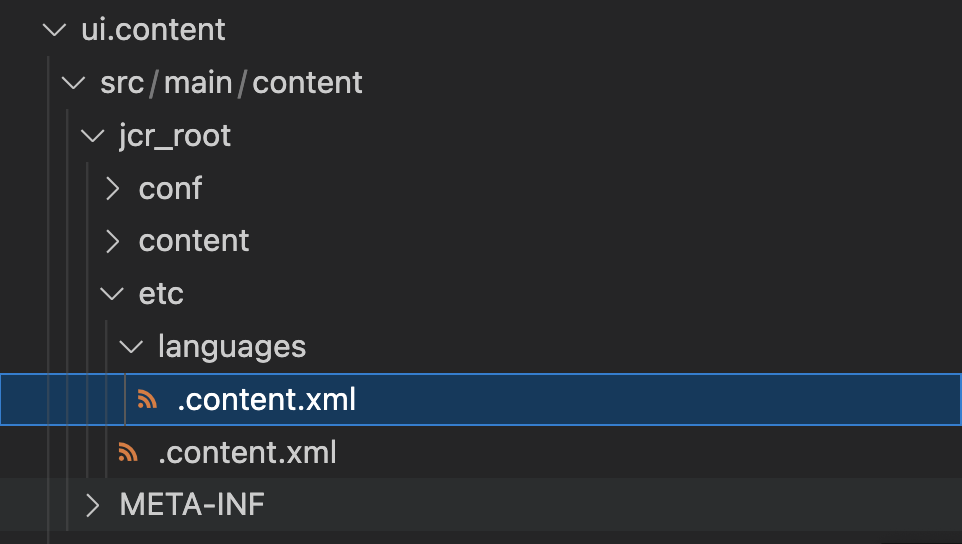

# 为基于核心组件的自适应Forms添加区域设置 {#supporting-new-locales-for-adaptive-forms-localization}


| 版本 | 文章链接 |
| -------- | ---------------------------- |
| Foundation 组件 | [单击此处](supporting-new-language-localization.md) |
| 核心组件 | 本文 |

AEM Forms为英语(en)、西班牙语(es)、法语(fr)、意大利语(it)、德语(de)、日语(ja)、葡萄牙语 — 巴西语(pt-BR)、中文(zh-CN)、中文 — 台湾(zh-TW)和韩语(ko-KR)语言环境提供开箱即用支持。 您还可以添加对更多区域设置的支持，如印地语(hi_IN)。

## 了解区域设置词典 {#about-locale-dictionaries}

自适应表单的本地化依赖于两种类型的区域设置词典：

* **表单特定词典** 包含自适应表单中使用的字符串。 例如，标签、字段名称、错误消息、帮助说明。 它作为每个区域设置的一组XLIFF文件进行管理，您可以在以下位置访问它： `[author-instance]/libs/cq/i18n/gui/translator.html`.

* **全局词典** AEM客户端库中有两个作为JSON对象管理的全局词典。 这些词典包含默认错误消息、月份名称、货币符号、日期和时间模式等。 这些词典位于 `[author-instance]/libs/fd/xfaforms/clientlibs/I18N`. 这些位置包含每个区域设置的单独文件夹。 由于全局字典不经常更新，因此为每个区域设置保留单独的JavaScript文件使浏览器能够在同一服务器上访问不同的自适应表单时缓存这些文件并降低网络带宽使用量。

## 前提条件 {#prerequistes}

在开始添加对新区域设置的支持之前，

* 安装纯文本编辑器(IDE)以便于编辑。 本文档中的示例基于Microsoft VS代码。
* 克隆自适应Forms核心组件存储库。 要克隆存储库：
   1. 打开命令行或终端窗口，然后导航到存储库的存储位置。 例如 `/adaptive-forms-core-components`
   1. 运行以下命令以克隆存储库：

      ```SHELL
          git clone https://github.com/adobe/aem-core-forms-components.git
      ```

  存储库包括添加区域设置所需的客户端库。


## 添加区域设置 {#add-localization-support-for-non-supported-locales}

AEM Forms当前支持英语(en)、西班牙语(es)、法语(fr)、意大利语(it)、德语(de)、日语(ja)、葡萄牙语 — 巴西语(pt-BR)、中文(zh-CN)、中文 — 台湾(zh-TW)和韩语(ko-KR)本地化自适应Forms内容。 要在自适应Forms运行时添加新区域设置支持，请执行以下步骤：


### 1.克隆AEMas a Cloud Service的Git存储库 {#clone-the-repository}

1. 打开命令行并选择要存储存储库的目录，例如 `/cloud-service-repository/`.

1. 运行以下命令以克隆存储库：

   ```SHELL
   git clone https://git.cloudmanager.adobe.com/<my-org>/<my-program>/
   ```

   替换 `<my-org>` 和 `<my-program>` 在上面URL中，使用您的组织名称和项目名称。 有关获取组织名称、程序名称或Git存储库的完整路径以及克隆存储库所需的凭据的详细说明，请参阅 [访问Git](https://experienceleague.adobe.com/docs/experience-manager-cloud-service/content/onboarding/journey/developers.html#accessing-git) 文章。

   成功完成命令后，将创建一个文件夹 `<my-program>` 创建。 它包含从Git存储库克隆的内容。 在文章的其余部分中，该文件夹重命名为， `[AEM Forms as a Cloud Service Git repostory]`.


### 2.将新区域设置添加到指南本地化服务 {#add-a-locale-to-the-guide-localization-service}

1. 以纯文本编辑器打开上一部分中克隆的存储库文件夹。
1. 导航到 `[AEM Forms as a Cloud Service Git repostory]/ui.config/src/main/content/jcr_root/apps/<appid>/osgiconfig/config` 文件夹。您可以找到 `<appid>` 在 `archetype.properties` 项目的文件。
1. 打开 `[AEM Forms as a Cloud Service Git repostory]/ui.config/src/main/content/jcr_root/apps/<appid>/osgiconfig/config/Guide Localization Service.cfg.json` 文件以供编辑。如果文件不存在，请创建该文件。 具有支持的区域设置的示例文件如下所示：

   

1. 添加 [语言的区域设置代码](https://en.wikipedia.org/wiki/List_of_ISO_639-1_codes) 例如，您要添加印地语的“hi”。
1. 保存并关闭该文件。

### 3.创建客户端库以添加区域设置

AEM Forms提供了一个示例客户端库，以帮助您轻松添加新区域设置。 您可以下载并添加 `clientlib-it-custom-locale` 客户端库从GitHub上的自适应Forms核心组件存储库到Formsas a Cloud Service存储库。 要添加客户端库，请执行以下步骤：

1. 在纯文本编辑器中打开自适应Forms核心组件存储库。 如果没有克隆存储库，请参阅 [先决条件](#prerequistes) 有关克隆存储库的说明。
1. 导航至 `/aem-core-forms-components/it/apps/src/main/content/jcr_root/apps/forms-core-components-it/clientlibs` 目录。
1. 复制 `clientlib-it-custom-locale` 目录。
1. 导航到 `[AEM Forms as a Cloud Service Git repostory]/ui.apps/src/main/content/jcr_root/apps/moonlightprodprogram/clientlibs` 并粘贴 `clientlib-it-custom-locale` 目录。


### 4.创建特定于区域设置的文件 {#locale-specific-file}

1. 导航至 `[AEM Forms as a Cloud Service Git repostory]/ui.apps/src/main/content/jcr_root/apps/<program-id>/clientlibs/clientlib-it-custom-locale/resources/i18n/`
1. 找到 [GitHub上的英语区域设置.json文件](https://github.com/adobe/aem-core-forms-components/blob/master/ui.af.apps/src/main/content/jcr_root/apps/core/fd/af-clientlibs/core-forms-components-runtime-all/resources/i18n/en.json)，其中包含产品中包含的最新默认字符串集。
1. 为您的特定区域设置创建新的.json文件。
1. 在新创建的.json文件中，镜像了英语区域设置文件的结构。
1. 将.json文件中的英语字符串替换为语言的相应本地化字符串。
1. 保存并关闭文件。


### 4.向词典添加区域设置支持 {#add-locale-support-for-the-dictionary}

仅当满足以下条件，才执行此步骤： `<locale>` 您添加的内容不属于 `en`， `de`， `es`， `fr`， `it`， `pt-br`， `zh-cn`， `zh-tw`， `ja`， `ko-kr`.

1. 导航到 `[AEM Forms as a Cloud Service Git repostory]/ui.content/src/main/content/jcr_root/etc/` 文件夹。

1. 创建 `etc` 下的文件夹 `jcr_root` 文件夹（如果尚未存在）。

1. 创建文件夹 `languages` 在 `etc` 文件夹（如果尚未存在）。

   

1. 创建 `.content.xml` 文件位于 `languages` 文件夹。 将以下内容添加到文件：

   ```XML
   <?xml version="1.0" encoding="UTF-8"?>
   <jcr:root xmlns:jcr="http://www.jcp.org/jcr/1.0" xmlns:nt="http://www.jcp.org/jcr/nt/1.0"
   jcr:primaryType="nt:unstructured"
   languages="[de,es,fr,it,pt-br,zh-cn,zh-tw,ja,ko-kr]"/>
   ```

1. 将区域设置代码添加到 `languages` 属性。 例如，在以下示例代码中添加了hindi。


   ```XML
   <?xml version="1.0" encoding="UTF-8"?>
   <jcr:root xmlns:jcr="http://www.jcp.org/jcr/1.0" xmlns:nt="http://www.jcp.org/jcr/nt/1.0"
   jcr:primaryType="nt:unstructured"
   languages="[de,es,fr,it,pt-br,zh-cn,zh-tw,ja,ko-kr,hi]"/>
   ```

1. 将新创建的文件夹添加到 `filter.xml` 下 `/ui.content/src/main/content/meta-inf/vault/filter.xml` 作为：

   ```
   <filter root="/etc/languages"/>
   ```

   

### 5.提交更改并部署管道 {#commit-changes-in-repo-deploy-pipeline}

在添加新的区域设置支持后，将更改提交到GIT存储库。 使用全栈管道部署代码。 学习 [如何设置管道](https://experienceleague.adobe.com/docs/experience-manager-cloud-service/content/onboarding/journey/developers.html?lang=en#setup-pipeline) 以添加新的区域设置支持。
管道完成后，新添加的区域设置将显示在AEM环境中。

## 在自适应Forms中使用添加的区域设置 {#use-added-locale-in-af}

执行以下步骤，使用新添加的区域设置使用和渲染自适应表单：

1. 登录到您的AEM创作实例。
1. 转到 **Forms** >  **Forms和文档**.
1. 选择自适应表单并单击 **添加字典** 和 **将字典添加到翻译项目** 出现向导。
1. 指定 **项目标题** 并选择 **目标语言** 从 **将字典添加到翻译项目** 向导。
1. 单击 **完成** 并执行创建的翻译项目。
1. 选择自适应表单并单击 **HTML预览**.
1. 添加 `&afAcceptLang=<locale-name>` 在自适应表单的URL中。
1. 刷新页面，自适应表单在指定的区域设置中呈现。

可以使用两种方法识别自适应表单的区域设置。 呈现自适应表单时，它通过以下方式标识请求的区域设置：

* 正在检索 `[local]` 自适应表单URL中的选择器。 URL 的格式为 `http://host:[port]/content/forms/af/[afName].[locale].html?wcmmode=disabled`。使用 `[local]` 选择器允许缓存自适应表单。

* 正在按列出的顺序检索以下参数：

   * 请求参数 `afAcceptLang`
要覆盖用户的浏览器区域设置，您可以传递 `afAcceptLang` 请求参数强制区域设置。 例如，以下URL强制以加拿大 — 法语区域设置呈现表单：
     `https://'[server]:[port]'/<contextPath>/<formFolder>/<formName>.html?wcmmode=disabled&afAcceptLang=ca-fr`

   * 用户的浏览器区域设置设置，该设置在使用请求的请求中指定 `Accept-Language` 标题。

如果所请求区域设置的客户端库不存在，它将检查客户端库是否存在区域设置中存在的语言代码。 例如，如果请求的区域设置为 `en_ZA` （南非英语）和客户图书馆 `en_ZA` 不存在，自适应表单将客户端库用于 `en` （英语）语言（如果存在）。 但是，如果这两个字典都不存在，则自适应表单会将该字典用于 `en` 区域设置。


标识区域设置后，自适应表单会选取特定于表单的词典。 如果未找到所请求区域设置的表单特定词典，则它会使用用于创作自适应表单的语言的词典。

如果没有可用的区域设置信息，则自适应表单将以其原始语言（开发期间使用的语言）显示。

Get [示例客户端库](/help/forms/assets/locale-support-sample.zip) 以添加对新区域设置的支持。 您需要以所需的区域设置更改文件夹的内容。

## 支持新本地化的最佳实践 {#best-practices}

* Adobe建议在创建自适应表单之后创建翻译项目。

* 在现有自适应表单中添加新字段时：
   * **对于机器翻译**：重新创建词典并运行翻译项目。 创建翻译项目后添加到自适应表单的字段保持未翻译状态。
   * **对于人工翻译**：导出词典，通过 `[server:port]/libs/cq/i18n/gui/translator.html`. 更新新添加字段的字典并上传。
