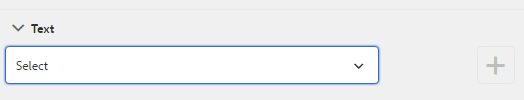
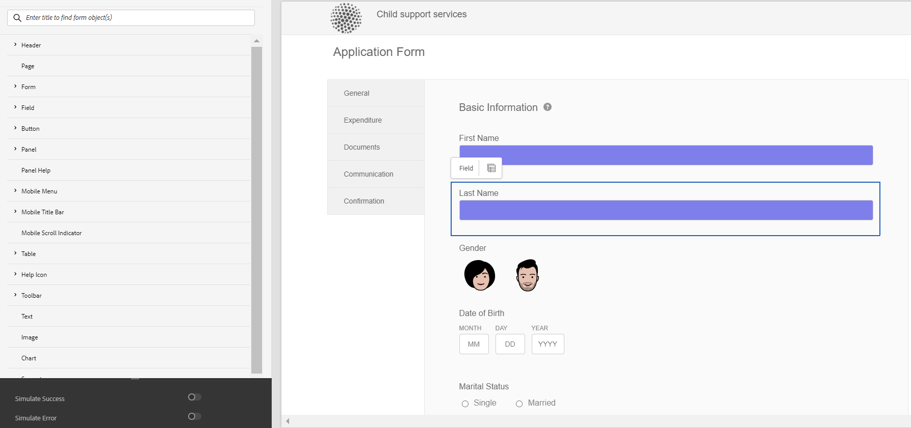

# 创建和使用主题 {#creating-and-using-themes}

Adobe 建议使用现代、可扩展的数据捕获[核心组件](https://experienceleague.adobe.com/docs/experience-manager-core-components/using/adaptive-forms/introduction.html)，以[创建新的自适应表单](/help/forms/creating-adaptive-form-core-components.md)或[将自适应表单添加到 AEM Sites 页面](/help/forms/create-or-add-an-adaptive-form-to-aem-sites-page.md)。这些组件代表有关创建自适应表单的重大改进，确保实现令人印象深刻的用户体验。本文介绍了使用基础组件创作自适应表单的旧方法。

| 版本 | 文章链接 |
| -------- | ---------------------------- |
| AEM 6.5 | [单击此处](https://experienceleague.adobe.com/docs/experience-manager-65/forms/adaptive-forms-advanced-authoring/themes.html) |
| AEM as a Cloud Service | 本文 |

您可以创建并应用主题来使自适应表单<!-- or an interactive communication-->风格化。 主题包含组件和面板的样式详细信息。 样式包括背景颜色、状态颜色、透明度、对齐方式和大小等属性。在应用主题时，指定的样式会反映在相应的组件上。主题是独立管理的，没有引用自适应表单<!-- or interactive communication -->。

您可以从[软件分发](https://experience.adobe.com/#/downloads/content/software-distribution/en/aemcloud.html)门户下载并安装[!DNL AEM Forms]引用内容包，以将引用主题和模板导入到您的环境。

## 创建、下载或上传主题 {#creating-downloading-or-uploading-a-theme}

主题将作为单独的实体创建和保存，并具有像自适应Forms这样的元属性。 它允许在多个自适应Forms<!-- or  and interactive communications-->中重用主题。 您还可以将主题移动到其他实例并重复使用它。

### 创建主题 {#creating-a-theme}

要创建主题，请执行以下操作：

1. 单击&#x200B;**[!UICONTROL Adobe Experience Manager]**，单击&#x200B;**[!UICONTROL Forms]**，然后单击&#x200B;**[!UICONTROL 主题]**。

1. 在“主题”页面中，单击&#x200B;**[!UICONTROL 创建]** > **[!UICONTROL 主题]**。
将启动创建主题的向导。

1. 指定主题的&#x200B;**[!UICONTROL 名称]**。

1. 指定表单以在此主题的&#x200B;**[!UICONTROL 默认预览]**&#x200B;字段中预览主题。 单击&#x200B;**[!UICONTROL 使用默认值]**&#x200B;以使用默认表单预览主题。

1. 指定&#x200B;**[!UICONTROL 配置容器]**。 您可以选择包含帐户Adobe字体配置详细信息的&#x200B;**[!UICONTROL 配置容器]**。 您也可以暂时将此选项保留为空，以后再从[主题属性](#metadata-of-a-theme)中指定详细信息。

1. 单击&#x200B;**[!UICONTROL 创建]**，然后单击&#x200B;**[!UICONTROL 编辑]**&#x200B;在主题编辑器中打开主题，或单击&#x200B;**[!UICONTROL 完成]**&#x200B;返回主题页面。

### 与Experience Manager6.5 Forms及先前版本上的主题的差异 {#difference-in-themes}

在Cloud Service实例上创建的主题：

* 版本号为2。

* 存储在`/content/dam/formsanddocuments-themes/<theme-name>/`

* 不提供客户端库选项。 无法指定客户端库类别和路径。

* 没有/apps位置的写入和更新权限(Forms-user组没有/apps位置的写入和更新权限)。

* 在上传在[!DNL Experience Manager Forms] 6.5或更早版本中创建的主题到Cloud Service实例之前，请确保将客户端库位置设置为`etc/clientlibs/fd/themes`。 如果`etc`文件夹中不存在客户端库，请手动将位置更新为`etc/clientlibs/fd/themes`。  您可以在[!DNL Experience Manager Forms] 6.5或以前的版本实例上进行更改。 设置客户端库的位置后，管理员可以将主题上传到Cloud Service实例，或者使用内容传输工具将主题从6.5版本或以前的版本实例迁移到Cloud Service实例。

  此外，更改类别的名称。 如果未更改名称，则可能会发生错误`theme with same category name exists`。 更改类别名称时，不会影响使用主题的自适应Forms。

### 下载主题 {#downloading-a-theme}

您可以将主题导出为zip文件，并在其他项目或Experience Manager实例中使用这些主题。 要下载主题，请执行以下操作：

1. 单击&#x200B;**[!UICONTROL Adobe Experience Manager]**，单击&#x200B;**[!UICONTROL Forms]**，然后单击&#x200B;**[!UICONTROL 主题]**。

1. 在“主题”页面中，**[!UICONTROL 选择]**&#x200B;主题，然后单击&#x200B;**[!UICONTROL 下载]**。 此时将显示一个对话框，其中包含主题的详细信息。

1. 单击&#x200B;**[!UICONTROL 下载]**。 主题将下载为zip文件。

>[!NOTE]
>
>如果下载的主题具有关联的自适应表单且关联的自适应表单基于自定义模板，则也要下载自定义模板。 上传下载的主题和自适应表单时，还应上传相关的自定义模板。

### 上传主题 {#uploading-a-theme}

具有管理员权限的用户可以上传在[!DNL Experience Manager Forms] 6.5或更早版本中创建的主题。

要上传主题，请执行以下操作：

1. 单击&#x200B;**[!UICONTROL Adobe Experience Manager]**，单击&#x200B;**[!UICONTROL Forms]**，然后单击&#x200B;**[!UICONTROL 主题]**。

1. 在“主题”页面中，单击&#x200B;**[!UICONTROL 创建]** > **[!UICONTROL 文件上传]**。
1. 在“文件上传”提示下，浏览并选择计算机上的主题包，然后单击&#x200B;**[!UICONTROL 上传]**。
上传的主题可在主题页面中找到。

## 主题的元数据 {#metadata-of-a-theme}

主题的元属性列表（可在主题的属性页面中找到）。

<table>
 <tbody>
  <tr>
   <th>
<strong>ID</strong>
 
 
 </th>
   <th><strong>名称</strong></th>
   <th><strong>可以编辑</strong></th>
   <th><strong>属性说明</strong></th>
  </tr>
  <tr>
   <td>1.</td>
   <td>标题</td>
   <td>是</td>
   <td>主题的显示名称。</td>
  </tr>
  <tr>
   <td>2.</td>
   <td>描述</td>
   <td>是</td>
   <td>有关主题的描述。</td>
  </tr>
  <tr>
   <td>3.</td>
   <td>类型</td>
   <td>否</td>
   <td>
    <ul>
     <li>资源类型。</li>
     <li>值始终为“主题”。</li>
    </ul> </td>
  </tr>
  <tr>
   <td>4.</td>
   <td>已创建</td>
   <td>否</td>
   <td>主题创建日期</td>
  </tr>
  <tr>
   <td>5.</td>
   <td>作者姓名</td>
   <td>是</td>
   <td>主题的作者。 在创建主题时计算。</td>
  </tr>
  <tr>
   <td>6.</td>
   <td>上次修改日期</td>
   <td>否</td>
   <td>上次修改主题的日期。</td>
  </tr>
  <tr>
   <td>7.</td>
   <td>状态</td>
   <td>否</td>
   <td>主题状态（已修改/已发布）。</td>
  </tr>
  <tr>
   <td>8.</td>
   <td>Publish On Time</td>
   <td>是</td>
   <td>自动发布主题的时间。</td>
  </tr>
  <tr>
   <td>9.</td>
   <td>Publish关闭时间</td>
   <td>是</td>
   <td>自动取消发布主题的时间。</td>
  </tr>
  <tr>
   <td>10.</td>
   <td>标记</td>
   <td>是</td>
   <td>附加到用于标识的主题的标签，用于改进搜索。</td>
  </tr>
  <!-- <tr>
   <td>11.</td>
   <td>References</td>
   <td>Links</td>
   <td>
    <ul>
     <li>Contains 'Referred by' section. Lists forms that use the theme.</li>
     <li>Since the theme does not refer to any other asset, there is no 'Refers' section.</li>
    </ul> </td>
  </tr>
   <tr>
   <td>12.</td>
   <td>Clientlib Location</td>
   <td>Yes</td>
   <td>
    <ul>
     <li>The user-defined repository path within '/etc' where the clientlibs corresponding to this theme are stored.</li>
     <li>Default value - '/etc/clientlibs/fd/themes' + relative path of theme asset.</li>
     <li>If the location does not exist, the folder hierarchy is auto-generated.</li>
     <li>When this value is changed, the clientlib node structure is moved to the new location entered.  <em><strong>Note:</strong> If you change default clientlib location, in the CRXDE repository assign <code>crx:replicate, rep:write, rep:glob:*, rep:itemNames:: js.txt, jcr:read </code>to <code>forms-users</code> and <code>crx:replicate</code>, <code>jcr:read </code>to <code>fd-service</code> in the new location. Also attach another ACL by adding <code>deny jcr:addChildNodes</code> for <code>forms-user</code></em></li>
    </ul> </td>
  </tr> 
  <tr>
   <td>13.</td>
   <td>Clientlib Category Name</td>
   <td>Yes</td>
   <td>
    <ul>
     <li>The user-defined clientlib category name for this theme.</li>
     <li>An error is displayed if the name is already in use by some other existing theme.</li>
     <li>Default value - computed using theme location.</li>
     <li>When this value is changed, the category name is updated on the corresponding clientlib node. Updating Clientlib Category Name in the jsp files is not required because clientlib category name is used by reference.</li>
    </ul> </td>
  </tr> -->
 </tbody>
</table>

## 关于主题编辑器 {#about-the-theme-editor}

主题编辑器是一个对业务用户和Web设计人员/开发人员友好的界面，它提供了轻松指定各种自适应表单<!-- and interactive communication -->元素样式所需的功能。 创建主题时，该主题将存储为一个单独的实体，如表单<!--  , interactive communications, letters, document fragments, and data dictionaries-->。

通过主题编辑器，可自定义主题中样式化组件的样式。 您可以自定义表单<!-- or interactive communication -->在设备上的外观。

主题编辑器分为两个面板：

* **画布** — 显示在右侧。 它显示了一个自适应表单<!--  or interactive communication -->的示例，其中所有样式更改都会立即反映。 也可以直接从画布中选择对象来查找与其关联的样式，并编辑这些样式。 顶部的设备分辨率标尺控制画布。 从标尺中选择分辨率断点将显示相应分辨率的样本表单<!--  or interactive communication -->的预览。 下面详细讨论了[的画布](themes.md#using-canvas)。

* **侧栏** — 显示在左侧。 它包括以下项：

   * **选择器：**&#x200B;显示选定用于设置样式的组件及其可以设置样式的属性。 选择器表示某个类型的所有组件。 如果您选择主题中的文本框组件来设置样式，则表单<!-- or interactive communication -->中的所有文本框将继承该样式。 选择器允许您选择通用组件或特定组件来设置样式。 例如，字段组件是通用组件，文本框是特定组件。

     **正在设置泛型组件的样式：**
字段可以是数字框字段（如年龄）或文本框字段（如地址）。
设置字段样式时，所有字段（如年龄、姓名、地址）都会设置样式。

     **正在设置特定组件的样式**：
特定组件会影响特定类别的对象。 在主题中设置数字框组件的样式时，只有中的数字框对象会继承该样式。

     例如，文本框字段（如地址）较长而数字框字段（如年龄）较短。 您可以选择数字框字段，缩短其长度并应用于表单。 表单中的所有数字框字段的宽度都会缩小。

     使用特定的背景颜色自定义所有字段组件时，所有字段（如年龄、名称和地址）将继承背景颜色。 如果选择数字框（如年龄）并减小其宽度，则所有数字框的宽度（如年龄）都会减小，家庭中的人数也会减少。 文本框的宽度不会更改。

   * **状态：**&#x200B;允许您自定义处于特定状态的对象的样式。 例如，可以指定对象在默认、集中、禁用、悬停或错误状态时的外观。
   * **属性类别：**&#x200B;样式属性分为不同的类别。 例如，Dimension和位置、文本、背景、边框和效果。 在每个类别下，您都会提供样式信息。 例如，在“背景”下，您可以提供“背景颜色”和“图像和渐变”。

   * **高级：**&#x200B;允许您向对象添加自定义CSS，这会覆盖可视化控件定义的属性（如果存在重叠）。

   * **查看CSS**：允许您查看选定组件的CSS。

  此外，在侧栏的底部有一个箭头。 单击箭头时，您会获得另外两个选项：**模拟成功**&#x200B;和&#x200B;**模拟错误。**&#x200B;下面的[详细讨论了这些选项以及上述选项](themes.md#using-rail)。

 **A.**&#x200B;侧栏&#x200B;**B.**&#x200B;画布

### 设置组件的样式 {#styling-components}

您可以在多个自适应Forms<!-- and interactive communications -->中使用主题，该功能会导入您在主题中指定的组件格式。 您可以设置各种组件的样式，如标题、描述、面板、字段、图标和文本框。 使用小组件配置主题中的组件属性。 虽然CSS覆盖部分允许您编写CSS代码或提供自定义选择器，但并不要求您事先了解CSS或LESS。 在侧栏中选择组件时，将显示“CSS覆盖”部分。

侧栏中的

侧栏中的选项，用于选择和设置不同组件的样式。

单击侧边栏中某个组件的编辑按钮会选择画布中的组件，并允许您使用侧边栏中的选项设置组件样式。

某些组件（如文本框、数字框、单选按钮和复选框）在“字段”等类属组件下分类。 例如，要自定义单选按钮的样式。 要选择样式单选按钮，请选择&#x200B;**[!UICONTROL 字段]** > **[!UICONTROL 小组件]** > **[!UICONTROL 单选按钮]**。

### 样式化面板布局 {#styling-panel-layouts-br}

[!DNL AEM Forms]中的主题支持对表单<!-- and  interactive communications -->中面板布局中的元素进行样式设置。 支持在现成布局和自定义布局中设计元素的样式。

现成的面板包括：

* 左侧选项卡
* 顶部选项卡
* 可折叠项
* 响应
* 向导
* 移动设备布局

   * 标题中的面板标题
   * 标题中没有面板标题

选择器会因每个布局而异。
从主题编辑器设计自定义布局的样式涉及：

* 为可设置样式的布局定义组件以及用于唯一标识这些组件的CSS选择器。
* 定义可以应用于这些组件的CSS属性。
* 从用户界面以交互方式定义这些组件的样式。

### 不同屏幕大小的不同样式 {#different-styles-for-different-screen-sizes-br}

桌面版和移动设备版面可以具有略微不同的样式，也可以具有完全不同的样式。 对于移动设备，平板电脑和手机共享相似的布局（组件大小除外）。

使用主题编辑器断点为不同屏幕大小定义替代样式。 您可以选择开始构建主题的基本设备或分辨率，并自动生成其他分辨率的样式变体。 您可以显式修改所有分辨率的样式。

>[!NOTE]
>
>该主题首先使用表单<!-- or interactive communication-->创建，然后应用于不同的表单<!-- or interactive communications-->。 主题创建中使用的断点可能与应用主题的表单<!-- or interactive communication -->不同。 CSS媒体查询基于主题创建中使用的表单<!-- or interactive communication -->，而不是应用主题的表单<!-- or interactive communication -->。

### 选择对象时侧栏中的样式属性上下文更改 {#styling-properties-context-changes-in-sidebar-on-selecting-objects}

在画布中选择组件时，其样式设置属性会列在侧栏中。 选择对象类型及其状态，然后提供其样式。

### 主题编辑器中最近使用的样式 {#recently-used-styles-in-theme-editor}

主题编辑器可缓存应用于组件的最多十个样式。 您可以将缓存的样式与主题的其他组件一起使用。 最近使用的样式将作为列表框显示在侧边栏中选定组件的正下方。 最初，最近使用的样式列表为空。

在设置组件样式时，将缓存样式并将其列在列表框中。 在此示例中，文本框的标签被设置为更改字体大小和颜色。 可以按照类似步骤选择图像或更改颜色来设置组件的样式。 观察更改字段标签样式时，如何缓存样式并将其列在列表框中。

在此示例中，字段标签的样式发生了更改，并且当为样式选择了响应面板描述时，列表条目会添加到资产库中。 资源库中的条目可用于更改响应面板描述的样式。

将样式添加到资产库时，该样式可用于其他主题以及表单编辑器UI的[样式模式](inline-style-adaptive-forms.md)。 同样，当您使用表单编辑器<!-- or interactive communication editor --> UI的样式模式来设置组件的样式时，该样式将被缓存，并可用于主题中。

通过资产库旁边的加号按钮，您可以使用提供的名称永久保存样式。 加号按钮可保存样式，即使您未单击侧边栏中的“保存”按钮以将样式应用于组件也是如此。 在样式模式中，保存样式以供以后使用的加号按钮不可用。

当您为样式提供自定义名称时，该样式将绑定到主题，并且不再可用于其他主题。 要删除保存的样式：

1. 在“画布”工具栏上，单击&#x200B;**[!UICONTROL 主题选项]**  > **[!UICONTROL 管理样式]**。
1. 在“管理样式”对话框中，选择已保存的样式，单击&#x200B;**[!UICONTROL 删除]**。

   

### 实时预览、保存和放弃更改 {#live-preview-save-and-discard-changes}

在样式中所做的修改会立即反映在画布中加载的表单<!-- or interactive communication -->中。 实时预览允许您以交互方式定义并查看样式的影响。 更改组件的样式时，将在侧栏中启用&#x200B;**[!UICONTROL Done]**&#x200B;按钮。 若要保留更改，请使用&#x200B;**[!UICONTROL 完成]**&#x200B;按钮。

>[!NOTE]
>
>在字段中输入无效字符时，字段边界颜色将更改为红色，并在屏幕左上角显示错误消息。 例如，如果在接受数字字符作为输入的文本框中输入字母，则输入框边界颜色将更改为红色。 如果不解决在屏幕中央底部显示的错误，则无法保存此类主题。

### 带有其他自适应表单的主题 {#theme-with-another-adaptive-form}

创建主题时，将使用主题编辑器附带的表单来创建主题。 在此表单中提供组件的样式。 您可以选择自己选择的表单<!-- or interactive communication -->来提供样式并预览其结果，而不是主题编辑器附带的表单。

在主题编辑器画布中替换当前表单或<!-- interactive communication -->：

1. 在主题编辑器面板中，单击&#x200B;**[!UICONTROL 主题选项]**  > **[!UICONTROL 配置]**。

1. 在“常规”选项卡中，浏览并选择&#x200B;**[!UICONTROL 自适应表单]**&#x200B;字段的表单<!-- or interactive communication -->。

### 重做/撤消 {#redo-undo}

您可以撤消或重做意外发生的不必要的更改。 使用画布中的重做/撤消按钮。

在主题编辑器中为组件设置样式时，会显示重做/撤消按钮。

## 使用主题编辑器 {#using-the-theme-editor}

通过主题编辑器，可以编辑您创建或上传的主题。 导航到&#x200B;**[!UICONTROL Forms和文档]** > **[!UICONTROL 主题]**，然后选择主题并将其打开。 主题将在主题编辑器中打开。

如上所述，主题编辑器包含两个面板：侧栏和画布。

在主题编辑器中自定义文本框构件组件的成功状态样式。 组件在画布中处于选中状态，其状态在侧栏中处于选中状态。 侧边栏中可用的样式选项用于自定义组件的外观。

### 使用画布 {#using-canvas}

主题是使用现成表单创建的，或使用您选择的表单<!-- or interactive communication -->创建的。 画布显示表单或<!-- interactive communication -->的预览，该表单或用于使用主题中指定的自定义项创建主题。 表单上方的标尺用于根据设备的显示大小确定布局。

在“画布”工具栏中，您会看到：

* **[!UICONTROL 切换侧面板]** ：用于显示或隐藏侧栏。
* **[!UICONTROL 主题选项]** ：提供三个选项

   * 配置：提供用于选择预览表单<!-- or interactive communication , base clientlib, -->和Adobe Fonts配置的选项。
   * 查看主题CSS：为所选主题生成CSS。
   * 管理样式：提供用于管理文本和图像样式的选项
   * 帮助：运行主题编辑器的图像引导式教程。

* **[!UICONTROL 模拟器]** ：模拟不同显示大小的主题外观。 在模拟器中将显示大小视为断点。 您可以选择断点并为其指定样式。 例如，台式机和平板电脑是两个断点。 您可以为每个断点指定不同的样式。

在画布中选择组件时，您会看到其顶部的组件工具栏。 通过组件工具栏，您可以选择组件，或切换到通用组件。 例如，在面板中选择一个数字文本框。 您会在组件工具栏中看到以下选项：

* **[!UICONTROL 数值框小组件]**：允许您选择组件以自定义其在侧栏中的外观。
* **[!UICONTROL 字段小组件]**：允许您选择用于样式的通用组件。 在此示例中，将选择所有文本输入组件（文本框/数字框/数字步进器/日期输入）来设置样式。

* ：允许您选择用于样式设置的父组件。 如果选择数字框并选择此图标，则字段组件处于选中状态。 如果选择字段组件并选择此图标，则面板将被选中。 如果不断点击此图标进行选择，则最终将选择用于样式设置的布局。

>[!NOTE]
>
>组件工具栏中可用的选项因您选择的组件而异。

### 使用侧栏 {#using-rail}

主题编辑器中的侧边栏提供了用于自定义主题中组件的样式以及使用选择器的选项。 选择器允许您选择一组组件或单个组件，并且您可以在侧栏中搜索选择器。 您可以为自定义组件编写选择器。

从侧栏中的画布或选择器中选择组件时，侧栏会显示可用于为其自定义样式的所有选项。
以下是您在选择组件时可在侧栏中看到的选项：

* 状态
* 属性表
* 模拟错误/成功

#### 状态 {#state}

状态是用户与组件交互的指示器。 例如，当用户在文本框中输入错误数据时，文本框的状态将更改为错误状态。 主题编辑器允许您为特定状态指定样式。

用于自定义状态样式的选项因组件而异。

#### 属性表 {#property-sheet}

<table>
 <tbody>
  <tr>
   <td><strong>属性</strong></td>
   <td><strong>使用</strong></td>
  </tr>
  <tr>
   <td>
尺寸及位置
 </td>
   <td>
允许您在主题中样式对齐、大小、定位和组件放置。 
 
选项包括“显示设置”、“填充”、“边距”、“宽度”、“高度”和“Z索引”。
 
您还可以使用布局模式，通过简单的拖放界面来定义组件的宽度。 有关详细信息，请参阅<a href="resize-using-layout-mode.md">使用布局模式调整组件大小</a>。
 </td>
  </tr>
  <tr>
   <td>
文本
 </td>
   <td>
允许您自定义主题组件中的文本样式。
 
例如，您想更改在文本框中输入的文本的外观。
 
选项包括字体系列、粗细、颜色、大小、行高、文本对齐、字母间距、文本缩进、下划线、斜体、文本转换、垂直对齐、基线和方向。 
 </td>
  </tr>
  <tr>
   <td>
背景 
 </td>
   <td>
允许您使用图像或颜色填充组件背景。 
 </td>
  </tr>
  <tr>
   <td>
边框
 </td>
   <td>
允许您选择组件的边框外观。 例如，希望文本框具有深红色、粗边框和虚线。 
 
您的选项包括边框的宽度、样式、半径和颜色。
 </td>
  </tr>
  <tr>
   <td>
效果
 </td>
   <td>
允许向元件添加特殊效果，如不透明度、混合模式和阴影。 
 </td>
  </tr>
  <tr>
   <td>
高级
 </td>
   <td>
允许您添加：

    <ul>
     <li><code>::before</code>和<code>::after</code>伪元素的属性，用于在选择器中的默认内容之后或之前添加内容，并设置其样式。 请参阅<a href="https://www.w3schools.com/css/css_pseudo_elements.asp" target="_blank">CSS Pseudo元素</a>。</li>
     <li>内联到组件的自定义CSS代码。</li>
    </ul> 
添加自定义CSS代码时，它会覆盖您使用侧边栏中的选项添加的自定义。 
 </td>
  </tr>
 </tbody>
</table>

#### 模拟错误/成功 {#simulate-error-success}

侧栏底部提供了模拟错误和成功选项。 您可以使用侧栏底部的显示/隐藏箭头查看它们。 使用主题编辑器，您可以设置组件的各种状态的样式。

例如，在表单中添加数字字段，并在主题编辑器中指定其样式。 当用户在字段中键入字母数字值时，您希望更改文本框的背景颜色。 选择主题中的数值字段，然后使用侧栏中的状态选项。 在侧栏中选择“错误”状态，然后将背景颜色更改为红色。 要预览行为，您可以使用侧边栏中提供的“模拟错误”选项。 “模拟错误”和“成功”选项详述如下：

* **模拟成功**：
当您为成功状态指定组件的样式时，您可以看到组件的外观。 例如，在表单中，客户设置密码。 用户可以按照您提供的指南设置密码。 当用户按照您提供的所有指南键入密码时，文本框将变为绿色。 当文本框变为绿色时，它处于成功状态。 您可以为处于成功状态的元件指定样式，并使用“模拟成功”选项模拟其外观。

* **模拟错误**：
当您为错误状态指定组件样式时，可以看到组件的外观。 例如，在表单中，客户设置密码。 用户可以按照您提供的指南设置密码。 当用户键入的密码未遵循您提供的所有准则时，文本框将变为红色。 当文本框变为红色时，它处于错误状态。 可为处于错误状态的元件指定样式，并使用“模拟错误”选项模拟其外观。

### 设置组件的样式 {#styling-a-component}

例如，您的表单中有两种类型的文本框：一种仅接受数字值，另一种接受字母数字值。 您可以自定义仅接受数字值的文本框（数字框）的样式。

要自定义特定组件（本示例中的数字框）的样式，请执行以下步骤：

1. 在主题编辑器中，选择画布中的数字框。
1. 选择数字框后，您可以看到包含三个选项的组件工具栏：

   * **[!UICONTROL 数值框小组件]**
   * **[!UICONTROL 字段小组件]**

1. 选择&#x200B;**[!UICONTROL 数字框小组件]**。
1. 侧栏标题将更改为数值框小组件，并显示用于自定义其外观的选项。
在侧栏中使用**[!UICONTROL Dimension和位置]**&#x200B;选项自定义组件的大小。 确保状态为&#x200B;**[!UICONTROL 默认值]**。

不要选择&#x200B;**[!UICONTROL 数值框小组件]**，请在组件工具栏中选择&#x200B;**[!UICONTROL 字段小组件]**，然后执行上述步骤。 为&#x200B;**[!UICONTROL 字段小组件]**&#x200B;选项选择维度时，除数字框之外的所有文本框都具有相同的大小。

### 为给定状态设置字段样式 {#styling-fields-given-state}

使用组件工具栏，还可以为其不同状态指定组件的样式。 例如，如果某个组件被禁用，则它处于禁用状态。 可在主题编辑器中样式的组件的常用状态为：默认、集中、已禁用、错误、成功和悬停。 您可以在画布中选择组件，然后使用侧边栏中的状态选项自定义其外观。

要自定义处于特定状态的组件的样式，请执行以下步骤：

1. 在画布中选择组件，然后从组件工具栏中选择相应的选项。
侧栏显示用于自定义组件样式的选项。
1. 在侧栏中选择一个状态。 例如，“错误”状态。
1. 使用侧栏中的选项（如&#x200B;**[!UICONTROL 边框、背景]**）自定义组件的外观。
1. 使用侧边栏底部的&#x200B;**[!UICONTROL 模拟错误]**&#x200B;选项查看编辑样式时的外观。

在指定组件的状态后自定义组件的样式时，将只针对指定状态显示组件的自定义设置。 例如，如果在选择了悬停状态时自定义组件的样式。 在将指针移动到应用主题的呈现形式<!-- or interactive communication -->中的组件上时，将显示组件的自定义设置。

要模拟错误和成功以外的状态行为，请使用预览模式。 要使用预览模式，请单击页面工具栏中的&#x200B;**[!UICONTROL 预览]**。

### 为较小的显示设置布局样式 {#styling-layouts-for-smaller-displays}

使用画布中的标尺为显示较小的设备选择断点。 在“画布”中单击模拟器以查看标尺和断点。 通过断点，可预览属于不同设备（如手机和平板电脑）的显示大小的表单<!-- or interactive communication -->。 主题编辑器支持多种显示大小。

要为不同的断点设置组件的样式：

1. 在画布中，选择标尺上方的断点。
断点表示移动设备及其显示大小。
1. 使用侧边栏自定义所选显示大小的主题中的表单<!-- or interactive communication -->组件的样式。
1. 确保已保存自定义。

您可以为多个设备设置表单<!-- or interactive communication -->组件的样式。 桌面和移动设备的表单<!-- and interactive communication -->组件可以具有完全不同的样式。

### 在主题中使用Web Fonts {#using-web-fonts-in-a-theme}

您现在可以在自适应表单<!-- or interactive communication -->中使用Web服务中提供的字体。 开箱即用的AdobeWeb字体服务[Adobe Fonts](https://fonts.adobe.com/)可作为配置使用。 要使用Adobe Fonts，请创建一个套件，在其中添加字体，然后从[Adobe Fonts](https://fonts.adobe.com/)中获取套件ID。

要在Experience Manager中配置Adobe Fonts，请执行以下步骤：

1. 在创作实例中，单击**[!UICONTROL Adobe Experience Manager ]**>**[!UICONTROL &#x200B;工具&#x200B;]** >**[!UICONTROL &#x200B;部署&#x200B;]**>**[!UICONTROL  Cloud Service ]**。
1. 在&#x200B;**[!UICONTROL Cloud Service]**&#x200B;页面上，导航到并打开&#x200B;**[!UICONTROL Adobe Fonts]**&#x200B;选项。 打开配置文件夹，然后单击&#x200B;**[!UICONTROL 创建]**。
1. 在&#x200B;**[!UICONTROL 创建配置]**&#x200B;对话框中，指定配置的标题，然后单击&#x200B;**[!UICONTROL 创建]**。

   您将被重定向到配置页面。

1. 在出现的“编辑组件”对话框中，提供您的套件ID并单击&#x200B;**[!UICONTROL 确定]**。

要配置主题以使用Adobe Fonts配置，请执行以下步骤：

1. 在创作实例上，在主题编辑器中打开主题。
1. 在主题编辑器中，导航到&#x200B;**[!UICONTROL 主题选项]**  > **[!UICONTROL 配置]**。
1. 在&#x200B;**[!UICONTROL Adobe Fonts配置]**&#x200B;字段中，选择一个套件，然后单击&#x200B;**[!UICONTROL 保存]**。

   现在，您可以看到字体已添加到主题的font-family属性中。

<!-- >
### Listing and selecting fonts in theme editor {#listing-and-selecting-fonts-in-theme-editor}

You can use the theme configuration service to add more fonts to the theme editor. Perform the following steps to add fonts:

1. Log in to Experience Manager Web Console with administrative privileges. URL for the Experience Manager Web Console is `https://'[server]:[port]'/system/console/configMgr`.
1. Open **[!UICONTROL Adaptive Form Theme Configuration Service]**.

   

1. Click +, specify the name of the font, and click **Save**. The font is added and available in theme editor. -->

#### 在主题编辑器中选择字体 {#selecting-fonts-in-theme-editor}

可以使用+按钮添加字体。 添加字体时，该字体会列在侧栏中。

除了主题配置选项之外，您还可以从主题编辑器本身添加字体。 在侧栏下的字体系列字段中键入要使用的字体，然后按键盘上的返回键。

选取字体时，会将其添加到字体系列列表下。 您可以使用主题编辑器中的“蒙版”选项来禁用或启用列出的字体。

您可以看到组件字体更改。

“字体系列”字段支持多种字体。 键入字体时，浏览器会查找该字体并将其应用于所选的组件。 如果浏览器找不到字体，则会在系列中查找该字体旁边的字体。 您可以首先键入要查找的特定字体。 如果找不到要使用的字体，可以在族中键入类属字体并使用它。

#### 在主题编辑器中应用的蒙版样式 {#mask-styles-applied-in-theme-editor}

您可以遮罩应用于主题的样式。 在主题编辑器侧边栏中，您可以使用图标禁用应用的样式。 例如，如果更改表单<!-- or interactive communication -->中组件的维度，则可以使用属性左侧的掩码按钮禁用它。 在保存主题时，将保留所选的掩码选项。

主题编辑器侧边栏中提供了

下面的示例显示了主题中蒙版和未蒙版的样式。

## 将主题应用于表单 {#applying-a-theme-to-a-form-or-interactive-communication-br}

要将主题应用于自适应表单，请执行以下操作：

1. 在编辑模式下打开表单。 若要在编辑模式下打开表单，请选择一个表单，然后单击&#x200B;**[!UICONTROL 打开]**。
1. 在编辑模式下，选择一个组件，然后单击 > **[!UICONTROL 自适应表单容器]**，然后单击。

   您可以在侧栏中编辑表单的属性。

1. 在侧栏中，单击&#x200B;**[!UICONTROL 样式]**。
1. 从&#x200B;**[!UICONTROL 自适应表单主题]**&#x200B;下拉列表中选择您的主题，然后单击&#x200B;**[!UICONTROL 完成]** 。

您还可以在创建自适应表单时为其定义主题。

<!-- To apply a theme to an interactive communication:

1. Open your interactive communication in edit mode. To open a interactive communication in edit mode, select a form and click **Open**.
1. In the edit mode, select a component, then click  &gt;**Document Container**, and then click .

   You can edit properties of your form in the sidebar.

1. In the sidebar, under **Basic**, select your theme from the **Theme** drop-down and click **Done**  -->

### 在运行时更改表单主题 {#change-theme-of-a-form-at-runtime}

主题为表单的不同组件设置样式。 您可以使用`themeOverride`属性动态更改表单主题。 表单的典型URL为：

`https://<server>:<port>/content/forms/af/test.html`

可以使用themeOverride参数在运行时应用主题。

`https://<server>:<port>/content/forms/af/test.html?themeOverride=/content/dam/formsanddocuments-themes/simpleEnrollmentTheme`

`themeOverride`选项允许您提供主题的路径。 它会更改表单的主题，并使用更新的样式刷新表单。

## 使用主题获取特定外观 {#specific-af-appearance}

对于[!DNL AEM Forms]以及默认的现成画布主题，还有许多其他主题。 如果要使用其他主题设计表单<!-- or interactive communication -->以及进行更多更改，请从“主题库”文件夹复制主题。 将复制的主题粘贴到主题库文件夹之外，并根据所需的更改编辑复制的主题。

要复制主题，请执行以下步骤：

1. 在创作实例中，导航到&#x200B;**[!UICONTROL Adobe Experience Manager]** > **[!UICONTROL Forms]** > **[!UICONTROL 主题]**。
1. 打开主题库文件夹。
1. 在“主题库”文件夹中，将指针悬停在相应的现成主题上，然后选择&#x200B;**[!UICONTROL 复制]**。
1. 将复制的主题粘贴到主题库文件夹之外。
1. 自定义复制的主题。

自定义主题后，将其应用于表单<!-- or interactive communication -->。

>[!NOTE]
>
>请勿修改主题库文件夹中可用的主题。 此文件夹包含系统主题。 安装较新版本的[!DNL AEM Forms]或修补程序时，将覆盖您对这些主题所做的任何更改。

## 对其他自适应表单用例的影响 {#impact-on-other-adaptive-form-use-cases}

* **Publish/取消发布表单：**&#x200B;发布表单时，也会发布应用于的主题（如果尚未发布）
* **导入/导出表单：**&#x200B;在导入或导出表单时，也将自动导入或导出与其关联的主题。
* **表单的引用：**&#x200B;表单引用中的“引用”部分包含主题的一个额外条目。
* **表单的上次修改时间：**&#x200B;更改相关主题时更新。
<!-- * **A/B Testing:** You can apply a different theme to two versions of the form in A/B testing. The information of the two themes is individually stored on the two guide containers. -->

## CSS生成序列 {#css-generation-sequence}

当您选择查看CSS时，主题编辑器会收集所有样式信息并构建CSS。 它按以下顺序收集信息：

<!-- 1. Styling defined in the theme's base client library. -->
1. 用户定义的样式，使用侧边栏中的属性指定。
1. 使用“CSS覆盖”选项提供的CSS样式。

例如，文本框的背景颜色为蓝色<!-- in the base client library-->。 可使用侧栏中的属性将其更改为粉红色。 在生成CSS时，您会看到文本框的背景颜色显示为粉红色。 使用属性更改背景颜色后，另一位作者使用CSS覆盖选项将背景颜色文本框更改为白色。 在生成CSS时，您会在生成的CSS中将背景颜色显示为白色。

## 调试样式 {#debugging-styles}

在主题编辑器中为组件指定样式时，将生成CSS。 当为类属组件设置样式时，其中包含的多个组件也会设置样式。 例如，当设置字段的样式时，其中的文本框和标签也会设置样式。 当在字段中设置文本框的样式时，它将获得自己的CSS。 如果要调试为字段和组件生成的CSS，主题编辑器会提供允许您查看CSS的选项。

您可以使用以下选项查看生成的CSS：

* 在侧栏中&#x200B;**查看CSS**&#x200B;选项：在主题中选择组件时，您可以在侧栏中看到“查看CSS”选项。 它显示生成的CSS，包括`::before`和`::after`伪元素的CSS。
* **在画布工具栏中查看主题CSS**&#x200B;选项：在画布工具栏中，单击 > **[!UICONTROL 查看主题CSS]**。 您可以看到根据在主题编辑器中定义的属性生成的整个主题CSS。

## 疑难解答、建议和最佳实践 {#troubleshooting-recommendations-and-best-practices}

* **从另一个主题中避免资源**

  编辑主题时，您可以浏览和添加其他主题中的资产（如图像）。 例如，您正在编辑页面的背景。 例如，当您选择&#x200B;**[!UICONTROL Page]** > **[!UICONTROL Background]** > **[!UICONTROL Add]** > **[!UICONTROL Image]**&#x200B;时，您会看到一个对话框，允许您浏览并添加其他主题中的图像。

* 如果从其他主题添加资产，并且移动或删除了其他主题，则您可能会遇到当前主题的问题。 建议您避免浏览和添加其他主题中的资产。

<!-- * **Using base clientlib, theme editor, and inline styling**

    * **Base clientlib**:

      Base client library contains styling information. To use styling information in client-side libraries in themes.

        1. Navigate to **[!UICONTROL Experience Manager]** &gt; **[!UICONTROL Forms]** &gt; **[!UICONTROL Themes]**.
        1. In the Themes page, select a theme and click **[!UICONTROL Properties]**.
        1. In the Properties page that opens, click **[!UICONTROL Advanced]**.
        1. In the Advanced tab, in the Clientlib Location field, browse, and select the client-library you want to use.
        1. Click **[!UICONTROL Save]**.

      The styling you specify in client library is imported in the theme that uses it. For example, you specify styling for text box, numeric box, and switch in the client library. When you import your client library in the theme, styling for text box, numeric box, and switch is imported. You can then style other components using theme editor. -->
    您还可以创建主题，创建主题的副本，然后修改复制的主题中提供的样式，以供类似用例使用。
    请参阅[使用主题获取特定外观](#specific-af-appearance)
    
    * **主题编辑器：**
    
    主题编辑器允许您创建主题以设置表单样式&lt;！ — 或交互式通信 — >。 您可以在主题中指定组件的样式，以便在您开发的多个表单之间实现外观和感觉的一致性。 建议在主题中指定样式信息，然后将主题应用于表单。
    
    * **内联样式：**
    
    您可以在表单&lt;！中使用“样式”模式来设置组件的样式 — 或交互式通信 — >处理表单时的多渠道编辑器。 使用样式模式更改表单组件样式将覆盖主题中指定的样式。 如果要更改特定表单的某些组件的样式，请参阅[组件的内联样式](inline-style-adaptive-forms.md)。

<!-- * **Using client-side libraries**

  If you want to create client libraries to import styling information, see [Using Client-Side Libraries](https://experienceleague.adobe.com/docs/experience-manager-cloud-service/implementing/developing/clientlibs.html). After you create a client library, you can import it in your theme using the steps mentioned above. -->

* **更改容器面板布局宽度**

  不建议更改容器面板布局宽度。 指定容器面板的宽度时，其将变为静态并且不会适应不同的显示。

* **何时使用表单编辑器或主题编辑器来处理页眉和页脚**

  如果要使用字体样式、背景和透明度等样式选项来设置页眉和页脚的样式，请使用主题编辑器。
如果要提供徽标图像、标题中的公司名称以及页脚中的版权信息等信息，请使用表单编辑器选项。

## 另请参阅 {#see-also}

{{see-also}}