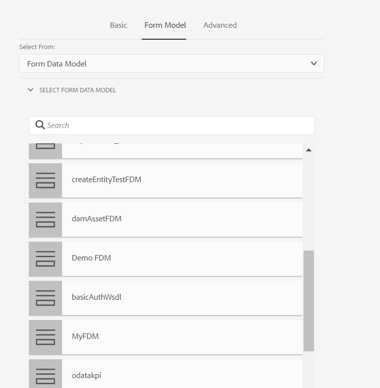

# 使用表单数据模型 {#use-form-data-model}

[!DNL Experience Manager Forms] 数据集成允许您使用不同的后端数据源创建表单数据模型，以将其用作各种自适应Forms中的模式 <!--and interactive communications--> 工作流。 它需要根据数据源中可用的数据模型对象和服务配置数据源并创建表单数据模型。 有关更多信息，请参阅下列主题：

* [[!DNL Experience Manager Forms] 数据集成](data-integration.md)
* [配置数据源](configure-data-sources.md)
* [创建表单数据模型](create-form-data-models.md)
* [使用表单数据模型](work-with-form-data-model.md)

表单数据模型是JSON架构的扩展，您可以使用它：

* [创建自适应Forms和片段](#create-af)

<!--* [Create interactive communications and building blocks like text, list, and condition fragments](#create-ic)-->
* [使用示例数据预览](#preview-ic)
* [使用表单数据模型服务](#prefill)
* [将提交的自适应表单数据写回数据源](#write-af)
* [使用自适应表单规则调用服务](#invoke-services)

## 创建自适应Forms和片段 {#create-af}

您可以创建 [自适应Forms](creating-adaptive-form.md) 和自适应表单片段 <!-- [Adaptive Form Fragments](adaptive-form-fragments.md) --> 基于表单数据模型。 在创建自适应表单或自适应表单片段时，请执行以下操作以使用表单数据模型：

1. 在“添加属性”屏幕上的“表单模型”选项卡中，选择 **[!UICONTROL 表单数据模型]** 在 **[!UICONTROL 选择自]** 下拉列表。

   

1. 点按以展开 **[!UICONTROL 选择表单数据模型]**. 将列出所有可用的表单数据模型。

   从数据模型中选择。

   

1. (**仅自适应表单片段**)您可以基于表单数据模型中只有一个数据模型对象来创建自适应表单片段。 展开 **[!UICONTROL 表单数据模型定义]** 下拉菜单。 它列出了指定表单数据模型中的所有数据模型对象。 从列表中选择数据模型对象。

   

   创建基于表单数据模型的自适应表单或自适应表单片段后，表单数据模型对象将显示在 **[!UICONTROL 数据源]** “自适应表单”编辑器中的“内容”浏览器选项卡。

   >[!NOTE]
   >
   >对于自适应表单片段，只有在创作时选择的数据模型对象及其关联的数据模型对象才会显示在数据源选项卡中。

   

   您可以将数据模型对象拖放到自适应表单或片段上以添加表单字段。 添加的表单字段将保留元数据属性并与数据模型对象属性绑定。 绑定可确保在表单提交时在相应数据源中更新字段值，并在表单呈现时预填。

<!-- ## Create interactive communications {#create-ic}

You can create an interactive communication based on a Form Data Model that you can use to prefill interactive communication with data from configured data sources. In addition, the building blocks of an interactive communication, such as text, list, and condition document fragments can be based on a form data model.

You can choose a Form Data Model when creating an interactive communication or a document fragment. The following image shows the General tab of the Create Interactive Communication dialog.

General tab of Create Interactive Communication dialog

For more information, see:

[Create an interactive communication](create-interactive-communication.md)

[Text in Interactive Communications](texts-interactive-communications.md)

[Conditions in Interactive Communications](conditions-interactive-communications.md)

[List fragments](lists.md) -->

## 使用示例数据预览 {#preview-ic}

表单数据模型编辑器允许您为表单数据模型中的数据模型对象生成和编辑示例数据。 您可以使用此数据进行预览和测试 <!--interactive communications and--> 自适应Forms。 在预览之前，必须生成示例数据，如 [使用表单数据模型](work-with-form-data-model.md#sample).

<!--To preview an interactive communication with sample Form Data Model data:

1. On [!DNL  Experience Manager] author instance, navigate to **[!UICONTROL Forms > Forms & Documents]**.
1. Select an interactive communication and tap **[!UICONTROL Preview]** in the toolbar to select **[!UICONTROL Web Channel]**, **[!UICONTROL Print Channel]**, or **[!UICONTROL Both Channels]** to preview the interactive communication.
1. In the Preview [*channel*] dialog, ensure that **[!UICONTROL Test Data of Form Data Model]** is selected and tap **[!UICONTROL Preview]**.

The interactive communication opens with prefilled sample data.

-->

要预览包含示例数据的自适应表单，请在创作模式下打开自适应表单，然后点按 **[!UICONTROL 预览]**.

## 使用表单数据模型服务预填充 {#prefill}

[!DNL Experience Manager Forms] 提供现成的表单数据模型预填充服务，您可以为自适应Forms启用该服务 <!--and interactive communications--> 基于表单数据模型。 预填充服务在自适应表单中查询数据模型对象的数据源 <!--and interactive communication--> 因此，在呈现表单或通信时预填充数据。

要为自适应表单启用表单数据模型预填充服务，请打开自适应表单容器属性并选择 **[!UICONTROL 表单数据模型预填充服务]** 从 **[!UICONTROL 预填充服务]** 下拉菜单。 然后，保存属性。

<!--To configure Form Data Model prefill service in an interactive communication, you can select Form Data Model Prefill Service in the Prefill Service drop-down while creating it or later by modifying the properties.

Edit Properties dialog for an interactive communication-->

## 将提交的自适应表单数据写入数据源 {#write-af}

当用户根据表单数据模型提交表单时，您可以配置表单以将数据模型对象提交的数据写入其数据源。 要实现此用例， [!DNL Experience Manager Forms] 提供 [表单数据模型提交操作](configuring-submit-actions.md)，仅现成可用于基于表单数据模型的自适应Forms。 它会在其数据源中写入数据模型对象的提交数据。

要配置表单数据模型提交操作，请打开自适应表单容器属性，然后选择 **[!UICONTROL 使用表单数据模型提交]** 从提交折叠面板下的提交操作下拉列表中。 然后，浏览并选择 **[!UICONTROL 要提交的数据模型对象的名称]** 下拉菜单。 保存属性。

在表单提交时，将配置数据模型对象的数据写入相应的数据源。

<!---->

您还可以使用二进制数据模型对象属性将表单附件提交到数据源。 执行以下操作以将附件提交到JDBC数据源：

1. 将包含二进制属性的数据模型对象添加到表单数据模型。
1. 在自适应表单中，拖放 **[!UICONTROL 文件附件]** 组件从组件浏览器上传到自适应表单。
1. 点按以选择添加的组件，然后点按  打开组件的属性浏览器。
1. 在绑定引用字段中，点按  并导航到选择您在表单数据模型中添加的二进制属性。 根据需要配置其他属性。

   点按  以保存属性。 附件字段现在绑定到表单数据模型的二进制属性。

1. 在自适应表单容器属性的“提交”部分中，启用 **[!UICONTROL 提交表单附件]**. 表单提交时，它会将二进制属性字段中的附件提交到数据源。

## 使用规则在自适应Forms中调用服务 {#invoke-services}

在基于表单数据模型的自适应表单中，您可以 [创建规则](rule-editor.md) 调用在表单数据模型中配置的服务。 的 **[!UICONTROL 调用服务]** 规则中的操作列出了表单数据模型中所有可用服务，并允许您为服务选择输入和输出字段。 您还可以使用 **[!UICONTROL 设置值]** 规则类型，以调用表单数据模型服务，并将字段值设置为服务返回的输出。

例如，以下规则会调用以员工ID为输入的get服务，并且返回的值会填充在表单中相应的从属ID、姓氏、名字和性别字段中。

此外，您还可以使用 `guidelib.dataIntegrationUtils.executeOperation` 用于在规则编辑器的代码编辑器中编写JavaScript的API。 <!-- For API details, see [API to invoke Form Data Model service](invoke-form-data-model-services.md).-->
