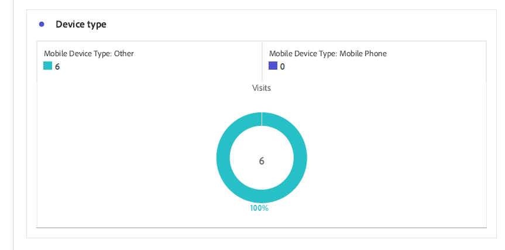

# 查看和了解自适应Forms分析报表 {#viewing-and-understanding-aem-forms-analytics-reports}

| 版本 | 文章链接 |
| -------- | ---------------------------- |
| AEM as a Cloud Service | 本文 |
| AEM 6.5 | [单击此处](https://experienceleague.adobe.com/docs/experience-manager-65/forms/integrate-aem-forms-with-experience-cloud-solutions/view-understand-aem-forms-analytics-reports.html) |

在快速发展的数字分析环境中，要做出明智决策并优化数字体验，必须顺应全球趋势。 为了解决此问题，自适应Forms与Adobe Analytics无缝集成，以捕获和跟踪已发布表单和文档的性能指标。 分析这些量度背后的目标是做出数据驱动型决策，使用量度和分析增强表单的可用性和有效性。

通过捕获和跟踪关键绩效指标，企业可以确定需要改进的方面，优化用户体验，最终推动更好的结果以创造卓越的客户体验。

## 将Adobe Analytics设置为自适应Forms {#setup-adobe-analytics-to-aem-forms}

对于AEM Forms Analytics报表，请首先通过Experience Cloud设置自动化将Adobe Analytics集成到AEM Forms。 自适应Forms中的Experience Cloud设置自动化需要Adobe Analytics许可证、数据收集(以前称为AdobeLaunch)来管理跟踪脚本，以及与Experience Platform LaunchAPI集成以简化数据聚合和见解生成。 访问 [使用Experience Cloud设置自动为自适应表单启用Adobe Analytics](/help/forms/enable-adobe-analytics-adaptive-form-using-experience-cloud-setup-automation.md) 了解完整的设置信息。

## 查看自适应Forms Adobe Analytics报表 {#view-adobe-analytics-report}

1. 在您的AEM实例上，转到 **[!UICONTROL Forms]** >> **[!UICONTROL Forms和文档]**.
1. 选择您的表单，您会看到Adobe Analytics已集成（如左图所示）到为Adobe Analytics激活的Forms。

   {width="100%"}

1. 单击 **Adobe Analytics** 查看报表和分析性能数据。

## 了解自适应Forms分析报表 {#understanding-aem-forms-analytics-reports}

Adobe Analytics提供了一系列全面的自适应Forms性能指标，旨在提供有关表单使用的宝贵见解。 这些指标包括：

### **自适应Forms的性能如何？** {#how-your-adaptive-form-is-performing}

它包含表单呈现、表单提交、验证错误和独特访客量度，利用这些量度，可评估表单的使用情况和有效性：

* **表单演绎版**：表单演绎版显示表单被呈现或打开的次数。

* **表单提交**：表单提交指示用户成功完成并提交自适应表单的次数。

* **验证错误**：验证错误显示表单字段中发生的与验证相关的错误总数。

* **独特访客**：独特访客表示访客呈现表单的次数。 有关独特访客的更多信息，请参阅 [独特访客、访问和客户行为](https://experienceleague.adobe.com/docs/analytics/components/metrics/visits.html).

  {width="100%"}

### **表单访客** {#visitors-to-your-forms}

它有助于您对表单中的访客活动获得有价值的分析：

* **访问和提交**：它描述在某个日期范围内访问表单的频率以及相应的表单提交次数，以了解有关此次点击的更多信息 [访问](https://experienceleague.adobe.com/docs/analytics/components/metrics/visits.html).
* **独特访客及其总访问量**：它会区分新用户和旧用户。 例如，访客可能在一个月内每天访问您的网站，但仍将其计为单个独特访客。 访问 [独特访客](https://experienceleague.adobe.com/docs/analytics/components/metrics/unique-visitors.html) 以了解详细信息。

  {width="100%"}

### **设备类型** {#device-type}

设备类型可帮助您识别用于访问表单的设备类型。 它将设备类型归类为“移动设备类型”。 例如，在本例中，选择“移动设备类型：其他”和“移动设备类型：移动电话”。 各种类型的移动设备包括手机、平板电脑、媒体播放器、游戏控制台等。

{width="100%"}

### **地理细分** {#geographical-breakdown}

它会显示访问Forms的位置。 它提供有关表单用户的特定于区域的信息，例如，您可以看到有关表单用户的特定于区域的信息是印度，如图所示。

{width="100%"}

### **流量主要来源和常用表单** {#top-sources-of-traffic-and-popular-forms}

这有助于您识别表单被引用位置的主要来源或链接。 例如，在下方的给定图像中，您看到自适应表单的搜索实例，其中18.9%为 **已输入/添加书签**， 70.49%基于 **搜索引擎**，其中24%来自 **其他网站**. 您可以根据自己的要求定义维度项目。 此外，您还可以确定哪些是访问次数最多或最受欢迎的表单。

{width="100%"}

### **热门表单上的用户活动** {#user-activity-on-top-forms}

全面了解用户与字段访问、表单呈现、验证错误、放弃的表单和表单提交之间的互动关系，可深入了解最活跃的表单。 在下图中，您可以看到根据表单事件量度，应用程序表单是最活跃的。

{width="100%"}

### **表单逗留时间的时间线** {#timeline-for-time-spent-on-forms}

这是用户随着时间的推移花在表单上的时间，这有助于您识别参与模式。

{width="100%"}

### **访客在填写表单时需要帮助的区域** {#areas-requiring-assistance}

帮助视图、验证错误和字段访问等量度可揭示用户需要帮助的位置以及我们如何跟踪字段中的错误。 例如，在下图中，您会在包含字段（如）的表单中看到 **全名**， **电话号码**， **DoB**. 此 **全名** 字段有12次访问，在12次访问中，8次访问发生验证错误，1次单击帮助图标可查看有关此字段的帮助视图。 您可以查看其他表单字段的量度数据。

{width="100%"}

### **访客在放弃表单前查看的最后一个表单字段** {#last-form-field-that-visitors-viewed}

这有助于您分析用户在放弃表单前花费时间的表单字段。 例如，在下面给定的图像中，在5个已放弃的表单中，有2个位于字段中 **全名**，字段上还剩2个 **电话号码**，且字段上还剩1个 **文本输入**.

{width="100%"}

## 另请参阅 {#see-also}

* [使用Experience Cloud设置自动为自适应表单启用Adobe Analytics](/help/forms/enable-adobe-analytics-adaptive-form-using-experience-cloud-setup-automation.md)
* [将自适应表单添加到 AEM Sites 页面或体验片段](/help/forms/create-or-add-an-adaptive-form-to-aem-sites-page.md)
* [将AEM Forms与Adobe Analytics集成](/help/forms/integrate-aem-forms-with-adobe-analytics.md)
