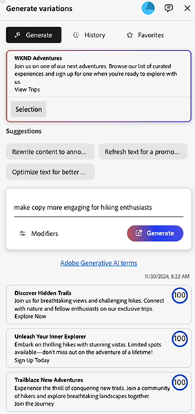

# 生成变体——集成在 AEM 编辑器中 {#generate-variations-integrated-in-aem-editors}

如果您正在寻找一种方法来优化您的数字渠道并加速内容创作，您可以使用集成在 AEM 编辑器中的“生成变体”功能。

“生成变体”功能使用生成式人工智能（AI）根据您的输入内容创建内容变体。创建变体后，您可以在您的网站上使用这些内容，并使用 [Edge Delivery Services](/help/edge/overview.md) 的[试验](https://www.aem.live/docs/experimentation)功能衡量它们的成功。

这有助于在几分钟内快速创建符合品牌要求的内容，从而加速内容更新速度。这反过来有助于通过新的文案变体提高转化率。

您可以在以下编辑器（[在配置完成后](#access-generate-variations)）中[访问生成变体](#access-generate-variations)功能：

* [在 AEM Edge Delivery Services 的 Sidekick 中；用于基于文档的创作](#access-aem-sidekick)
* [在通用编辑器中](#access-aem-universal-editor)
* [在内容片段编辑器中](#access-aem-content-fragment-editor)

>[!IMPORTANT]
>
>本页面使用基于文档的创作作为示例的基础，但其原则也适用于其他编辑器。

>[!NOTE]
>
>在所有情况下，要使用生成变体功能，您必须确保满足[访问权限方面的先决条件](#access-prerequisites)。

>[!NOTE]
>
>建议您使用此版本，因为虽然独立版本的[生成变体现在仍然可以直接访问](/help/generative-ai/generate-variations.md)，但未来将被弃用。

之后您可以：

* [选择您要处理的内容](#select-the-content)，从现有的内容区块中选择
   * 所选的区块决定了显示的内容和可用的操作
* [描述您想要做出的更改](#describe-the-changes-you-want)
* [生成内容的变体](#generate-copy)，然后[如果需要，执行进一步操作](#take-further-action-on-a-variation)
* [选择并使用变体](#use-a-generated-variation)
* 审查您的[历史](#history)
* 查看您的[收藏夹](#favorites)

## 法律和使用说明 {#legal-usage-note}

<!--
Generative AI and Generate Variations for AEM are powerful tools – but **you** are responsible for use of the output.

Your inputs to the service should be tied to a context. This context can be your branding materials, website content, data, schemas for such data, templates, or other trusted documents.

You must evaluate the accuracy of any output as appropriate to your use case.

Before using Generate Variations you are recommended to read the [Adobe Experience Cloud Generative AI User Guidelines](https://www.adobe.com/legal/licenses-terms/adobe-dx-gen-ai-user-guidelines.html).
-->

[生成变体的使用](#generative-action-usage)与生成式操作的使用相关。

>[!NOTE]
>
>请参阅[关于在 AEM 中生成变体的详细信息的安全情况说明书](https://www.adobe.com/cn/content/dam/cc/en/trust-center/ungated/whitepapers/experience-cloud/aem-sites-generate-variations-security-fact-sheet.pdf)。

## 概述 {#overview}

当您打开集成到编辑器中的“生成变体”功能时，您会看到该扩展作为一个浮动面板，面板上有三个选项卡。


* 编辑器：
   * 这显示了编辑器中的内容流。
   * 您可以在此处选择要在&#x200B;**生成变体**&#x200B;中使用的内容区块。
* **生成变体**：
   * 是一个带有三个选项卡的浮动面板，可以根据需要重新定位
   * [生成](#get-started-with-generate-variations)：
      * 显示[您选择的内容](#select-the-content)。
      * 提供更改&#x200B;**建议**&#x200B;示例。
      * 允许您[描述您想要进行的更改](#describe-the-changes-you-want)。
      * 允许您[生成](#generate-copy)新的变体。
      * 显示生成的变体。<!--, together with their [brand score](#the-brand-score).-->
      * [对变体采取进一步操作](#take-further-action-on-a-variation)。
      * [使用生成的变体](#use-a-generated-variation)。
   * [历史记录](#history)：
      * 显示您最近生成的历史记录。
   * [收藏夹](#favorites)：
      * 显示您标记为“收藏夹”的之前生成的结果。
   * **Adobe 生成式 AI 术语**：[Adobe Experience Cloud 生成式 AI 用户指南](https://www.adobe.com/cn/legal/licenses-terms/adobe-dx-gen-ai-user-guidelines.html)的链接。

## 开始使用生成变体功能 {#get-started-with-generate-variations}

该界面将引导您完成生成内容的过程。打开界面之后，第一步就是选择要使用的内容区块。

### 选择上下文 {#select-the-content}

从编辑器的主内容流中，选择您想要生成变体的内容。此&#x200B;**选择**&#x200B;将在&#x200B;**生成**&#x200B;选项卡中显示。

### 描述您想要做出的更改 {#describe-the-changes-you-want}

要生成相关内容的变体，您需要描述您想要做出的更改。您可以选择所给出的其中一项&#x200B;**建议**，或者提供您自己的描述。

您还可以指定&#x200B;**修饰符**，以提供更多上下文：

* **引用网页**，提供一个 URL 以获取更多上下文。
* **上传内容简介**，更新包含内容简介详细信息的 `.docx` 文件（10MB 或更小）。

### 生成文案 {#generate-copy}

描述完所需的更改后，选择&#x200B;**生成**&#x200B;来查看生成式 AI 的回应。



<!--
### The Brand Score {#the-brand-score}

The brand score shows you how on-brand the generated variation is.
-->

### 对变体采取进一步操作 {#take-further-action-on-a-variation}

当您选择单个变体时，您可以使用以下操作：

* **编辑**
   * 您可以编辑生成的变体文本。

      * 您的更新内容可以在网页中预览。

   * 保存您的更改以供日后使用。
* **收藏夹**
   * 标记此变体以供将来参考。
   * 标记后，它将会在[收藏夹](#favorites)选项卡下显示。
* **AI 原理**
   * 为了增加透明度，这提供了一个简短的描述，解释为什么生成式 AI 会生成该特定变体。

### 使用生成的变体 {#use-a-generated-variation}

要使用生成式 AI 生成的内容，您必须首先选择并&#x200B;**导出为 CSV**。

导出后，您可以在其他地方使用该内容；例如，在为您的网站创作内容时。您还可以运行[试验](https://www.aem.live/docs/experimentation)。

>[!NOTE]
>
>当从 [AEM 通用编辑器](#access-aem-universal-editor)或 [AEM 内容片段编辑器](#access-aem-content-fragment-editor)访问“生成变体”时，所选的生成内容将会自动保存到 AEM。

## 历史记录 {#history}

此选项卡显示您在选择了&#x200B;**生成**&#x200B;之后的历史活动。 已添加&#x200B;**历史记录**&#x200B;条目。

如果在稍后的某个时间点，您在主流程中选择相同的内容并打开&#x200B;**历史记录**&#x200B;选项卡，那么您将会看到为该区块生成的所有变体。

## 收藏夹 {#favorites}

在查看内容后，您可以将选定的变体保存为收藏夹。

保存后，它们就会显示在&#x200B;**收藏夹**&#x200B;下。收藏夹会被保留（直到您选择&#x200B;**取消收藏**&#x200B;它们，或清除浏览器缓存）。

* 您可以&#x200B;**编辑**、 **取消收藏**&#x200B;或显示某个条目的 **AI 原理**。
* 选择变体后，您还可以&#x200B;**导出到 CSV**。

## 生成式操作的使用 {#generative-action-usage}

使用管理取决于所采取的操作：

* 生成变体

  一个文案变体的生成等同于一个生成式操作。作为客户，您的 AEM 许可证附带了一定数量的生成式操作。一旦基本权限消耗完毕，您可以购买额外的操作。

  >[!NOTE]
  >
  >请参阅 [Adobe Experience Manager：Cloud Service | 产品描述](https://helpx.adobe.com/cn/legal/product-descriptions/aem-cloud-service.html)，了解有关基本权限的更多详细信息，如果您想购买更多生成式操作，请联系您的帐户团队。

## 访问“生成变体” {#access-generate-variations}

满足先决条件后，您可以通过 AEM as a Cloud Service 或 Edge Delivery Services 的 Sidekick 访问“生成变体”功能。

### 访问权限方面的先决条件 {#access-prerequisites}

要使用“生成变体”功能，您必须确保满足先决条件：

* [访问带有 Edge Delivery Services 的 Experience Manager as a Cloud Service](#access-to-aemaacs-with-edge-delivery-services)

#### 访问带有 Edge Delivery Services 的 Experience Manager as a Cloud Service{#access-to-aemaacs-with-edge-delivery-services}

需要访问“生成变体”功能的用户必须有权使用带有 Edge Delivery Services 的 Experience Manager as a Cloud Service 环境。

>[!NOTE]
>
>如果您的 AEM Sites as a Cloud Service 合同中未包含 Edge Delivery Services，您将需要签署一份新合同以获取访问权限。
>
>您应该联系您的客户团队，讨论如何迁移至带有 Edge Delivery Services 的 AEM Sites as a Cloud Service。

为了授予特定用户访问权限，请将他们的用户帐户分配到相应的产品配置文件中。请参阅[分配 AEM 产品配置文件，以了解更多详细信息](/help/journey-onboarding/assign-profiles-cloud-manager.md)。

### 通过 AEM Sidekick 访问基于文档的创作功能 {#access-aem-sidekick}

通过 AEM Sidekick 的访问用于[基于文档的创作](https://www.aem.live/docs/aem-authoring)。

在访问 Edge Delivery Services 的 Sidekick 的“生成变体”功能之前，需要进行一些配置。

>[!NOTE]
>
>请参阅文档[安装 AEM Sidekick](https://www.aem.live/docs/sidekick-extension)，了解有关如何安装和配置 Sidekick 的信息。

要在 Edge Delivery Services 的 Sidekick 中使用“生成变体”功能，请在 Edge Delivery Services 项目中加入以下配置。

1. 在以下位置启用我们的应用程序：

   * `tools/sidekick/config.json`

   这必须合并到您现有的配置中，然后进行部署。

   例如：

   ```prompt
   {
     "plugins": [
       {
         "id": "aem-genai-variations",
         "titleI18n": {
           "en": "Generate with AI"
         },
         "environments": [
           "preview"
         ],
         "includePaths": [
           "**.docx**"
         ],
         "event": "aem-genai-variations-sidekick"
       }
     ]
   }
   ```

1. 创建：

   * `/tools/sidekick/aem-genai-variations.js`

   您必须创建包含以下内容的文件：

   ```prompt
   (function () {
     let isAEMGenAIVariationsAppLoaded = false;
     function loadAEMGenAIVariationsApp() {
       const script = document.createElement('script');
       script.src = 'https://experience.adobe.com/solutions/aem-sites-genai-aem-genai-variations-mfe/static-assets/resources/sidekick/client.js?source=plugin';
       script.onload = function () {
         isAEMGenAIVariationsAppLoaded = true;
       };
       script.onerror = function () {
         console.error('Error loading AEMGenAIVariationsApp.');
       };
       document.head.appendChild(script);
     }
   
     function handlePluginButtonClick() {
       if (!isAEMGenAIVariationsAppLoaded) {
         loadAEMGenAIVariationsApp();
       }
     }
   
     // The code snippet for the Sidekick V1 extension, https://chromewebstore.google.com/detail/aem-sidekick/ccfggkjabjahcjoljmgmklhpaccedipo?hl=en
     const sidekick = document.querySelector('helix-sidekick');
     if (sidekick) {
       // sidekick already loaded
       sidekick.addEventListener('custom:aem-genai-variations-sidekick', handlePluginButtonClick);
     } else {
       // wait for sidekick to be loaded
       document.addEventListener('sidekick-ready', () => {
         document.querySelector('helix-sidekick')
           .addEventListener('custom:aem-genai-variations-sidekick', handlePluginButtonClick);
       }, { once: true });
     }
   
     // The code snippet for the Sidekick V2 extension, https://chromewebstore.google.com/detail/aem-sidekick/igkmdomcgoebiipaifhmpfjhbjccggml?hl=en
     const sidekickV2 = document.querySelector('aem-sidekick');
     if (sidekickV2) {
       // sidekick already loaded
       sidekickV2.addEventListener('custom:aem-genai-variations-sidekick', handlePluginButtonClick);
     } else {
       // wait for sidekick to be loaded
       document.addEventListener('sidekick-ready', () => {
         document.querySelector('aem-sidekick')
           .addEventListener('custom:aem-genai-variations-sidekick', handlePluginButtonClick);
       }, { once: true });
     }
   }());
   ```

1. 更新：

   * `/scripts/scripts.js`

   必须对此进行更新以在 `loadLazy()` 函数中包含以下语句：

   ```prompt
     import('../tools/sidekick/aem-genai-variations.js');
   ```

   这确保 `/tools/sidekick/aem-genai-variations.js` 作为延迟加载过程的一部分被加载。

   

1. 您可能需要确保用户对带有 [Edge Delivery Services 的 Experience Manager as a Cloud Service 具有访问权限](#access-to-aemaacs-with-edge-delivery-services)。

1. 然后，您可以通过在 Sidekick 的工具栏中选择&#x200B;**使用 AI 生成**&#x200B;来访问该功能：

   

### 通过 AEM 通用编辑器访问 {#access-aem-universal-editor}

通过 [AEM 通用编辑器](/help/sites-cloud/authoring/universal-editor/authoring.md)访问是作为一个扩展实施的。

* 有关如何使用通用编辑器访问生成变体的详细信息，请参阅文档[使用通用编辑器创作内容。](/help/sites-cloud/authoring/universal-editor/authoring.md#generate-variations)
* 有关如何启用扩展的详细信息，请参阅文档 [AEM Experience Manager 中的扩展管理器。](https://developer.adobe.com/uix/docs/extension-manager/)

### 通过 AEM 内容片段编辑器访问 {#access-aem-content-fragment-editor}

通过 [AEM 内容片段编辑器](/help/sites-cloud/administering/content-fragments/authoring.md#generate-variations-ai)访问是作为一个扩展实施的。有关更多详细信息，请参阅 [AEM Experience Manager 中的扩展管理器](https://developer.adobe.com/uix/docs/extension-manager/)。

## 更多信息 {#further-information}

若要了解更多信息，您还可以阅读：

* [GenAI 在 GitHub 上生成变体](https://github.com/adobe/aem-genai-assistant#setting-up-aem-genai-assistant)
* [Edge Delivery Services 试验](https://www.aem.live/docs/experimentation)
* [Experience Cloud 产品中的生成式 AI](https://experienceleague.adobe.com/zh-hans/docs/core-services/interface/features/generative-ai)

   * [Experience Cloud 产品中的生成式 AI - Adobe Experience Manager](https://experienceleague.adobe.com/zh-hans/docs/core-services/interface/features/generative-ai#aem)

* [在 Experience Cloud 上生成变体登陆页面](https://experience.adobe.com/solutions/aem-sites-genai-aem-genai-variations-mfe/static-assets/resources/ga.html)

* [AEM as a Cloud Service 中的生成式 AI](/help/ai-in-aem/overview.md#generative-ai-in-aem)

## 版本历史记录 {#release-history}

有关当前版本和之前版本的详细信息，请参阅[生成变体的发行说明](/help/generative-ai/release-notes-generate-variations.md)
