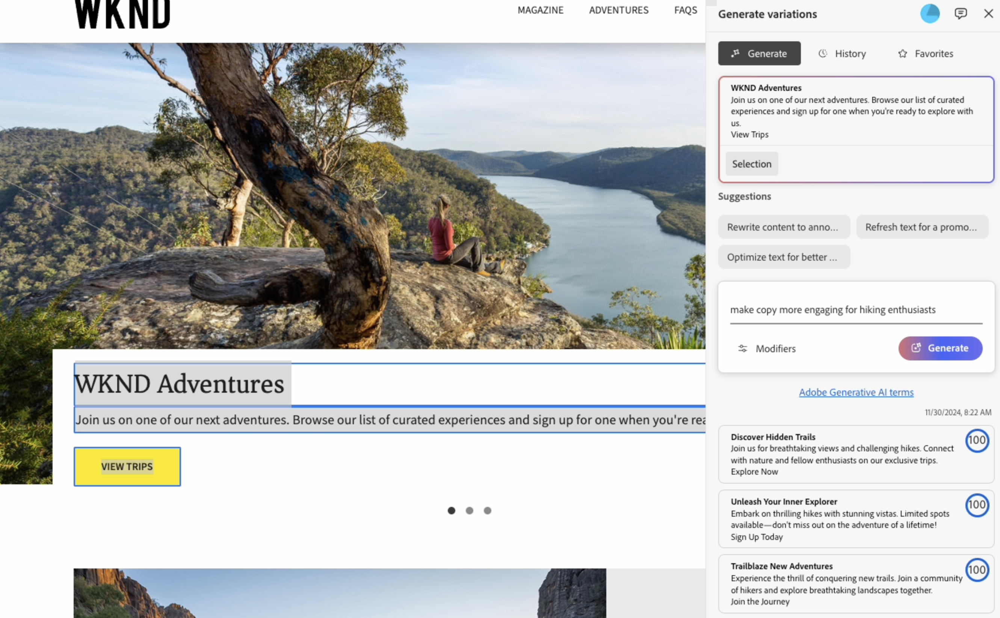

# 生成变体 — 集成在AEM编辑器中 {#generate-variations-integrated-in-aem-editors}

如果您正在寻找优化数字渠道和加快内容创建的方法，则可以使用集成到AEM编辑器中的生成变体。

生成变体使用生成人工智能(AI)根据您的输入创建内容变体。 创建变体后，您可以在您的网站上使用这些内容，并使用 [Edge Delivery Services](/help/edge/overview.md) 的[实验](https://www.aem.live/docs/experimentation)功能衡量它们的成功。

这有助于在几分钟内通过快速创建品牌内容来加快内容速度。 这进而有助于改善与新复制变体的转化。

您可以从以下编辑器[访问生成变体](#access-generate-variations) （[在配置变体](#access-generate-variations)后）：

* [在AEM Edge Delivery Services的Sidekick中；用于基于文档的创作](#access-aem-sidekick)
* [在通用编辑器中](#access-aem-universal-editor)
* [在内容片段编辑器中](#access-aem-content-fragment-editor)

>[!IMPORTANT]
>
>本页使用基于文档的创作作为示例的基础，但相关原则适用于其他编辑器。

>[!NOTE]
>
>在所有情况下，要使用生成变体功能，您必须确保满足[访问权限方面的先决条件](#access-prerequisites)。

>[!NOTE]
>
>仍可直接访问[生成变体的独立版本](/help/generative-ai/generate-variations.md)。

之后您可以：

* [从现有内容块中选择要处理的内容](#select-the-content)
   * 所选块指示显示的内容和可用的操作
* [描述所需的更改](#describe-the-changes-you-want)
* [生成内容的变体](#generate-copy)，然后[根据需要采取进一步操作](#take-further-action-on-a-variation)
* [选择并使用变体](#use-a-generated-variation)
* 查看您的[历史记录](#history)
* 查看您的[收藏夹](#favorites)

## 法律和使用说明 {#legal-usage-note}

<!--
Generative AI and Generate Variations for AEM are powerful tools – but **you** are responsible for use of the output.

Your inputs to the service should be tied to a context. This context can be your branding materials, website content, data, schemas for such data, templates, or other trusted documents.

You must evaluate the accuracy of any output as appropriate to your use case.

Before using Generate Variations you are recommended to read the [Adobe Experience Cloud Generative AI User Guidelines](https://www.adobe.com/legal/licenses-terms/adobe-dx-gen-ai-user-guidelines.html).
-->

[生成变体的使用](#generative-action-usage)与生成式操作的消耗相关。

## 概述 {#overview}

在打开集成到编辑器中的生成变体时，您会看到扩展作为具有三个选项卡的浮动面板。



* 编辑者：
   * 这将显示编辑器中的内容流。
   * 在此处，您可以选择内容块以在&#x200B;**生成变体**&#x200B;中使用。
* **生成变体**：
   * 是一个具有三个选项卡的浮动面板，可根据需要重新调整其位置
   * [生成](#get-started-with-generate-variations)：
      * 显示您选择的[内容](#select-the-content)。
      * 为更改提供示例&#x200B;**建议**。
      * 允许您[描述所需的更改](#describe-the-changes-you-want)。
      * 允许您[生成](#generate-copy)新变体。
      * 显示生成的变量。<!--, together with their [brand score](#the-brand-score).-->
      * [对变体执行进一步操作](#take-further-action-on-a-variation)。
      * [使用生成的变量](#use-a-generated-variation)。
   * [历史记录](#history)：
      * 显示您最近几代的历史记录。
   * [收藏夹](#favorites)：
      * 显示已标记为收藏的前一代结果。
   * **Adobe Generative AI术语**：链接到[Adobe Experience Cloud Generative AI用户指南](https://www.adobe.com/cn/legal/licenses-terms/adobe-dx-gen-ai-user-guidelines.html)。

## 生成变体入门 {#get-started-with-generate-variations}

该界面将引导您完成生成内容的过程。打开界面后，第一步是选择要使用的内容块。

### 选择内容 {#select-the-content}

从编辑器的主内容流中，选择要为其生成变体的内容。 此&#x200B;**选择**&#x200B;将显示在&#x200B;**生成**&#x200B;选项卡中。

### 描述所需的更改 {#describe-the-changes-you-want}

要生成内容的变体，您需要描述所需的更改。 您可以选择给定的&#x200B;**建议**&#x200B;之一，也可以提供您自己的描述。

您还可以指定&#x200B;**修饰符**&#x200B;以提供更多上下文：

* **引用网页**
为更多上下文提供一个URL。
* **上载内容简报**
更新包含内容摘要（10MB或更小）详细信息的`.docx`文件。

### 生成副本 {#generate-copy}

在描述了所需的更改后，选择&#x200B;**生成**&#x200B;以查看来自生成AI的响应。


<!--
### The Brand Score {#the-brand-score}

The brand score shows you how on-brand the generated variation is.
-->

### 对变量执行进一步操作 {#take-further-action-on-a-variation}

选择单个变体时，可以使用以下操作：

* **编辑**
   * 您可以编辑生成的变体的文本。

      * 可以在网页中预览您的更新。

   * 保存更改以供将来使用。
* **收藏**
   * 标记此变量以供将来参考。
   * 标记后，将显示在[收藏夹](#favorites)选项卡下。
* **AI理由**
   * 为了增加透明度，本文简要说明了创作AI生成该特定变体的原因。

### 使用生成的变量 {#use-a-generated-variation}

要使用通过创作AI生成的内容，您必须首先选择并&#x200B;**导出到CSV**。

导出后，您可以在其他位置使用内容；例如，在为网站创作内容时。 您还可以运行[试验](https://www.aem.live/docs/experimentation)。

>[!NOTE]
>
>当从[AEM通用编辑器](#access-aem-universal-editor)或[AEM内容片段编辑器](#access-aem-content-fragment-editor)访问生成变体时，所选生成的内容会自动保存到AEM。

## 历史记录 {#history}

此选项卡显示您过去的活动，如选择&#x200B;**生成**&#x200B;之后。 已添加&#x200B;**History**&#x200B;条目。

如果在以后选择主流中的相同内容并打开&#x200B;**历史记录**&#x200B;选项卡，则会看到为该块生成的所有变体。

## 收藏夹 {#favorites}

在查看内容后，您可以将选定的变体保存为收藏夹。

保存后，它们将显示在&#x200B;**收藏夹**&#x200B;下。 收藏会一直保留（直到您&#x200B;**取消收藏**&#x200B;它们，或清除浏览器缓存）。

* 您可以&#x200B;**编辑**、**取消收藏**&#x200B;或显示条目的&#x200B;**AI基本原则**。
* 选择变量后，您还可以&#x200B;**导出到CSV**。

## 生成式操作的使用 {#generative-action-usage}

使用管理取决于所采取的操作：

* 生成变体

  一个复制变体的生成等同于一个生成式操作。作为客户，您的 AEM 许可证附带了一定数量的生成式操作。一旦基本权限消耗完毕，您可以购买额外的操作。

  >[!NOTE]
  >
  >请参阅 [Adobe Experience Manager：Cloud Service | 产品描述](https://helpx.adobe.com/cn/legal/product-descriptions/aem-cloud-service.html)，了解有关基本权限的更多详细信息，如果您想购买更多生成式操作，请联系您的帐户团队。

## 访问“生成变体” {#access-generate-variations}

满足先决条件后，您可以通过 AEM as a Cloud Service 或 Edge Delivery Services 的 Sidekick 访问“生成变体”功能。

### 访问权限方面的先决条件 {#access-prerequisites}

要使用“生成变体”功能，您必须确保满足先决条件：

* [访问带有 Edge Delivery Services 的 Experience Manager as a Cloud Service](#access-to-aemaacs-with-edge-delivery-services)

#### 访问带有 Edge Delivery Services 的 Experience Manager as a Cloud Service{#access-to-aemaacs-with-edge-delivery-services}

需要访问“生成变体”功能的用户必须有权使用带有 Edge Delivery Services 的 Experience Manager as a Cloud Service 环境。

>[!NOTE]
>
>如果您的 AEM Sites as a Cloud Service 合同中未包含 Edge Delivery Services，您将需要签署一份新合同以获取访问权限。
>
>您应该联系您的客户团队，讨论如何迁移至带有 Edge Delivery Services 的 AEM Sites as a Cloud Service。

为了授予特定用户访问权限，请将他们的用户帐户分配到相应的产品配置文件中。请参阅[分配 AEM 产品配置文件，以了解更多详细信息](/help/journey-onboarding/assign-profiles-cloud-manager.md)。

### 从AEM Sidekick访问基于文档的创作 {#access-aem-sidekick}

来自AEM Sidekick的访问权限用于基于[文档的创作](/help/edge/wysiwyg-authoring/authoring.md)。

在访问 Edge Delivery Services 的 Sidekick 的“生成变体”功能之前，需要进行一些配置。

>[!NOTE]
>
>请参阅文档[安装 AEM Sidekick](https://www.aem.live/docs/sidekick-extension)，了解有关如何安装和配置 Sidekick 的信息。

要在Edge Delivery Services的Sidekick中生成变体，请在您的Edge Delivery Services项目中包含以下配置。

1. 在中启用我们的应用程序：

   * `tools/sidekick/config.json`

   这必须合并到您现有的配置中，然后进行部署。

   例如：

   ```prompt
   {
     "plugins": [
       {
         "id": "aem-genai-variations",
         "titleI18n": {
           "en": "Generate with AI"
         },
         "environments": [
           "preview"
         ],
         "includePaths": [
           "**.docx**"
         ],
         "event": "aem-genai-variations-sidekick"
       }
     ]
   }
   ```

1. 创建：

   * `/tools/sidekick/aem-genai-variations.js`

   您必须创建包含以下内容的此文件：

   ```prompt
   (function () {
     let isAEMGenAIVariationsAppLoaded = false;
     function loadAEMGenAIVariationsApp() {
       const script = document.createElement('script');
       script.src = 'https://experience.adobe.com/solutions/aem-sites-genai-aem-genai-variations-mfe/static-assets/resources/sidekick/client.js?source=plugin';
       script.onload = function () {
         isAEMGenAIVariationsAppLoaded = true;
       };
       script.onerror = function () {
         console.error('Error loading AEMGenAIVariationsApp.');
       };
       document.head.appendChild(script);
     }
   
     function handlePluginButtonClick() {
       if (!isAEMGenAIVariationsAppLoaded) {
         loadAEMGenAIVariationsApp();
       }
     }
   
     // The code snippet for the Sidekick V1 extension, https://chromewebstore.google.com/detail/aem-sidekick/ccfggkjabjahcjoljmgmklhpaccedipo?hl=en
     const sidekick = document.querySelector('helix-sidekick');
     if (sidekick) {
       // sidekick already loaded
       sidekick.addEventListener('custom:aem-genai-variations-sidekick', handlePluginButtonClick);
     } else {
       // wait for sidekick to be loaded
       document.addEventListener('sidekick-ready', () => {
         document.querySelector('helix-sidekick')
           .addEventListener('custom:aem-genai-variations-sidekick', handlePluginButtonClick);
       }, { once: true });
     }
   
     // The code snippet for the Sidekick V2 extension, https://chromewebstore.google.com/detail/aem-sidekick/igkmdomcgoebiipaifhmpfjhbjccggml?hl=en
     const sidekickV2 = document.querySelector('aem-sidekick');
     if (sidekickV2) {
       // sidekick already loaded
       sidekickV2.addEventListener('custom:aem-genai-variations-sidekick', handlePluginButtonClick);
     } else {
       // wait for sidekick to be loaded
       document.addEventListener('sidekick-ready', () => {
         document.querySelector('aem-sidekick')
           .addEventListener('custom:aem-genai-variations-sidekick', handlePluginButtonClick);
       }, { once: true });
     }
   }());
   ```

1. 更新：

   * `/scripts/scripts.js`

   必须更新此语句，以便在`loadLazy()`函数中包含以下语句：

   ```prompt
     import('../tools/sidekick/aem-genai-variations.js');
   ```

   这可确保在延迟加载过程中加载`/tools/sidekick/aem-genai-variations.js`。

   

1. 您可能需要确保用户具有对带有 [Edge Delivery Services 的 Experience Manager as a Cloud Service 的访问权限](#access-to-aemaacs-with-edge-delivery-services)。

1. 然后，您可以通过从Sidekick的工具栏中选择&#x200B;**使用AI生成**&#x200B;来访问该功能：

   

### 从AEM通用编辑器访问 {#access-aem-universal-editor}

从[AEM通用编辑器](/help/sites-cloud/authoring/universal-editor/authoring.md)进行的访问已作为扩展实现。 有关更多详细信息，请参阅AEM Experience Manager中的[Extension Manager](https://developer.adobe.com/uix/docs/extension-manager/)。

### 从AEM内容片段编辑器访问 {#access-aem-content-fragment-editor}

从[AEM内容片段编辑器](/help/sites-cloud/administering/content-fragments/authoring.md#generate-variations-ai)进行的访问已作为扩展实施。 有关更多详细信息，请参阅AEM Experience Manager中的[Extension Manager](https://developer.adobe.com/uix/docs/extension-manager/)。

## 更多信息 {#further-information}

若要了解更多信息，您还可以阅读：

* [GenAI 在 GitHub 上生成变体](https://github.com/adobe/aem-genai-assistant#setting-up-aem-genai-assistant)
* [Edge Delivery Services 试验](https://www.aem.live/docs/experimentation)

## 版本历史记录 {#release-history}

有关当前版本和之前版本的详细信息，请参阅[生成变体的发行说明](/help/generative-ai/release-notes-generate-variations.md)
