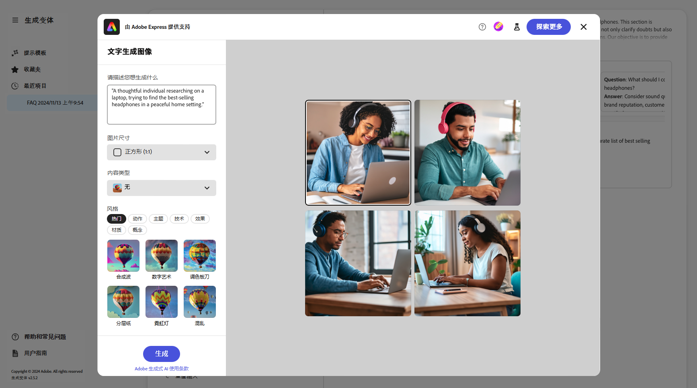
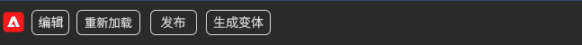

# 生成变体 {#generate-variations}

如果您正在寻找优化数字渠道和加快内容创建的方法，则可以使用“生成变体”。 生成变体使用生成人工智能(AI)根据提示创建内容变体；这些提示由Adobe提供或由用户创建和管理。 创建变体后，您可以在网站上使用该内容，也可以使用衡量变体成功与否 [试验](https://www.aem.live/docs/experimentation) 的功能 [Edge Delivery Services](/help/edge/overview.md).

您可以 [访问生成变体](#access-generate-variations) 从：

<!-- 
* [within Adobe Experience Manager (AEM) as a Cloud Service](#access-aemaacs)
-->

* [AEMEdge Delivery Services的Sidekick](#access-aem-sidekick)

稍后您可以：

* [入门](#get-started) 使用Adobe为特定用例创建的提示模板。
* 您可以 [编辑现有提示](#edit-the-prompt)
* 或 [创建并使用您自己的提示](#create-prompt)：
   * [保存您的提示](#save-prompt) 供将来使用
   * [访问和使用共享提示](#select-prompt) 来自您的整个组织
* 定义 [受众](#audiences) 在以下情况下在提示中使用的区段： [生成特定于受众的个性化内容](#generate-copy).
* 在修改和优化结果（如有必要）之前，在提示旁预览输出。
* 使用 [用于生成图像的Adobe Express](#generate-image) 基于复制变体；这使用Firefly的创作AI功能。
* 选择要在您的网站上或试验中使用的内容。

## 法律和使用说明 {#legal-usage-note}

创作AI和为AEM生成变体是功能强大的工具，但是 **您** 负责使用输出。

您对服务的输入应绑定到上下文。 此上下文可以是您的品牌推广材料、网站内容、数据、此类数据的架构、模板或其他可信文档。

必须根据用例评估任何输出的精度。

在使用“生成变体”之前，您需要同意 [Adobe生成AI用户指南](https://www.adobe.com/legal/licenses-terms/adobe-dx-gen-ai-user-guidelines.html).

[生成变体的使用情况](#generative-action-usage) 与创造性行为的消费挂钩。

## 概述 {#overview}

打开“生成变体”（并展开左侧面板）时，您会看到：


* 右侧面板
   * 这取决于您在左侧导航中所做的选择。
   * 默认情况下， **提示模板** 将显示出来。
* 左侧导航
   * 左侧的 **生成变体**，则有选项（三明治菜单）可展开或隐藏左侧导航面板。
   * **提示模板**：
      * 显示各种提示的链接；这些可能包括提示：
         * 由Adobe提供，用于帮助您生成内容；使用Adobe图标进行标记。
         * 自己创建。
         * 在IMS组织内创建；用显示多个头的图标进行标记。
      * 包括 [新建提示](#create-prompt) 用于创建自己的提示的链接。
      * 您可以 **删除** 自行或IMS组织内创建的提示。 可使用相应的卡上随椭圆一起访问的菜单完成此操作。
   * [收藏夹](#favorites)：显示已标记为收藏的上一代搜索结果。
   * [最近项目](#recents)：提供最近使用的提示及其输入的链接。
   * **帮助和常见问题解答**：指向文档的链接，包括常见问题解答。
   * **用户准则**：指向法律准则的链接。

## 开始使用 {#get-started}

该界面将指导您完成生成内容的过程。 打开界面后，第一步是选择要使用的提示。

### 选择提示 {#select-prompt}

从主面板中，您可以选择：

* 由Adobe提供的用于开始生成内容的提示模板，
* 该 [新建提示](#create-prompt) 创建自己的提示，
* 您创建的仅供您使用的模板，
* 您或您组织中的某人已创建的模板。

要区分：

* Adobe提供的提示将使用Adobe图标进行标记
* IMS组织中可用的提示使用多头图标进行标记。
* 未特别标记您的私人提示。


### 提供输入 {#provide-inputs}

每个提示都需要您提供特定信息，以便能够从创作AI中获取合适的内容。

输入字段将引导您了解需要哪些信息。 为帮助解决此问题，某些字段具有您可使用或根据需要修改的默认值，以及说明要求的说明。

有多个键输入字段对于多个提示是通用的（某些字段并非始终可用）：

* **计数**/**数量**
   * 您可以选择希望在一代中创建多少内容变体。
   * 根据提示的不同，这可能具有各种标签之一；例如Count、Number of Variations、Number of Ideas等。
* **受众源**/**目标受众**
   * 帮助向特定受众生成个性化内容。
   * Adobe提供默认受众；或者您可以指定其他受众；请参阅 [受众](#audiences).
* **其他上下文**
   * 插入相关内容，以帮助Generative AI根据输入制作更好的响应。 例如，如果要为特定页面或产品创建Web横幅，则可能需要包含有关页面/产品的信息。
* **温度**
用于修改Adobe生成人工智能的温度：
   * 温度升高会偏离提示并导致更多变化、随机性和创造性。
   * 较低的温度更具确定性，更接近提示中的内容。
   * 缺省情况下，温度设置为1。 如果生成的结果不符合您的要求，您可以试验不同的温度。
* **编辑提示**
   * 基础 [提示可编辑](#edit-the-prompt) 以优化生成的结果。

### 生成副本 {#generate-copy}

在填写输入字段和/或修改提示后，即可生成内容并查看响应。

选择 **生成** 查看创作AI生成的响应。 生成的内容变体显示在生成这些变体的提示下。


>[!NOTE]
>
>大多数Adobe提示模板都包含 **AI原理** 在变量响应中。 这可以透明地解释为何创新型人工智能会产生这种特定的变体。

选择单个变体时，以下操作可用：

* **收藏**
   * 标记为 **收藏** 供将来使用(将显示在 [收藏夹](#favorites))。
* 竖起大拇指/竖下大拇指
   * 使用拇指上/下指示器通知Adobe响应的质量。
* **复制**
   * 复制到剪贴板以便在网站上创作内容时使用，或在 [试验](https://www.aem.live/docs/experimentation).
* **删除**

如果需要优化输入或提示，可以进行调整并选择 **生成** 再次获得一组新响应。 新的提示和响应显示在初始提示和响应的下方；您可以上下滚动以查看各种内容集。

每组变体的上方是创建这些变体的提示，以及 **重复使用** 选项。 如果您需要重新运行包含其输入的提示，请选择 **重复使用** 以重新加载它们 **输入**.

### 生成图像 {#generate-image}

生成文本变体后，可以使用Firefly的生成AI功能生成Adobe Express的图像。

>[!NOTE]
>
>**生成图像** 仅当您在IMS组织中拥有Adobe Express权利，并在Admin Console中向您授予访问权限时，才可用。

选择一个变体，然后 **生成图像**，以直接打开 **文本到图像** 在 [Adobe Express](https://www.adobe.com/express/). 该提示会根据您的变体选择预先填充，并且会根据该提示自动生成图像。



您可以进行进一步的更改：

* [在Adobe Express中写下自己的提示](https://helpx.adobe.com/firefly/using/tips-and-tricks.html) 通过描述你希望看到的内容，
* 调整 **文本到图像** 选项，
* 则 **刷新** 生成的图像。

您还可以使用 **浏览更多** 以获得更多可能性。

完成后，选择所需的图像并 **保存** 以关闭Adobe Express。 将返回图像，并随变量一起保存。


在此处，您可以将鼠标悬停在图像上以显示以下内容的措施项：

* **复制**： [将图像复制到剪贴板以供在其他位置使用](#use-content)
* **编辑**：打开Adobe Express，以便您可以对图像进行更改
* **下载**：将图像下载到本地计算机
* **删除**：从变量中删除图像

>[!NOTE]
>
>[content credentials](https://helpx.adobe.com/creative-cloud/help/content-credentials.html) 在基于文档的创作中使用时，不会持久保留。

### 使用内容 {#use-content}

要使用通过创作AI生成的内容，必须将内容复制到剪贴板以供在其他位置使用。

可使用复制图标完成此操作：

* 对于文本：使用在变体面板上可见的复制图标
* 对于图像：将鼠标悬停在图像上可查看复制图标

将信息复制到剪贴板后，即可粘贴该信息以用于为网站创作内容。 您还可以运行 [试验](https://www.aem.live/docs/experimentation).

## 收藏夹 {#favorites}

查看内容后，您可以将所选变体另存为收藏夹。

保存后，它们将显示在 **收藏夹** 在左侧导航中。 收藏会一直保留(直到您 **删除** 或清除浏览器缓存)。

* 收藏夹和变体可以复制/粘贴到剪贴板以便在您的网站内容中使用。
* 收藏夹可以是 **已删除**.

## 最近访问 {#recents}

此部分提供指向最近活动的链接。 A **最近** 条目会在您选择后添加 **生成**. 它具有提示的名称和时间戳。 如果选择某个链接，则该链接会加载提示、填充相应的输入字段并显示生成的变体。

## 编辑提示 {#edit-the-prompt}

可以编辑基础提示。 您可能需要执行以下操作：

* 如果您要获得的生成结果需要进一步细化
* 要修改和 [保存提示](#save-prompt) 供将来使用

选择 **编辑提示**：


这将打开提示编辑器，您可以在其中进行更改：


### 添加提示输入 {#add-prompt-inputs}

创建或编辑提示时，您可能希望添加输入字段。 输入字段在提示中充当变量，并提供了在各种场景中使用相同提示的灵活性。 它们允许用户定义提示的特定元素，而无需编写整个提示。

* 使用双大括号定义字段 `{{ }}` 将占位符名称括起来。
例如：`{{tone_of_voice}}`。

  >[!NOTE]
  >
  >双大括号之间不允许有空格。

* 它也定义于 `METADATA`，并使用以下参数：
   * `label`
   * `description`
   * `default`
   * `type`

#### 示例：添加新文本字段 — 语音音调 {#example-add-new-text-field-tone-of-voice}

添加标题为的新文本字段 **语调**&#x200B;中，在提示符下使用以下语法：

```prompt
{{@tone_of_voice, 
  label="Tone of voice",
  description="Indicate the desired tone of voice",
  default="optimistic, smart, engaging, human, and creative",
  type=text
}}
```


#### 示例：添加新下拉字段 — 页面类型 {#example-add-new-dropdown-field-page-type}

要创建提供下拉选择的输入字段“页面类型”，请执行以下操作：

1. 创建名为的电子表格 `pagetype.xls` 文件夹结构的顶级目录中。
1. 编辑电子表格：

   1. 创建两列： **键** 和 **值**.
   1. 在 **键** 列中，输入将在下拉列表中显示的标签。
   1. 在 **值** 列，描述键值，使生成人工智能具有上下文。

1. 在提示符下，参考电子表格的标题以及相应的类型。

   ```prompt
   {{@page_type, 
     label="Page Type",
     description="Describes the type of page",
     spreadsheet=pagetype
   }}
   ```

## 创建提示 {#create-prompt}

当您选择时 **新建提示** 从 **提示模板**，新面板将允许您输入新提示。 然后，您可以指定这些参数，以及 **温度**，至 **生成** 内容。

请参阅 [保存提示](#save-prompt) 有关保存提示以备将来使用的详细信息。

请参阅 [添加提示输入](#add-prompt-inputs) 以获取有关添加自己的提示输入的详细信息。

如果要在UI中保留格式设置，则在复制并粘贴到基于文档的创作流中时，请在提示中包含以下内容：

<!-- CHECK - are the double-quotes needed? -->

* `"Format the response as an array of valid, iterable RFC8259 compliant JSON"`

下图显示了这样做的优势：

* 在第一个示例中， `Title` 和 `Description` 合并
* 在第二个示例中，它们单独进行格式设置：这是通过在提示符中包含JSON请求来完成的。


## 保存提示 {#save-prompt}

编辑或创建提示后，您可能希望保存这些提示以供将来使用；供IMS组织或您自己使用。 保存的提示将显示为 **提示模板** 卡片。

编辑提示后， **保存** 选项位于“输入”部分的底部，左侧为 **生成**.

选中后， **保存提示** 对话框打开：


1. 添加唯一 **提示名称**；用于标识中的提示 **提示模板**.
   1. 新的唯一名称将创建新的提示模板。
   1. 现有名称会覆盖该提示；此时会显示一条消息。
1. （可选）添加描述。
1. 激活或取消激活选项 **在组织间共享**，具体取决于该提示是您个人专用的，还是在您的IMS组织内可用。 此状态显示在 [提示模板中显示的结果卡](#select-prompt).
1. **保存** 提示；或 **取消** 操作。

>[!NOTE]
>
>如果您正在覆盖/更新现有提示，则会通知您（警告）。

>[!NOTE]
>
>从 **提示模板** 您可以删除自己创建的提示（使用通过椭圆访问的菜单），也可以删除IMS组织内的提示。

## 受众 {#audiences}

要生成个性化内容，创作AI必须了解受众。 Adobe提供了大量默认受众，您也可以添加自己的受众。

添加受众时，您应该使用自然语言描述受众。 例如：

* 要创建受众，请执行以下操作：
   * `Student`
* 你可能会说：
   * `The audience consists of students, typically individuals who are pursuing education at various academic levels, such as primary, secondary, or tertiary education. They are engaged in learning and acquiring knowledge in diverse subjects, seeking academic growth, and preparing for future careers or personal development.`

支持两个受众源：

* [Adobe Target](#audience-adobe-target)
* [CSV文件](#audience-csv-file)


### 受众 — Adobe Target {#audience-adobe-target}

选择 **Adobe Target** 提示符中的受众允许生成针对该受众个性化的内容。

>[!NOTE]
>
>要使用此选项，您的IMS组织必须有权访问Adobe Target。

1. 选择 **Adobe Target**。
1. 然后选择所需的 **目标受众**，从提供的列表中。

   >[!NOTE]
   >
   >要使用 **Adobe Target** 必须填写描述字段。 如果不可用，则受众会在下拉列表中显示为不可用。 要添加描述，请转到Target并 [添加受众说明](https://experienceleague.adobe.com/en/docs/target-learn/tutorials/audiences/create-audiences).

   

#### 添加Adobe Target受众 {#add-adobe-target-audience}

请参阅 [创建受众](https://experienceleague.adobe.com/en/docs/target-learn/tutorials/audiences/create-audiences) 在Adobe Target中创建受众。

### 受众 — CSV文件 {#audience-csv-file}

选择 **CSV文件** 提示中的受众允许生成针对选定内容进行个性化的内容 **目标受众**.

Adobe提供了大量要使用的受众。

1. 选择 **CSV文件**.
1. 然后选择所需的 **目标受众**，从提供的列表中。

   

#### 添加受众CSV文件 {#add-audience-csv-file}

您可以添加来自各种平台的CSV文件(例如，Google驱动器、Dropbox、Sharepoint)，这些平台能够在文件公开可用后提供该文件的URL。

>[!NOTE]
>
>在共享平台中， *必须* 能够公开访问文件。

例如，要从Google驱动器上的文件添加受众，请执行以下操作：

1. 在Google Drive中，创建一个包含两列的电子表格文件：
   1. 第一列将显示在下拉列表中。
   1. 第二列是受众描述。
1. 发布文件：
   1. 文件 — >共享 — >发布到Web -> CSV
1. 将URL复制到已发布的文件。
1. 转到生成变体。
1. 打开提示编辑器。
1. 查找 **Adobe Target** 受众替换了URL。

   >[!NOTE]
   >
   >确保URL的两端均保留双引号(&quot;)。

   例如：

   

## 常见问题解答 {#faqs}

### 格式化输出 {#formatted-outpu}

**生成的响应没有提供我需要的格式化输出。 如何修改格式？ 例如：我需要一个标题和副标题，但是，响应只是标题**

1. 在编辑模式下打开实际提示。
1. 转到要求。
1. 您会发现与输出相关的要求。
   1. 示例：“文本必须由三个部分组成：标题、正文和按钮标签。” 或“将响应格式化为具有属性“Title”、“Body”和“ButtonLabel”的有效JSON对象数组。”
1. 根据您的需要修改要求。

   >[!NOTE]
   >
   >如果输入的新输出具有字数/字符数限制，请创建要求。

   示例：“标题文本不能超过10个单词或50个字符（包括空格）。”
1. 保存提示以供将来使用。

### 响应长度 {#length-of-response}

**生成的响应太长或太短。 如何更改长度？**

1. 在编辑模式下打开实际提示。
1. 转到要求。
1. 您会发现每个输出都有相应的单词/字符限制。
   1. 示例：“标题文本不能超过10个单词或50个字符（包括空格）。”
1. 根据您的需要修改要求。
1. 保存提示以供将来使用。

### 改进响应 {#improve-responses}

**我得到的反应和我要找的并不完全一样。 我该怎么做才能改进它们？**

1. 尝试在“Advanced（高级）”设置下更改“Temperature（温度）”。
   1. 温度升高会偏离提示并导致更多变化、随机性和创造性。
   1. 较低的温度更具确定性，会遵循提示中的内容。
1. 在编辑模式下打开实际提示并查看提示。 请特别留意描述语音音调和其他重要标准的要求部分。

### 提示中的注释 {#comments-in-prompt}

**如何在提示中使用注释？**

提示中的注释用于包含不属于实际输出的注释、解释或说明。 这些注释封装在特定语法中：它们以双大括号开始和结束，并以散列开头(例如， `{{# Comment Here }}`)。 注释有助于阐明提示的结构或意图，而不会影响生成的响应。

### 查找共享提示 {#find-a-shared-prompt}

**如果找不到其他人共享的提示模板，我该怎么办？**

在这种情况下，需要检查各种详细信息：

1. 为您的环境使用URL。
例如， https://experience.adobe.com/#/aem/generate-variations
1. 确保选定的IMS组织正确无误。
1. 确认提示已保存为“共享”。

### v2.0.0中的自定义提示 {#custom-prompts-v200}

**在v.2.0.0中，我的自定义提示已消失 — 我该怎么办？**

迁移到v2.0.0版本会导致自定义提示模板中断，因此这些模板将不可用。

请参阅 [v2.0.0发行说明（了解如何检索这些版本的说明）](#release-notes-2-0-0-retrieve-prompt-templates).

## 生成操作用法 {#generative-action-usage}

使用情况管理取决于所采取的操作：

* 生成变体

  复制变体的一代等于一个生成操作。 作为客户，您的AEM许可证中会附带一定数量的创新型操作。 一旦使用基本权利，您就可以购买其他操作。

  >[!NOTE]
  >
  >请参阅 [Adobe Experience Manager：Cloud Service | 产品描述](https://helpx.adobe.com/legal/product-descriptions/aem-cloud-service.html) 有关基本权利的更多详细信息，如果您希望购买更具创作的操作，请联系您的客户团队。

* Adobe Express

  图像生成使用情况通过Adobe Express授权和以下方式处理： [创新型积分](https://helpx.adobe.com/firefly/using/generative-credits-faq.html).

## 访问生成变体 {#access-generate-variations}

<!--
### Access from AEM as a Cloud Service {#access-aemaacs}

Generate Variations can be accessed from the [Navigation Panel](/help/sites-cloud/authoring/basic-handling.md#navigation-panel) of AEM as a Cloud Service:


-->

### 从AEM Sidekick访问 {#access-aem-sidekick}

在您可以从(Edge Delivery Services)Sidekick访问生成变体之前，需要一些配置。

1. 查看文档 [安装AEM Sidekick](https://www.aem.live/docs/sidekick-extension) 了解如何安装和配置Sidekick。

1. 要在(Edge Delivery Services)Sidekick中使用生成变体，请在下的Edge Delivery Services项目中包含以下配置：

   * `tools/sidekick/config.json`

   这必须合并到现有配置中，然后部署。

   例如：

   ```prompt
   {
     // ...
     "plugins": [
       // ...
       {
         "id": "generate-variations",
         "title": "Generate Variations",
         "url": "https://experience.adobe.com/aem/generate-variations",
         "passConfig": true,
         "environments": ["preview","live", "edit"],
         "includePaths": ["**.docx**"]
       }
       // ...
     ]
   }
   ```

1. 然后，您可能需要确保用户具有 [使用Edge Delivery Services访问Experience Manageras a Cloud Service](#access-to-aemaacs-with-edge-delivery-services).

1. 然后，您可以通过选择 **生成变体** 从Sidekick的工具栏中：

   

## 使用Edge Delivery Services访问Experience Manageras a Cloud Service{#access-to-aemaacs-with-edge-delivery-services}

需要访问生成变体的用户必须具有使用Edge Delivery Services的Experience Manageras a Cloud Service环境的权限。

>[!NOTE]
>
>如果您的AEM Sitesas a Cloud Service合同中不包含Edge Delivery Services，则需要签署新合同才能获得访问权限。
>
>您应该联系您的客户团队，讨论如何与Edge Delivery Servicesas a Cloud Service迁移到AEM Sites。

要向特定用户授予访问权限，请将其用户帐户分配给相应的产品配置文件。 请参阅 [分配AEM产品配置文件，了解更多详细信息](/help/journey-onboarding/assign-profiles-cloud-manager.md).

## 深入阅读 {#further-reading}

另请阅读：

* [GenAI在GitHub上生成变体](https://github.com/adobe/aem-genai-assistant#setting-up-aem-genai-assistant)
* [Edge Delivery Services试验](https://www.aem.live/docs/experimentation)

## 发行说明 {#release-notes}

### 2.0.0  {#release-notes-2-0-0}

* 为提示模板引入了通用永久存储。
* 受众的新功能
   * 可直接从Adobe Target中读取受众
   * 更新了添加CSV文件的方法
* 带有“保存提示”选项的对话框
* 在生成图像时，将预填充Adobe Express中的提示
* 提示卡（在主页上）显示额外信息，可以删除

#### 2.0.0 — 如何检索自定义提示模板 {#release-notes-2-0-0-retrieve-prompt-templates}

迁移到v2.0.0版本会导致自定义提示模板损坏 — 因此不可用。 要检索它们，请执行以下操作：

1. 转到Sharepoint中的提示模板文件夹。
1. 复制提示。
1. 打开生成变体应用程序。
1. 选择新建提示卡。
1. 粘贴提示。
1. 验证提示是否有效。
1. 保存提示。

### 1.0.5 {#release-notes-1-0-5}

* 与Adobe Express集成
* 将编辑提示移动到侧边栏

### 1.0.4 {#release-notes-1-0-4}

* 内部改进

### 1.0.3 {#release-notes-1-0-3}

* 展开或隐藏左侧导航面板
* 小幅改进

### 1.0.0 - 1.0.2 {#release-notes-1-0-0-1-0-2}

* 内部改进
