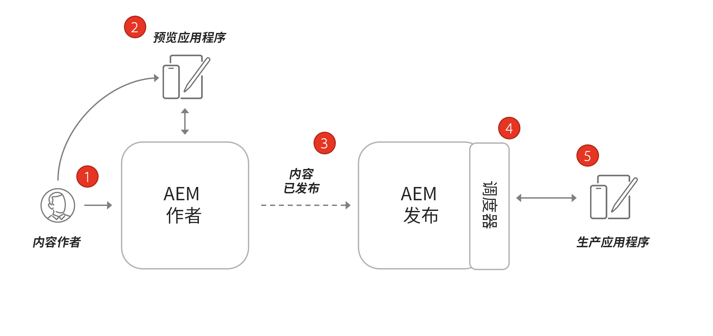
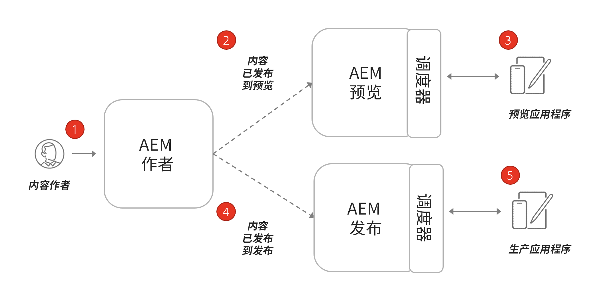

# AEM Headless 的架构

典型的 AEM 环境由 Author 服务、Publish 服务和可选的 Preview 服务组成。

* **Author 服务**&#x200B;是内部用户创建、管理和预览内容的地方。

* **Publish 服务**&#x200B;被视为“实时”环境，通常是最终用户与之交互的对象。在 Author 服务上编辑和审批之后的内容，分发到 Publish 服务。AEM Headless 应用程序最常见的部署模式是将应用程序的生产版本连接到 AEM Publish 服务。

* **Preview 服务**&#x200B;的功能与 **Publish 服务**&#x200B;相同。但是，它仅向内部用户提供。这使其成为了理想的系统，供审批者先审核即将发布的内容更改，然后再对最终用户上线内容。

* **Dispatcher** 是一个通过 AEM Dispatcher 模块增强的静态 Web 服务器。它提供缓存功能和其他安全层。**Dispatcher** 位于 **Publish** 和 **Preview** 服务前。

在 AEM as a Cloud Service 程序中，您可以有多个环境：Dev、Stage 和 Prod。每个环境有自己独特的 **Author**、**Publish** 和 **Preview** 服务。您可在[此处](/help/implementing/cloud-manager/manage-environments.md)学习有关管理环境的更多信息。

## 作者发布模型

AEM Headless 应用程序最常见的部署模式是将应用程序的生产版本连接到 AEM Publish 服务。

上图描绘了这种常见的部署模式。

1. **内容作者**&#x200B;使用 AEM Author 服务创建、编辑和管理内容。
1. **内容作者**&#x200B;和其他内部用户可直接在 Author 服务上预览内容。应用程序的预览版本可以设置为连接到 Author 服务。
1. 内容得到批准后，可以发布到 AEM Publish 服务。
1. **Dispatcher** 是位于 **Publish** 服务前的一层，可以缓存特定请求并提供安全层。
1. 最终用户与应用程序的生产版本交互。生产应用程序通过 Dispatcher 连接到 Publish 服务，并使用 GraphQL API 请求和使用内容。

## 作者预览发布部署

Headless 部署的另一个选项是纳入 **AEM Preview** 服务。对于这种方法，内容可以首先发布到 **Preview** 服务，Headless 应用程序的预览版本可以连接到该服务。此方法的优势在于&#x200B;**预览**&#x200B;服务可以设置为具有与 **Publish** 服务相同的身份验证要求和权限，使其更容易模拟生产体验。

1. **内容作者**&#x200B;使用 AEM Author 服务创建、编辑和管理内容。
1. 内容首先发布到 AEM Preview 服务。
1. 应用程序的预览版本可以设置为连接到 Preview 服务。
1. 内容经过审核和批准后，可以发布到 AEM Publish 服务。
1. 最终用户与应用程序的生产版本交互。生产应用程序通过 Dispatcher 连接到 Publish 服务，并使用 GraphQL API 请求和使用内容。
