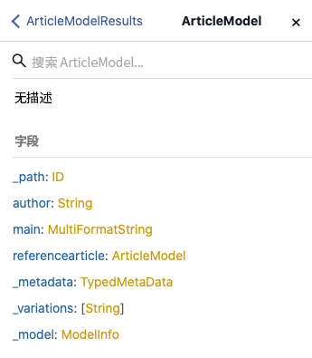
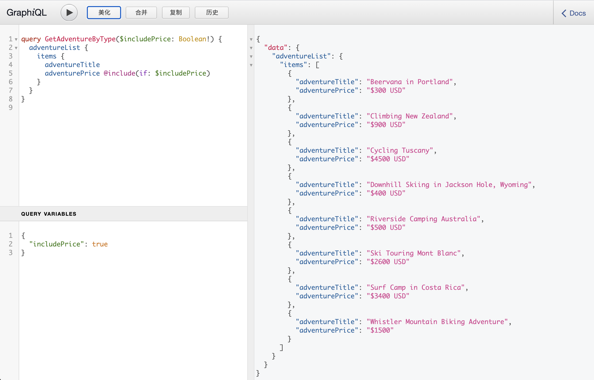

# AEM GraphQL API，用于内容片段 {#graphql-api-for-use-with-content-fragments}

了解如何将Adobe Experience Manager(AEM)中的内容片段与AEM GraphQL APIas a Cloud Service一起用于无头内容交付。

AEMas a Cloud Service的GraphQL API与内容片段一起使用，在很大程度上是基于标准的开源GraphQL API。

在AEM中使用GraphQL API，可以在无头CMS实施中高效地将内容片段交付到JavaScript客户端：

* 避免像使用REST一样使用迭代API请求，
* 确保投放仅限于特定要求，
* 允许批量交付作为单个API查询的响应渲染所需的确切内容。

>[!NOTE]
>
>GraphQL当前用于Adobe Experience Manager(AEM)as a Cloud Service的两个（单独）方案：
>
>* [AEM Commerce通过GraphQL从商务平台使用数据](/help/commerce-cloud/integrating/magento.md).
>* AEM内容片段可与AEM GraphQL API（一种基于标准GraphQL的自定义实施）一起使用，来提供结构化内容以供在您的应用程序中使用。


## GraphQL API {#graphql-api}

GraphQL是：

* &quot;*...API的查询语言以及用于使用现有数据执行这些查询的运行时。 GraphQL提供了API中数据的完整且可理解的描述，使客户能够准确地询问自己需要的内容，而无需再做任何事情，更便于随着时间的推移改进API，并支持功能强大的开发人员工具。*&quot;

   请参阅 [GraphQL.org](https://graphql.org)

* &quot;*...灵活API层的开放规范。 将GraphQL置于现有后端上，以比以往更快的速度构建产品…….*&quot;

   请参阅 [浏览GraphQL](https://www.graphql.com).

* *&quot;。..一种数据查询语言和规范，由Facebook于2012年在内部开发，后于2015年公开开放。 它为基于REST的体系结构提供了替代方案，目的是提高开发人员的工作效率并最大限度地减少数据传输量。 GraphQL由数百个大小各异的组织用于生产……”*

   请参阅 [GraphQL Foundation](https://foundation.graphql.org/).

<!--
"*Explore GraphQL is maintained by the Apollo team. Our goal is to give developers and technical leaders around the world all of the tools they need to understand and adopt GraphQL.*". 
-->

有关GraphQL API的更多信息，请参阅以下部分（包括许多其他资源）：

* At [graphql.org](https://graphql.org):

   * [GraphQL简介](https://graphql.org/learn)

   * [GraphQL规范](https://spec.graphql.org/)

* At [graphql.com](https://graphql.com):

   * [指南](https://www.graphql.com/guides/)

   * [教程](https://www.graphql.com/tutorials/)

   * [案例研究](https://www.graphql.com/case-studies/)

用于AEM的GraphQL实施基于标准的GraphQL Java库。 请参阅：

* [graphQL.org - Java](https://graphql.org/code/#java)

* [GitHub上的GraphQL Java](https://github.com/graphql-java)

### GraphQL术语 {#graphql-terminology}

GraphQL使用以下代码：

* **[查询](https://graphql.org/learn/queries/)**

* **[架构和类型](https://graphql.org/learn/schema/)**:

   * 架构由AEM基于内容片段模型生成。
   * 使用您的架构，GraphQL显示GraphQL for AEM实施允许的类型和操作。

* **[字段](https://graphql.org/learn/queries/#fields)**

* **[GraphQL端点](graphql-endpoint.md)**
   * AEM中响应GraphQL查询并提供对GraphQL架构的访问权限的路径。

   * 请参阅 [启用GraphQL端点](graphql-endpoint.md) 以了解更多详细信息。

请参阅 [(GraphQL.org)GraphQL简介](https://graphql.org/learn/) 以了解详细信息，包括 [最佳实践](https://graphql.org/learn/best-practices/).

### GraphQL查询类型 {#graphql-query-types}

通过GraphQL，您可以执行查询以返回以下任一值：

* A **单一登入**

* A **[条目列表](https://graphql.org/learn/schema/#lists-and-non-null)**

您还可以执行以下操作：

* [已缓存的持久化查询](/help/headless/graphql-api/persisted-queries.md)

### GraphiQL IDE {#graphiql-ide}

您可以使用 [GraphiQL IDE](/help/headless/graphql-api/graphiql-ide.md).

## 创作和发布环境的用例 {#use-cases-author-publish-environments}

用例取决于AEMas a Cloud Service环境的类型：

* 发布环境；用于：
   * JS应用程序的查询数据（标准用例）

* 创作环境；用于：
   * 查询数据以用于“内容管理目的”：
      * AEMas a Cloud Service中的GraphQL当前是只读API。
      * REST API可用于CR(u)D操作。

## 权限 {#permission}

访问资产所需的权限。

## 模式生成 {#schema-generation}

GraphQL是一种强类型API，这意味着数据必须按类型清晰地结构和组织。

GraphQL规范提供了一系列关于如何创建用于查询特定实例上数据的强大API的准则。 要实现此目的，客户端需要获取 [架构](#schema-generation)，其中包含查询所需的所有类型。

对于内容片段，GraphQL架构（结构和类型）基于 **已启用** [内容片段模型](/help/assets/content-fragments/content-fragments-models.md) 及其数据类型。

>[!CAUTION]
>
>所有GraphQL架构(从已 **已启用**)可通过GraphQL端点读取。
>
>这意味着您需要确保没有可用的敏感数据，因为这些数据可能会以这种方式泄露；例如，这包括模型定义中可以显示为字段名称的信息。

例如，如果用户创建了一个名为 `Article`，则AEM会生成对象 `article` 是 `ArticleModel`. 此类型中的字段对应于模型中定义的字段和数据类型。

1. 内容片段模型：

   

1. 相应的GraphQL模式（从GraphiQL自动文档中输出）：
   

   这将显示生成的类型 `ArticleModel` 包含多个 [字段](#fields).

   * 其中三个受用户控制： `author`, `main` 和 `referencearticle`.

   * 其他字段由AEM自动添加，它们代表了提供特定内容片段相关信息的有用方法；在本例中， `_path`, `_metadata`, `_variations`. 这些 [辅助字段](#helper-fields) 标记有前面的 `_` 区分用户定义的内容和自动生成的内容。

1. 用户根据文章模型创建内容片段后，可以通过GraphQL查询该内容片段。 有关示例，请参阅 [示例查询](/help/headless/graphql-api/sample-queries.md#graphql-sample-queries) (基于 [与GraphQL一起使用的内容片段结构示例](/help/headless/graphql-api/sample-queries.md#content-fragment-structure-graphql))。

在用于AEM的GraphQL中，架构是灵活的。 这意味着每次创建、更新或删除内容片段模型时，都会自动生成该模型。 更新内容片段模型时，数据架构缓存也会刷新。

站点GraphQL服务监听（在后台）对内容片段模型所做的任何修改。 检测到更新后，只会重新生成模式的该部分。 这种优化节省了时间并提供了稳定性。

例如，如果您：

1. 安装包含 `Content-Fragment-Model-1` 和 `Content-Fragment-Model-2`:

   1. 的GraphQL类型 `Model-1` 和 `Model-2` 将生成。

1. 然后修改 `Content-Fragment-Model-2`:

   1. 仅 `Model-2` GraphQL类型将进行更新。

   1. 反之 `Model-1` 将保持不变。

>[!NOTE]
>
>如果您想要通过REST API或其他方式对内容片段模型进行批量更新，请务必注意这一点。

架构通过与GraphQL查询相同的端点提供，客户端会处理使用扩展调用架构的事实 `GQLschema`. 例如，执行简单 `GET` 请求 `/content/cq:graphql/global/endpoint.GQLschema` 将导致输出具有Content-type的架构： `text/x-graphql-schema;charset=iso-8859-1`.

### 架构生成 — 未发布的模型 {#schema-generation-unpublished-models}

嵌套内容片段后，可能会发布父内容片段模型，但未发布引用的模型。

>[!NOTE]
>
>AEM UI可阻止发生这种情况，但如果以编程方式或通过内容包进行发布，则可能会发生这种情况。

发生此情况时，AEM会生成 *不完整* 父内容片段模型的架构。 这意味着从架构中删除依赖于未发布模型的片段引用。

## 字段 {#fields}

架构内有两个基本类别的单个字段：

* 生成的字段。

   选择 [字段类型](#field-types) 用于根据您配置内容片段模型的方式创建字段。 字段名称取自 **属性名称** 字段 **数据类型**.

   * 还有 **渲染为** 资产需要考虑，因为用户可以配置某些数据类型；例如，作为单行文本或多字段。

* 对于AEM,GraphQL还会生成 [辅助字段](#helper-fields).

   这些参数用于标识内容片段，或获取有关内容片段的更多信息。

### 字段类型 {#field-types}

用于AEM的GraphQL支持类型列表。 所有支持的内容片段模型数据类型和相应的GraphQL类型均表示：

| 内容片段模型 — 数据类型 | GraphQL类型 | 描述 |
|--- |--- |--- |
| 单行文本 | 字符串， [字符串] |  用于简单字符串，如作者名称、位置名称等。 |
| 多行文本 | 字符串 |  用于输出文本，如文章的正文 |
| 数字 |  浮动， [浮动] | 用于显示浮点数和正则数 |
| 布尔型 |  布尔型 |  用于显示复选框→简单true/false语句 |
| 日期和时间 | 日历 |  用于以ISO 8086格式显示日期和时间。 根据所选类型，AEM GraphQL中可以使用三种类型： `onlyDate`, `onlyTime`, `dateTime` |
| 枚举 |  String |  用于显示在模型创建时定义的选项列表中的选项 |
|  标记 |  [String] |  用于显示表示AEM中所用标记的字符串列表 |
| 内容引用 |  字符串 |  用于在AEM中显示指向其他资产的路径 |
| 片段引用 |  *模型类型* |  用于引用在创建模型时定义的特定模型类型的另一个内容片段 |

### 帮助程序字段 {#helper-fields}

除了用户生成字段的数据类型之外，GraphQL for AEM还会生成 *助手* 字段，以帮助标识内容片段，或提供有关内容片段的其他信息。

#### 路径 {#path}

路径字段用作GraphQL中的标识符。 它表示内容片段资产在AEM存储库中的路径。 我们选择了此作为内容片段的标识符，因为它：

* 在AEM中是唯一的，
* 很容易被取走。

以下代码将显示之前基于内容片段模型创建的所有内容片段的路径 `Person`.

```xml
{
  personList {
    items {
      _path
    }
  }
}
```

要检索特定类型的单个内容片段，还需要先确定其路径。 例如：

```xml
{
  personByPath(_path: "/content/dam/path/to/fragment/john-doe") {
    item {
      _path
      firstName
      name
    }
  }
}
```

请参阅 [示例查询 — 单个特定城市片段](/help/headless/graphql-api/sample-queries.md#sample-single-specific-city-fragment).

#### 元数据 {#metadata}

AEM还通过GraphQL公开内容片段的元数据。 元数据是描述内容片段的信息，例如内容片段的标题、缩略图路径、内容片段的描述、创建日期等。

由于元数据是通过架构编辑器生成的，因此没有特定的结构，因此， `TypedMetaData` 实施了GraphQL类型以公开内容片段的元数据。 `TypedMetaData` 公开按以下标量类型分组的信息：

| 字段 |
|--- |
| `stringMetadata:[StringMetadata]!` |
| `stringArrayMetadata:[StringArrayMetadata]!` |
| `intMetadata:[IntMetadata]!` |
| `intArrayMetadata:[IntArrayMetadata]!` |
| `floatMetadata:[FloatMetadata]!` |
| `floatArrayMetadata:[FloatArrayMetadata]!` |
| `booleanMetadata:[BooleanMetadata]!` |
| `booleanArrayMetadata:[booleanArrayMetadata]!`  |
| `calendarMetadata:[CalendarMetadata]!` |
| `calendarArrayMetadata:[CalendarArrayMetadata]!` |

每个标量类型表示单个名称值对或名称值对数组，其中该对的值是其分组的类型。

例如，如果您要检索内容片段的标题，我们知道此属性是字符串属性，因此我们将查询所有字符串元数据：

要查询元数据，请执行以下操作：

```xml
{
  personByPath(_path: "/content/dam/path/to/fragment/john-doe") {
    item {
      _path
      _metadata {
        stringMetadata {
          name
          value
        }
      }
    }
  }
}
```

如果查看生成的GraphQL架构，则可以查看所有元数据GraphQL类型。 所有模型类型均具有相同 `TypedMetaData`.

>[!NOTE]
>
>**正常元数据和数组元数据之间的差异**
>请记住 `StringMetadata` 和 `StringArrayMetadata` 两者都引用存储库中存储的内容，而不是如何检索它们。
>
>例如，通过调用 `stringMetadata` 字段，您将收到存储库中存储的所有元数据的数组，作为 `String` ，如果调用 `stringArrayMetadata` 您将收到存储库中存储的所有元数据的数组，作为 `String[]`.

请参阅 [元数据查询示例 — 列出标题为GB的奖项的元数据](/help/headless/graphql-api/sample-queries.md#sample-metadata-awards-gb).

#### 变量 {#variations}

的 `_variations` 已实施字段，以简化对内容片段所包含变量的查询。 例如：

```xml
{
  personByPath(_path: "/content/dam/path/to/fragment/john-doe") {
    item {
      _variations
    }
  }
}
```

请参阅 [示例查询 — 具有命名变体的所有城市](/help/headless/graphql-api/sample-queries.md#sample-cities-named-variation).

<!--
## Security Considerations {#security-considerations}
-->

## GraphQL变量 {#graphql-variables}

GraphQL允许将变量置于查询中。 有关详细信息，您可以在 [变量的GraphQL文档](https://graphql.org/learn/queries/#variables).

例如，要获取类型为 `Article` 具有特定变量的变量，您可以指定 `variation` 在GraphiQL中。


```xml
### query
query GetArticlesByVariation($variation: String!) {
    articleList(variation: $variation) {
        items {
            _path
            author
        }
    }
}
 
### in query variables
{
    "variation": "uk"
}
```

## GraphQL指令 {#graphql-directives}

在GraphQL中，可以根据变量更改查询，称为GraphQL指令。

例如，您可以在其中包含 `adventurePrice` 字段 `AdventureModels`，基于变量 `includePrice`.



```xml
### query
query GetAdventureByType($includePrice: Boolean!) {
  adventureList {
    items {
      adventureTitle
      adventurePrice @include(if: $includePrice)
    }
  }
}
 
### in query variables
{
    "includePrice": true
}
```

## 筛选 {#filtering}

您还可以在GraphQL查询中使用过滤来返回特定数据。

过滤使用基于逻辑运算符和表达式的语法。

例如，以下（基本）查询过滤所有名称为 `Jobs` 或 `Smith`:

```xml
query {
  personList(filter: {
    name: {
      _logOp: OR
      _expressions: [
        {
          value: "Jobs"
        },
        {
          value: "Smith"
        }
      ]
    }
  }) {
    items {
      name
      firstName
    }
  }
}
```

有关更多示例，请参阅：

* 详情 [用于AEM扩展的GraphQL](#graphql-extensions)

* [使用此示例内容和结构的示例查询](/help/headless/graphql-api/sample-queries.md#graphql-sample-queries-sample-content-fragment-structure)

   * 和 [示例内容和结构](/help/headless/graphql-api/sample-queries.md#content-fragment-structure-graphql) 准备在示例查询中使用

* [基于WKND项目的示例查询](/help/headless/graphql-api/sample-queries.md#sample-queries-using-wknd-project)

## GraphQL for AEM — 扩展摘要 {#graphql-extensions}

使用AEM的GraphQL查询的基本操作符合标准的GraphQL规范。 对于使用AEM的GraphQL查询，有以下扩展：

* 如果需要单个结果：
   * 使用模型名称；eg city

* 如果您希望得到结果列表：
   * 添加 `List` 至模型名称；例如，  `cityList`
   * 请参阅 [示例查询 — 有关所有城市的所有信息](#sample-all-information-all-cities)

* 如果要使用逻辑OR:
   * use ` _logOp: OR`
   * 请参阅 [示例查询 — 名称为“Jobs”或“Smith”的所有人员](#sample-all-persons-jobs-smith)

* 逻辑AND也存在，但是（通常）是隐式的

* 您可以查询与内容片段模型中的字段对应的字段名称
   * 请参阅 [示例查询 — 公司CEO和员工的完整详细信息](#sample-full-details-company-ceos-employees)

* 除了模型中的字段之外，还有一些系统生成的字段（前面有下划线）：

   * 对于内容：

      * `_locale` :揭露语言；基于语言管理器
         * 请参阅 [给定区域设置的多个内容片段的查询示例](#sample-wknd-multiple-fragments-given-locale)
      * `_metadata` :显示片段的元数据
         * 请参阅 [元数据查询示例 — 列出标题为GB的奖项的元数据](#sample-metadata-awards-gb)
      * `_model` :允许查询内容片段模型（路径和标题）
         * 请参阅 [模型中内容片段模型的示例查询](#sample-wknd-content-fragment-model-from-model)
      * `_path` :存储库中内容片段的路径
         * 请参阅 [示例查询 — 单个特定城市片段](#sample-single-specific-city-fragment)
      * `_reference` :显示引用；包括富文本编辑器中的内联引用
         * 请参阅 [包含预取引用的多个内容片段的查询示例](#sample-wknd-multiple-fragments-prefetched-references)
      * `_variation` :以显示内容片段中的特定变量
         * 请参阅 [示例查询 — 具有命名变体的所有城市](#sample-cities-named-variation)
   * 操作：

      * `_operator` :应用特定的运算符； `EQUALS`, `EQUALS_NOT`, `GREATER_EQUAL`, `LOWER`, `CONTAINS`, `STARTS_WITH`
         * 请参阅 [示例查询 — 所有名称不为“Jobs”的人员](#sample-all-persons-not-jobs)
         * 请参阅 [示例查询 — 所有在 `_path` 以特定前缀开头](#sample-wknd-all-adventures-cycling-path-filter)
      * `_apply` :适用特定条件；例如，  `AT_LEAST_ONCE`
         * 请参阅 [示例查询 — 对包含项目且必须至少发生一次的数组进行筛选](#sample-array-item-occur-at-least-once)
      * `_ignoreCase` :在查询时忽略大小写
         * 请参阅 [示例查询 — 名称中包含SAN的所有城市，无论大小写如何](#sample-all-cities-san-ignore-case)


* 支持GraphQL并集类型：

   * use `... on`
      * 请参阅 [包含内容引用的特定模型的内容片段的示例查询](#sample-wknd-fragment-specific-model-content-reference)

* 在查询嵌套片段时回退：

   * 如果嵌套片段中不存在给定的变量，则 **主控** 将返回变量。

## 从外部网站查询GraphQL端点 {#query-graphql-endpoint-from-external-website}

要从外部网站访问GraphQL端点，您需要配置：

* [CORS过滤器](/help/headless/deployment/cross-origin-resource-sharing.md)
* [反向链接过滤器](/help/headless/deployment/referrer-filter.md)

## 身份验证 {#authentication}

请参阅 [对内容片段的远程AEM GraphQL查询进行身份验证](/help/headless/security/authentication.md).

<!-- to be addressed later -->

<!--
## Sorting {#sorting}
-->

<!-- to be addressed later -->

<!--
## Paging {#paging}
-->

## 常见问题解答 {#faqs}

出现的问题：

1. **Q**:&quot;*AEM的GraphQL API与查询生成器API有何不同？*&quot;

   * **A**:&quot;*AEM GraphQL API提供了对JSON输出的完全控制，并且是用于查询内容的行业标准。
今后，AEM计划投资于AEM GraphQL API。*&quot;

## 教程 — AEM Headless和GraphQL快速入门 {#tutorial}

正在查找动手实践教程？ 查看 [AEM无头和GraphQL快速入门](https://experienceleague.adobe.com/docs/experience-manager-learn/getting-started-with-aem-headless/graphql/overview.html) 端到端教程，演示如何在无头CMS场景中使用AEM GraphQL API构建和公开内容，这些内容由外部应用程序使用。
