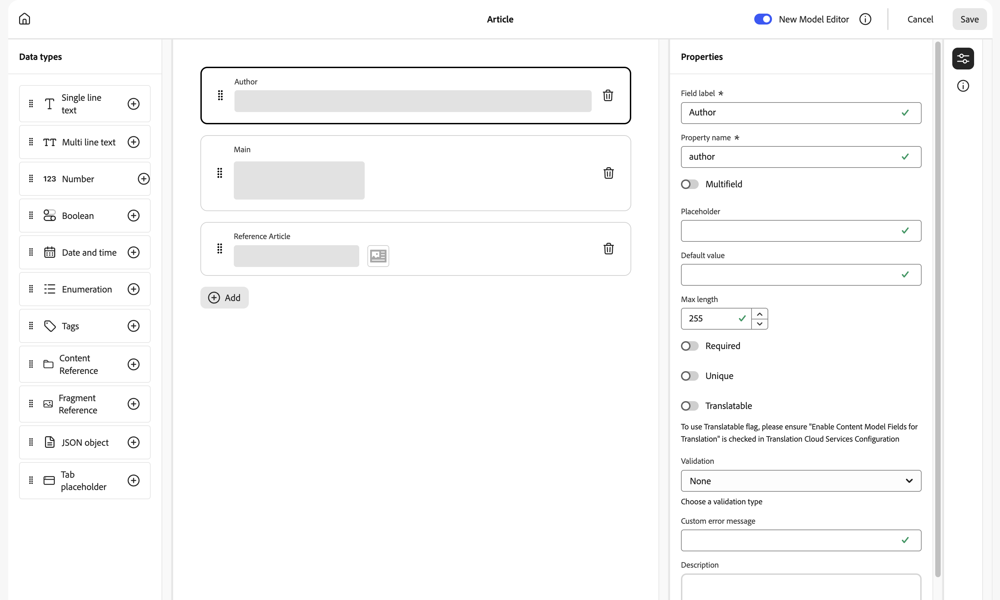
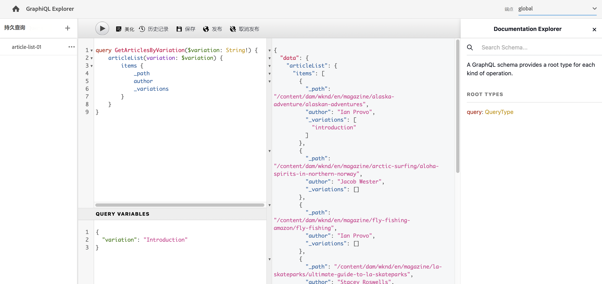

# 用于内容片段的 AEM GraphQL API {#graphql-api-for-use-with-content-fragments}

了解如何在 Adobe Experience Manager (AEM) as a Cloud Service 中将内容片段与 AEM GraphQL API 一起，用于 Headless 内容投放。

与内容片段一起使用的 AEM as a Cloud Service GraphQL API 很大程度上依赖于标准的开源 GraphQL API。

在 AEM 中使用 GraphQL API 可以在 Headless CMS 实施中，高效地将内容片段投放到 JavaScript 客户端：

* 避免 REST 中的迭代 API 请求，
* 确保将投放限制到特定要求，
* 允许作为对单个 API 查询的响应，批量精确投放所需呈现的内容。

>[!NOTE]
>
>GraphQL 当前用于 Adobe Experience Manager (AEM) as a Cloud Service 中的两种（分隔的）场景：
>
>* [AEM Commerce 通过 GraphQL 使用来自 Commerce 平台的数据](/help/commerce-cloud/integrating/magento.md)。
>* AEM 内容片段与 AEM GraphQL API（一种自定义实施，基于标准 GraphQL）配合使用，提供结构化内容用于您的应用程序。


## GraphQL API {#graphql-api}

GraphQL 是：

* “*...一种用于 API 和运行时的查询语言，使用您的现有数据满足这些查询。GraphQL 提供了 API 中数据的完整且可理解的描述，使客户端能够精确地请求所需要的数据，避免其他多余内容，让 API 更容易随时间演进，并提供了强大的开发人员工具。*”

   请参阅 [GraphQL.org](https://graphql.org)。

* “*...一种面向灵活 API 层的开发规格。将 GraphQL 放在现有后端之上，相比从前能够更快地构建产品...*”

   请参阅[探索 GraphQL](https://www.graphql.com)。

* *“...一种数据查询语言和规范，由 Facebook 在 2012 年内部开发，然后在 2015 年公开开源发布。它提供了对基于 REST 的架构的替代，其目的是为了提高开发人员的工作效率并尽可能减少传输的数据量。GraphQL 已由各种规模的数百家组织用于生产环境中...”*

   请参阅 [GraphQL 基础](https://foundation.graphql.org/)。

<!--
"*Explore GraphQL is maintained by the Apollo team. Our goal is to give developers and technical leaders around the world all of the tools they need to understand and adopt GraphQL.*". 
-->

有关 GraphQL API 的更多信息，请参阅以下部分（以及多种其他资源）：

* 位于 [graphql.org](https://graphql.org)：

   * [GraphQL 简介](https://graphql.org/learn)

   * [GraphQL 规范](https://spec.graphql.org/)

* 位于 [graphql.com](https://graphql.com)：

   * [ 指南](https://www.graphql.com/guides/)

   * [教程](https://www.graphql.com/tutorials/)

   * [案例研究](https://www.graphql.com/case-studies/)

GraphQL for AEM 实施基于标准 GraphQL Java 库。请参阅：

* [graphQL.org – Java](https://graphql.org/code/#java)

* [GitHub 上的 GraphQL Java](https://github.com/graphql-java)

### GraphQL 术语 {#graphql-terminology}

GraphQL 使用以下对象：

* **[查询](https://graphql.org/learn/queries/)**

* **[架构和类型](https://graphql.org/learn/schema/)**：

   * AEM 基于内容片段模型来生成架构。
   * 使用您的架构，GraphQL 呈现允许用于 GraphQL for AEM 实施的类型和操作。

* **[字段](https://graphql.org/learn/queries/#fields)**

* **[GraphQL 端点](graphql-endpoint.md)**
   * AEM 中的路径，对应于 GraphQL 查询，提供对 GraphQL 架构的访问。

   * 有关更多详细信息，请参阅[启用 GraphQL 端点](graphql-endpoint.md)。

请参阅 [(GraphQL.org) GraphQL 简介](https://graphql.org/learn/)获取全面的详细信息，包括[最佳实践](https://graphql.org/learn/best-practices/)。

### GraphQL 查询类型 {#graphql-query-types}

使用 GraphQL，您可以执行查询以返回：

* **单个条目**

* **[条目列表](https://graphql.org/learn/schema/#lists-and-non-null)**

AEM 提供将查询（两种类型）转换为[持久查询的功能，可由 Dispatcher 和 CDN 缓存](/help/headless/graphql-api/persisted-queries.md)。

### GraphQL 查询最佳实践（Dispatcher 和 CND） {#graphql-query-best-practices}

[持久查询](/help/headless/graphql-api/persisted-queries.md)是推荐用于发布实例的方法：

* 它们被缓存
* 它们由 AEM as a Cloud Service 集中管理

>[!NOTE]
>
>通常“作者”上没有 Dispatcher/CDN，因此在那里使用持久查询没有任何好处；除了测试它们。

不建议使用 POST 请求的 GraphQL 查询，因为它们未缓存，因此在默认实例中，Dispatcher 配置为阻止此类查询。

虽然 GraphQL 也支持 GET 请求，但这些请求可能会达到限制（例如 URL 的长度），而使用“持久查询”可以避免这些限制。

>[!NOTE]
>
>要允许在 Dispatcher 中直接查询和/或 POST 查询，您可以要求系统管理员：
>
>* 创建一个名为 `ENABLE_GRAPHQL_ENDPOINT` 的 [Cloud Manager 环境变量](/help/implementing/cloud-manager/environment-variables.md)
>* 值为 `true`


>[!NOTE]
>
>将来某个时候，执行直接查询的功能可能会被弃用。

### GraphiQL IDE {#graphiql-ide}

您可以使用 [GraphiQL IDE](/help/headless/graphql-api/graphiql-ide.md) 测试和调试 GraphQL 查询。

## 创作、预览和发布的用例 {#use-cases-author-preview-publish}

用例可以依赖于 AEM as a Cloud Service 环境的类型：

* 发布环境；用于：
   * 查询 JS 应用程序的数据（标准用例）

* 预览环境；用于：
   * 在发布环境中部署之前预览查询
      * 查询 JS 应用程序的数据（标准用例）

* 创作环境；用于：
   * 查询用于“内容管理用途”的数据：
      * AEM as a Cloud Service 中的 GraphQL 当前为只读 API。
      * REST API 可用于 CR(u)D 操作。

## 权限 {#permission}

权限是访问 Assets 所需的权限。

GraphQL 查询是在基础请求的 AEM 用户的许可下执行的。如果用户对某些片段（存储为资产）没有读取权限，它们将不会成为结果集的一部分。

此外，用户需要访问 GraphQL 端点才能执行 GraphQL 查询。

## 架构生成 {#schema-generation}

GraphQL 是一种强类型的 API，这意味着数据必须有明确的结构并按类型整理。

GraphQL 规范提供了一系列准则，说明如何创建可靠的 API 用于询问特定实例上的数据。为执行此操作，客户端需要提取[架构](#schema-generation)，其中包含查询所需的全部类型。

对于内容片段，GraphQL 架构（结构和类型）基于&#x200B;**已启用**[内容片段模型](/help/sites-cloud/administering/content-fragments/content-fragments-models.md)及其数据类型。

>[!CAUTION]
>
>所有 GraphQL 架构（派生自&#x200B;**已启用**&#x200B;的内容片段模型）可通过 GraphQL 端点读取。
>
>这意味着您需要确保其中没有提供敏感数据，因为这种方式可能会导致泄露；例如，这包括可能在模型定义中作为字段名称呈现的信息。

例如，如果创建内容片段模型的用户调用 `Article`，则 AEM 生成 GraphQL 类型 `ArticleModel`。此类型中的字段对应于在模型中定义的字段和数据类型。此外，它还为操作此类型的查询创建一些入口点，例如 `articleByPath` 或 `articleList`。

1. 内容片段模型：

   

1. 对应的 GraphQL 架构（来自 GraphiQL 自动文档的输出）：
   

   这显示了生成的类型 `ArticleModel` 包含多个 [字段](#fields)。

   * 其中三个由用户控制：`author`、`main` 和 `referencearticle`。

   * 其他字段由 AEM 自动添加，表示用于提供有关特定内容片段的有用方法，在本例中为（[帮助程序字段](#helper-fields)）`_path`、`_metadata`、`_variations`。

1. 用户基于 Article 模型创建内容片段之后，可以通过 GraphQL 询问该模型。例如，请参阅[示例查询](/help/headless/graphql-api/sample-queries.md#graphql-sample-queries)（基于[用于 GraphQL 的示例内容片段结构](/help/headless/graphql-api/sample-queries.md#content-fragment-structure-graphql)）。

在 GraphQL for AEM 中，架构是灵活的。这意味着每次在创建、更新或删除内容片段模型时会自动生成架构。数据架构缓存还可在更新内容片段模型时刷新。

<!-- move the following to a separate "in depth" page -->

数据架构缓存还可在更新内容片段模型时刷新。

Sites GraphQL 服务监听（在后台）对内容片段模型所作的任何更改。检测到更新时，仅重新生成架构的该部分。此优化可节省时间并提供稳定性。

例如，如果您：

1. 安装包含 `Content-Fragment-Model-1` 和 `Content-Fragment-Model-2` 的软件包：

   1. 将生成用于 `Model-1` 和 `Model-2` 的 GraphQL 类型。

1. 然后修改 `Content-Fragment-Model-2`：

   1. 将只更新 `Model-2` GraphQL 类型。

   1. 而 `Model-1` 将保持不变。

>[!NOTE]
>
>在您需要通过 REST api 或以其他方式批量更新内容片段模型时，这一点务必要注意。

架构通过与 GraphQL 查询相同的端点提供，客户端处理使用扩展 `GQLschema` 调用架构的实际情况。例如，在 `/content/cq:graphql/global/endpoint.GQLschema` 上执行简单的 `GET` 请求将导致架构的输出带有内容类型：`text/x-graphql-schema;charset=iso-8859-1`。

<!-- move through to here to a separate "in depth" page -->

### 架构生成 – 未发布的模型 {#schema-generation-unpublished-models}

当内容片段嵌套时，可能会出现的情况是发布了父内容片段模型，但未发布引用的模型。

>[!NOTE]
>
>AEM UI 可以防止出现这种情况，但是，如果以编程方式进行发布，或者使用内容包发布，则可能出现这种情况。

出现这种情况时，AEM 为父内容片段模型生成&#x200B;*不完整的*&#x200B;架构。这意味着依赖于未发布模型的片段引用会从架构中删除。

## 字段 {#fields}

在架构中有两个基本类别的单独字段：

* 您生成的字段。

   使用选择的一组[数据类型](#Data-types)，根据您配置内容片段模型的方式来创建字段。字段名称获取自&#x200B;**数据类型**&#x200B;选项卡的&#x200B;**属性名称**。

   * 还需要考虑 **呈现为**&#x200B;设置，因为用户可以配置某些数据类型。例如，通过从下拉列表中选择 `multifield`，可以将单行文本字段配置为包含多个单行文本。

* GraphQL for AEM 还生成多个[帮助程序字段](#helper-fields)。

### 数据类型 {#data-types}

GraphQL for AEM 支持一个类型列表。所有支持的内容片段模型数据类型和对应的 GraphQL 类型呈现如下：

| 内容片段模型 – 数据类型 | GraphQL 类型 | 描述 |
|--- |--- |--- |
| 单行文本 | `String`、`[String]` | 用于简单字符串，例如作者姓名、位置名称等 |
| 多行文本 | `String`、`[String]` | 用于输出文本，例如文章的正文 |
| 数字 | `Float`、`[Float]` | 用于显示浮点数和常规数字 |
| 布尔型 | `Boolean` | 用于显示复选框 → 简单的 true/false 语句 |
| 日期和时间 | `Calendar` | 用于显示日期和时间，使用 ISO 8601 格式。根据选择的类型，有三种风格可用于 AEM GraphQL 中：`onlyDate`、`onlyTime`、`dateTime` |
| 枚举 | `String` | 用于显示在模型创建时定义的选项列表中的选项 |
| 标记 | `[String]` | 用于显示表示在 AEM 中所用标记的字符串列表 |
| 内容引用 | `String`、`[String]` | 用于显示指向 AEM 中其他资源的路径 |
| 片段引用 | *模型类型*<br><br>单个字段：`Model`-模型类型，直接引用<br><br>多字段，具有一个引用类型：`[Model]`-数组类型`Model`，直接从数组中引用<br><br>多字段，带有多个引用类型；`[AllFragmentModels]`-所有模型类型的数组，从具有合并类型的数组中引用 | 用于引用创建模型时定义的特定模型类型的一个或多个内容片段 |

{style="table-layout:auto"}

### 帮助程序字段 {#helper-fields}

在用户生成的字段数据类型之外，GraphQL for AEM 还生成了多种&#x200B;*帮助程序* 字段，用于帮助标识内容片段，或者提供有关内容片段的额外信息。

这些[帮助程序字段](#helper-fields)使用前缀 `_` 标记，用于区分哪些字段由用户定义，哪些字段为自动生成。

#### 路径 {#path}

路径字段用作 AEM GraphQL 中的标识符。它代表 AEM 存储库中内容片段资源的路径。我们选择此项作为内容片段的标识符是因为它：

* 在 AEM 中唯一
* 可以轻松地提取

以下代码将显示根据内容片段模型 `Author` 创建的所有内容片段的路径，如 WKND 教程所提供。

```graphql
{
  authorList {
    items {
      _path
    }
  }
}
```

要检索特定类型的单个内容片段，您还需要先确定其路径。例如：

```graphql
{
  authorByPath(_path: "/content/dam/wknd-shared/en/contributors/sofia-sj-berg") {
    item {
      _path
      firstName
      lastName
    }
  }
}
```

请参阅[示例查询 – 一个特定城市片段](/help/headless/graphql-api/sample-queries.md#sample-single-specific-city-fragment)。

#### 元数据 {#metadata}

通过 GraphQL，AEM 还可以公开内容片段的元数据。元数据是描述内容片段的信息，例如内容片段的标题、缩略图路径、内容片段的描述、创建日期等等。

由于元数据通过架构编辑器生成，因此没有特定结构，所以实施了 `TypedMetaData` GraphQL 类型以公开内容片段的元数据。`TypedMetaData` 公开按以下标量类型分组的信息：

| 字段 |
|--- |
| `stringMetadata:[StringMetadata]!` |
| `stringArrayMetadata:[StringArrayMetadata]!` |
| `intMetadata:[IntMetadata]!` |
| `intArrayMetadata:[IntArrayMetadata]!` |
| `floatMetadata:[FloatMetadata]!` |
| `floatArrayMetadata:[FloatArrayMetadata]!` |
| `booleanMetadata:[BooleanMetadata]!` |
| `booleanArrayMetadata:[booleanArrayMetadata]!` |
| `calendarMetadata:[CalendarMetadata]!` |
| `calendarArrayMetadata:[CalendarArrayMetadata]!` |

每个标量类型表示一个名称-值对或者名称-值对数组，而该对的值是它所分组到的类型。

例如，如果您希望检索内容片段的标题，我们知道此属性是字符串属性，因此我们将查询所有字符串元数据：

要查询元数据，请执行以下操作：

```graphql
{
  authorByPath(_path: "/content/dam/wknd-shared/en/contributors/sofia-sj-berg") {
    item {
      _metadata {
        stringMetadata {
          name
          value
        }
      }
    }
  }
}
```

如果您查看生成的 GraphQL 架构，可以查看所有元数据 GraphQL 类型。所有模型类型具有相同的 `TypedMetaData`。

>[!NOTE]
>
>**普通和数组元数据之间的不同**
>请记住，`StringMetadata` 和 `StringArrayMetadata` 均引用存储在存储库中的内容，而非您如何检索它们。
>
>举例而言，通过调用 `stringMetadata` 字段，您应该以 `String` 的形式收到存储在存储库中所有元数据的数组，如果您调用 `stringArrayMetadata`，则会以 `String[]` 的形式收到存储在存储库中所有元数据的数组。

请参阅[元数据的示例查询 – 列出标题为 GB 的奖励的元数据](/help/headless/graphql-api/sample-queries.md#sample-metadata-awards-gb)。

#### 变体 {#variations}

`_variations` 字段已实施以简化查询内容片段具有的变体。例如：

```graphql
{
  authorByPath(_path: "/content/dam/wknd-shared/en/contributors/ian-provo") {
    item {
      _variations
    }
  }
}
```

>[!NOTE]
>
>请注意，`_variations` 字段不包含 `master`变量，从技术上讲是原始数据（在 UI 中称为 *主控变量*）不被视为显式变量。

请参阅[示例查询 – 具有指定变量的所有城市](/help/headless/graphql-api/sample-queries.md#sample-cities-named-variation)。

>[!NOTE]
>
>如果内容片段不存在给定的变量，则原始数据（也称为主控变量）将作为（回退）默认值返回。

<!--
## Security Considerations {#security-considerations}
-->

## GraphQL 变量 {#graphql-variables}

GraphQL 允许在查询中放入变量。有关详细信息，请参阅 [GraphQL 的变量文档](https://graphql.org/learn/queries/#variables)。

例如，要获取具有特定变量（如有）的类型为 `Author` 的所有内容片段，您可以在 GraphiQL 中指定参数 `variation`。



**查询**:

```graphql
query($variation: String!) {
  authorList(variation: $variation) {
    items {
      _variation
      lastName
      firstName
    }
  }
}
```

**查询变量**:

```json
{
  "variation": "another"
}
```

此查询将返回完整的作者列表。没有`another`变量的作者将回退到原始数据（在这种情况下，`_variation` 将报告 `master`）。

如果您想将列表限制为提供指定变量的作者（并跳过会回退到原始数据的作者），您需要应用[过滤器](#filtering)：

```graphql
query($variation: String!) {
  authorList(variation: $variation, filter: {
    _variation: {
      _expressions: {
        value: $variation
      }
    }
  }) {
    items {
      _variation
      lastName
      firstName
    }
  }
}
```

## GraphQL 指令 {#graphql-directives}

在 GraphQL 中，可以更改基于变量的查询，这称为 GraphQL 指令。

例如，您可在针对所有 `AdventureModels`、基于变量 `includePrice` 的查询中包含 `adventurePrice` 字段。


**查询**:

```graphql
query GetAdventureByType($includePrice: Boolean!) {
  adventureList {
    items {
      title
      price @include(if: $includePrice)
    }
  }
}
```

**查询变量**:

```json
{
    "includePrice": true
}
```

## 筛选 {#filtering}

您还可以筛选 GraphQL 查询以返回特定数据。

筛选使用基于逻辑运算符和表达式的语法。

最原子的部分是可以应用于特定字段内容的单个表达式。它将字段的内容与给定的常量值进行比较。

例如，表达式

```graphql
{
  value: "some text"
  _op: EQUALS
}
```

会将字段的内容与值 `some text` 进行比较，如果内容等于该值，则成功。否则，表达式将失败。

以下运算符可用于将字段与特定值进行比较：

| 运算符 | 类型 | 如果...，则表达式成功 |
|--- |--- |--- |
| `EQUALS` | `String`、`ID`、`Boolean` | ... 该值与该字段的内容完全相同 |
| `EQUALS_NOT` | `String`、`ID` | ... 该值与该字段的内容&#x200B;*不*&#x200B;完全相同 |
| `CONTAINS` | `String` | ... 字段的内容包含值（`{ value: "mas", _op: CONTAINS }` 将匹配 `Christmas`、`Xmas`、`master`、...） |
| `CONTAINS_NOT` | `String` | ... 字段的内容&#x200B;*不*&#x200B;包含值 |
| `STARTS_WITH` | `ID` | ... ID 以特定值开头（`{ value: "/content/dam/", _op: STARTS_WITH` 将匹配 `/content/dam/path/to/fragment`，但不是`/namespace/content/dam/something` |
| `EQUAL` | `Int`、`Float` | ... 该值与该字段的内容完全相同 |
| `UNEQUAL` | `Int`、`Float` | ... 该值与该字段的内容&#x200B;*不*&#x200B;完全相同 |
| `GREATER` | `Int`、`Float` | ... 字段内容大于值 |
| `GREATER_EQUAL` | `Int`、`Float` | ... 字段的内容大于或等于值 |
| `LOWER` | `Int`、`Float` | ... 字段内容小于值 |
| `LOWER_EQUAL` | `Int`、`Float` | ... 字段的内容小于或等于值 |
| `AT` | `Calendar`, `Date`, `Time` | ... 字段的内容与值完全相同（包括时区设置） |
| `NOT_AT` | `Calendar`、`Date`、`Time` | ... 字段的内容与值&#x200B;*不*&#x200B;完全相同 |
| `BEFORE` | `Calendar`、`Date`、`Time` | ... 值表示的时间点在字段内容表示的时间点之前 |
| `AT_OR_BEFORE` | `Calendar`、`Date`、`Time` | ... 值表示的时间点在字段内容表示的时间点之前或与之相同 |
| `AFTER` | `Calendar`、`Date`、`Time` | ... 值表示的时间点在字段内容表示的时间点之后 |
| `AT_OR_AFTER` | `Calendar`, `Date`, `Time` | ... 值表示的时间点在字段内容表示的时间点之后或与之相同 |

某些类型还允许指定其他选项来修改表达式的计算方式：

| 选项 | 类型 | 描述 |
|--- |--- |--- |
| `_ignoreCase` | `String` | 忽略字符串的大小写，例如 `time` 的值将匹配 `TIME`、`time`、`tImE`、... |
| `_sensitiveness` | `Float` | 允许有一定的余地，将 `float` 值视为相同（以解决由于 `float` 值的内部表示引起的技术限制；应该避免，因为此选项可能有负面影响对性能的影响 |

表达式可以在逻辑运算符 (`_logOp`) 的帮助下组合成一个集合：

* `OR` – 如果至少有一个表达式成功，则表达式集将成功
* `AND` – 如果所有表达式都成功，则表达式集将成功（默认值）

每个字段都可以通过其自己的一组表达式进行过滤。过滤器参数中提到的所有字段的表达式集最终将由其自己的逻辑运算符组合。

过滤器定义（作为 `filter` 参数传递给查询）包含：

* 每个字段的子定义（可以通过其名称访问该字段，例如，数据（字段）类型中的 `lastName` 字段的过滤器中有一个 `lastName` 字段）
* 每个子定义包含 `_expressions` 数组，提供表达式集，以及 `_logOp` 字段，该字段定义表达式应与之组合的逻辑运算符
* 每个表达式由值（`value` 字段）和运算符（`_operator` 字段）定义，字段的内容应该与之进行比较

请注意，如果要将项目与 `AND` 组合，则可以省略 `_logOp`；如果要检查是否相等，则可以省略 `_operator`，因为这些是默认值。

以下示例演示了一个完整的查询，该查询过滤所有 `lastName` 为 `Provo` 或包含 `sjö` 的人员，与大小写无关：

```graphql
{
  authorList(filter: {
    lastname: {
      _logOp: OR
      _expressions: [
        {
          value: "sjö",
          _operator: CONTAINS,
          _ignoreCase: true
        },
        {
          value: "Provo"
        }
      ]
    }
  }) {
    items {
      lastName
      firstName
    }
  }
}
```

虽然您也可以对嵌套字段进行筛选，但不建议这样做，因为这可能会导致性能问题。

有关更多示例，请参阅：

* [GraphQL for AEM 扩展](#graphql-extensions)的详细信息

* [使用此示例内容和结构的示例查询](/help/headless/graphql-api/sample-queries.md#graphql-sample-queries-sample-content-fragment-structure)

   * 以及准备用于示例查询的[示例内容和结构](/help/headless/graphql-api/sample-queries.md#content-fragment-structure-graphql)

* [基于 WKND 项目的示例查询](/help/headless/graphql-api/sample-queries.md#sample-queries-using-wknd-project)

## 排序 {#sorting}

>[!NOTE]
>
>要获得最佳性能，请考虑[更新内容片段以在 GraphQL 筛选中进行分页和排序](/help/headless/graphql-api/graphql-optimized-filtering-content-update.md)。

此功能允许您根据指定字段对查询结果进行排序。

排序标准：

* 是表示字段路径的逗号分隔值列表
   * 列表中的第一个字段将定义主要排序顺序，如果主要排序标准的两个值相等，将使用第二个字段，如果前两个标准相等，则使用第三个字段，等等。
   * 点分符号，即 field1.subfield.subfield 等...
* 带有可选的订单方向
   * ASC（升序）或 DESC（降序）；作为默认 ASC 应用
   * 可以按字段指定方向；这意味着您可以对一个字段按升序排序，对另一个字段按降序排序（姓名，firstName DESC）

例如：

```graphql
query {
  authorList(sort: "lastName, firstName") {
    items {
      firstName
      lastName
    }
  }
}
```

也可以：

```graphql
{
  authorList(sort: "lastName DESC, firstName DESC") {
    items {
        lastName
        firstName
    }
  }
}
```

您还可以使用 `nestedFragmentname.fieldname` 的格式对嵌套片段中的字段进行排序。

>[!NOTE]
>
>这可能会对性能产生负面影响。

例如：

```graphql
query {
  articleList(sort: "authorFragment.lastName")  {
    items {
      title
      authorFragment {
        firstName
        lastName
        birthDay
      }
      slug
    }
  }
}
```

## 分页 {#paging}

>[!NOTE]
>
>要获得最佳性能，请考虑[更新内容片段以在 GraphQL 筛选中进行分页和排序](/help/headless/graphql-api/graphql-optimized-filtering-content-update.md)。

此功能允许您对返回列表的查询类型执行分页。提供了两种方法：

* 在 `List` 查询中的 `offset` 和 `limit`
* 在 `Paginated` 查询中的 `first` 和 `after`

### 列表查询 – 偏移和限制 {#list-offset-limit}

在 `...List` 查询中，您可以使用 `offset` 和 `limit` 返回特定的结果子集：

* `offset`：指定要返回的第一个数据集
* `limit`：指定返回的最大数据集数

例如，要输出最多包含五篇文章的结果页面，从&#x200B;*完整*&#x200B;结果列表中的第五篇文章开始：

```graphql
query {
   articleList(offset: 5, limit: 5) {
    items {
      authorFragment {
        lastName
        firstName
      }
    }
  }
}
```

<!-- When available link to BP and replace "JCR query level" with a more neutral term. -->

<!-- When available link to BP and replace "JCR query result set" with a more neutral term. -->

>[!NOTE]
>
>* 分页需要稳定的排序顺序才能在请求同一结果集的不同页面的多个查询中正常工作。默认情况下，它使用结果集中每个项目的存储库路径来确保顺序始终相同。如果使用不同的排序顺序，并且如果无法在 JCR 查询级别进行排序，则会对性能产生负面影响，因为在确定页面之前必须将整个结果集加载到内存中。
>
>* 偏移量越高，从完整的 JCR 查询结果集中跳过项目所需的时间就越多。大型结果集的替代解决方案是使用带有 `first` 和 `after` 方法的分页查询。


### 分页查询 – 先和后 {#paginated-first-after}

`...Paginated` 查询类型重用了大部分 `...List` 查询类型功能（过滤、排序），但没有使用 `offset`/`limit` 参数，它使用 `first`/`after` 参数，正如 [GraphQL 光标连接规范](https://relay.dev/graphql/connections.htm)所定义。您可以在 [GraphQL 介绍](https://graphql.org/learn/pagination/#pagination-and-edges) 中找到不太正式的介绍。

* `first`：`n`要返回的第一个项目。
默认为 `50`。最大值为 `100`。
* `after`：确定请求页面开始的光标；请注意，光标所代表的项目不包含在结果集中；项目的光标由 `edges` 结构的 `cursor` 字段确定。

例如，输出包含最多五次冒险的结果页面，从&#x200B;*完整*&#x200B;结果列表中的给定光标项开始：

```graphql
query {
    adventurePaginated(first: 5, after: "ODg1MmMyMmEtZTAzMy00MTNjLThiMzMtZGQyMzY5ZTNjN2M1") {
        edges {
          cursor
          node {
            title
          }
        }
        pageInfo {
          endCursor
          hasNextPage
        }
    }
}
```

<!-- When available link to BP -->
<!-- Due to internal technical constraints, performance will degrade if sorting and filtering is applied on nested fields. Therefore it is recommended to use filter/sort fields stored at root level. For more information, see the [Best Practices document](link). -->

>[!NOTE]
>
>* 默认情况下，分页使用表示片段的存储库节点的 UUID 进行排序，以确保结果的顺序始终相同。当使用 `sort` 时，隐式使用 UUID 以确保唯一排序；即使对于具有相同排序键的两个项目，也可以使用。
>
>* 由于内部技术限制，如果对嵌套字段应用排序和过滤，性能会降低。因此，建议使用存储在根级别的过滤器/排序字段。如果要查询大型分页结果集，这也是推荐的方式。


## GraphQL 查询中的 Web 优化图像传递 {#web-optimized-image-delivery-in-graphql-queries}

经 Web 优化的图像传递支持您使用 GraphQL 查询来：

* 请求 AEM Assets 图像的 URL

* 通过查询传递参数，以便自动生成并返回图像的特定演绎版

   >[!NOTE]
   >
   >指定的演绎版未存储在 AEM Assets 中。演绎版将生成并在缓存中保存一段较短的时间。

* 将 URL 作为 JSON 传递的一部分返回

您可以使用 AEM 来：

* 将 [Web 优化图像传递](https://experienceleague.adobe.com/docs/experience-manager-core-components/using/developing/web-optimized-image-delivery.html)传入 GraphQL 查询中。

这意味着将在查询执行期间应用命令，方式与这些图像的 GET 请求中的 URL 参数相同。

该操作将允许您为 JSON 传递动态创建图像演绎版，从而无需手动创建这些演绎版并将其存储在存储库中。

GraphQL 中的解决方案意味着您可以：

* 在 `ImageRef` 引用上使用 `_dynamicUrl`

* 将 `_assetTransform` 添加到定义筛选条件的列表标题

### 转换请求的结构 {#structure-transformation-request}

`AssetTransform` (`_assetTransform`) 用于发出 URL 转换请求。

结构和语法是：

* `format`：按扩展名包含所有支持的格式的枚举：GIF、PNG、PNG8、JPG、PJPG、BJPG、WEBP、WEBPLL 或 WEBPLY
* `seoName`：将用作文件名而不是节点名的字符串
* `crop`：框架子结构，如果省略宽度或高度，则宽度或高度将用作同一值
   * `xOrigin`：框架的 x 原点，它是强制性的
   * `yOrigin`：框架的 y 原点，它是强制性的
   * `width`：框架的宽度
   * `height`：框架的高度
* `size`：维度子结构，如果省略宽度或高度，则宽度或高度将用作同一值
   * `width`：维度的宽度
   * `height`：维度的高度
* `rotation`：所有支持的旋转的枚举：R90、R180、R270
* `flip`：HORIZONTAL、VERTICAL、HORIZONTAL_AND_VERTICAL 的枚举
* `quality`：1 和 100 之间的整数，表示图像质量的百分比
* `width`：定义输出图像宽度的整数，但会被图像生成器忽略
* `preferWebp`：指示是否首选 webp（默认值为 false）的布尔值

URL 转换适用于所有查询类型：按路径、列表或分页。

### 具有完整参数的 Web 优化图像传递 {#web-optimized-image-delivery-full-parameters}

以下是带有一整组参数的示例查询：

```graphql
{
  articleList(
    _assetTransform: {
      format:GIF
      seoName:"test"
      crop:{
        xOrigin:10
        yOrigin:20
        width:50
        height:45
      }
      size:{
        height:100
        width:200
      }
      rotation:R90
      flip:HORIZONTAL_AND_VERTICAL
      quality:55
      width:123
      preferWebp:true
    }
  ) {
    items {
      _path
      featuredImage {
        ... on ImageRef {
          _dynamicUrl
        }
      }
    }
  }
}
```

### 使用单个查询变量的 Web 优化图像传递 {#web-optimized-image-delivery-single-query-variable}

以下示例说明了单个查询变量的用法：

```graphql
query ($seoName: String!) {
  articleList(
    _assetTransform: {
      format:GIF
      seoName:$seoName
      crop:{
        xOrigin:10
        yOrigin:20
        width:50
        height:45
      }
      size:{
        height:100
        width:200
      }
      rotation:R90
      flip:HORIZONTAL_AND_VERTICAL
      quality:55
      width:123
      preferWebp:true
    }
  ) {
    items {
      _path
      featuredImage {
        ... on ImageRef {
          _dynamicUrl
        }
      }
    }
  }
}
```

### 使用多个查询变量的 Web 优化图像传递 {#web-optimized-image-delivery-multiple-query-variables}

以下示例说明了多个查询变量的用法：

```graphql
query ($seoName: String!, $format: AssetTransformFormat!) {
  articleList(
    _assetTransform: {
      format:$format
      seoName:$seoName
      crop:{
        xOrigin:10
        yOrigin:20
        width:50
        height:45
      }
      size:{
        height:100
        width:200
      }
      rotation:R90
      flip:HORIZONTAL_AND_VERTICAL
      quality:55
      width:123
      preferWebp:true
    }
  ) {
    items {
      _path
      featuredImage {
        ... on ImageRef {
          _dynamicUrl
        }
      }
    }
  }
}
```

### 使用 URL 提出的 Web 优化的图像传递请求 {#web-optimized-image-delivery-request-url}

如果您将查询另存为持久查询（例如，使用名称 `dynamic-url-x`），您随后可以[直接执行持久查询](/help/headless/graphql-api/persisted-queries.md#execute-persisted-query)。

例如，要直接执行前面的示例（另存为持久查询），请使用以下 URL：

* [单一参数](#dynamic-image-delivery-single-specified-parameter)；名为 `dynamic-url-x` 的持久查询

   * `http://localhost:4502/graphql/execute.json/wknd-shared/dynamic-url-x;seoName=xxx`

      响应如下：

      

* [多个参数](#dynamic-image-delivery-multiple-specified-parameters)；名为 `dynamic` 的持久查询

   * `http://localhost:4502/graphql/execute.json/wknd-shared/dynamic;seoName=billiboy;format=GIF;`

      >[!CAUTION]
      >
      >在末尾需要添加 `;` 才能完全终止参数列表。

### 图像传递的限制 {#image-delivery-limitations}

存在以下限制：

* 应用于查询的所有图像部分的修饰符（全局参数）

* 缓存标头

   * 创作时未缓存
   * 发布时缓存 – max-age 为 10 分钟（无法由客户端更改）

## GraphQL for AEM – 执行摘要 {#graphql-extensions}

使用 GraphQL for AEM 的查询基本处理遵循标准 GraphQL 规范。对于用于 AEM 的 GraphQL 查询，有几个扩展：

* 如果您需要单个结果：
   * 使用模型名称，例如 city

* 如果您需要结果列表：
   * 将 `List` 添加到模型名称；例如，`cityList`
   * 请参阅[示例查询 – 关于所有城市的所有信息](/help/headless/graphql-api/sample-queries.md#sample-all-information-all-cities)

   稍后您可以：

   * [对结果进行排序](#sorting)

      * `ASC` : 升序
      * `DESC` : 降序
   * 使用以下任一方法返回一页结果：

      * [带有偏移和限制的列表查询](#list-offset-limit)
      * [带有“先”和“后”的分页查询](#paginated-first-after)
   * 请参阅[示例查询 – 关于所有城市的所有信息](/help/headless/graphql-api/sample-queries.md#sample-all-information-all-cities)


* 如果您希望使用逻辑 OR：
   * 使用 ` _logOp: OR`
   * 请参阅[示例查询 – 所有名为“Jobs”或“Smith”的人](/help/headless/graphql-api/sample-queries.md#sample-all-persons-jobs-smith)

* 逻辑 AND 也可使用，不过（通常）是隐式的

* 您可以查询与内容片段模型中字段对应的字段名称
   * 请参阅[示例查询 – 公司的 CEO 和员工的完整详细信息](/help/headless/graphql-api/sample-queries.md#sample-full-details-company-ceos-employees)

* 除了来自您模型的字段以外，还有一些系统生成的字段（以下划线为前缀）：

   * 对于内容：

      * `_locale`：用于显示语言；基于语言管理器
         * 请参阅[给定区域设置的多个内容片段的示例查询](/help/headless/graphql-api/sample-queries.md#sample-wknd-multiple-fragments-given-locale)
      * `_metadata`：用于显示片段的元数据
         * 请参阅[元数据的示例查询 – 列出标题为 GB 的奖励的元数据](/help/headless/graphql-api/sample-queries.md#sample-metadata-awards-gb)
      * `_model`：允许查询内容片段模型（路径和标题）
         * 请参阅[来自模型的内容片段模型的示例查询](/help/headless/graphql-api/sample-queries.md#sample-wknd-content-fragment-model-from-model)
      * `_path`：存储库中内容片段的路径
         * 请参阅[示例查询 – 一个特定城市片段](/help/headless/graphql-api/sample-queries.md#sample-single-specific-city-fragment)
      * `_reference`：用于显示引用，包括富文本编辑器中的内联引用
         * 请参阅[具有预获取引用的多个内容片段的示例查询](/help/headless/graphql-api/sample-queries.md#sample-wknd-multiple-fragments-prefetched-references)
      * `_variation`：用于显示内容片段中的特定变体

         >[!NOTE]
         >
         >如果内容片段不存在给定的变量，则主控变量将作为（回退）默认值返回。

         * 请参阅[示例查询 – 具有指定变体的所有城市](/help/headless/graphql-api/sample-queries.md#sample-cities-named-variation)
   * 对于[图像传递](#image-delivery)：

      * `_dynamicUrl`：在 `ImageRef` 引用上使用

      * `_assetTransform`：在定义筛选条件的列表标题上

      * 请参阅：

         * [具有完整参数的图像传递的示例查询](#image-delivery-full-parameters)

         * [具有单个指定参数的图像传递的示例查询](#image-delivery-single-specified-parameter)
   * 以及操作：

      * `_operator`：应用特定运算符；`EQUALS`、`EQUALS_NOT`、`GREATER_EQUAL`、`LOWER`、`CONTAINS`、`STARTS_WITH`
         * 请参阅[示例查询 – 所有名字不是“Jobs”的人](/help/headless/graphql-api/sample-queries.md#sample-all-persons-not-jobs)
         * 请参阅[示例查询 – `_path` 以特定前缀开头的所有冒险](/help/headless/graphql-api/sample-queries.md#sample-wknd-all-adventures-cycling-path-filter)
      * `_apply`：用于应用特定条件，例如 `AT_LEAST_ONCE`
         * 请参阅[示例查询 – 筛选数组中必须至少出现一次的项](/help/headless/graphql-api/sample-queries.md#sample-array-item-occur-at-least-once)
      * `_ignoreCase`：在查询时忽略大小写
         * 请参阅[示例查询 – 名称中包含 SAN 的所有城市，不考虑大小写](/help/headless/graphql-api/sample-queries.md#sample-all-cities-san-ignore-case)


* 支持 GraphQL 合并类型：

   * 使用 `... on`
      * 请参阅[具有内容引用的特定模型的内容片段示例查询](/help/headless/graphql-api/sample-queries.md#sample-wknd-fragment-specific-model-content-reference)

* 在查询嵌套片段时回退：

   * 如果给定的变体在嵌套片段中不存在，则将返回&#x200B;**主**&#x200B;变体。

## 从外部网站查询 GraphQL 端点 {#query-graphql-endpoint-from-external-website}

要从外部网站访问 GraphQL 端点，您需要配置：

* [CORS 筛选条件](/help/headless/deployment/cross-origin-resource-sharing.md)
* [反向链接筛选条件](/help/headless/deployment/referrer-filter.md)

## 身份验证 {#authentication}

请参阅[对内容片段的远程 AEM GraphQL 查询的身份验证](/help/headless/security/authentication.md)。

## 常见问题解答 {#faqs}

出现的问题：

1. **问**：*适用于 AEM 的 GraphQL API 与查询生成器 API 有何不同？*

   * **答**：
*AEM GraphQL API 提供了对 JSON 输出的全面控制，是用于查询内容的行业标准。
接下来，AEM 计划投资于 AEM GraphQL API。*

## 教程 – AEM Headless 和 GraphQL 快速入门 {#tutorial}

正在寻找实践教程？请查看 [AEM Headless 和 GraphQL 快速入门](https://experienceleague.adobe.com/docs/experience-manager-learn/getting-started-with-aem-headless/graphql/overview.html?lang=zh-Hans)端到端教程，其中说明了在 Headless CMS 场景中，如何使用 AEM GraphQL API 构建和公开内容并由外部应用程序使用。
