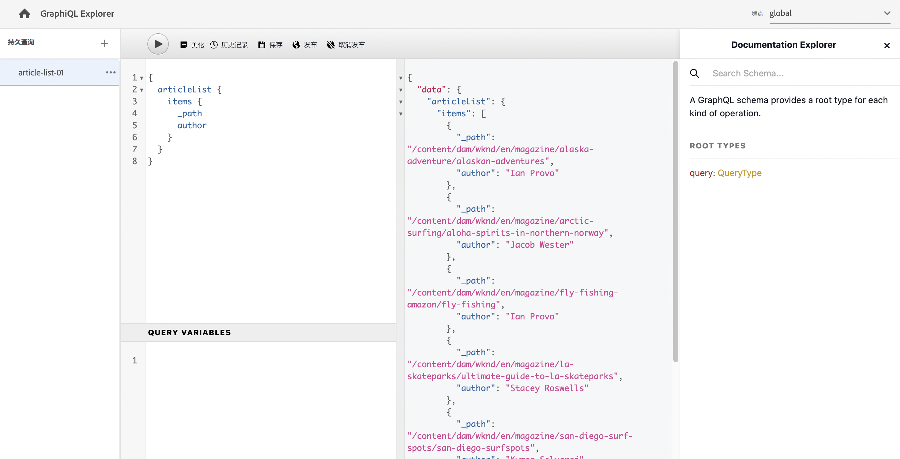
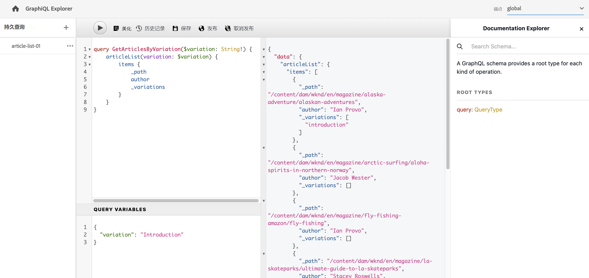
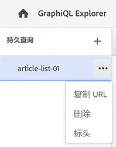

# 使用 GraphiQL IDE {#graphiql-ide}

标准的实施 [GraphiQL](https://graphql.org/learn/serving-over-http/#graphiql) IDE可与Adobe Experience Manager(AEM)as a Cloud Service的GraphQL API一起使用。

>[!NOTE]
>
>此功能的某些功能在预发行渠道中提供。 特别是与持久查询相关的功能。
> 
>请参阅 [预发行渠道文档](https://experienceleague.adobe.com/docs/experience-manager-cloud-service/content/release-notes/prerelease.html#enable-prerelease) 以了解有关如何为环境启用该功能的信息。

>[!NOTE]
>
>GraphiQL包含在AEM中，但默认情况下，仅在 `dev-authors` 环境。

>[!NOTE]
>您必须 [配置了端点](/help/headless/graphql-api/graphql-endpoint.md) 在 [配置浏览器](/help/assets/content-fragments/content-fragments-configuration-browser.md) 在使用GraphiQL IDE之前。


的 **GraphiQL** 工具允许您测试和调试GraphQL查询，方法是：
* 选择 **端点** 适用于要用于查询的站点配置
* 直接输入新查询
* 创建和访问， **[持久化查询](/help/headless/graphql-api/persisted-queries.md)**
* 运行查询以立即查看结果
* 管理 **查询变量**
* 保存和管理 **持久化查询**
* 发布或取消发布， **持久化查询** (到/从 `dev-publish`)
* 请参阅 **历史** 您以前的查询
* 使用 **文档资源管理器** 访问文档；帮助您了解和了解可用的方法。

例如：

* `http://localhost:4502/aem/graphiql.html`



您可以在开发创作系统上使用GraphiQL，以便客户端应用程序可以使用GET请求和发布查询来请求它们。 对于生产用途，您必须 [将查询移动到生产环境](/help/headless/graphql-api/persisted-queries.md#transfer-persisted-query-production). 最初，供生产作者使用查询验证新创作的内容，最后，生产发布以供实时使用。

## 选择您的端点 {#selecting-endpoint}

作为第一步，您需要选择 **[端点](/help/headless/graphql-api/graphql-endpoint.md)** 用于查询的查询。 端点适用于要用于查询的站点配置。

此选项可从右上角的下拉列表中找到。

## 创建并保留新查询 {#creating-new-query}

您可以在编辑器中输入新查询 — 该编辑器位于左中间的面板中，直接位于GraphiQL徽标下方。

>[!NOTE]
>
>如果已选择保留的查询并在编辑器面板中显示，则选择 `+` (下 **持久化查询**)以清空编辑器，以准备好用于新查询。

只需开始输入，编辑者也可以：

* 使用鼠标悬停可显示有关元素的其他信息
* 提供语法突出显示、自动完成、自动建议等功能

>[!NOTE]
>
>GraphQL查询通常以 `{` 字符。
>
>以 `#` 将被忽略。

使用 **另存为** 来保留新查询。

## 更新保留的查询 {#updating-persisted-query}

从 **持久化查询** 面板（最左侧）。

查询将显示在编辑器面板中。 根据需要进行任何更改，然后使用 **保存** 以提交对保留查询的更新。

## 运行查询 {#running-queries}

您可以立即运行新查询，也可以加载并运行保留的查询。 要加载保留的查询，请从列表中选择该查询 — 该查询将显示在编辑器面板中。

无论哪种情况，编辑器面板中显示的查询都是在执行以下任一操作时执行的查询：

* 单击/点按 **执行查询** 图标
* 使用键盘组合 `Control-Enter`

## 查询变量 {#query-variables}

<!-- more details needed here? -->

GraphiQL IDE还允许您管理 [查询变量](/help/headless/graphql-api/content-fragments.md#graphql-variables).

例如：



## 发布保留查询（开发 — 发布） {#publishing-persisted-queries}

从列表（左侧面板）中选择保留的查询后，即可使用 **发布** 和 **取消发布** 操作。 这会将它们激活到开发发布环境(`dev-publish`)环境，以便应用程序在测试时轻松访问。

>[!NOTE]
>
>持久查询的缓存的定义 `Time To Live` {&quot;cache-control&quot;:&quot;parameter&quot;:value}的默认值为2小时（7200秒）。

## 缓存保留的查询 {#caching-persisted-queries}

AEM将根据默认生存时间(TTL)使内容交付网络(CDN)缓存失效。

此值设置为：

* 7200秒是Dispatcher和CDN的默认TTL;也称为 *共享缓存*
   * 默认：s-maxage=7200
* 60是客户端（例如，浏览器）的默认TTL
   * 默认：maxage=60

AEM GraphQL查询在GraphiQL UI中保留，执行时将使用默认TTL。 如果要更改GraphLQ查询的TTL，则必须改为使用API方法保留该查询。 这包括使用命令行界面中的CURL将查询发布到AEM。

例如：

```xml
curl -X PUT \
    -H 'authorization: Basic YWRtaW46YWRtaW4=' \
    -H "Content-Type: application/json" \
    "http://localhost:4502/graphql/persist.json/wknd/plain-article-query-max-age" \
    -d \
'{ "query": "{articleList { items { _path author main { json } referencearticle { _path } } } }", "cache-control": { "max-age": 300 }}'
```

的 `cache-control` 可以在创建时(PUT)或稍后(例如，通过POST请求)进行设置。 创建持久查询时，缓存控制是可选的，因为AEM可以提供默认值。 请参阅 [如何保留GraphQL查询](/help/headless/graphql-api/persisted-queries.md#how-to-persist-query)，例如使用curl保留查询的示例。

## 复制URL以直接访问查询 {#copy-url}

的 **复制URL** 选项允许您通过复制用于直接访问保留查询并查看结果的URL来模拟查询。 然后，可用于测试；例如，通过在浏览器中访问：

<!--
  >[!NOTE]
  >
  >The URL will need [encoding before using programmatically](/help/headless/graphql-api/persisted-queries.md#encoding-query-url).
  >
  >The target environment might need adjusting, depending on your requirements.
-->

例如：

`http://localhost:4502/graphql/execute.json/global/article-list-01`

通过在浏览器中使用此URL，您可以确认结果：


的 **复制URL** 选项可通过保留查询名称右侧的三个垂直圆点（最左侧的面板）访问：



## 删除保留的查询 {#deleting-persisted-queries}

的 **删除** 选项也可通过保留查询名称右侧的三个垂直圆点（最左侧的面板）访问。

<!-- what happens if you try to delete something that is still published? -->


## 在生产环境中安装保留查询 {#installing-persisted-query-production}

使用GraphiQL开发和测试持久查询后，最终目标是 [将其传输到生产环境](/help/headless/graphql-api/persisted-queries.md#transfer-persisted-query-production) 供应用程序使用。

## 键盘快捷键 {#keyboard-shortcuts}

在IDE中，有一系列键盘快捷键提供了对操作图标的直接访问：

* 修改查询：  `Shift-Control-P`
* 合并查询：  `Shift-Control-M`
* 执行查询：  `Control-Enter`
* 自动完成：  `Control-Space`

>[!NOTE]
>
>在某些键盘上， `Control` 键被标记为 `Ctrl`.
