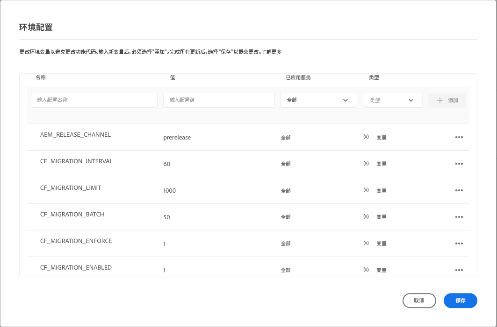

# 更新内容片段以进行优化的 GraphQL 筛选 {#updating-content-fragments-for-optimized-graphql-filtering}

要优化GraphQL过滤器的性能，请运行过程以更新内容片段。

>[!NOTE]
>
>更新内容片段后，您可以遵循以下推荐 [优化GraphQL查询](/help/headless/graphql-api/graphql-optimization.md).


## 前提条件 {#prerequisites}

此任务有以下前提条件：

1. 确保您至少拥有 2023.1.0 版本的 AEM as a Cloud Service。

1. 确保执行任务的用户具有所需的权限：

   * 至少， `Deployment Manager` 需要Cloud Manager中的角色。

## 更新内容片段 {#updating-content-fragments}

1. 使用 Cloud Manager UI 为实例设置以下变量来启用更新：

   

   可用变量包括：

   <table style="table-layout:auto">
    <tbody>
     <tr>
      <th> </th>
      <th>名称</th>
      <th>值</th>
      <th>默认值</th>
      <th>服务</th>
      <th>已应用</th>
      <th>类型</th>
      <th>注释</th>
     </tr>

   <tr>
      <td>1</td>
      <td>`CF_MIGRATION_ENABLED` </td>
      <td>`1` </td>
      <td>`0` </td>
      <td>所有 </td>
      <td> </td>
      <td>变量 </td>
      <td>Enables(!=0) 或 disables(0) 触发内容片段迁移作业。 </td>
     </tr>
     <tr>
      <td>2</td>
      <td>`CF_MIGRATION_ENFORCE` </td>
      <td>`1` </td>
      <td>`0` </td>
      <td>所有 </td>
      <td> </td>
      <td>变量 </td>
      <td>Enforce (!=0)重新迁移内容片段。<br>将此标志设置为0会执行CF的增量迁移。 这意味着，如果由于任何原因终止了作业，则下次运行该作业将从终止时开始迁移。 建议实施第一次迁移（值=1）。 </td>
     </tr>
     <tr>
      <td>3</td>
      <td>`CF_MIGRATION_BATCH` </td>
      <td>`50` </td>
      <td>`50` </td>
      <td>所有 </td>
      <td> </td>
      <td>变量 </td>
      <td>用于保存迁移后的内容片段数的批次的大小。<br>这与在一个批次中保存到存储库的CF数量相关，并且可用于优化写入存储库的次数。 </td>
     </tr>
     <tr>
      <td>4</td>
      <td>`CF_MIGRATION_LIMIT` </td>
      <td>`1000` </td>
      <td>`1000` </td>
      <td>所有 </td>
      <td> </td>
      <td>变量 </td>
      <td>一次处理的内容片段的最大数目。<br>另请参阅 `CF_MIGRATION_INTERVAL` 的注释。 </td>
     </tr>
     <tr>
      <td>5</td>
      <td>`CF_MIGRATION_INTERVAL` </td>
      <td>`60` </td>
      <td>`600` </td>
      <td>所有 </td>
      <td> </td>
      <td>变量 </td>
      <td>处理剩余内容片段直到达到下一个限制的时间间隔（秒）<br>此间隔还被视为启动作业之前的等待时间，以及处理每个后续CF_MIGRATION_LIMIT数CF之间的延迟。<br>(*)</td>
     </tr>
    </tbody>
   </table>

   >[!NOTE]
   >
   >(*)
   >
   >`CF_MIGRATION_INTERVAL` 的值还可以帮助估算迁移作业的总执行时间。
   >
   >例如：
   >
   >* 内容片段总数 = 20,000
   >* CF_MIGRATION_LIMIT = 1000
   >* CF_MIGRATION_INTERNAL = 60（秒）
   >* 完成迁移大约所需的时间 = 60 + (20,000/1000 * 60) = 1260 秒 = 21 分钟
   >  在开始时增加的额外“60”秒是因开始作业时的初始延迟导致的。
   >
   >这只是 *最小值* 完成作业所需的时间，但不包括I/O时间。 实际花费的时间可能超过此估计。

1. 监视更新的进度和完成情况。

   为此，请从以下位置监控有关 author 和 golden-publish 的日志：

   * `com.adobe.cq.dam.cfm.impl.upgrade.UpgradeJob`

      * Author 日志；例如：

        ```shell
        23.01.2023 13:13:45.926 *INFO* [sling-threadpool-09cbdb47-4d99-4c4c-b6d5-781b635ee21b-(apache-sling-job-thread-pool)-1-Content Fragment Upgrade Job Queue Config(cfm/upgrader)] com.adobe.cq.dam.cfm.impl.upgrade.UpgradeJob This instance<dd9ffdc1-0c28-4d04-9a96-5d4d223e457e> is the leader, will schedule the upgrade schedule job.
        ...
        23.01.2023 13:13:45.941 *INFO* [sling-threadpool-09cbdb47-4d99-4c4c-b6d5-781b635ee21b-(apache-sling-job-thread-pool)-1-Content Fragment Upgrade Job Queue Config(cfm/upgrader)] com.adobe.cq.dam.cfm.impl.upgrade.UpgradeJob Scheduling content fragments upgrade from version 0 to 1, slingJobId: 2023/1/23/13/13/50e1a575-4cd7-497b-adf0-62cb5768eedb_0, enforce: true, limit: 1000, batch: 50, interval: 60s
        
        23.01.2023 13:20:40.960 *INFO* [sling-threadpool-09cbdb47-4d99-4c4c-b6d5-781b635ee21b-(apache-sling-job-thread-pool)-1-Content Fragment Upgrade Job Queue Config(cfm/upgrader)] com.adobe.cq.dam.cfm.impl.upgrade.UpgradeJob Finished content fragments upgrade in 6m, slingJobId: 2023/1/23/13/13/50e1a575-4cd7-497b-adf0-62cb5768eedb_0, status: MaintenanceJobStatus{jobState=SUCCEEDED, statusMessage='Upgrade to version '1' succeeded.', errors=[], successCount=3781, failedCount=0, skippedCount=0}
        ```

      * Golden-publish 日志；例如：

        ```shell
        23.01.2023 12:35:05.150 *INFO* [sling-threadpool-8abcc1bb-cdcb-46d4-8565-942ad8a73209-(apache-sling-job-thread-pool)-1-Content Fragment Upgrade Job Queue Config(cfm/upgrader)] com.adobe.cq.dam.cfm.impl.upgrade.UpgradeJob This instance<ad1b399e-77be-408e-bc3f-57097498fddb> is the leader, will schedule the upgrade schedule job.
        
        23.01.2023 12:35:05.161 *INFO* [sling-threadpool-8abcc1bb-cdcb-46d4-8565-942ad8a73209-(apache-sling-job-thread-pool)-1-Content Fragment Upgrade Job Queue Config(cfm/upgrader)] com.adobe.cq.dam.cfm.impl.upgrade.UpgradeJob Scheduling content fragments upgrade from version 0 to 1, slingJobId: 2023/1/23/12/34/ad1b399e-77be-408e-bc3f-57097498fddb_0, enforce: true, limit: 1000, batch: 50, interval: 60s
        ...
        23.01.2023 12:40:45.180 *INFO* [sling-threadpool-8abcc1bb-cdcb-46d4-8565-942ad8a73209-(apache-sling-job-thread-pool)-1-Content Fragment Upgrade Job Queue Config(cfm/upgrader)] com.adobe.cq.dam.cfm.impl.upgrade.UpgradeJob Finished content fragments upgrade in 5m, slingJobId: 2023/1/23/12/34/ad1b399e-77be-408e-bc3f-57097498fddb_0, status: MaintenanceJobStatus{jobState=SUCCEEDED, statusMessage='Upgrade to version '1' succeeded.', errors=[], successCount=3781, failedCount=0, skippedCount=0}
        ```

   使用 Splunk 启用对环境日志的访问的客户可以使用下面的示例查询来监控升级过程。有关启用Splunk日志记录的详细信息，请参阅 [调试生产和暂存](/help/implementing/developing/introduction/logging.md#debugging-production-and-stage).

   ```splunk
   index=<indexName> sourcetype=aemerror aem_envId=<environmentId> msg="*com.adobe.cq.dam.cfm.impl.upgrade.UpgradeJob Finished*" 
   (aem_tier=golden-publish OR aem_tier=author) | table _time aem_tier pod_name msg | sort -_time desc
   ```

   其中：

   * `environmentId`- 客户环境标识符；例如，`e1234`
   * `indexName`- 客户索引名称，收集`aemerror`事件

   输出示例：

   <table style="table-layout:auto">
     <thead>
       <tr>
       <th>_次</th>
       <th>aem_tier</th>
       <th>pod_name</th>
       <th>msg</th>
       </tr>
     </thead> 
     <tbody>
       <tr>
         <td>2023-04-21 06:00:35.723</td>
         <td>作者</td>
         <td>cm-p1234-e1234-aem-author-76d6dc4b79-8lsb5</td>
         <td>[sling-threadpool-bb5da4dd-6b05-4230-93ea-1d5cd242e24f-(apache-sling-job-thread-pool)-1-Content Fragment Upgrade Job Queue Config(cfm/upgrader)] com.adobe.cq.dam.cfm.impl.upgrade.UpgradeJob Finished content fragments upgrade in 391m, slingJobId: 2023/4/20/23/16/db7963df-e267-489b-b69a-5930b0dadb37_0, status: MaintenanceJobStatus{jobState=SUCCEEDED, statusMessage='Upgrade to version '1' succeeded.', errors=[], successCount=36756, failedCount=0, skippedCount=0}</td>
       </tr>
       <tr>
         <td>2023-04-21 06:05:48.207</td>
         <td>golden-publish</td>
         <td>cm-p1234-e1234-aem-golden-publish-644487c9c5-lvkv2</td>
         <td>[sling-threadpool-284b9a9a-8454-461e-9bdb-44866c6ddfb1-(apache-sling-job-thread-pool)-1-Content Fragment Upgrade Job Queue Config(cfm/upgrader)] com.adobe.cq.dam.cfm.impl.upgrade.UpgradeJob Finished content fragments upgrade in 211m, slingJobId: 2023/4/20/23/15/66c1690a-cdb7-4e66-bc52-90f33394ddfc_0, status: MaintenanceJobStatus{jobState=SUCCEEDED, statusMessage='Upgrade to version '1' succeeded.', errors=[], successCount=19557, failedCount=0, skippedCount=0}</td>
       </tr>
     </tbody>
   <table>

1. 禁用更新程序。

   >[!IMPORTANT]
   >
   >需要执行此步骤才能完成升级。

   更新程序运行后，将云环境变量 `CF_MIGRATION_ENABLED` 重置为“0”以触发所有 pod 的回收。

   <table style="table-layout:auto">
    <tbody>
     <tr>
      <th> </th>
      <th>名称</th>
      <th>值</th>
      <th>默认值</th>
      <th>服务</th>
      <th>已应用</th>
      <th>类型</th>
      <th>注释</th>
     </tr>
     <tr>
      <td></td>
      <td>`CF_MIGRATION_ENABLED` </td>
      <td>`0` </td>
      <td>`0` </td>
      <td>所有 </td>
      <td> </td>
      <td>变量 </td>
      <td>Disables(0)（或 Enables(!=0)）触发内容片段迁移作业。 </td>
     </tr>
    </tbody>
   </table>

   >[!NOTE]
   >
   >这对发布层非常重要，因为内容更新仅在golden-publish上完成，并且当回收pod时，所有普通发布pod都基于golden-publish。

1. 验证更新程序的完成情况。

   您可以使用 Cloud Manager Developer Console 中的存储库浏览器来检查内容片段数据，从而验证更新的成功完成情况。

   * 在首次完成迁移之前， `cfGlobalVersion` 属性不存在。
因此，JCR 节点 `/content/dam` 上此属性的值为 `1`，确认迁移完成情况。

   * 您也可以检查单个内容片段的以下属性：

      * `_strucVersion` 的值应为 `1`
      * `indexedData` 结构必须存在

     >[!NOTE]
     >
     >此过程会更新创作实例和发布实例上的内容片段。
     >
     >因此，Adobe建议通过存储库浏览器对以下项执行验证 *至少* 一位作者 *和* 一个发布实例。

## 限制 {#limitations}

请注意以下限制：

* 只有在完全更新了您的所有内容片段（由以下内容片段表示）之后，才能优化GraphQL过滤器的性能： `cfGlobalVersion` JCR节点的属性 `/content/dam`)

* 如果内容片段是从内容包中导入的(使用 `crx/de`)后，在再次运行更新过程之前，不会在GraphQL查询结果中考虑这些内容片段。
